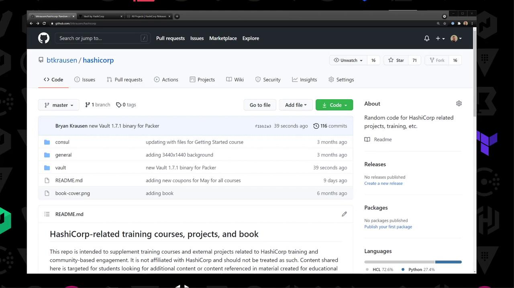
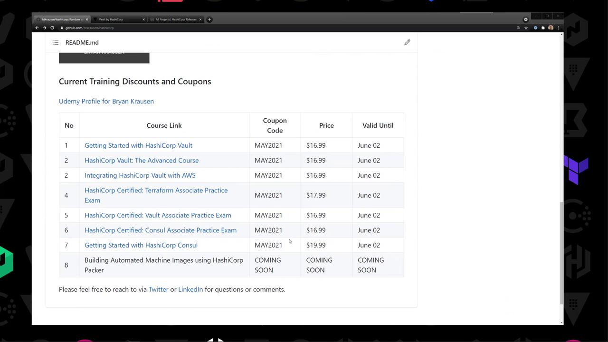
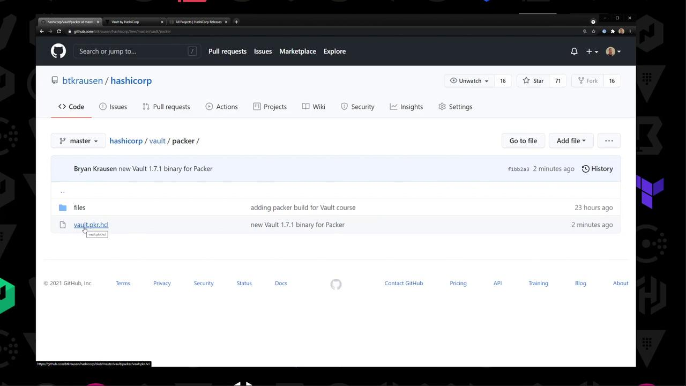
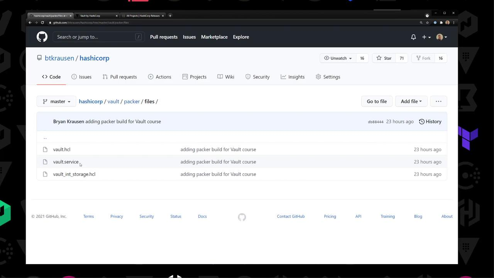
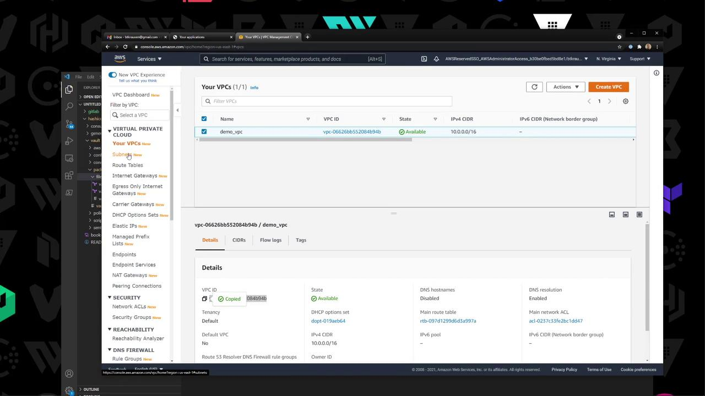
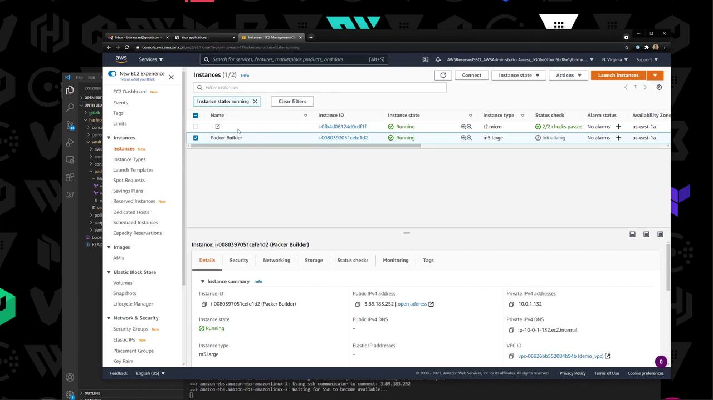
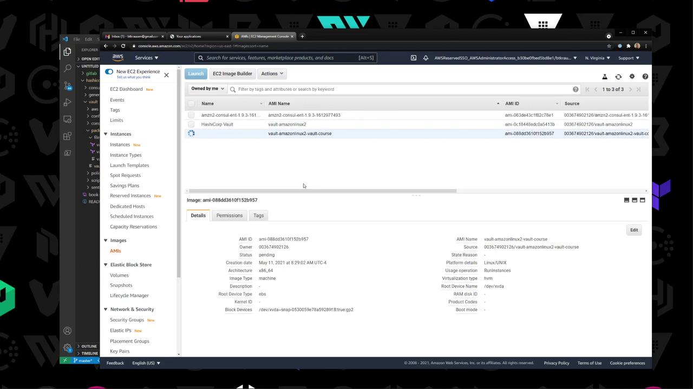
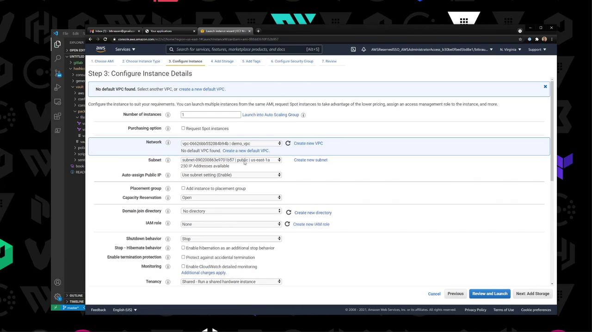
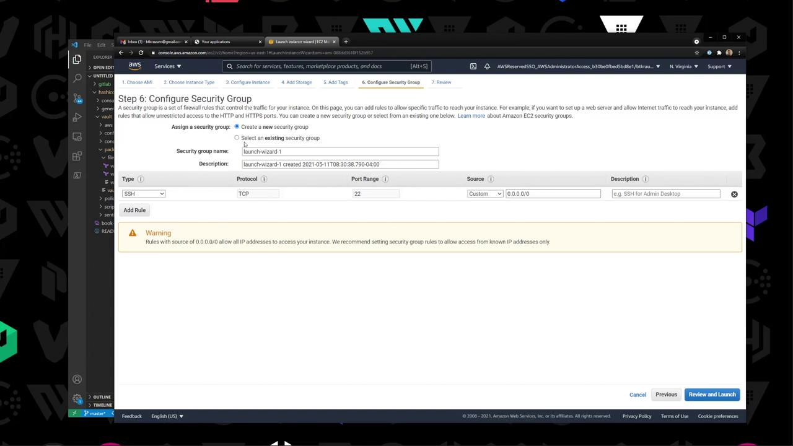

# Global settings
api_addr     = "https://vault-us-east-1.example.com:8200"
cluster_addr = "https://node-a-us-east-1.example.com:8201"
cluster_name = "vault-prod-us-east-1"
ui           = true
log_level    = "INFO"
```

<Callout icon="lightbulb">
  The `retry_join` block supports various providers (AWS, Azure, GCP) or static IP/hostname lists. Adjust to your environment.
</Callout>

## Joining and Managing the Raft Cluster

### Auto-joining via AWS

Vault nodes configured with the `retry_join` block will discover and join the leader automatically based on AWS tags.

### Manual Join

When auto-join isn’t available, add followers manually:

```bash theme={null}
vault operator raft join https://<leader_node_address>:8200
```

Replace `<leader_node_address>` with your leader’s Vault API endpoint.

<Callout icon="triangle-alert">
  Run the join command only on standby nodes. Do not execute it on the leader to avoid election issues.
</Callout>

### Viewing Cluster Membership

List Raft peers and their voting status:

```bash theme={null}
vault operator raft list-peers
```

Sample output:

```text theme={null}
Node      Address            State     Voter
----      -------            -----     -----
vault_1   10.0.101.22:8201   leader    true
vault_2   10.0.101.23:8201   follower  true
vault_3   10.0.101.24:8201   follower  true
vault_4   10.0.101.25:8201   follower  true
vault_5   10.0.101.26:8201   follower  true
```

| Field   | Description                                      |
| ------- | ------------------------------------------------ |
| Node    | Identifier of the Vault Raft peer                |
| Address | Raft port for inter-node communication (8201)    |
| State   | Current role: `leader` or `follower`             |
| Voter   | Indicates Raft vote participation (`true/false`) |

## Conclusion

By configuring Vault with its integrated Raft storage backend, you gain:

* A clear, multi-node topology without external dependencies.
* An HCL configuration template for integrated storage with AWS KMS sealing.
* Commands for automatic and manual cluster enrollment.
* Techniques to monitor and list your Raft peers.

Continue exploring Vault’s authentication methods, secrets engines, and advanced features in the next modules.

## Links and References

* [Vault Storage Backends](https://www.vaultproject.io/docs/configuration/storage)
* [Terraform Vault Provider](https://registry.terraform.io/providers/hashicorp/vault/latest)
* [AWS KMS Encryption](https://docs.aws.amazon.com/kms/latest/developerguide/overview.html)

<CardGroup>
  <Card title="Watch Video" icon="video" href="https://learn.kodekloud.com/user/courses/hashicorp-certified-vault-associate-certification/module/a5a3d715-00ac-4573-aa63-061912aafce2/lesson/ea6bc98f-e8f1-497d-abba-bf6cc7d20155" />

  <Card title="Practice Lab" icon="installation" href="https://learn.kodekloud.com/user/courses/hashicorp-certified-vault-associate-certification/module/a5a3d715-00ac-4573-aa63-061912aafce2/lesson/53de6fbe-86ac-4cba-b252-1e8ee5a2d9e7" />
</CardGroup>


# Demo Installing Vault using Packer

Source: https://notes.kodekloud.com/docs/HashiCorp-Certified-Vault-Associate-Certification/Installing-Vault/Demo-Installing-Vault-using-Packer/page

This tutorial guides you through using Packer to create a custom AMI with Vault 1.7.1 pre-installed on AWS.

In this tutorial, you’ll use [Packer](https://www.packer.io/) to bake a custom Amazon Machine Image (AMI) with Vault 1.7.1 pre-installed. We’ll walk through cloning the repo, configuring the Packer template, downloading Vault, building the AMI, and launching an EC2 instance.

<Frame>
  
</Frame>

This repository (github.com/bryankrausen/hashicorp) contains all my HashiCorp training content—Terraform, Vault, Packer, and more—plus discount links and coupons.

<Frame>
  
</Frame>

## Repository Structure

Navigate to the `vault/packer` directory. You’ll find:
‐ **vault.pkr.hcl**: Packer HCL2 template\
‐ **files/**: Vault configuration examples

<Frame>
  
</Frame>

Inside `files/`:

| Filename                | Description                      |
| ----------------------- | -------------------------------- |
| `vault.hcl`             | Vault server configuration       |
| `vault.service`         | systemd unit file for Vault      |
| `vault_int_storage.hcl` | Example using integrated storage |

<Frame>
  
</Frame>

## 1. Download Vault 1.7.1

Head to the official release page and grab the Linux ZIP:

```none theme={null}
https://releases.hashicorp.com/vault/1.7.1/vault_1.7.1_linux_amd64.zip
```

Example listing on the download page:

```text theme={null}
vault_1.7.1_SHA256SUMS
vault_1.7.1_linux_amd64.zip
vault_1.7.1_darwin_amd64.zip
…
```

<Callout icon="lightbulb">
  Make sure to verify the SHA256 checksum to ensure file integrity.
</Callout>

## 2. Configure the Packer Template

Open `vault.pkr.hcl` and define:

1. **Variables** (AWS region, VPC/Subnet IDs, path to Vault ZIP)
2. **Data source** for Amazon Linux 2 AMI
3. **`amazon-ebs`** source block
4. **Provisioners** to upload and install Vault

```hcl theme={null}
variable "aws_region" {
  type    = string
  default = env("AWS_REGION")
}

variable "vault_zip" {
  type    = string
  default = "/path/to/vault_1.7.1_linux_amd64.zip"
}

variable "vpc_id" {
  type    = string
  default = "vpc-xxxx"
}

variable "subnet_id" {
  type    = string
  default = "subnet-xxxx"
}

data "aws_ami" "amazon_linux_2" {
  most_recent = true
  owners      = ["amazon"]

  filter {
    name   = "name"
    values = ["amzn2-ami-hvm-*-x86_64-gp2"]
  }
}

source "amazon-ebs" "vault-amzn2" {
  region                      = var.aws_region
  ami_name                    = "vault-amazonlinux2-{{timestamp}}"
  instance_type               = "t2.micro"
  source_ami                  = data.aws_ami.amazon_linux_2.id
  ssh_username                = "ec2-user"
  associate_public_ip_address = true
  subnet_id                   = var.subnet_id
  vpc_id                      = var.vpc_id
  tags = {
    Name = "HashiCorp Vault"
    OS   = "Amazon Linux 2"
  }
}

build {
  sources = ["source.amazon-ebs.vault-amzn2"]

  provisioner "file" {
    source      = var.vault_zip
    destination = "/tmp/vault.zip"
  }

  provisioner "file" {
    source      = "files/"
    destination = "/tmp"
  }

  provisioner "shell" {
    inline = [
      "unzip /tmp/vault.zip -d /usr/local/bin",
      "chmod +x /usr/local/bin/vault",
      "mkdir -p /etc/vault.d",
      "mv /tmp/vault.hcl /etc/vault.d/",
      "mv /tmp/vault_int_storage.hcl /etc/vault.d/",
      "mv /tmp/vault.service /etc/systemd/system/",
      "systemctl daemon-reload",
      "systemctl enable vault"
    ]
  }
}
```

## 3. Set AWS Variables

Retrieve your VPC and Subnet IDs from the AWS VPC console:

<Frame>
  
</Frame>

You can either update the `default` values in `vault.pkr.hcl` or pass them at build time:

```bash theme={null}
packer build \
  -var aws_region=us-east-1 \
  -var vpc_id=vpc-123456 \
  -var subnet_id=subnet-abcdef \
  vault.pkr.hcl
```

## 4. Validate & Build the AMI

```bash theme={null}
packer validate vault.pkr.hcl
packer build vault.pkr.hcl
```

Packer will launch a builder EC2 instance, upload your files, install Vault, and register a new AMI.

```bash theme={null}
amazon-ebs.vault-amzn2: Creating AMI: vault-amazonlinux2-<timestamp> from instance i-0b8...
...
amazon-ebs.vault-amzn2: Builds finished. The artifacts of successful builds are:
```

## 5. Verify the Builder Instance

In the EC2 console, watch the temporary Packer builder instance spin up and terminate:

<Frame>
  
</Frame>

## 6. Check the New AMI

Under **EC2** → **AMIs**, confirm your `vault-amazonlinux2-*` AMI is available:

<Frame>
  
</Frame>

## 7. Launch & Validate an Instance

1. **Launch**: Select the custom AMI, choose T2 Micro, enable public IP.
2. **Security Group**: Open SSH (port 22) from your IP.

<Frame>
  
</Frame>

<Frame>
  
</Frame>

SSH into the new instance and verify Vault:

```bash theme={null}
ssh -i key.pem ec2-user@<public-ip>
sudo systemctl status vault
vault version
