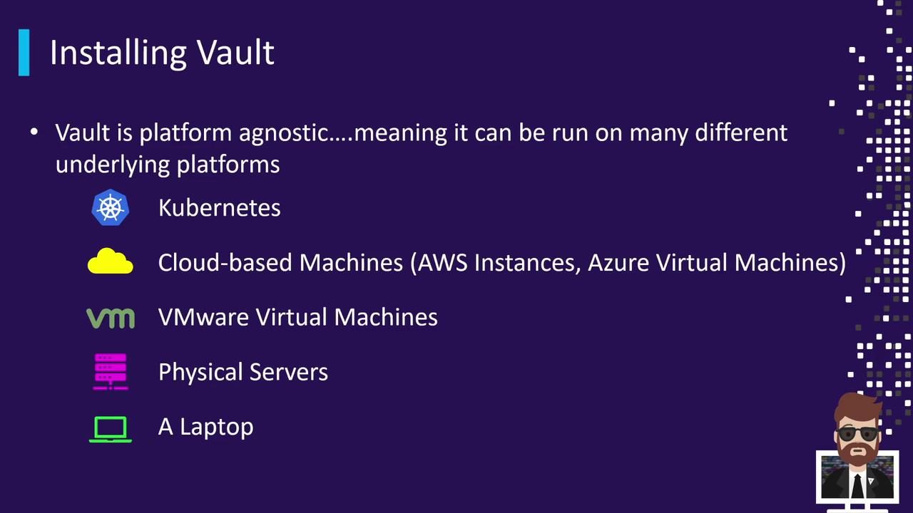
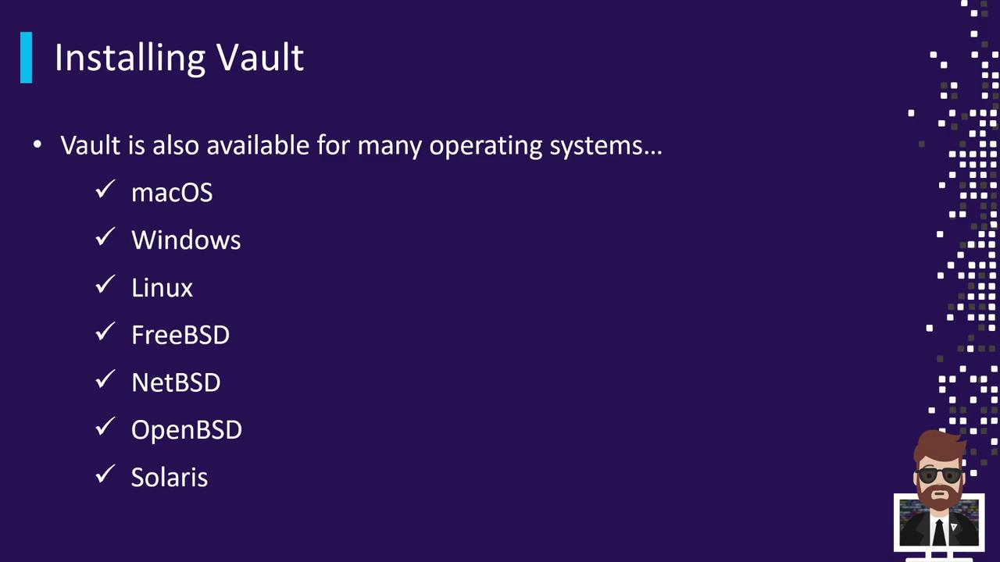
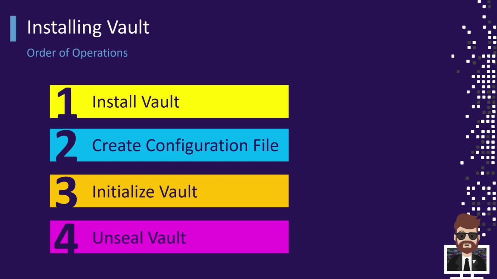
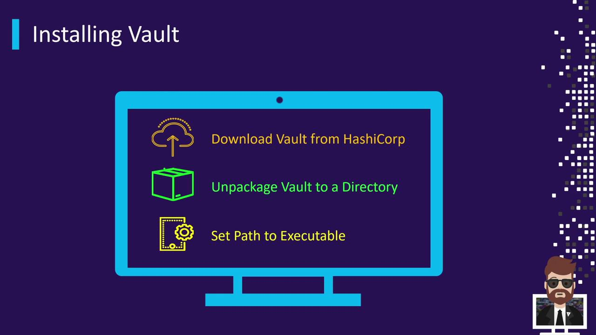

# 1. Change to /tmp and verify files
cd /tmp && ls
# 2. Unzip and move the Vault binary
sudo unzip vault.zip
sudo mv vault /usr/local/bin/vault

# 3. Validate the installation
vault --version
```

<Callout icon="lightbulb">
  Ensure that `/usr/local/bin` is in your `$PATH` so you can run `vault` without providing the full path.
</Callout>

## 2. Create a Vault System User and Directories

Run Vault under a non-root user and prepare the configuration and data directories.

```bash theme={null}
# Create a system user for Vault
sudo useradd --system --home /var/lib/vault --shell /sbin/nologin vault

# Create config & data directories
sudo mkdir -p /etc/vault.d /opt/vault/data1

# Give ownership to the vault user
sudo chown -R vault:vault /etc/vault.d /opt/vault
```

| Directory          | Purpose                   | Owner       |
| ------------------ | ------------------------- | ----------- |
| `/etc/vault.d`     | Vault configuration files | vault:vault |
| `/opt/vault/data1` | Raft storage data         | vault:vault |
| `/var/lib/vault`   | Vault home (no shell)     | vault:vault |

## 3. Define the Systemd Service

Create the Systemd unit at `/etc/systemd/system/vault.service`:

```ini theme={null}
[Unit]
Description="HashiCorp Vault - Secrets Management"
Documentation=https://www.vaultproject.io/docs/
Requires=network-online.target
After=network-online.target
ConditionFileNotEmpty=/etc/vault.d/vault.hcl
StartLimitIntervalSec=60
StartLimitBurst=3

[Service]
User=vault
Group=vault
ProtectSystem=full
ProtectHome=read-only
PrivateTmp=yes
PrivateDevices=yes
SecureBits=keep-caps
AmbientCapabilities=CAP_IPC_LOCK
Capabilities=CAP_IPC_LOCK+ep
CapabilityBoundingSet=CAP_SYSLOG CAP_IPC_LOCK
NoNewPrivileges=yes
ExecStart=/usr/local/bin/vault server --config=/etc/vault.d/vault.hcl
ExecReload=/bin/kill --signal HUP $MAINPID
KillMode=process
KillSignal=SIGINT
Restart=on-failure
RestartSec=5s
TimeoutStopSec=30s

[Install]
WantedBy=multi-user.target
```

Reload and enable the Vault service:

```bash theme={null}
sudo systemctl daemon-reload
sudo systemctl enable vault
```

## 4. Vault Configuration (`vault.hcl`)

Below is an example of `/etc/vault.d/vault.hcl` using Raft storage, AWS KMS auto-unseal, and a non-TLS TCP listener for demonstration:

```hcl theme={null}
storage "raft" {
  path    = "/opt/vault/data1"
  node_id = "node-a-us-east-1"

  retry_join {
    auto_join = [
      "provider=aws",
      "region=us-east-1",
      "tag_key=vault",
      "tag_value=us-east-1"
    ]
  }
}

seal "awskms" {
  region     = "us-east-1"
  kms_key_id = "arn:aws:kms:us-east-1:003674902126:key/8bc6b2ab-840a-4eef-8f2d-5616a3e67900"
}

listener "tcp" {
  address         = "0.0.0.0:8200"
  cluster_address = "0.0.0.0:8201"
  tls_disable     = 1
}

api_addr     = "http://10.0.1.37:8200"
cluster_addr = "http://10.0.1.37:8201"
cluster_name = "vault-prod-us-east-1"

ui        = true
log_level = "INFO"
```

<Callout icon="triangle-alert">
  For a production setup, **always** enable TLS by adding `tls_cert_file` and `tls_key_file` under the `listener` block.
</Callout>

## 5. Start and Verify Vault

Launch Vault and confirm its status:

```bash theme={null}
# Start the service
sudo systemctl start vault

# Check seal & HA status
vault status
```

Expected output:

```plaintext theme={null}
Key             Value
---             -----
Seal Type       awskms
Initialized     false
Sealed          false
Total Shares    0
Version         1.7.1
Storage Type    raft
HA Enabled      true
```

View runtime logs to troubleshoot:

```bash theme={null}
# Service status
sudo systemctl status vault

# Live logs
sudo journalctl -u vault -f
```

You should see AWS KMS auto-unseal messages if IAM and KMS permissions are correct:

```plaintext theme={null}
2021-05-12T13:41:19.601Z [INFO]  core: [DEBUG] discover-aws: Creating session...
2021-05-12T13:41:19.639Z [INFO]  core: [DEBUG] discover-aws: Filter instances with vault=us-east-1
...
```

## 6. References

* [AWS EC2][ec2]
* [Packer by HashiCorp][packer]
* [Vault Documentation](https://www.vaultproject.io/docs/)
* [HashiCorp AWS KMS Secrets Engine](https://www.vaultproject.io/docs/secrets/aws)

[ec2]: https://aws.amazon.com/ec2

[packer]: https://www.packer.io

<CardGroup>
  <Card title="Watch Video" icon="video" href="https://learn.kodekloud.com/user/courses/hashicorp-certified-vault-associate-certification/module/a5a3d715-00ac-4573-aa63-061912aafce2/lesson/bd3e90d0-1ae9-419a-9113-1c1863d62848" />

  <Card title="Practice Lab" icon="installation" href="https://learn.kodekloud.com/user/courses/hashicorp-certified-vault-associate-certification/module/a5a3d715-00ac-4573-aa63-061912aafce2/lesson/b55773a1-515f-4a4a-ad56-70a8f624c5f2" />
</CardGroup>


# Installing and Running Vault Server

Source: https://notes.kodekloud.com/docs/HashiCorp-Certified-Vault-Associate-Certification/Installing-Vault/Installing-and-Running-Vault-Server/page

This guide covers the installation and operation of HashiCorp Vault across various platforms and environments.

In this guide, we’ll walk through the essential components and steps required to install and run HashiCorp Vault. You’ll learn how to:

* Prepare your system and environment
* Create and manage configuration files
* Initialize, seal, and unseal the Vault
* Choose storage backends and interfaces

Vault is intentionally platform-agnostic, supporting a wide range of deployment scenarios.

## Supported Platforms

<Frame>
  
</Frame>

Vault can run anywhere you need it:

* **Kubernetes** (self-hosted or managed services such as AKS, EKS)
* **Cloud-based VMs** (AWS EC2, Azure VM, Google Compute Engine)
* **VMware virtual machines**
* **Physical servers** (for isolated CPU and memory)
* **Local workstations** (laptops and desktops for development)

Some security-conscious teams opt for physical servers to isolate Vault’s cryptographic operations.

## Supported Operating Systems

<Frame>
  
</Frame>

Vault binaries are distributed for multiple OS platforms:

| Operating System               | Typical Use Case                        |
| ------------------------------ | --------------------------------------- |
| Linux                          | Production servers (Ubuntu, RHEL, etc.) |
| macOS                          | Local development on Apple hardware     |
| Windows                        | Development or Windows-based servers    |
| FreeBSD/NetBSD/OpenBSD/Solaris | Specialized or legacy environments      |

Enterprises typically deploy Vault on Linux distributions such as Ubuntu, Amazon Linux, CentOS, or Red Hat.

## Installation Workflow

<Frame>
  
</Frame>

Follow this sequence for a manual deployment or when scripting an automated install:

1. Install the Vault binary
2. Create or update the Vault configuration file
3. Start the Vault server process
4. Initialize the Vault (generates root tokens and unseal keys)
5. Unseal Vault (use unseal keys to decrypt the storage)

After unsealing, your Vault instance is ready to store secrets or issue dynamic credentials.

<Callout icon="lightbulb">
  Automating these steps with tools like Terraform, Ansible, or Helm can ensure consistency across environments.
</Callout>

## Installing Vault

You can install Vault in several ways: via system packages, Helm charts, or manual download. Choose the method that fits your environment.

### Using APT on Debian/Ubuntu

```bash theme={null}
curl -fsSL https://apt.releases.hashicorp.com/gpg | sudo apt-key add -
sudo apt-add-repository "deb [arch=amd64] https://apt.releases.hashicorp.com $(lsb_release -cs) main"
sudo apt-get update
sudo apt-get install vault
```

This will add the HashiCorp APT repository, refresh your package index, and install the `vault` CLI into your system `PATH`.

### Using Helm on Kubernetes

```bash theme={null}
helm repo add hashicorp https://helm.releases.hashicorp.com
helm repo update
helm install vault hashicorp/vault --namespace vault --create-namespace
```

Deploy Vault as a Kubernetes Deployment with a Service and StatefulSet backing the storage layer.

### Manual Download and Installation

<Frame>
  
</Frame>

```bash theme={null}
