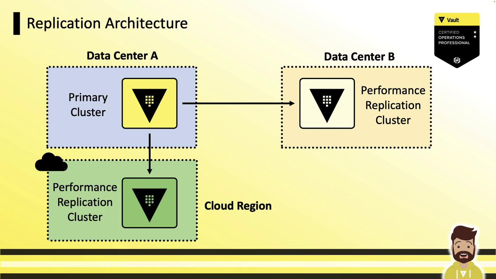
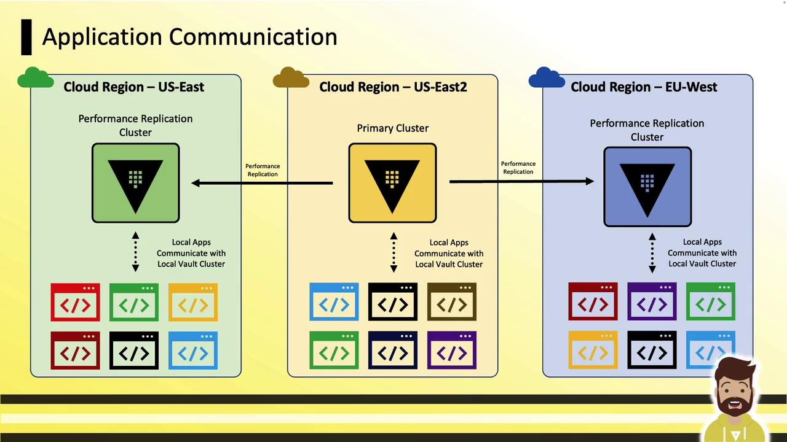
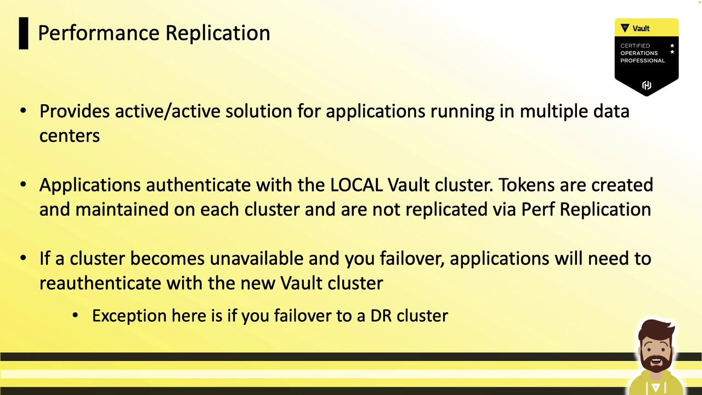
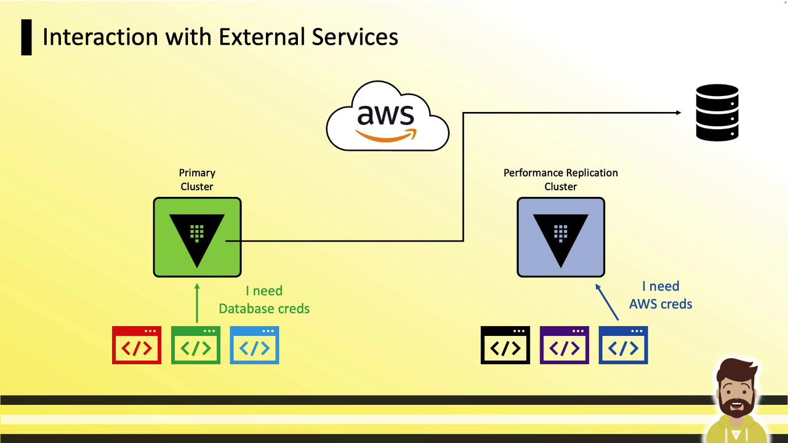

# Demo Disaster Replication Configuration

Source: https://notes.kodekloud.com/docs/HashiCorp-Certified-Vault-Associate-Certification/Vault-Replication/Demo-Disaster-Replication-Configuration/page

This guide explains how to enable and configure performance replication in Vault Enterprise for active-active read scalability across multiple clusters.

In this guide, you’ll learn how to enable and configure **performance replication** in Vault Enterprise. Performance replication lets you distribute Vault policies, secrets engines, authentication methods, and audit configurations across multiple clusters for active-active read scalability, while routing write operations to a single primary.

<Frame>
  
</Frame>

## Key Concepts

* **Active-Active Workloads**: Read operations (authentication, secret reads, dynamic secret generation) are served locally on each replica.
* **Centralized Writes**: All write requests (policy changes, configuration updates) are forwarded to the primary cluster.
* **Independent Authentication**: Tokens and leases created on a performance secondary are local and are *not* replicated from the primary. Clients must re-authenticate on each cluster.

## Performance vs. Disaster Recovery (DR) Replication

| Feature                | Performance Replication          | DR Replication                 |
| ---------------------- | -------------------------------- | ------------------------------ |
| Policies & Config      | ✓                                | ✗                              |
| Secrets Engines & Auth | ✓                                | ✗                              |
| Audit Configurations   | ✓                                | ✗                              |
| Tokens & Leases        | ✗                                | ✓                              |
| Use Case               | Active-active, low-latency reads | Failover and disaster recovery |
| Write Path             | Forwarded to primary             | Forwarded to primary           |

<Frame>
  
</Frame>

## Example Architecture: Data Centers & Cloud Regions

### Multi–Data Center Deployment

A primary cluster in **Data Center A** replicates to performance secondaries in **Data Center B** and a **cloud region**. Local applications read and authenticate against their nearest replica, while writes go to the primary.

<Frame>
  
</Frame>

### Global Cloud Deployment

In a cloud setup, the primary (US-East2) replicates to secondaries in US-East and EU-West. Applications in each region authenticate to their local replica for reads; writes are sent back to the primary and propagated.

<Frame>
  
</Frame>

## How Performance Replication Works

1. **Active-Active Authentication**\
   Each performance replica handles logins locally. Tokens and leases exist only on the cluster where they were issued.

2. **Local Dynamic Secrets**\
   Replicas generate dynamic credentials (e.g., database passwords, AWS keys) without contacting the primary:

<Frame>
  
</Frame>

<Frame>
  
</Frame>

3. **External Service Interactions**\
   Connections to AWS, databases, and other external services occur directly from each replica:

<Frame>
  
</Frame>

## Setup Process

Follow these four steps to configure performance replication:

<Frame>
  
</Frame>

1. Enable performance replication on the primary.
2. Generate a secondary token.
3. Enable the secondary using the token.
4. Monitor the replication status.

### CLI Commands

```bash theme={null}
