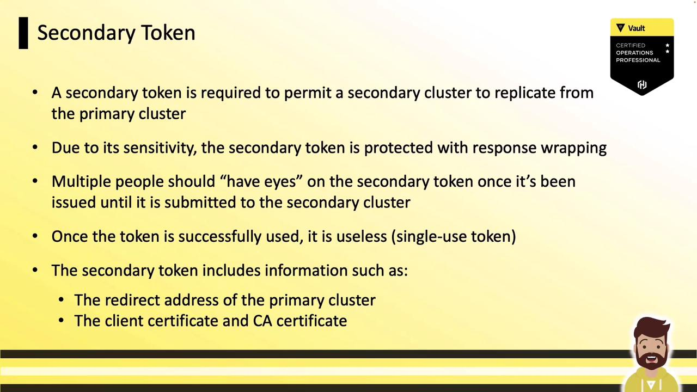
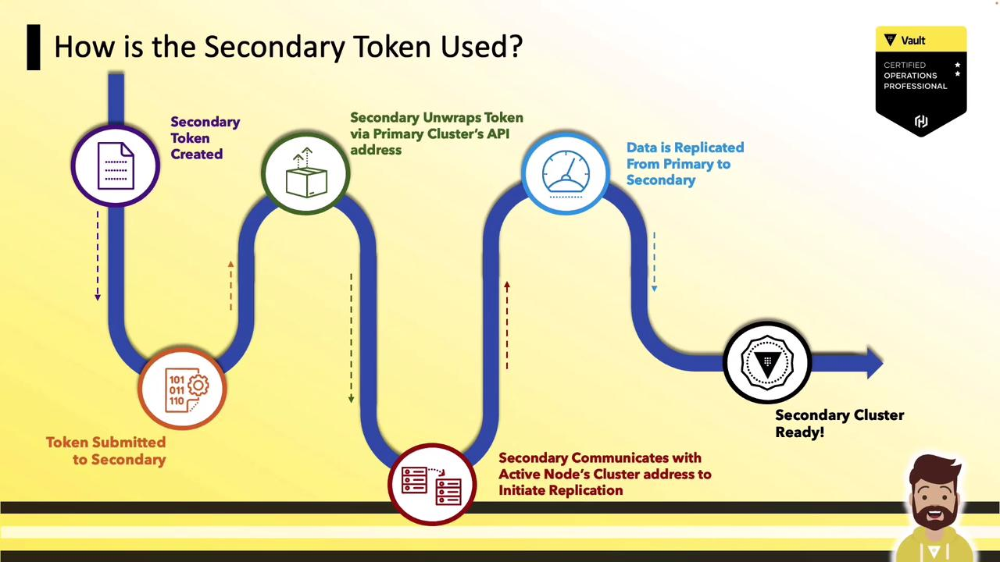
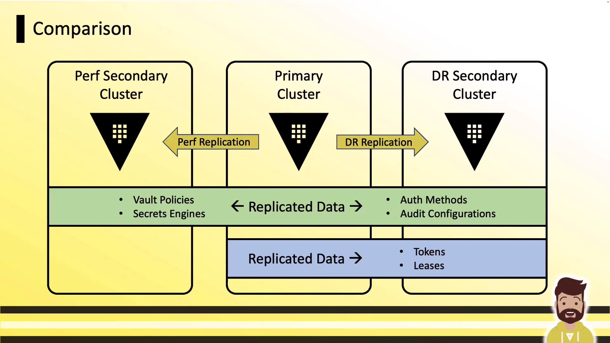
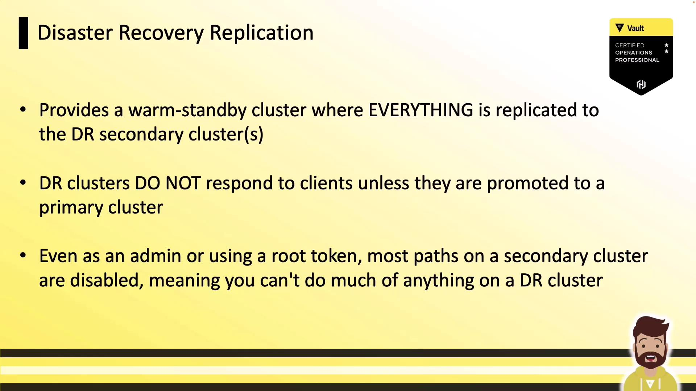

# Example: Enable DR replication on primary
vault write -f sys/replication/dr/primary/enable
```

***

## 2. Generate the Wrapped Secondary Token

Next, create a DR secondary token on the primary. This wrapped, single-use token contains:

* The primary’s unwrapping address
* The CA certificate for mTLS
* A client certificate and key

```bash theme={null}
vault write -wrap-ttl=5m -f sys/replication/dr/secondary-token
```

<Frame>
  
</Frame>

***

## 3. (Optional) Inspect the Wrapped Token

Typically you hand this wrapped token directly to the secondary without unwrapping. For demonstration, here’s the JSON after unwrapping:

```json theme={null}
{
  "request_id": "98d4c7a5-0f00-4872-1cad-6ab8fa35694c",
  "data": {
    "ca_cert": "MIIC/fCCAd ...",
    "client_cert": "MIICjCCAjgAwIBAgIIK4vDI ...",
    "client_key": {
      "type": "p521",
      "d": "...",
      "x": "...",
      "y": "..."
    }
  },
  "cluster_id": "0d12790a-996e-152f-0113-3b016812d64d",
  "id": "secondary"
}
```

You can skip this step in production—Vault handles unwrapping automatically on the secondary.

***

## 4. Activate DR Replication on the Secondary Cluster

On your secondary cluster, supply the wrapped token when enabling DR replication. Vault will:

1. Call back to the primary’s API on port 8200 to unwrap the token
2. Extract mTLS credentials and primary address
3. Establish inter-cluster connections on port 8201
4. Begin streaming data from primary to secondary

```bash theme={null}
vault write sys/replication/dr/secondary/enable \
    token="<wrapped_token_response>"
```

<Frame>
  
</Frame>

Once complete, your secondary cluster is fully synchronized and ready for disaster recovery.

***

## Further Reading

* [Vault DR Replication Documentation](https://www.vaultproject.io/docs/enterprise/replication/dr)
* [Mutual TLS in Vault](https://www.vaultproject.io/docs/concepts/tls)
* [Vault Enterprise Features](https://www.vaultproject.io/docs/enterprise)

<CardGroup>
  <Card title="Watch Video" icon="video" href="https://learn.kodekloud.com/user/courses/hashicorp-certified-vault-associate-certification/module/cfd009a3-718e-46c1-b509-a1354fc1e2a6/lesson/ad6a1beb-6bd4-449e-8f38-021239754907" />
</CardGroup>


# Introduction to Vault Replication

Source: https://notes.kodekloud.com/docs/HashiCorp-Certified-Vault-Associate-Certification/Vault-Replication/Introduction-to-Vault-Replication/page

Vault replication provides high availability and disaster recovery for secret management by synchronizing policies, secrets, and leases across multiple clusters.

Vault replication enables high availability and disaster recovery for your secret management platform. By leveraging Vault’s DR (Disaster Recovery) and Performance replication modes, you can synchronize policies, secrets, and leases across multiple clusters—ensuring seamless failover and consistent access in multi-region deployments.

## Understanding Vault Replication

Enterprises often distribute infrastructure across regions or data centers to maintain uptime. Vault, as the central secrets store, must follow the same architecture. Replication in HashiCorp Vault Enterprise (including HCP Vault) follows a leader-follower model:

* The **primary cluster** is the system of record.
* One or more **secondary clusters** receive asynchronous updates over mutual TLS.

Replication ensures:

* Global policy management: write policies once on primary, propagate automatically to all replicas.
* Consistent secrets: applications in any region read the same credentials and settings.
* Failover readiness: secondary clusters stand ready to assume primary duties if needed.

<Callout icon="lightbulb">
  Vault replication is an Enterprise-only feature. Evaluate your licensing and capacity requirements before enabling replication.
</Callout>

<Frame>
  
</Frame>

Vault Enterprise supports two replication modes:

1. **Performance Replication**
2. **Disaster Recovery (DR) Replication**

We’ll start with Performance replication before diving into DR replication details.

***

## Performance Replication

Performance replication extends Vault to multiple data centers for low-latency reads. It replicates all configurations, policies, and secrets from the primary to one or more **performance secondary** clusters. Key characteristics:

* **Primary cluster**: serves all reads and writes.
* **Performance secondary**: serves local reads; forwards writes to primary.
* **Tokens & leases**: *not* replicated—clients must re-authenticate after failover.

<Frame>
  
</Frame>

***

## Disaster Recovery (DR) Replication

DR replication creates a warm-standby cluster that includes tokens and leases. It mirrors policies, auth methods, secret engines, and all dynamic data. This mode is ideal for planned or unplanned primary outages:

* **DR secondary**: passive; does not serve client reads/writes until promotion.
* **Tokens & leases**: fully replicated—clients continue using existing credentials after failover.

<Frame>
  
</Frame>

***

## Performance vs. DR Replication: Feature Comparison

| Feature                  | Performance Replication  | DR Replication     |
| ------------------------ | ------------------------ | ------------------ |
| Configuration & policies | ✓                        | ✓                  |
| Secret engines & data    | ✓                        | ✓                  |
| Tokens & leases          | ✗                        | ✓                  |
| Client reads             | Secondary only           | Primary only       |
| Client writes            | Primary only             | Primary only       |
| Licensing impact         | Additional secondary fee | Typically included |

<Frame>
  
</Frame>

***

## Deep Dive: DR Cluster Behavior and Promotion

A DR secondary remains in standby until you invoke the promotion API. Until then:

* Most API endpoints are disabled (including root token generation).
* Any client request returns a “path is disabled” error.

Upon promotion:

1. The DR cluster becomes the new primary.
2. All replicated data, tokens, and leases become active.
3. Client applications resume without re-authentication.

<Callout icon="triangle-alert">
  Only one DR cluster can be promoted at a time. Promoting a DR secondary will break replication links—you must reconfigure replication after failover.
</Callout>

<Frame>
  
</Frame>

***

## Links and References

* [Vault Replication Overview](https://www.vaultproject.io/docs/enterprise/replication)
* [Vault Enterprise Licensing](https://www.vaultproject.io/docs/enterprise#licensing)
* [HCP Vault](https://cloud.hashicorp.com/products/vault)
* [HashiCorp Vault Documentation](https://www.vaultproject.io/docs)

<CardGroup>
  <Card title="Watch Video" icon="video" href="https://learn.kodekloud.com/user/courses/hashicorp-certified-vault-associate-certification/module/cfd009a3-718e-46c1-b509-a1354fc1e2a6/lesson/f5be3c45-0525-4315-8fac-d95f7892b529" />
</CardGroup>
