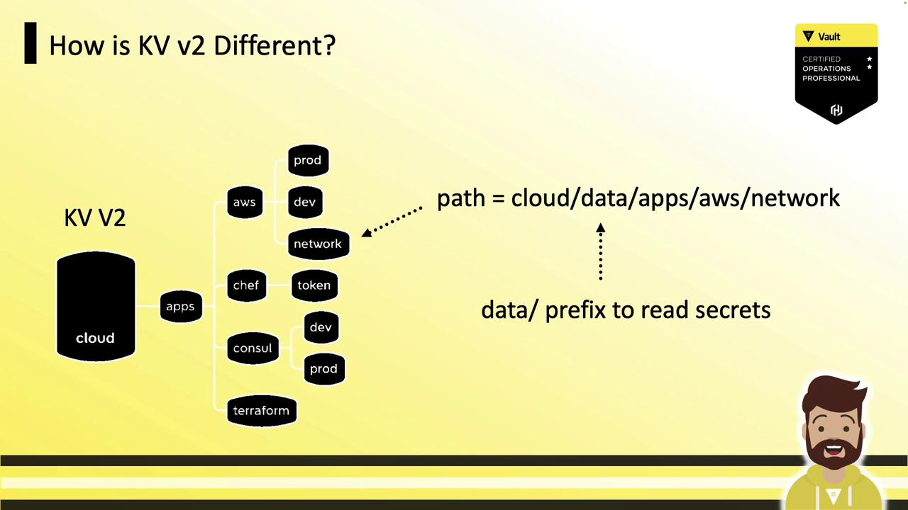
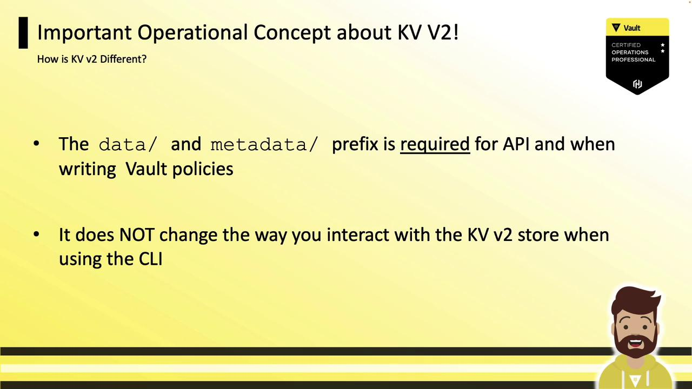
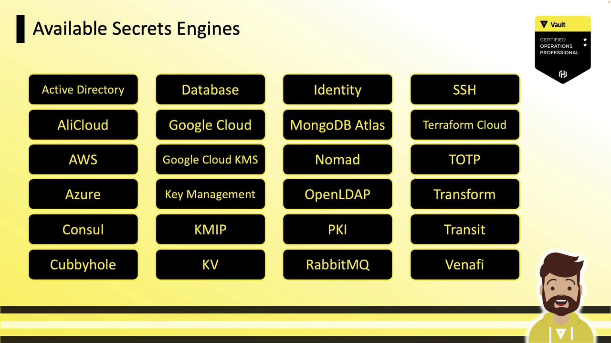
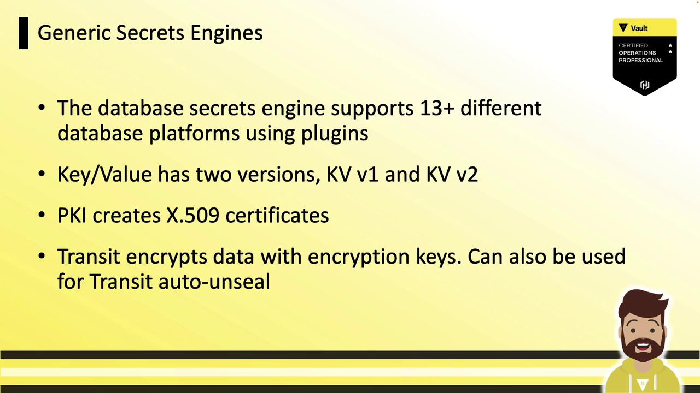
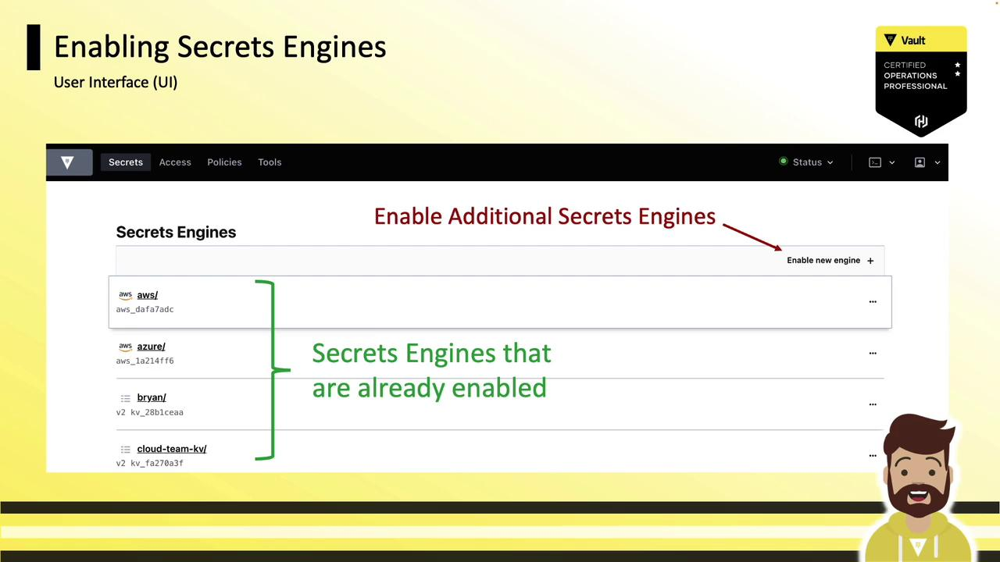

# Enable a KV v1 engine at the default path kv/
vault secrets enable kv

# Enable a KV v1 engine at a custom path hcvop/
vault secrets enable -path=hcvop kv

# List all secrets engines with detailed info
vault secrets list --detailed
```

| Path       | Plugin    | Accessor      | Options |
| ---------- | --------- | ------------- | ------- |
| cubbyhole/ | cubbyhole | cubbyhole\_\* | map\[]  |
| kv/        | kv        | kv\_\*        | map\[]  |
| hcvop/     | kv        | kv\_\*        | map\[]  |

<Callout icon="lightbulb">
  An empty `map[]` under **Options** indicates a KV v1 store.
</Callout>

***

## Enabling and Listing KV Version 2

You can enable KV v2 with either shorthand or an explicit version flag.

Method 1 (shorthand):

```bash theme={null}
vault secrets enable kv-v2
```

Method 2 (explicit):

```bash theme={null}
vault secrets enable -path=training -version=2 kv
```

Re-run the listing:

```bash theme={null}
vault secrets list --detailed
```

| Path       | Plugin    | Accessor      | Options         |
| ---------- | --------- | ------------- | --------------- |
| cubbyhole/ | cubbyhole | cubbyhole\_\* | map\[]          |
| kv-v2/     | kv        | kv\_\*        | map\[version:2] |
| training/  | kv        | kv\_\*        | map\[version:2] |

<Callout icon="lightbulb">
  The `map[version:2]` entry marks a KV v2 store.
</Callout>

***

## Upgrading a KV v1 Engine to v2

You can convert an existing KV v1 mount to version 2. Be aware this action is **irreversible** without restoring from backup.

<Callout icon="triangle-alert">
  Upgrading to KV v2 cannot be undone. Ensure you have a backup of your Vault data before proceeding.
</Callout>

```bash theme={null}
vault kv enable-versioning training/
# Success! Tuned the secrets engine at: training/
```

***

## Understanding KV v2 Metadata and Path Prefixes

KV v2 tracks detailed metadata (creation date, version, deletion status, custom fields) for every secret. To support versioning, KV v2 introduces two API path prefixes:

* **data/** – Stores the secret data
* **metadata/** – Stores the versioning metadata

<Frame>
  
</Frame>

For a KV v2 engine mounted at `cloud/` with a secret path `apps/AWS/network`:

* Data path: `cloud/data/apps/AWS/network`
* Metadata path: `cloud/metadata/apps/AWS/network`

<Frame>
  
</Frame>

When working with the API or writing policies, you must include the `data/` and `metadata/` prefixes. The `vault kv` CLI commands automatically handle these prefixes for you:

<Frame>
  
</Frame>

***

## Next Steps

You’re now ready to get hands-on with KV v1 and KV v2 in Vault. Practice writing policies, making API calls, and exploring the versioning features to master static secret management.

## Links and References

* [Vault KV Secrets Engine Documentation](https://www.vaultproject.io/docs/secrets/kv)
* [Vault Policies Guide](https://www.vaultproject.io/docs/concepts/policies)
* [Vault CLI Documentation](https://www.vaultproject.io/docs/commands)

<CardGroup>
  <Card title="Watch Video" icon="video" href="https://learn.kodekloud.com/user/courses/hashicorp-certified-vault-operations-professional-2022/module/b59936f2-3ed0-4ec2-b1fd-971dcce5c2ca/lesson/d1ee3cbb-649f-4986-83e6-d5acbbb94658" />
</CardGroup>


# Section Overview Create a Working Vault Server Config

Source: https://notes.kodekloud.com/docs/HashiCorp-Certified-Vault-Operations-Professional-2022/Create-a-working-Vault-server-configuration-given-a-scenario/Section-Overview-Create-a-Working-Vault-Server-Config/page

Learn to build a production-ready Vault server setup, including configuration, enabling secrets engines, and managing authentication methods.

In this lesson, you’ll learn how to build a production-ready Vault server setup. We’ll walk through:

* Launching Vault and managing its configuration files
* Enabling and tuning Secrets Engines
* Auto-unseal and Integrated Storage
* Configuring authentication methods
* Secure initialization, root token regeneration, and key rotation

<Frame>
  
</Frame>

Each of these steps is essential for a resilient, compliant Vault deployment. Let’s start by enabling and configuring the Secrets Engines.

***

## Available Secrets Engines

Vault supports a wide range of Secrets Engines for cloud providers, directories, databases, and more. While Vault can integrate with AWS, Azure, GCP, Active Directory, and others, our focus will be on the core, cross-platform engines:

| Secrets Engine | Use Case                                |
| -------------- | --------------------------------------- |
| Cubbyhole      | Per-token secret storage (built-in)     |
| Database       | Dynamic credentials for databases       |
| Key/Value (KV) | Generic storage (v1 vs. v2 versioning)  |
| Identity       | Vault’s identity store (built-in)       |
| PKI            | X.509 certificate issuance              |
| Transit        | Data encryption and auto-unseal support |

<Frame>
  
</Frame>

***

## Generic Secrets Engine Features

Vault’s generic engines share powerful capabilities:

* **Database Secrets Engine**\
  Manage credentials for MySQL, PostgreSQL, Oracle, and more via a single plugin-based engine.
* **Key/Value (KV) Secrets Engine**\
  KV v2 adds versioning and metadata on top of the simple key/value store.
* **PKI Secrets Engine**\
  Issue and revoke X.509 certificates with customizable roles, CA certs, and TTLs.
* **Transit Secrets Engine**\
  Encrypt/decrypt data without storing it, and integrate with Auto Unseal systems.
* **Cubbyhole & Identity Engines**\
  Enabled by default; provide per-token isolated storage and an identity backend.

<Frame>
  
</Frame>

***

## Enabling Secrets Engines

By default, `cubbyhole/` and `identity/` are mounted. All other engines must be enabled at a unique mount path.

<Callout icon="lightbulb">
  Vault’s `cubbyhole/` and `identity/` engines are mounted by default and cannot be disabled.
</Callout>

You interact with each engine via its mount path:

* **Default mount**: use the engine type (e.g., `aws/`, `kv/`).
* **Custom mount**: choose any path (e.g., `team1-db/`).

<Frame>
  
</Frame>

### CLI: vault secrets

Vault’s primary CLI for secrets engines:

| Command               | Description                           |
| --------------------- | ------------------------------------- |
| vault secrets enable  | Enable a new secrets engine           |
| vault secrets disable | Disable an existing mount             |
| vault secrets list    | Show enabled engines                  |
| vault secrets move    | Change an engine’s mount path         |
| vault secrets tune    | Adjust engine parameters (e.g., TTLs) |

```bash theme={null}
$ vault secrets enable aws
Success! Enabled the aws secrets engine at: aws/

$ vault secrets tune -default-lease-ttl=72h pki/
Success! Tuned the pki secrets engine at: pki/

$ vault secrets disable aws/
Success! Disabled the secrets engine at: aws/

$ vault secrets list
Path        Type        Accessor         Description
----        ----        --------         -----------
cubbyhole/  cubbyhole   cubbyhole_...    per-token private secret storage
identity/   identity    identity_...     identity store
pki/        pki         pki_...          n/a
```

For detailed output (including KV version), use:

```bash theme={null}
$ vault secrets list -detailed
```

<Callout icon="triangle-alert">
  Always choose a unique mount path to prevent conflicts when enabling multiple secrets engines.
</Callout>

### Custom Path & Description

You can customize both the mount path and its metadata:

```bash theme={null}
$ vault secrets enable \
    -path="cloud-kv" \
    -description="Team A Key/Value Store" \
    kv-v2
```

* `-path="cloud-kv"`: custom mount point
* `-description="Team A Key/Value Store"`: shown in `vault secrets list`
* `kv-v2`: engine type (Key/Value version 2)

#### Example: Listing Secrets Engines

```bash theme={null}
$ vault secrets list
Path            Type        Accessor            Description
----            ----        --------            -----------
aws/            aws         aws_dafa7adc        n/a
cloud-kv/       kv          kv_fa270a3f         Team A Key/Value Store
cubbyhole/      cubbyhole   cubbyhole_88c8e2e3  per-token private secret storage
identity/       identity    identity_e60e93cb   identity store
pki/            pki         pki_123456ab        n/a
transit/        transit     transit_7b8038ca    n/a
```

*Note*: KV engines always show as `kv` in `vault secrets list`; the version is visible with `-detailed`.\*

***

## Enabling via UI

In the Vault UI, go to **Secrets** → **Enable new engine**. Select the engine type, configure options, and mount it—all in one guided flow.

<Frame>
  
</Frame>

***

With your Secrets Engines enabled and tuned, you’re now prepared to dive into the Key/Value Secrets Engine details—exploring data versioning, access control, and best practices.

## References

* [Vault CLI Commands](https://www.vaultproject.io/docs/commands/secrets)
* [Vault Concepts](https://www.vaultproject.io/docs/concepts)
* [HashiCorp Vault Documentation](https://www.vaultproject.io/docs/)

<CardGroup>
  <Card title="Watch Video" icon="video" href="https://learn.kodekloud.com/user/courses/hashicorp-certified-vault-operations-professional-2022/module/b59936f2-3ed0-4ec2-b1fd-971dcce5c2ca/lesson/b799d1ad-2e72-4cd7-baef-99960fa753b1" />
</CardGroup>
