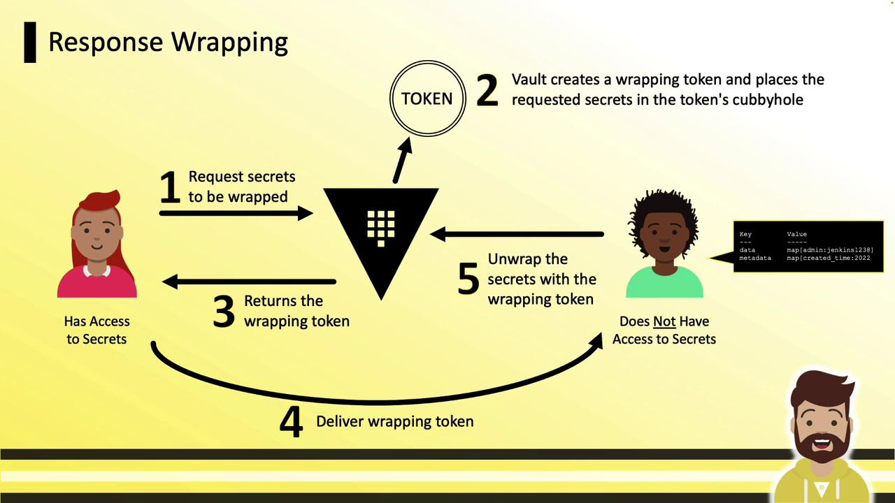
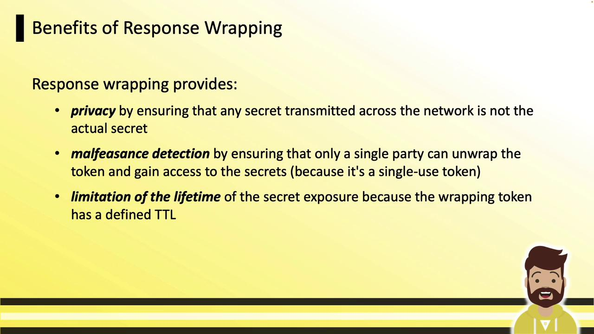
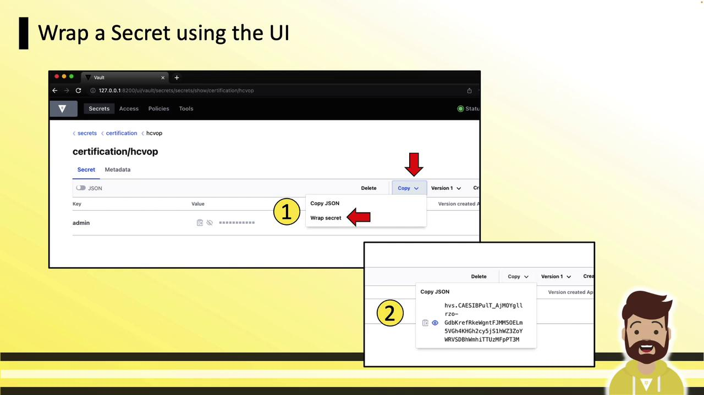
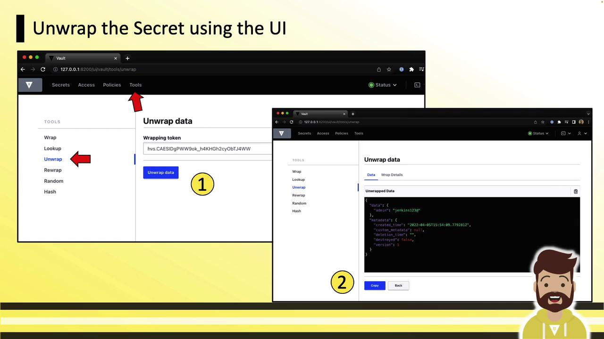

# Write a secret
vault write cubbyhole/training certification=hcvop

# Read the secret
vault read cubbyhole/training
```

### API: Write and Read

Using the HTTP API:

```bash theme={null}
# Write
curl \
  --header "X-Vault-Token: ${VAULT_TOKEN}" \
  --request POST \
  --data '{"certification":"hcvop"}' \
  https://vault.example.com:8200/v1/cubbyhole/training

# Read
curl \
  --header "X-Vault-Token: ${VAULT_TOKEN}" \
  https://vault.example.com:8200/v1/cubbyhole/training
```

For more, see the [Vault API Reference](https://www.vaultproject.io/api-docs).

***

Response wrapping lets you transmit secrets securely over untrusted channels (e.g., email, chat). Instead of sending raw data, Vault issues a **wrapping token**, stores the secret in that token’s cubbyhole, and returns only the token. The recipient unpacks it to retrieve the secret.

<Frame>
  
</Frame>

## Workflow Overview

1. Requester asks Vault for a secret.
2. Vault returns a wrapping token instead of the secret data.
3. Vault stores the secret in the wrapping token’s cubbyhole.
4. Requester shares the wrapping token over any channel.
5. Recipient unwraps the token to fetch the secret.

<Frame>
  
</Frame>

## Benefits

| Benefit               | Description                                              |
| --------------------- | -------------------------------------------------------- |
| Privacy               | Only the wrapping token crosses the network.             |
| Malfeasance Detection | Single-use tokens prevent multiple unwrappings.          |
| Lifetime Limitation   | Tokens expire quickly (e.g., default TTL of 60 seconds). |

<Frame>
  
</Frame>

***

## CLI: Wrapping a Secret

Use the `-wrap-ttl` flag on any read command. For example, wrapping a KV secret:

```bash theme={null}
vault kv get -wrap-ttl=5m secrets/certification/hcvop
```

Sample output:

```text theme={null}
Key                           Value
---                           -----
wrapping_token                [VAULT_TOKEN]...
wrapping_accessor             O5XSKsRf0c7CwXo996BJkYNi
wrapping_token_ttl            5m
wrapping_token_creation_time  2022-12-25T10:36:36.588947-04:00
wrapping_token_creation_path  secrets/certification/hcvop
```

### Inspecting the Wrapping Token

```bash theme={null}
vault token lookup [VAULT_TOKEN]
```

Output fields include `creation_ttl`, `expire_time`, `num_uses`, and the original `path`.

***

## UI: Wrapping a Secret

In the Vault UI:

1. Navigate to the desired secret.
2. Click **Copy**, then **Wrap Secret**.
3. The wrap token appears in the bottom-right panel—copy and share it.

<Frame>
  
</Frame>

***

## CLI: Unwrapping a Secret

```bash theme={null}
vault unwrap [VAULT_TOKEN]
```

Example response:

```text theme={null}
Key      Value
---      -----
data     map[admin:jenkins123 app:myapp]
metadata map[created_time:2022-12-25T14:33:10.525712Z ...]
```

Alternatively:

```bash theme={null}
export VAULT_TOKEN=<wrapping-token>
vault unwrap
```

Or:

```bash theme={null}
vault login <wrapping-token>
vault unwrap
```

## UI: Unwrapping a Secret

In the UI, go to **Tools » Unwrap**, paste your wrapping token, then click **Unwrap Data**. The secret fields will display in the panel.

<Frame>
  
</Frame>

***

Cubbyhole and response wrapping are key patterns for securely sharing static or dynamic credentials without exposing them directly. By sending only a single-use token with a short TTL, you ensure secrets remain protected until the moment of unwrapping.

## Links and References

* [Vault Documentation](https://www.vaultproject.io/docs)
* [Vault CLI Commands](https://www.vaultproject.io/docs/commands)
* [Vault API Reference](https://www.vaultproject.io/api-docs)

<CardGroup>
  <Card title="Watch Video" icon="video" href="https://learn.kodekloud.com/user/courses/hashicorp-certified-vault-operations-professional-2022/module/b59936f2-3ed0-4ec2-b1fd-971dcce5c2ca/lesson/fb642978-4f5c-4527-8d65-8c7d6fda5ece" />
</CardGroup>


# Demo AppRole Auth Method

Source: https://notes.kodekloud.com/docs/HashiCorp-Certified-Vault-Operations-Professional-2022/Create-a-working-Vault-server-configuration-given-a-scenario/Demo-AppRole-Auth-Method/page

This tutorial explains how to configure and use Vault’s AppRole authentication method for machine clients to access a KV secrets engine.

In this tutorial, you’ll learn how to configure and use Vault’s AppRole authentication method to grant machine clients read access to a KV secrets engine. By the end, you’ll create a policy, define an AppRole, and retrieve a client token using Role ID and Secret ID.

## Prerequisites

* A running Vault server
* `VAULT_ADDR` environment variable set (e.g., `export VAULT_ADDR=http://127.0.0.1:8200`)
* Vault CLI installed and authenticated as an administrator

## 1. Verify Enabled Auth Methods

By default, Vault includes the Token auth method. Let’s confirm:

```bash theme={null}
vault auth list
```

Example output:

```text theme={null}
Path    Type    Accessor
----    ----    --------
token/  token   auth_token_9e81d3bb
```

You can also compare common methods:

| Auth Method | Path     | Description                    |
| ----------- | -------- | ------------------------------ |
| token       | token/   | Default client token login     |
| approle     | approle/ | Machine-based, non-human login |

## 2. Enable AppRole Auth Method

Enable AppRole at the path `approle/`:

```bash theme={null}
vault auth enable approle
```

Expected response:

```text theme={null}
Success! Enabled approle auth method at: approle/
```

## 3. Define a Read-Only KV Policy

Create a policy file named `kv-policy.hcl`:

```hcl theme={null}
path "kv/data/*" {
  capabilities = ["read"]
}
```

Upload the policy to Vault:

```bash theme={null}
vault policy write kv-policy kv-policy.hcl
```

```text theme={null}
Success! Uploaded policy: kv-policy
```

## 4. Create and Configure the AppRole

### 4.1 Create the AppRole

Associate the `kv-policy` with a new AppRole called `automation`:

```bash theme={null}
vault write auth/approle/role/automation \
    policies="kv-policy"
```

```text theme={null}
Success! Data written to: auth/approle/role/automation
```

### 4.2 List and Inspect Roles

List all AppRole roles:

```bash theme={null}
vault list auth/approle/role
```

```text theme={null}
Keys
----
automation
```

Inspect the `automation` role’s settings:

```bash theme={null}
vault read auth/approle/role/automation
```

```text theme={null}
Key                       Value
---                       -----
bind_secret_id            true
policies                  [kv-policy]
token_ttl                 0s
token_max_ttl             0s
token_policies            [kv-policy]
...
```

### 4.3 (Optional) Set a Default Token TTL

Assign a 24-hour default token TTL to the `automation` role:

```bash theme={null}
vault write auth/approle/role/automation \
    token_ttl="24h"
```

Verify the update:

```bash theme={null}
vault read auth/approle/role/automation | grep token_ttl
```

```text theme={null}
token_ttl             24h
```

## 5. Retrieve the Role ID

The Role ID is a stable, unique identifier—think of it as a username. Fetch it with:

```bash theme={null}
vault read auth/approle/role/automation/role-id
```

```text theme={null}
Key      Value
---      -----
role_id  1dc0ddb7-2117-3dd2-b391-e5bdfc6a5389
```

## 6. Generate a Secret ID

The Secret ID is equivalent to a password. To get a one-time Secret ID, run:

```bash theme={null}
vault write -force auth/approle/role/automation/secret-id
```

```text theme={null}
Key                 Value
---                 -----
secret_id           83ef7b27-5c13-4051-79e1-5130d069f627
secret_id_accessor  6daa5f2e-e3f1-e29d-af10-65dd0860f23b
secret_id_ttl       0s
```

<Callout icon="triangle-alert">
  Treat both Role ID and Secret ID as sensitive credentials. Avoid exposing them in logs, version control, or shared terminals.
</Callout>

## 7. Authenticate with AppRole

Now request a Vault token by supplying your Role ID and Secret ID:

```bash theme={null}
vault write auth/approle/login \
    role_id="1dc0ddb7-2117-3dd2-b391-e5bdfc6a5389" \
    secret_id="83ef7b27-5c13-4051-79e1-5130d069f627"
```

Sample response:

```text theme={null}
Key                   Value
---                   -----
token                 [VAULT_TOKEN]...
token_duration        24h
token_renewable       true
token_policies        ["kv-policy" "default"]
...
```

You now hold a Vault token, renewable for 24 hours, with read-only access to `kv/data/*`.

<Callout icon="lightbulb">
  AppRole is ideal for automation and CI/CD pipelines. You can also authenticate via the HTTP API:\
  POST `/v1/auth/approle/login` with JSON body:

  ```json theme={null}
  { "role_id": "...", "secret_id": "..." }
  ```
</Callout>

***

You have successfully configured Vault’s AppRole auth method. For more details, see the [Vault AppRole Authentication Guide](https://www.vaultproject.io/docs/auth/approle).

<CardGroup>
  <Card title="Watch Video" icon="video" href="https://learn.kodekloud.com/user/courses/hashicorp-certified-vault-operations-professional-2022/module/b59936f2-3ed0-4ec2-b1fd-971dcce5c2ca/lesson/deedd4da-a247-449a-925d-2f6c0b99b4de" />

  <Card title="Practice Lab" icon="installation" href="https://learn.kodekloud.com/user/courses/hashicorp-certified-vault-operations-professional-2022/module/b59936f2-3ed0-4ec2-b1fd-971dcce5c2ca/lesson/a78e07d2-c84d-4821-a40b-1826158fcbd2" />
</CardGroup>
