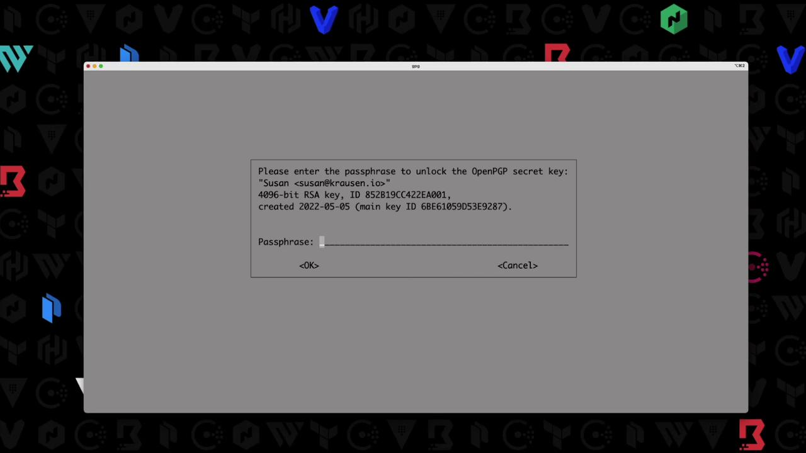

# Demo Practice secure Vault initialization

Source: https://notes.kodekloud.com/docs/HashiCorp-Certified-Vault-Operations-Professional-2022/Create-a-working-Vault-server-configuration-given-a-scenario/Demo-Practice-secure-Vault-initialization/page

This guide demonstrates how to initialize HashiCorp Vault with encrypted recovery keys and a root token using public OpenPGP keys.

This guide demonstrates how to initialize HashiCorp Vault with encrypted recovery keys and a root token using public [OpenPGP](https://www.openpgp.org/) keys. In this example, we’ll use three public keys—`btk.pub`, `frank.pub`, and `susan.pub`—located in your current directory.

## Prerequisites

* Vault server (v1.10.0+ent) installed and running
* Three PGP public keys: `btk.pub`, `frank.pub`, `susan.pub`
* GPG ([GnuPG](https://gnupg.org/)) installed for decryption

## 1. Verify Your PGP Keys

List the `.pub` files to ensure your public keys are accessible:

```bash theme={null}
$ ls *.pub
btk.pub
frank.pub
susan.pub
```

<Callout icon="triangle-alert">
  Make sure these files are the intended public keys. Do **not** expose your private keys.
</Callout>

## 2. Confirm Vault Is Uninitialized

Check Vault’s status before initialization:

```bash theme={null}
$ vault status
Key                     Value
---                     -----
Recovery Seal Type      awskms
Initialized             false
Sealed                  true
Total Recovery Shares   0
Threshold               0
Unseal Progress         0/0
Unseal Nonce            n/a
Version                 1.10.0+ent
Storage Type            raft
HA Enabled              true
```

Vault should be **initialized: false** and **sealed: true**.

## 3. Initialize Vault with Encrypted Shares

Run the `vault operator init` command to:

* Create **3** recovery shares
* Require **2** shares to meet the threshold
* Encrypt each share with our PGP keys

```bash theme={null}
$ vault operator init \
    --recovery-shares=3 \
    --recovery-threshold=2 \
    --recovery-pgp-keys="btk.pub,frank.pub,susan.pub" \
    > vaultinit.txt
```

<Callout icon="triangle-alert">
  The file `vaultinit.txt` contains sensitive data. Store it in a secure location—never commit it to version control.
</Callout>

### Initialization Parameters

| Parameter          | Value                         |
| ------------------ | ----------------------------- |
| recovery-shares    | 3                             |
| recovery-threshold | 2                             |
| recovery-pgp-keys  | btk.pub, frank.pub, susan.pub |

## 4. Review the Initialization Output

Since the command redirected output to `vaultinit.txt`, your console is blank. Display the file to see each encrypted share and the root token:

```bash theme={null}
$ cat vaultinit.txt
Recovery Key 1: wcFMA4Z9h7N72NGARAAzMm1xOnYclitFpuA07AOUVKDPOx03mKT0RyPQgRzsgVhs+748139se3DUAkprZx/...
Recovery Key 2: ZlXab7mVy0sR8b4JHJL0T2G9gC0KpLmYrKvWUkiFZ1...
Recovery Key 3: qW8/E7u5OzLmZk3R2H4jXn1a9vK5mCuXbJ9pR0gLZ2...
Initial Root Token: hvs.8CSU02a1xcS21iehKawiqWN
Success! Vault is initialized
```

Each recovery key is a Base64-encoded string—encrypted with the matching PGP public key. The root token remains in plaintext by default.

## 5. Decrypt a Recovery Share

To decrypt the share encrypted for Susan:

<Callout icon="lightbulb">
  Ensure you have Susan’s **private** key and know the GPG passphrase to unlock it.
</Callout>

```bash theme={null}
$ echo "qW8/E7u5OzLmZk3R2H4jXn1a9vK5mCuXbJ9pR0gLZ2..." \
  | base64 --decode \
  | gpg --decrypt
```

GPG will prompt for the passphrase:

<Frame>
  
</Frame>

Once unlocked, you’ll see the plaintext recovery key:

```plaintext theme={null}
5f3e1c4a6d9b8e7c2d1f0a9b4c3e2f1a
```

## 6. Next Steps

With at least two decrypted shares (meeting the threshold), you can:

* Unseal Vault or a DR cluster
* Generate a new root token
* Perform emergency recovery

By encrypting each recovery share with a different PGP key, you ensure that only authorized users can decrypt their respective shares, strengthening Vault’s security model.

## References

* [HashiCorp Vault Documentation](https://www.vaultproject.io/docs)
* [OpenPGP Standard](https://www.openpgp.org/)
* [GnuPG Homepage](https://gnupg.org/)

<CardGroup>
  <Card title="Watch Video" icon="video" href="https://learn.kodekloud.com/user/courses/hashicorp-certified-vault-operations-professional-2022/module/b59936f2-3ed0-4ec2-b1fd-971dcce5c2ca/lesson/23d6aaad-e61d-49c0-b9d9-aff621d308a9" />

  <Card title="Practice Lab" icon="installation" href="https://learn.kodekloud.com/user/courses/hashicorp-certified-vault-operations-professional-2022/module/b59936f2-3ed0-4ec2-b1fd-971dcce5c2ca/lesson/a04564ac-fa25-401b-99ee-4b6503202d4b" />
</CardGroup>
