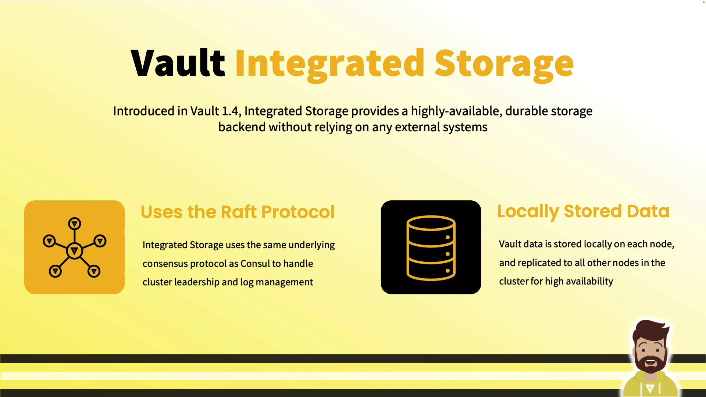
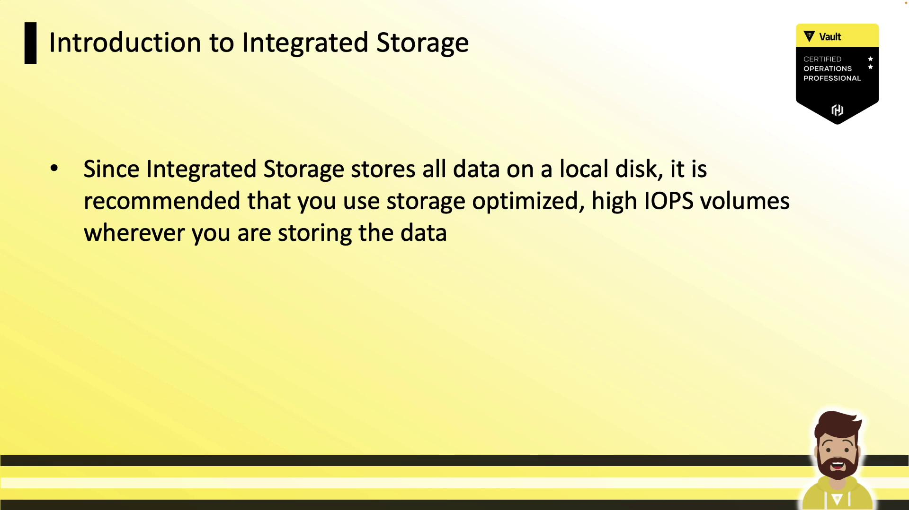
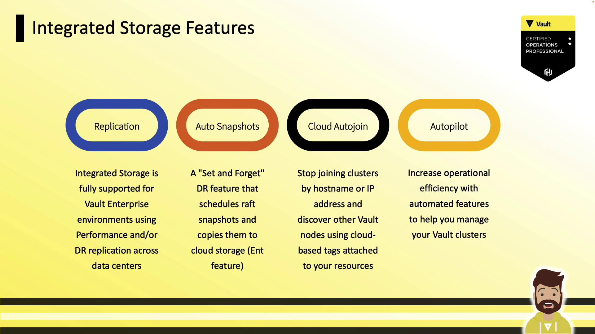
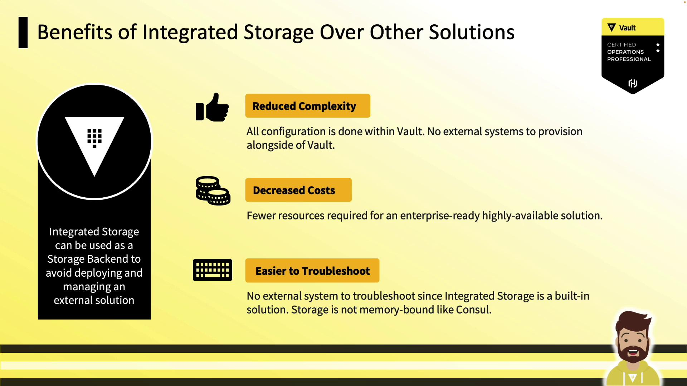
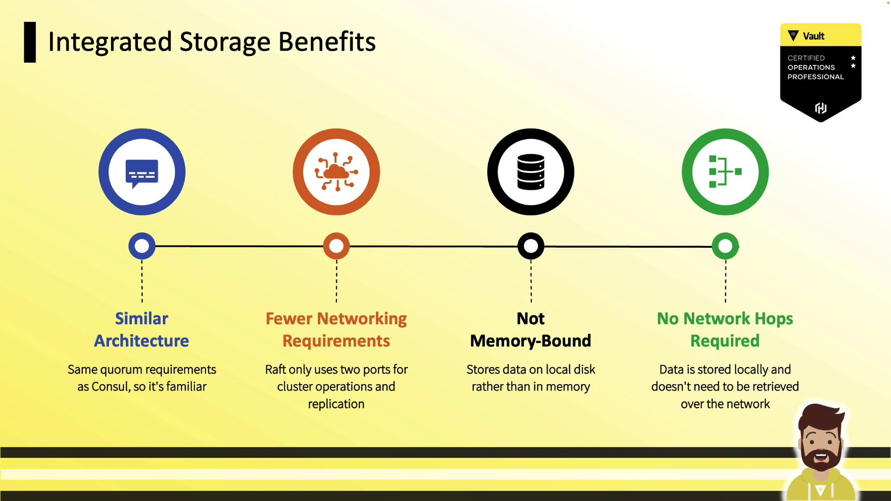
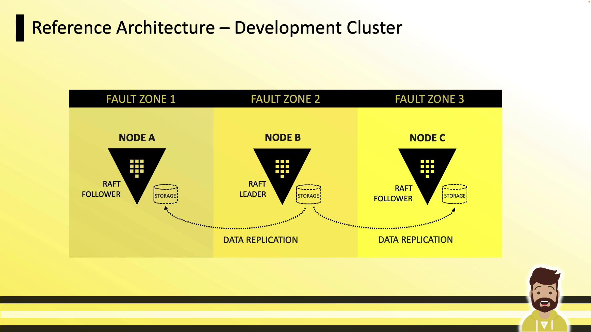
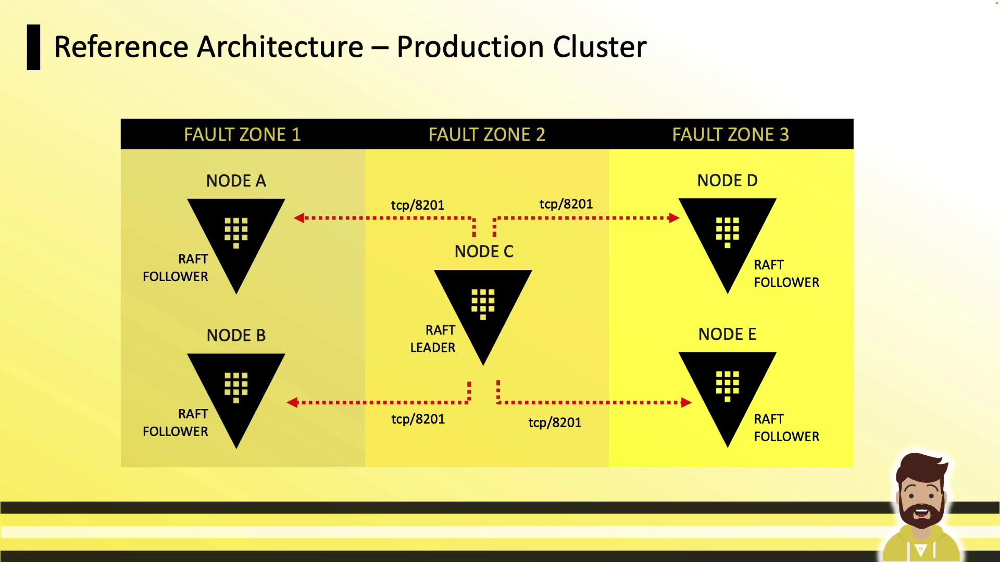
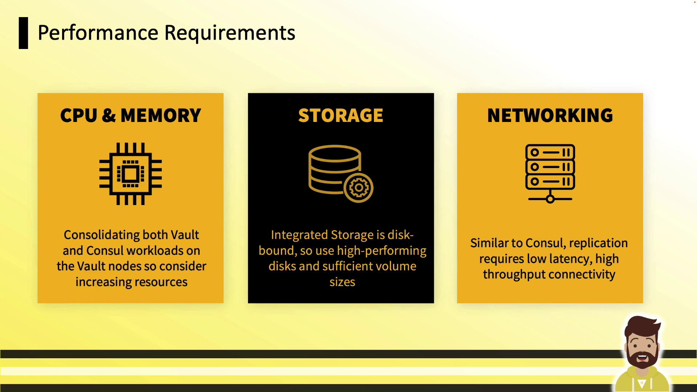

# => Success! Enabled approle auth method at: approle/
```

Disable an auth method:

```bash theme={null}
vault auth disable approle
# => Success! Disabled the auth method (if it existed) at: approle/
```

List enabled auth methods:

```bash theme={null}
vault auth list
# => Path           Type      Accessor
#    ----           ----      --------
#    hcvop/         approle   auth_approle_d8c20abe
#    token/         token     auth_token_89ce3371
#    vault-course/  approle   auth_approle_b3f0c92d
```

#### Custom Path Example

```bash theme={null}
vault auth enable -path=training approle
vault auth list
# => Path      Type      Accessor
#    training/ approle   auth_approle_f1a2b3c4
```

#### Tuning Auth Methods

Adjust the max lease TTL for `training/`:

```bash theme={null}
vault auth tune -max-lease-ttl=1h training/
# => Success! Tuned auth method: training/
```

***

### Using an Auth Method

When interacting with credentials or roles, prefix the path with `auth/`. For example, create an AppRole role:

```bash theme={null}
vault write auth/approle/role/hcvop \
    secret_id_ttl=10m \
    token_num_uses=10 \
    token_ttl=20m \
    token_max_ttl=30m \
    secret_id_num_uses=40
# => Success! Data written to: auth/approle/role/hcvop
```

***

## API Example: Enable an Auth Method

```bash theme={null}
curl \
  --header "X-Vault-Token: $VAULT_TOKEN" \
  --request POST \
  --data '{"type":"approle"}' \
  https://vault.example.com/v1/sys/auth/approle
```

This API call enables the AppRole auth method at `approle/`.

***

## Next Steps

Continue to the AppRole, userpass, and token method deep-dives for detailed workflows and best practices.

***

## Links and References

* [Vault Auth Methods API](https://www.vaultproject.io/api-docs/system/auth)
* [Vault CLI Documentation](https://www.vaultproject.io/docs/commands/auth)
* [HashiCorp Vault Best Practices](https://www.vaultproject.io/docs/best-practices)

<CardGroup>
  <Card title="Watch Video" icon="video" href="https://learn.kodekloud.com/user/courses/hashicorp-certified-vault-operations-professional-2022/module/b59936f2-3ed0-4ec2-b1fd-971dcce5c2ca/lesson/f668107c-8068-453b-8bc3-685a3cda6c5b" />
</CardGroup>


# Implementing Integrated Storage

Source: https://notes.kodekloud.com/docs/HashiCorp-Certified-Vault-Operations-Professional-2022/Create-a-working-Vault-server-configuration-given-a-scenario/Implementing-Integrated-Storage/page

This guide covers Vault’s Integrated Storage, its configuration, operation, and benefits for high availability and durability without external storage systems.

In this guide, we cover Vault’s Integrated Storage: what it is, why it matters, and how to configure and operate it. Introduced in Vault 1.4, Integrated Storage embeds a Raft-based backend directly within Vault for high availability and durability—without any external storage system.

<Frame>
  
</Frame>

***

## Why Integrated Storage?

Prior to Vault 1.4, enterprise deployments required Consul or another external backend—adding complexity, network hops, and extra operational overhead. Integrated Storage solves this by:

* Storing all Vault data on each node’s local disk
* Replicating data across nodes via Raft
* Eliminating any external dependency for storage

In a three- or five-node cluster, every node maintains the same dataset. If nodes fail, remaining members serve requests as long as a quorum exists.

***

## Key Benefits

<Frame>
  
</Frame>

* **No external backend**: Run Vault without Consul or other storage.
* **Reduced latency**: Reads and writes occur on local disk.
* **Simplified operations**: Troubleshoot only Vault, not two systems.

<Callout icon="lightbulb">
  For best performance, use storage-optimized volumes with high IOPS.
</Callout>

<Frame>
  
</Frame>

***

## Feature Evolution

Since version 1.4, Vault’s Integrated Storage has gained:

| Feature                       | Availability     |
| ----------------------------- | ---------------- |
| Raft Replication              | OSS & Enterprise |
| Auto Snapshots                | Enterprise       |
| Cloud Auto-Join               | Enterprise       |
| Autopilot (cleanup, upgrades) | Enterprise       |

<Frame>
  
</Frame>

***

## Comparative Advantages

<Frame>
  
</Frame>

* **Lower complexity**: Single system for secrets and storage
* **Cost savings**: No additional Consul cluster or VMs
* **Easier troubleshooting**: Inspect only Vault logs and metrics
* **Disk-backed**: No in-memory bottlenecks

<Frame>
  
</Frame>

* **Familiar Raft** if you know Consul
* **Only two ports**: 8200 (API), 8201 (Raft RPC)
* **Durable writes** to disk

***

## Reference Architectures

| Architecture           | Nodes      | Fault Zones      | Quorum | Ports       |
| ---------------------- | ---------- | ---------------- | ------ | ----------- |
| Development Cluster    | 3          | 3 (AZs or racks) | 2/3    | 8200 & 8201 |
| Production Cluster     | 5          | 3 (AZs or racks) | 3/5    | 8200 & 8201 |
| Enterprise Replication | Primary/DR | Multi-region     | N/A    | 8200 & 8201 |

### Development Cluster (3 Nodes)

<Frame>
  
</Frame>

* Three nodes in separate fault zones
* Local disk on each node
* Leader handles replication to followers

### Production Cluster (5 Nodes)

<Frame>
  
</Frame>

* Five nodes across three zones
* Tolerates up to two node failures (quorum of three)
* TCP 8201 for Raft RPC; 8200 remains API

### Enterprise Replication

<Frame>
  
</Frame>

Use Integrated Storage in primary, performance, and DR clusters—replicate data across regions or data centers for disaster recovery.

***

## Performance Requirements

| Resource     | Recommendation                                        |
| ------------ | ----------------------------------------------------- |
| CPU & Memory | Consolidate Vault + Raft; monitor & scale             |
| Storage      | High-IOPS, ample capacity (*disk full → Vault stops*) |
| Networking   | Low latency, high throughput between nodes            |

<Frame>
  
</Frame>

<Callout icon="triangle-alert">
  If storage fills up, Vault will halt. Monitor disk usage closely.
</Callout>

***

## Configuration Overview

Add an Integrated Storage stanza to your Vault HCL configuration (see [Vault Raft Storage Docs](https://www.vaultproject.io/docs/configuration/storage/raft)):

```hcl theme={null}
listener "tcp" {
  address         = "0.0.0.0:8200"
  cluster_address = "0.0.0.0:8201"
  tls_disable     = true
}

storage "raft" {
  path                   = "/opt/vault/data"
  node_id                = "vault-node-a.hcvop.com"

  retry_join {
    auto_join = "provider=aws region=us-east-1 tag_key=vault tag_value=us-east-1"
  }

  performance_multiplier = 1
}

api_addr     = "https://vault.hcvop.com:8200"
cluster_addr = "https://vault-node-a.hcvop.com:8201"
```

### Common `storage "raft"` Parameters

* `path`: Local directory for Raft data (use high-performance disk)
* `node_id`: Unique identifier for this node
* `retry_join`: Discovery and join strategy (static or cloud auto-join)
* `performance_multiplier`: Adjust election & heartbeat intervals

***

## Retry Join Options

Vault supports two methods to join a Raft cluster:

1. **Static Join**: Specify `leader_api_addr` for existing nodes.
2. **Cloud Auto-Join**: Use `auto_join` with cloud tags (AWS, Azure, GCP).

If using TLS between nodes, configure certificate files:

```hcl theme={null}
retry_join {
  leader_api_addr         = "https://vault-node-b.hcvop.com:8200"
  leader_ca_cert_file     = "/opt/vault.d/ca.pem"
  leader_client_cert_file = "/opt/vault.d/cert.pem"
  leader_client_key_file  = "/opt/vault.d/pri.key"
}
```

<Frame>
  
</Frame>

You can include multiple `retry_join` blocks to cover diverse discovery methods:

```hcl theme={null}
storage "raft" {
  path    = "/opt/vault/data"
  node_id = "vault-node-a.hcvop.com"

  retry_join {
    leader_api_addr         = "https://vault-node-b.hcvop.com:8200"
    leader_ca_cert_file     = "/opt/vault.d/ca.pem"
    leader_client_cert_file = "/opt/vault.d/cert.pem"
    leader_client_key_file  = "/opt/vault.d/pri.key"
  }

  retry_join {
    leader_api_addr         = "https://vault-node-c.hcvop.com:8200"
    leader_ca_cert_file     = "/opt/vault.d/ca.pem"
    leader_client_cert_file = "/opt/vault.d/cert.pem"
    leader_client_key_file  = "/opt/vault.d/pri.key"
  }

  performance_multiplier = 1
}
```

***

## Cluster Initialization & Day-2 Operations

### 1. Initialize and Unseal the First Node

```bash theme={null}
vault operator init        # Generates unseal keys & root token
vault operator unseal      # Use Shamir keys or auto-unseal
```

### 2. Join Additional Nodes

On each follower:

```bash theme={null}
vault operator raft join https://vault-node-a.hcvop.com:8200
```

### 3. Remove a Node Gracefully

```bash theme={null}
vault operator raft leave vault-4
