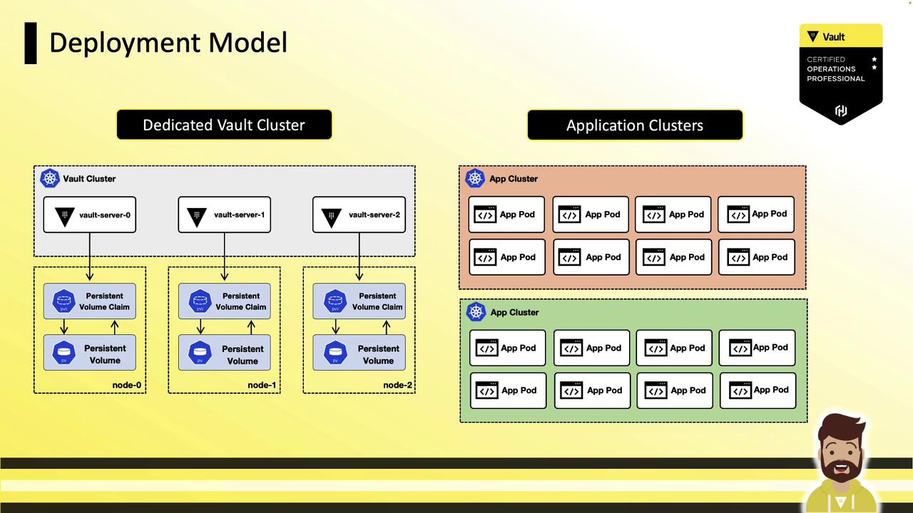

# Enable at default path (userpass/)
vault auth enable userpass

# Or enable at custom path (e.g., vault-local/)
vault auth enable -path=vault-local userpass
```

## Creating a User

Run `vault write` against the `auth/userpass/users/<username>` path:

```bash theme={null}
vault write auth/userpass/users/hcvop-engineer \
    password=cm084kjfj340 \
    policies=engineering-policy \
    token_ttl=15m \
    token_max_ttl=8h
```

| Parameter       | Description                                       | Example              |
| --------------- | ------------------------------------------------- | -------------------- |
| password        | Initial user password                             | `cm084kjfj340`       |
| policies        | Comma-separated Vault policies                    | `engineering-policy` |
| token\_ttl      | Time-to-live for issued tokens                    | `15m`                |
| token\_max\_ttl | Maximum time-to-live before renewal is disallowed | `8h`                 |

<Callout icon="lightbulb">
  You can assign multiple policies (e.g., `default`,`engineering-policy`) or fine-tune token parameters per user.
</Callout>

## Additional Token Configuration Options

| Option              | Description                        | Example                            |
| ------------------- | ---------------------------------- | ---------------------------------- |
| token\_type         | Token type (`default` or `batch`)  | `token_type=batch`                 |
| token\_num\_uses    | Maximum number of uses for a token | `token_num_uses=5`                 |
| token\_bound\_cidrs | CIDR list restricting token usage  | `token_bound_cidrs="10.1.16.0/16"` |
| token\_period       | Duration for periodic tokens       | `token_period=1h`                  |

Include these flags in the same `vault write` command when creating or updating a user.

## Reading User Settings

Retrieve user configuration:

```bash theme={null}
vault read auth/userpass/users/hcvop-engineer
```

Sample output:

```text theme={null}
Key                       Value
---                       -----
policies                  [engineering-policy]
token_bound_cidrs         []
token_explicit_max_ttl    0s
token_max_ttl             8h
token_ttl                 15m
token_type                default
```

## Modifying User Configuration

To update a single attribute, re-run `vault write` with the changed flag:

```bash theme={null}
vault write auth/userpass/users/hcvop-engineer token_type=batch
```

Only the specified setting (`token_type`) is updated; other attributes remain intact.

## Authenticating with Userpass

```bash theme={null}
vault login -method=userpass username=hcvop-engineer
# Prompts for password (hidden)
```

Successful authentication returns:

* **Token**
* **Duration** (TTL)
* **Renewable** flag
* **Attached policies**

Your CLI automatically caches the token for subsequent commands.

## Password Rotation

Grant users the ability to update their own password by adding this to their policy:

```hcl theme={null}
path "auth/userpass/users/{{identity.entity.aliases.userpass.username}}/password" {
  capabilities = ["update"]
}
```

Then users can run:

```bash theme={null}
vault write auth/userpass/users/hcvop-engineer/password password=xmeij9dk20je
```

This enables self-service rotation without exposing credentials to admins.

## Best Practices and Considerations

* Regularly **revoke** or **delete** user entries when access is no longer required.
* Implement an **external password policy** (complexity, expiry) via automation or scripts.
* For enterprise use, prefer **OIDC**, **LDAP**, or **Kerberos** auth methods to centralize identity management.

## Links and References

* [HashiCorp Vault Userpass Auth][vault-userpass]
* [Vault Authentication Methods][vault-auth-methods]
* [Vault CLI Commands][vault-cli]

[vault-userpass]: https://www.vaultproject.io/docs/auth/userpass

[vault-auth-methods]: https://www.vaultproject.io/docs/auth

[vault-cli]: https://www.vaultproject.io/docs/commands

[vault-oidc]: https://www.vaultproject.io/docs/auth/jwt#oidc-and-jwt-configuration

<CardGroup>
  <Card title="Watch Video" icon="video" href="https://learn.kodekloud.com/user/courses/hashicorp-certified-vault-operations-professional-2022/module/b59936f2-3ed0-4ec2-b1fd-971dcce5c2ca/lesson/ad9d02f0-1e6e-4e0e-ba94-f2331dc9cb43" />
</CardGroup>


# Vault Security Hardening

Source: https://notes.kodekloud.com/docs/HashiCorp-Certified-Vault-Operations-Professional-2022/Create-a-working-Vault-server-configuration-given-a-scenario/Vault-Security-Hardening/page

This guide explores best practices for securely hardening a Vault deployment following HashiCorp’s security model and defense-in-depth principles.

In this guide, we explore best practices for production hardening a Vault deployment. Following HashiCorp’s Vault Security Model and defense-in-depth principles, you’ll learn how to securely configure your platform, operating system, and Vault instances. This is a conceptual overview—ideal for certification preparation—focusing on secure configurations rather than OS-level demonstrations.

<Frame>
  
</Frame>

We’ll cover three main areas:

1. General recommendations (platform & deployment)
2. Operating system recommendations (Linux/Windows)
3. Vault-specific recommendations

***

## 1. General Recommendations

### 1.1 Deployment Model

Deploy Vault with minimal resource sharing—single tenancy is ideal. Moving from physical hardware to VMs to containers increases the attack surface. If you’re using Kubernetes, VMware, or cloud, dedicate separate clusters or nodes for Vault.

<Frame>
  
</Frame>

For example, isolate your Vault servers in a dedicated Kubernetes namespace or cluster, apart from application pods:

<Frame>
  
</Frame>

### 1.2 Restrict Node Access

Direct SSH/RDP or `kubectl exec`/`docker exec` on Vault nodes should be prohibited. Use the Vault API/CLI from a hardened jump box. For secure interactive sessions, consider [HashiCorp Boundary](https://www.hashicorp.com/products/boundary).

```bash theme={null}
