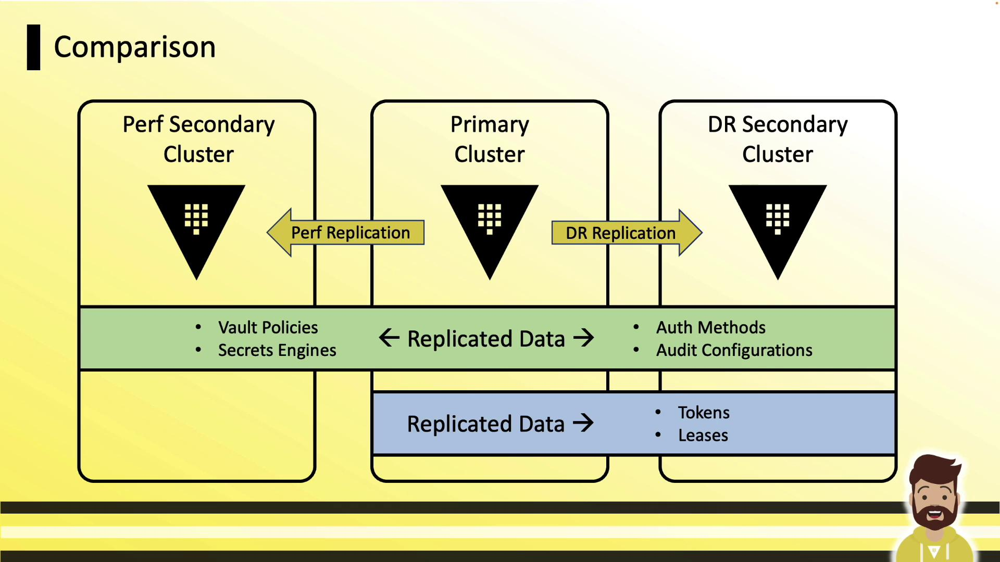
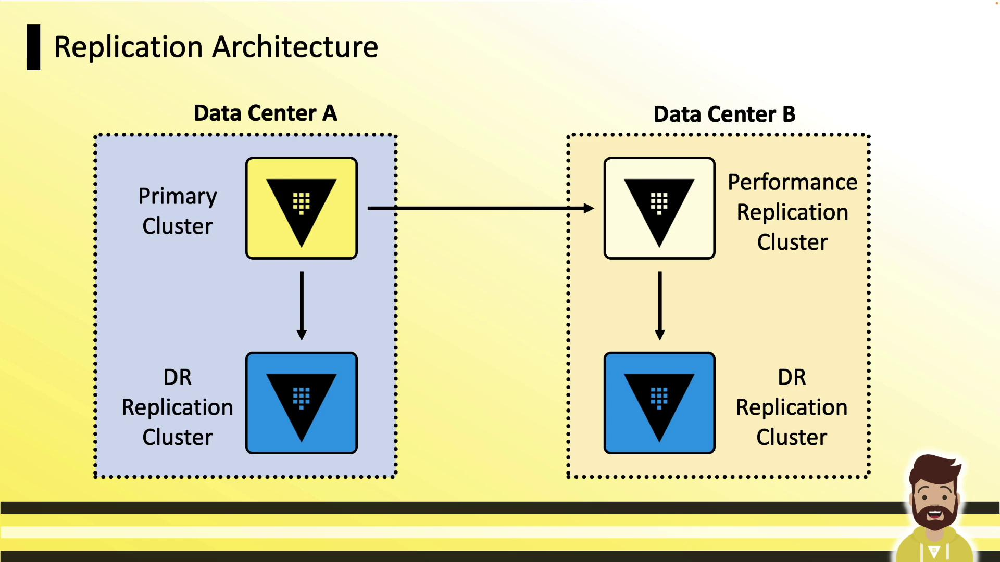
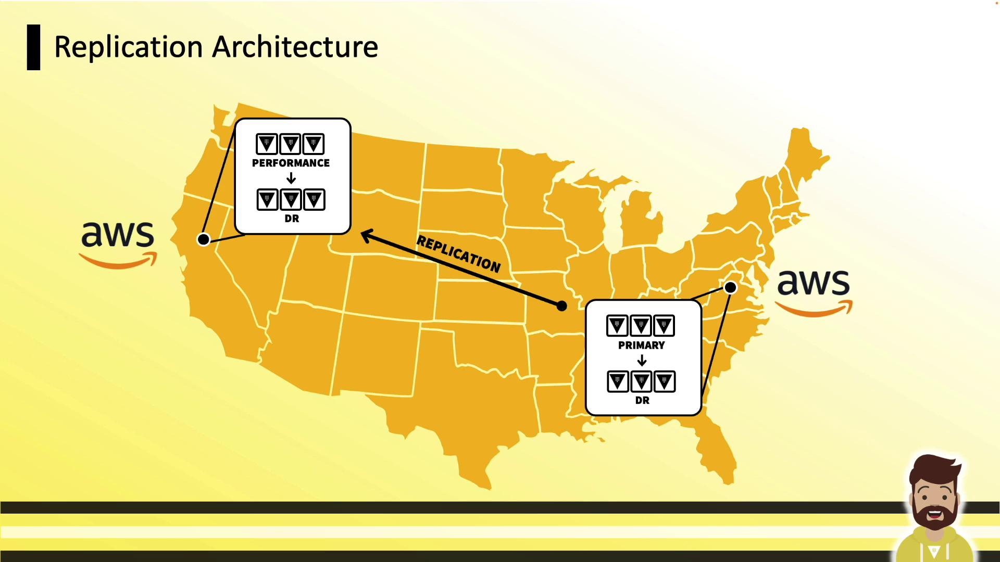
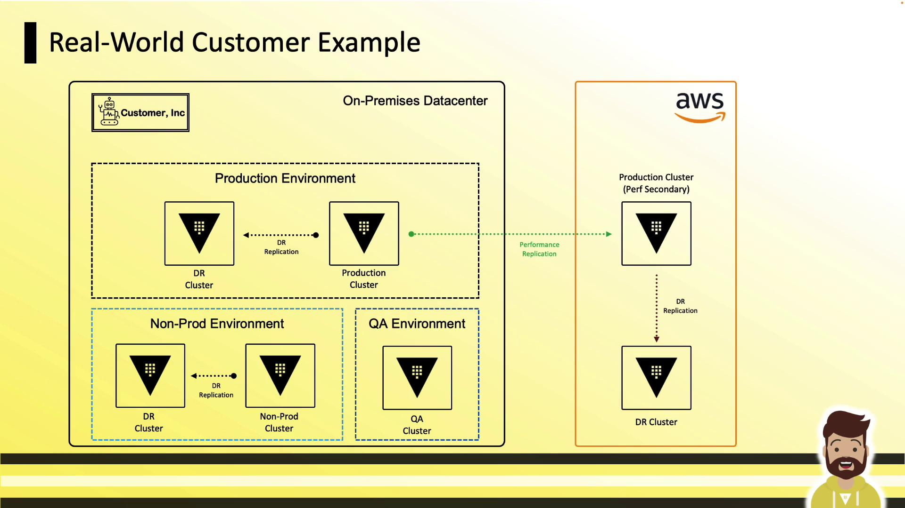
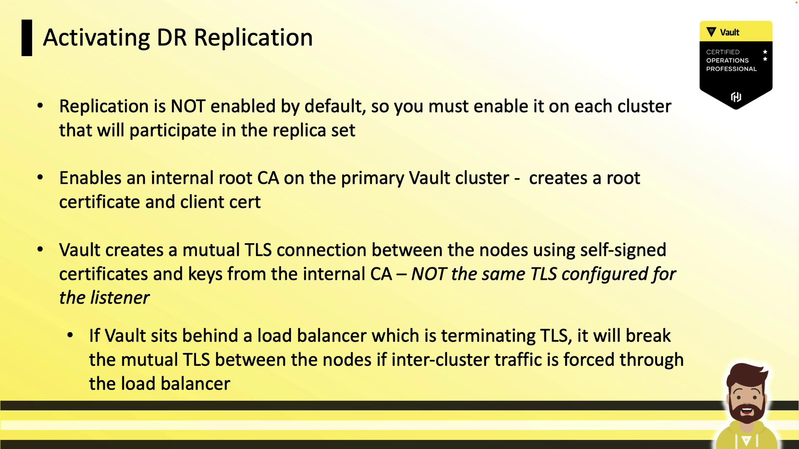
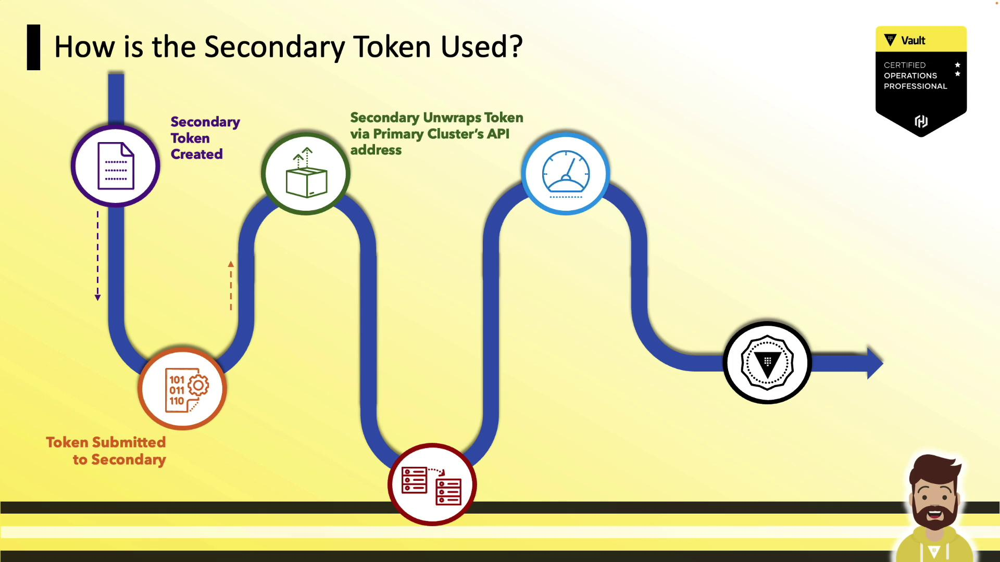
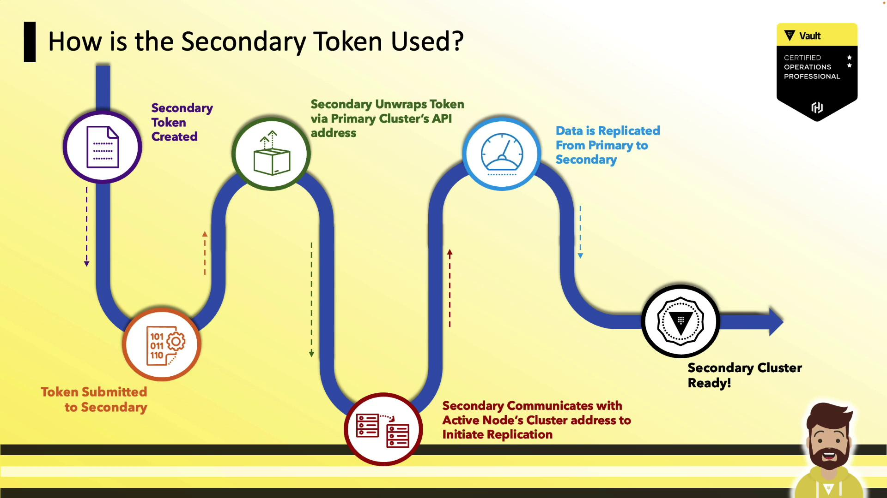
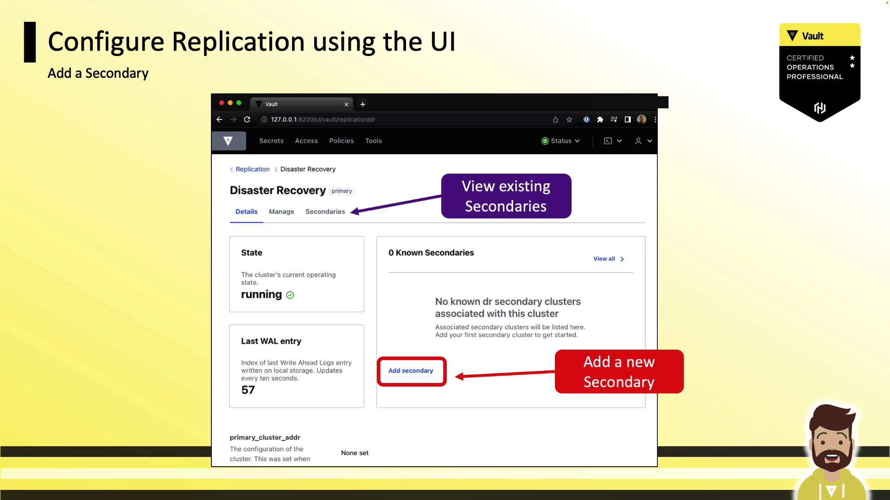

# Verify your token
vault token lookup

# Demote primary to secondary
vault write -f sys/replication/dr/primary/demote
```

<Callout icon="triangle-alert">
  Demoting the primary will briefly interrupt Vault service on that cluster. Ensure maintenance windows and inform your team.
</Callout>

Expected warning:

```text theme={null}
WARNING! The following warnings were returned from Vault:
* This cluster is being demoted to a replication secondary. Vault will be unavailable for a brief period and will resume service shortly.
```

***

## 3. Generate a DR Operation Token on the Secondary

Switch context to your **DR secondary** cluster to create a one-time operation token required for promotion.

1. **Initiate token generation**
   ```bash theme={null}
   vault operator generate-root -dr-token
   ```
   You’ll receive an **operation nonce**.

2. **Unseal with quorum of unseal keys**\
   Provide any 3 of 5 unseal keys from the former primary:
   ```bash theme={null}
   vault operator generate-root -dr-token
   # Enter unseal key #1
   # Enter unseal key #2
   # Enter unseal key #3
   ```
   Vault returns an **encoded token**, e.g.:
   ```text theme={null}
   Encoded Token: LDJQkQUE6DhyVWITrMHJ2dCgFPjVQGAMLQPEfCw
   ```

3. **Decode the DR operation token**
   ```bash theme={null}
   vault operator generate-root -dr-token \
     -otp="2ac123e0-d768-ce9e-ed7f-58eba3091a8f" \
     -decode="LDJQkQUE6DhyVWITrMHJ2dCgFPjVQGAMLQPEfCw"
   ```
   Output:
   ```text theme={null}
   DR Operation Token: hvs.vjJaqI8ACON0@FlUQeKHDIJO
   ```

<Callout icon="lightbulb">
  The DR operation token is time-limited and can only be used once to promote the secondary.
</Callout>

***

## 4. Promote the Secondary to Primary

Using the decoded token, promote the DR secondary:

```bash theme={null}
vault write sys/replication/dr/secondary/promote \
  dr_operation_token="hvs.vjJaqI8ACON0@FlUQeKHDIJO"
```

You’ll see:

```text theme={null}
WARNING! The following warnings were returned from Vault:
* This cluster is being promoted to a replication primary. Vault will be unavailable for a brief period and will resume service shortly.
```

***

## 5. Verify the New Primary

1. **Authenticate** (if needed):
   ```bash theme={null}
   vault login hvs.Y9MwsvPOH3zIZpBUymLF6Dk
   ```

2. **List Raft peers**:
   ```bash theme={null}
   vault operator raft list-peers
   ```
   Expected:
   ```text theme={null}
   Node     Address             State   Voter
   ----     -------             -----   -----
   vault-3 10.1.101.108:8201    leader  true
   ```

3. **Test secrets engines**:
   ```bash theme={null}
   vault secrets enable aws
   ```
   ```text theme={null}
   Success! Enabled the aws secrets engine at: aws/
   ```

At this point, your DR secondary cluster is fully promoted and ready to operate as the new primary. All write and read operations should now succeed on this cluster.

***

## Links and References

* [HashiCorp Vault DR Replication](https://www.vaultproject.io/docs/concepts/dr-replication)
* [Vault Operator Commands](https://www.vaultproject.io/docs/commands/operator)
* [Vault API: sys/replication/dr](https://www.vaultproject.io/api-docs/replication/dr)
* [HashiCorp Vault GitHub](https://github.com/hashicorp/vault)

<CardGroup>
  <Card title="Watch Video" icon="video" href="https://learn.kodekloud.com/user/courses/hashicorp-certified-vault-operations-professional-2022/module/c1dd23ce-c7fd-4564-84d8-4ff14b115bd7/lesson/d6341e84-1d58-497c-92d1-fa086ac83364" />
</CardGroup>


# Enable and Configure Disaster Recovery DR Replication

Source: https://notes.kodekloud.com/docs/HashiCorp-Certified-Vault-Operations-Professional-2022/Build-Fault-Tolerant-Vault-Environments/Enable-and-Configure-Disaster-Recovery-DR-Replication/page

This guide explains how to enable and configure Disaster Recovery replication in Vault Enterprise, covering setup, performance comparison, and reference architectures.

Vault Enterprise’s Disaster Recovery (DR) replication creates a warm-standby cluster that can be promoted instantly if your primary fails. In this guide, you’ll learn how Vault replication works, compare performance and DR modes, review reference architectures, and walk through both CLI and UI setup.

***

## What Is Vault Replication?

Vault replication offers a global, consistent view of your policies, secret engines, auth methods, KV data, and audit configurations—eliminating manual duplication and ensuring high availability across data centers or cloud regions. It uses a leader-follower model with one primary (leader) cluster and one or more secondary (follower) clusters. All inter-cluster communication is end-to-end encrypted with mutual TLS.

<Frame>
  
</Frame>

***

## Performance vs. Disaster Recovery Replication

Vault Enterprise supports two replication modes. Select the one that matches your use case:

| Feature          | Performance Replication                                      | Disaster Recovery (DR) Replication    |
| ---------------- | ------------------------------------------------------------ | ------------------------------------- |
| Data & Config    | Policies, Secrets engines, Auth methods, KV data, Audit logs | Same as Performance + Tokens & Leases |
| Read Traffic     | Served locally                                               | Not served (warm standby)             |
| Write Traffic    | Forwarded to primary                                         | Not served                            |
| Tokens & Leases  | Not replicated                                               | Replicated                            |
| Typical Use Case | Global read scaling                                          | Fast failover and seamless client ops |

<Frame>
  
</Frame>

***

## Replication Comparison

Here’s how a performance secondary, primary, and DR secondary differ. Only DR replication includes tokens and leases in the secondary:

<Frame>
  
</Frame>

***

## DR Secondary Characteristics

A DR secondary acts as a **warm standby**. It accepts replication logs but:

* Does **not** serve any client operations (reads or writes).
* Keeps most API paths disabled—even for admin or root tokens—until you promote it.

<Frame>
  
</Frame>

***

## Reference Architectures

Choose the topology that fits your environment:

### Two Data Centers

* Data Center A: Primary + local DR secondary
* Data Center B: Performance secondary + local DR secondary
* Clients talk to their local cluster; on failure, promote the DR node.

<Frame>
  
</Frame>

### AWS Regions

* Northern Virginia: Primary + DR
* Northern California: Performance + DR
* Ideal for multi-region AWS deployments.

<Frame>
  
</Frame>

### On-Prem VMware Example

* Data Center A: Production primary + DR
* Data Center B: Performance + DR
* Separate non-prod environment mirroring production for QA/testing.

<Frame>
  
</Frame>

### On-Prem to AWS Example

* On-prem DC: Production primary + DR
* AWS: Performance + DR
* Dedicated non-prod and QA clusters.

<Frame>
  
</Frame>

***

## Networking Requirements

* Bidirectional Vault-to-Vault on ports **8200** (cluster bootstrap/API) and **8201** (replication/Raft forwarding).
* DNS resolution between clusters must be configured.

<Callout icon="triangle-alert">
  Open these ports only between trusted Vault clusters. Exposing replication ports publicly can lead to security risks.
</Callout>

***

## Enabling DR Replication

Follow these three steps to set up DR replication via the CLI:

<Frame>
  
</Frame>

### 1. Activate DR on the Primary

Vault generates an internal CA and mutual-TLS certificates for secure inter-cluster links. If you’re behind a TLS-terminating load balancer, pass through port 8201.

<Frame>
  
</Frame>

```bash theme={null}
vault write -f sys/replication/dr/primary/enable
```

### 2. Generate the Secondary Token

Create a one-time, response-wrapped token to authorize the DR secondary. It includes the CA cert, client cert/key, and primary’s API address.

<Frame>
  
</Frame>

```bash theme={null}
vault write sys/replication/dr/primary/secondary-token id="us-east-2-dr"
```

Inspect the unwrapped token to see embedded details:

```json theme={null}
{
  "data": {
    "ca_cert": "...",
    "client_cert": "...",
    "client_key": { "type": "p521", "x": "...", "y": "...", "d": "..." },
    "cluster_id": "0d127970-99ce-152f-0311-3b081d126d43",
    "id": "secondary",
    "primary_cluster_addr": "https://vault-pr.hvcop.com:8201"
  }
}
```

<Callout icon="triangle-alert">
  Treat the secondary token like a password. It’s single-use and grants high privileges.
</Callout>

#### How the Token Is Used

1. The secondary submits the wrapped token to the primary API (`:8200`).
2. It unwraps the token and retrieves certs and cluster info.
3. Replication over port 8201 then begins automatically.

<Frame>
  
</Frame>

<Frame>
  
</Frame>

### 3. Activate DR on the Secondary

```bash theme={null}
vault write sys/replication/dr/secondary/enable token="<response-wrapped-token>"
```

Once the secondary connects, replication starts immediately.

***

## Configuring DR via the UI

You can also enable DR replication through Vault’s web interface:

1. **Primary**
   * Navigate to **Status → Replication → Enable Replication**
   * Choose **Disaster Recovery – Primary**, then click **Enable**
   * Click **Add Secondary**, assign a name, and **Generate Token**. Copy the token.

<Frame>
  
</Frame>

2. **Secondary**
   * Go to **Status → Replication → Enable Replication**
   * Select **Disaster Recovery – Secondary**
   * Paste the activation token and click **Enable**

<Frame>
  
</Frame>

***

## Monitoring Replication

Use the Vault CLI to verify replication health and status:

```bash theme={null}
vault read -format=json sys/replication/status
vault read -format=json sys/replication/performance/status
vault read -format=json sys/replication/dr/status
```

* `sys/replication/status`: Shows both performance and DR replication
* `sys/replication/performance/status`: Performance only
* `sys/replication/dr/status`: DR only

***

Now you’re ready to deploy DR replication in your Vault Enterprise environment or practice these steps for the [Vault Certified Operations Professional exam](https://www.hashicorp.com/certification/vault-operations-professional).

## References

* [Vault Enterprise Replication Documentation](https://www.vaultproject.io/docs/enterprise/replication)
* [Vault Certified Operations Professional Exam](https://www.hashicorp.com/certification/vault-operations-professional)

<CardGroup>
  <Card title="Watch Video" icon="video" href="https://learn.kodekloud.com/user/courses/hashicorp-certified-vault-operations-professional-2022/module/c1dd23ce-c7fd-4564-84d8-4ff14b115bd7/lesson/d335d5fe-97c9-4b0a-b438-3ba91a278192" />
</CardGroup>
