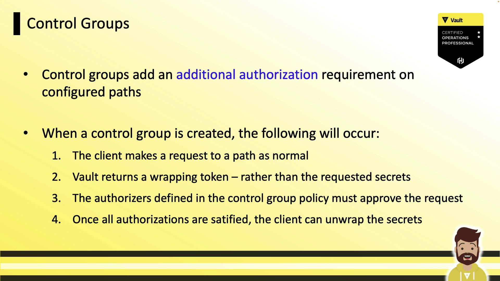
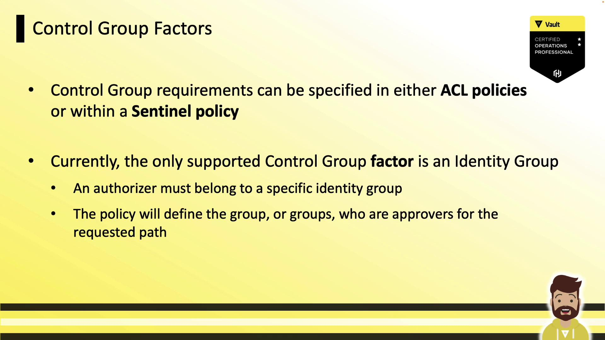
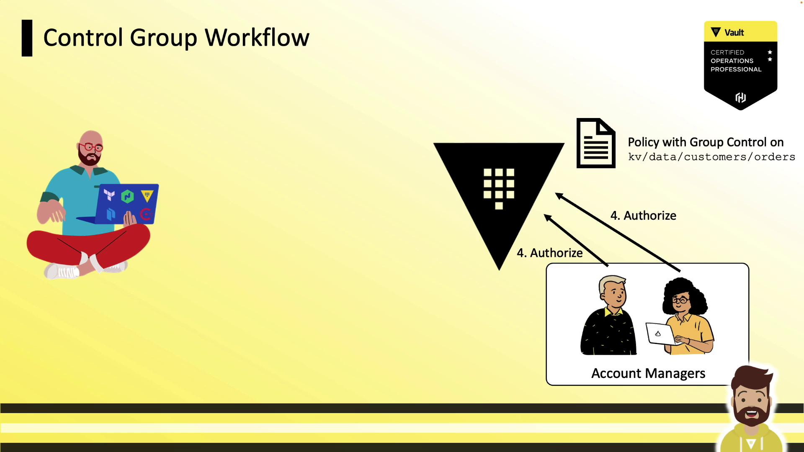
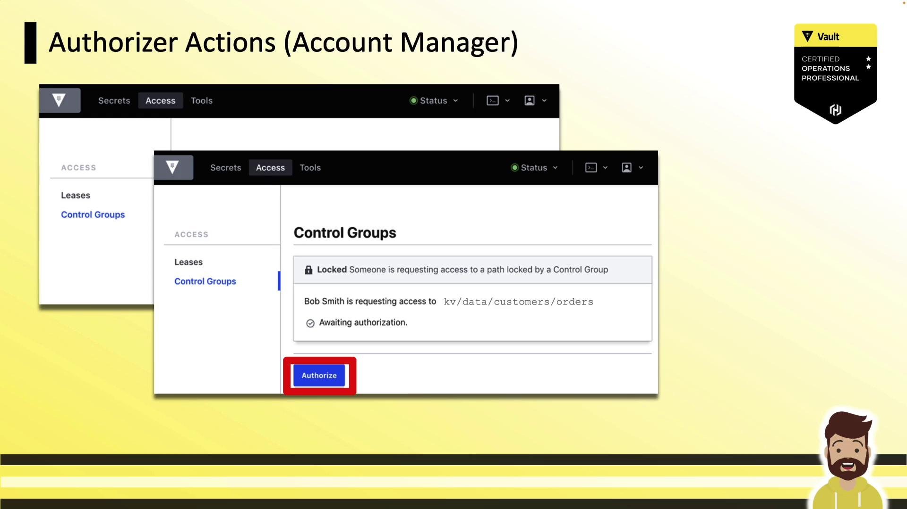
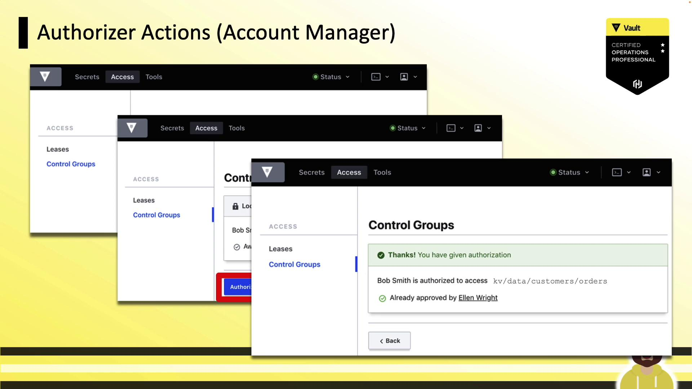
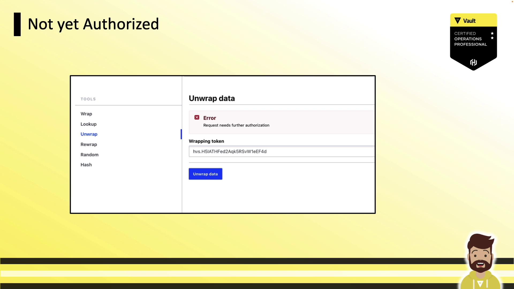

# Control Group

Source: https://notes.kodekloud.com/docs/HashiCorp-Certified-Vault-Operations-Professional-2022/Configure-Access-Control/Control-Group/page

Control groups require designated approvers to authorize requests for sensitive Vault paths, enhancing security through multi-party approval.

Control groups provide an extra layer of approval for sensitive Vault paths, requiring designated approvers to explicitly authorize each request. This feature is covered in the Vault Certified Operations Professional exam and can be useful when you need multi-party approval on top of ACL and Sentinel policies.

<Callout icon="lightbulb">
  Control groups are rarely used in production environments but are essential for high-security workflows and exam preparation.
</Callout>

***

## What Are Control Groups?

By default, Vault evaluates:

1. The token’s attached ACL policies
2. Any Sentinel policies applied to the token or path

With a control group configured on a path, Vault enforces a **third** requirement: an explicit approval step from one or more designated identity groups before returning secrets.

<Frame>
  
</Frame>

***

## Control Group Factors

You can define control group requirements in:

* **ACL policies**
* **Sentinel policies**

Currently, the only supported factor is an **Identity Group**, which specifies both the list of approvers and the number of required approvals.

| Factor Type    | Description                             | Example Use                                                         |
| -------------- | --------------------------------------- | ------------------------------------------------------------------- |
| Identity Group | Approver group names and approval count | Require 2 approvals from `account-managers`                         |
|                |                                         | Require 1 approval each from `account-managers` and `security-team` |

<Frame>
  
</Frame>

***

## Control Group Workflow

When a control group is applied, Vault follows this sequence:

<Frame>
  
</Frame>

1. **Client requests** a secret at the protected path.
2. Vault returns a **wrapping token** instead of the secret.
3. Client shares the wrapping token’s **accessor** with the approvers.
4. **Approvers** submit the accessor back to Vault to authorize the request.
5. Once all approvals are met, the client runs `vault unwrap` to retrieve the secret.

### 1. Client Receives a Wrapping Token

A standard read on a protected path yields wrapping info:

```json theme={null}
{
  "wrap_info": {
    "token":    "[VAULT_TOKEN]-",
    "accessor": "cql9n3r4kMeIQZekoLrMWMWN",
    "ttl":      300
    // ...
  }
}
```

The client then forwards the `accessor` to the designated approvers.

### 2. Approvers Authorize the Request

Approvers log in (CLI or UI) and run:

```bash theme={null}
vault write sys/control-group/authorize accessor="cql9n3r4kMeIQZekoLrMWMWN"
```

<Frame>
  
</Frame>

If the policy requires multiple sign-offs, Vault waits until all approvals are recorded:

<Frame>
  
</Frame>

### 3. Client Unwraps the Secret

After approvals:

```bash theme={null}
vault unwrap [VAULT_TOKEN]-
```

If approvals are missing, unwrap returns an error:

<Frame>
  
</Frame>

***

## Defining Control Groups in ACL Policies

The following ACL policy requires two approvals from the `account-managers` group on path `kv/data/customers/orders`:

```hcl theme={null}
path "kv/data/customers/orders" {
  capabilities = ["read"]

  control_group = {
    factor "acct_manager" {
      identity {
        group_names = ["account-managers"]
        approvals   = 2
      }
    }
  }
}
```

You can add multiple `factor` blocks or specify multiple `group_names` for more complex authorization schemes.

***

## Defining Control Groups in Sentinel Policies

Control groups can also be enforced in Sentinel as an External Governance Policy (EGP). This example requires at least two approvals from `account-managers`:

```sentinel theme={null}
import "controlgroup"

control_group = func() {
  numAuthzs = 0
  for controlgroup.authorizations as authz {
    if "account-managers" in authz.groups.by_name {
      numAuthzs = numAuthzs + 1
    }
  }
  return numAuthzs >= 2
}

main = rule {
  control_group()
}
```

Deploy this Sentinel policy to enforce the same approval workflow on your protected path.

***

## Demo: Control Groups in Action

1. **Authenticate** with a token that has a control-group policy:

   ```bash theme={null}
   vault login [VAULT_TOKEN]-
   ```

2. **Request the secret**:

   ```bash theme={null}
   vault kv get kv/customers/orders
   ```

3. **Share the `wrapping_accessor`** with approvers and await authorization.

4. **Unwrap** the token once all approvals are in place:

   ```bash theme={null}
   vault unwrap [VAULT_TOKEN]
   ```

***

## Conclusion

Control groups add a mandatory multi-party approval step on top of standard ACL and Sentinel policies. While the only supported factor today is an identity group, mastering control groups is crucial for sensitive workflows and the Vault Certified Operations Professional exam.

***

## References

* [Vault ACL Policies](https://www.vaultproject.io/docs/concepts/policies)
* [Sentinel Control Groups](https://docs.hashicorp.com/sentinel/import/controlgroup)
* [Vault Wrapping API](https://www.vaultproject.io/api-docs/sys/wrapping)
* [Vault Identity Groups](https://www.vaultproject.io/docs/enterprise/identity#groups)

<CardGroup>
  <Card title="Watch Video" icon="video" href="https://learn.kodekloud.com/user/courses/hashicorp-certified-vault-operations-professional-2022/module/968cf007-376b-48c8-83f9-17521b5dd575/lesson/1594ec26-e2a2-4331-9e1d-cb6ad50d686f" />
</CardGroup>
