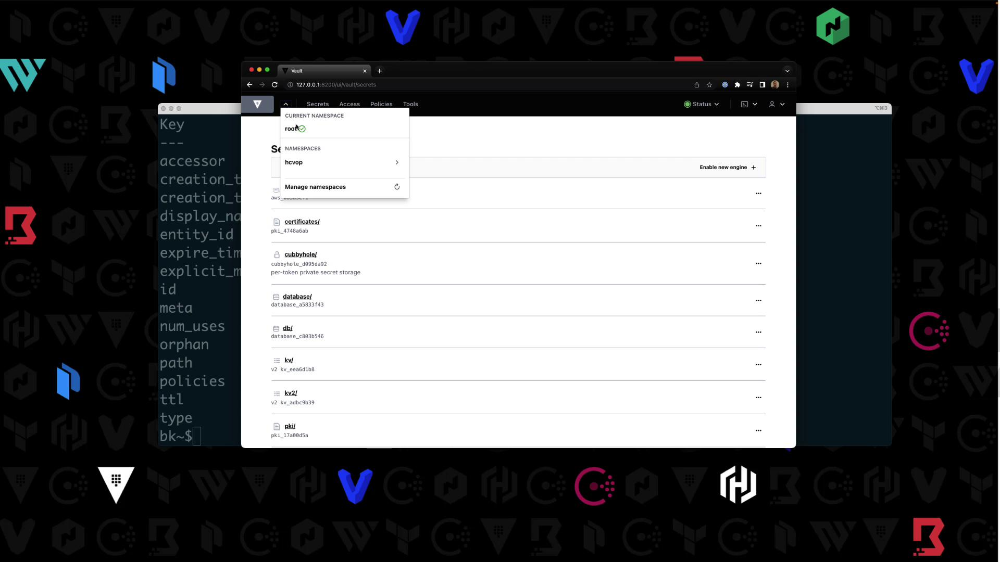
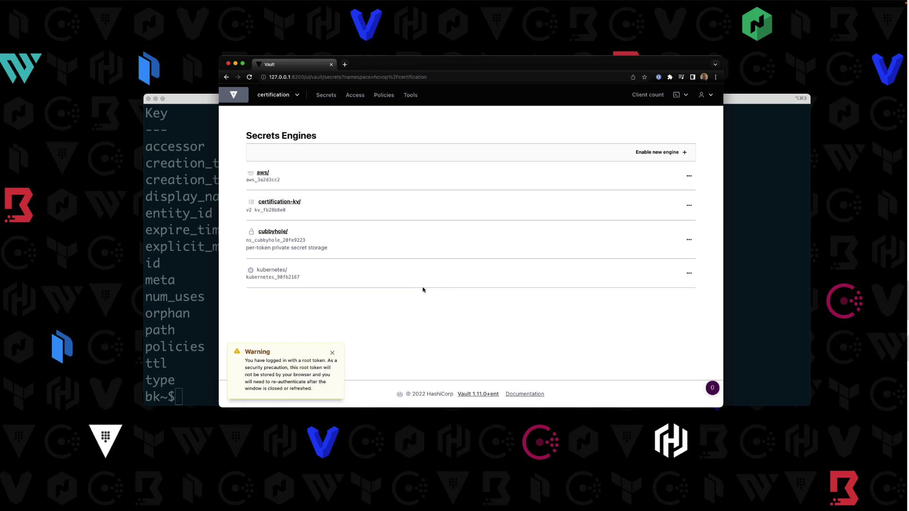
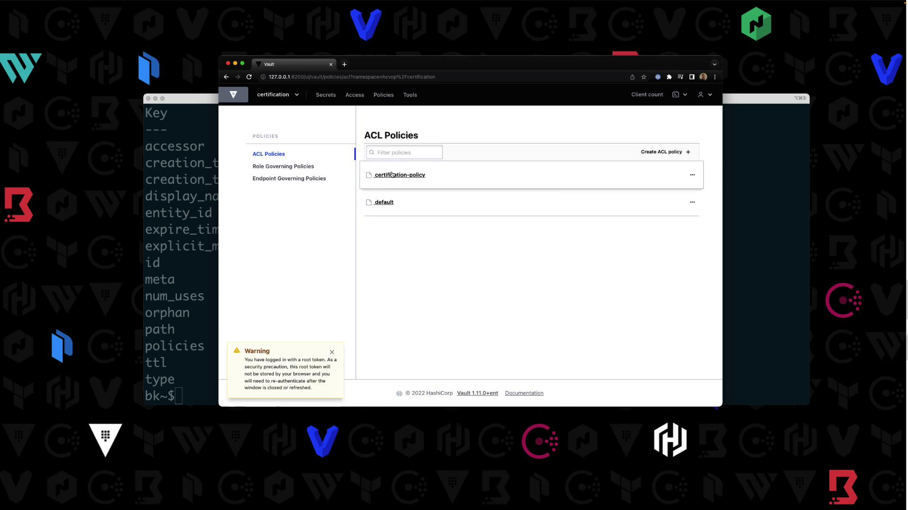
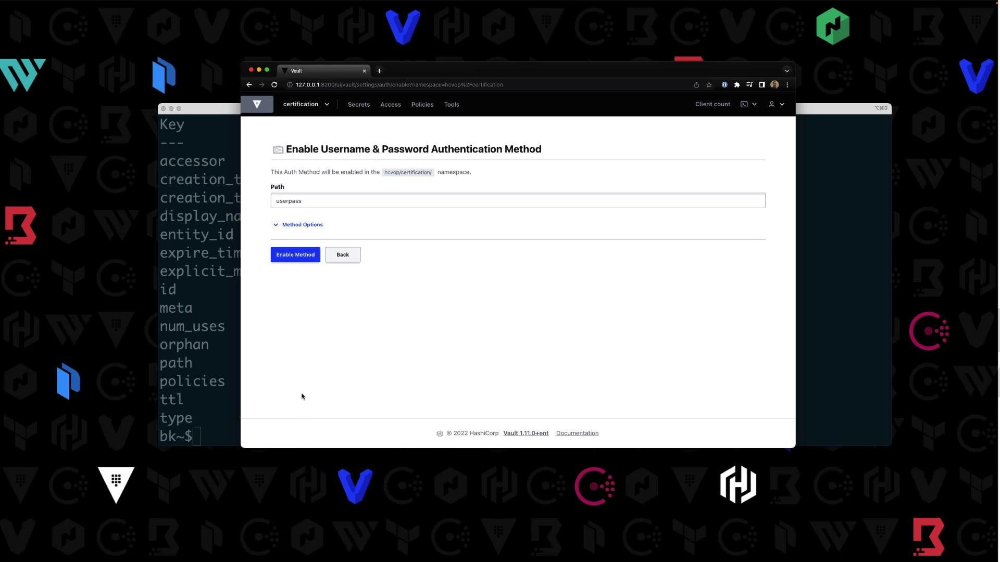
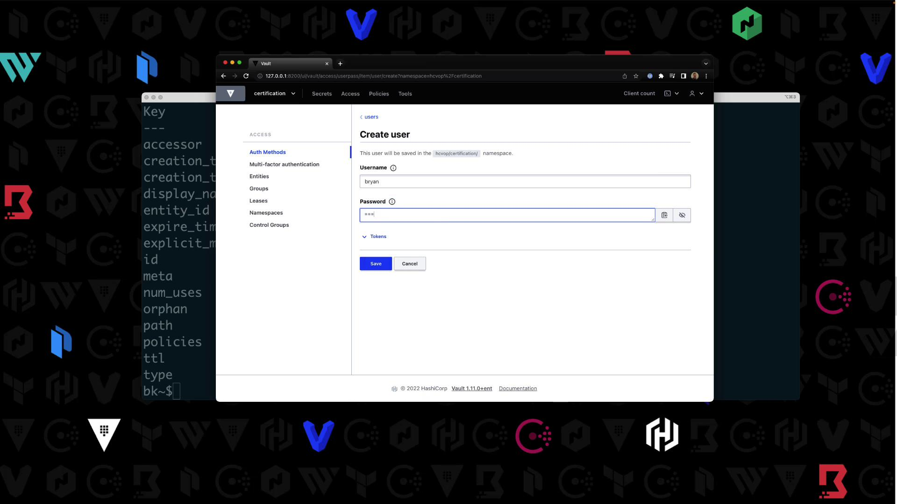
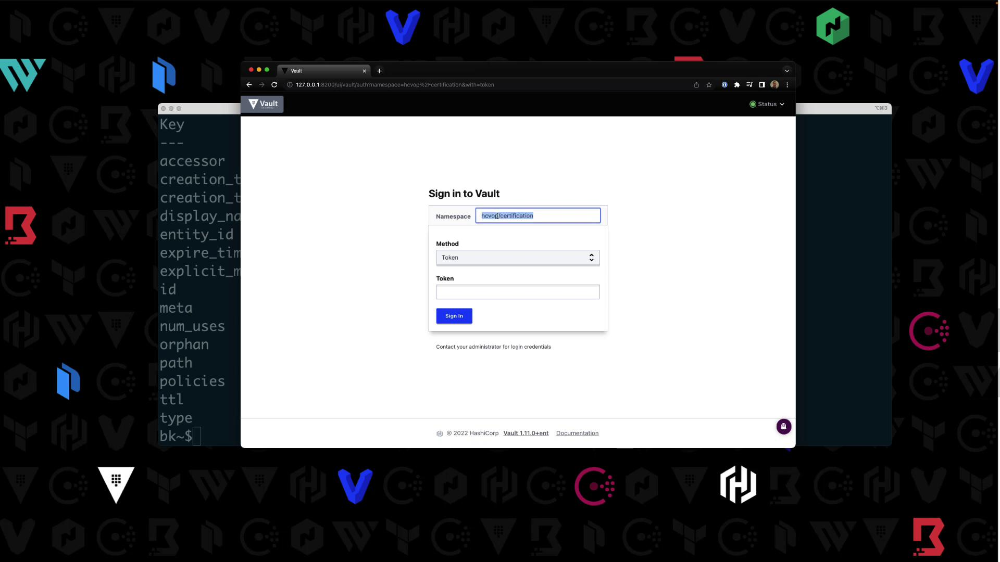

# Demo Namespace

Source: https://notes.kodekloud.com/docs/HashiCorp-Certified-Vault-Operations-Professional-2022/Configure-Access-Control/Demo-Namespace/page

This lesson covers working with Vault namespaces using CLI and UI in Vault Enterprise 1.11.

In this lesson, you’ll work with Vault namespaces using both the CLI and UI. We assume Vault Enterprise 1.11 is running locally, unsealed, and you’re authenticated as `root`.

***

## Prerequisites

* Vault Enterprise 1.11 installed and unsealed
* `root` token available

***

## Listing and Creating Namespaces via CLI

1. List existing namespaces:
   ```bash theme={null}
   vault namespace list
   ```
   If none exist, you’ll see:
   ```text theme={null}
   No namespaces found
   ```

2. Create a top-level namespace named `hcvop`:
   ```bash theme={null}
   vault namespace create hcvop
   ```
   Output:
   ```text theme={null}
   Key     Value
   ---     -----
   id      4clCR
   path    hcvop/
   ```

3. Verify it’s listed:
   ```bash theme={null}
   vault namespace list
   ```
   ```text theme={null}
   Keys
   ----
   hcvop/
   ```

### Creating Child Namespaces

Method 1: use the `-namespace` flag.

```bash theme={null}
vault namespace create -namespace=hcvop certification
```

Method 2: set `VAULT_NAMESPACE`:

```bash theme={null}
export VAULT_NAMESPACE=hcvop
vault namespace create training
```

List the children under `hcvop`:

```bash theme={null}
vault namespace list
```

```text theme={null}
Keys
----
certification/
training/
```

Return to root:

```bash theme={null}
unset VAULT_NAMESPACE
vault namespace list
```

```text theme={null}
Keys
----
hcvop/
```

***

## Exploring Namespaces in the UI

Fetch your root token if needed:

```bash theme={null}
vault token lookup
```

1. Open the Vault UI.
2. Log in with your root token.
3. Click the **Namespaces** dropdown—you’ll see `hcvop/` listed:

<Frame>
  
</Frame>

4. Select `hcvop`, re-enter your token, then switch between its `certification` and `training` child namespaces.

***

## Enabling Secrets Engines in a Child Namespace

Target `hcvop/certification` in your shell:

```bash theme={null}
export VAULT_NAMESPACE=hcvop/certification
vault secrets list
```

Enable AWS and KV v2:

```bash theme={null}
vault secrets enable aws
vault secrets enable -path=certification-kv kv-v2
```

Confirm:

```bash theme={null}
vault secrets list
```

| Path              | Type          | Description                      |
| ----------------- | ------------- | -------------------------------- |
| aws/              | aws           | AWS credential management        |
| certification-kv/ | kv            | Key/Value secrets engine v2      |
| cubbyhole/        | ns\_cubbyhole | Per-token private secret storage |
| identity/         | ns\_identity  | Identity store                   |
| sys/              | ns\_system    | System control & debugging       |

In the UI under **Secrets**, you’ll see your enabled engines:

<Frame>
  
</Frame>

***

## Writing a Policy in a Namespace

Still in `hcvop/certification`, write `certification-policy`:

```bash theme={null}
vault policy write certification-policy -<<EOF
path "certification-kv/*" {
  capabilities = ["read","create","update","delete","list"]
}
EOF
```

Success! In the UI under **Access > Policies**, you’ll see your new policy:

<Frame>
  
</Frame>

***

## Enabling Userpass Authentication

<Callout icon="lightbulb">
  Authentication methods are namespace-specific. Confirm your context is `hcvop/certification`.
</Callout>

1. In the UI, navigate to **Auth > Enable new method**.
2. Select **Username & Password**, then click **Enable**:

<Frame>
  
</Frame>

3. Create a user `Bryan` with password `HCVOP` and attach `certification-policy`:

<Frame>
  
</Frame>

***

## Logging in as the New User

Log out of the root session. On the UI login page:

* Namespace: `hcvop/certification`
* Method: **Username & Password**
* Credentials: `Bryan` / `HCVOP`

You’ll see only the `certification-kv/` engine. Other paths (e.g., `aws/`) will return an authorization error:

<Frame>
  
</Frame>

***

## Extending the Policy

To allow users to list policies:

```bash theme={null}
vault policy write certification-policy -<<EOF
path "certification-kv/*" {
  capabilities = ["read","create","update","delete","list"]
}
path "sys/policies/*" {
  capabilities = ["read","list"]
}
EOF
```

After re-login, visit **Access > Policies** to confirm.

***

## Summary

You can target a namespace in two ways:

1. Add `-namespace=<ns>` to your Vault commands
2. Export `VAULT_NAMESPACE=<ns>`

Namespaces let you organize and isolate Vault resources for different teams, applications, or environments.\
Learn more: [Vault Namespaces](https://www.vaultproject.io/docs/enterprise/namespaces)

<CardGroup>
  <Card title="Watch Video" icon="video" href="https://learn.kodekloud.com/user/courses/hashicorp-certified-vault-operations-professional-2022/module/968cf007-376b-48c8-83f9-17521b5dd575/lesson/eeacf0fa-a9ef-4b59-96b6-0777cb3adcab" />

  <Card title="Practice Lab" icon="installation" href="https://learn.kodekloud.com/user/courses/hashicorp-certified-vault-operations-professional-2022/module/968cf007-376b-48c8-83f9-17521b5dd575/lesson/b8e4cb0b-90a0-4e8b-9c5d-5b5a94a0e374" />
</CardGroup>
