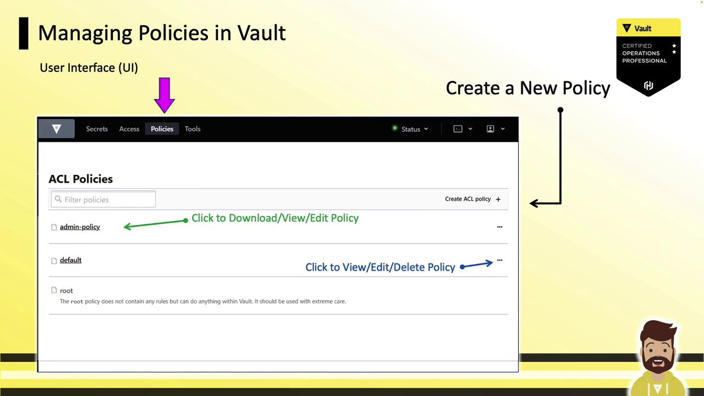
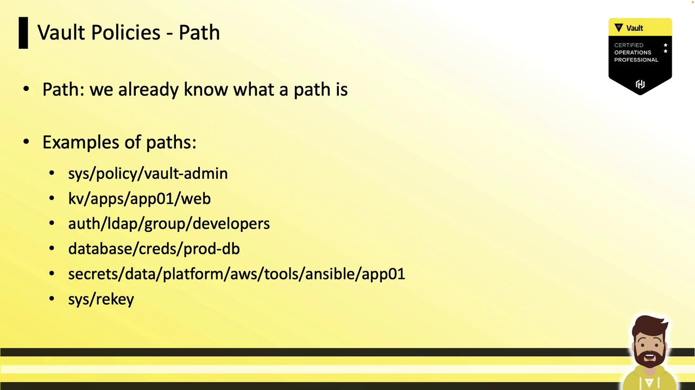
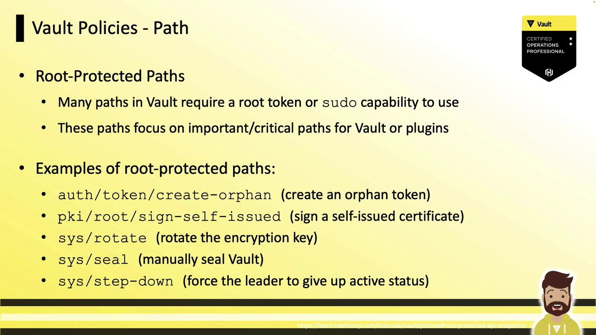

# -> default
vault policy read default
# Allow tokens to look up their own properties
path "auth/token/lookup-self" {
  capabilities = ["read"]
}
# ... other default rules
```

Reading the `root` policy returns an error (no readable rules):

```bash theme={null}
vault policy read root
# No policy named: root
```

Internally, the root policy is equivalent to:

```hcl theme={null}
path "*" {
  capabilities = ["create","read","update","delete","list","sudo"]
}
```

<Callout icon="triangle-alert">
  Use root tokens sparingly. They grant complete control over the Vault cluster.
</Callout>

## Managing Policies with the CLI

Vault’s CLI offers `vault policy` subcommands: `list`, `read`, `write`, `delete`, and `fmt`.

List all policies:

```bash theme={null}
vault policy list
# -> admin-policy
#    default
#    root
```

Create or update a policy from an HCL file:

```bash theme={null}
vault policy write admin-policy /tmp/admin.hcl
# Success! Uploaded policy: admin-policy
```

**Inline policy definition** via heredoc:

```bash theme={null}
vault policy write webapp -<< 'EOF'
path "kv/data/apps/*" {
  capabilities = ["read","create","update","delete"]
}
path "kv/metadata/*" {
  capabilities = ["read","create","update","list"]
}
EOF
```

## Managing Policies in the UI

In the Vault web UI, go to **Policies** to view ACLs. The `root` policy appears grayed out (non-editable). Use the three-dot menu on any other policy to edit or delete it, or click **Create ACL Policy** to add a new one.

<Frame>
  
</Frame>

## Managing Policies via the HTTP API

Vault’s HTTP API exposes policy management endpoints. To write a policy:

```bash theme={null}
curl --header "X-Vault-Token: s.EXAMPLETOKEN" \
     --request PUT \
     --data @payload.json \
     https://vault.example.com:8200/v1/sys/policy/webapp
```

* Header: `X-Vault-Token` for auth
* Method: `PUT` to create or update
* URL: `/v1/sys/policy/<policy-name>`
* Body (`payload.json`): JSON with a `"policy"` field containing HCL or JSON rules

Example `payload.json`:

```json theme={null}
{
  "policy": "path \"kv/apps/webapp\" { capabilities = [\"read\",\"list\"] }"
}
```

For details, see the [Vault HTTP API docs](https://www.vaultproject.io/api-docs).

## Anatomy of a Vault Policy

Each policy consists of one or more path blocks:

```hcl theme={null}
path "<resource-path>" {
  capabilities = ["<create|read|update|delete|list|sudo>"]
}
```

Combine blocks to cover multiple resources:

```hcl theme={null}
path "kv/data/apps/jenkins" {
  capabilities = ["read","update","delete"]
}

path "sys/policies/*" {
  capabilities = ["create","update","list","delete"]
}

path "aws/creds/web-app" {
  capabilities = ["read"]
}
```

## Understanding Vault Paths

Every Vault feature—secret engines, auth methods, KV data—is namespaced under a path. Examples:

<Frame>
  
</Frame>

* `sys/policy`: Manage Vault’s own ACLs
* `kv/app1/app01/web`: KV v1 secrets
* `database/creds/my-role`: Dynamic DB credentials
* `auth/token/renew-self`: Token renewal endpoint

For KV v2 mounts (e.g., at `secrets`), include the `data` prefix:

```bash theme={null}
vault kv get secrets/data/platform/aws/tools/ansible
```

Here, `secrets` = mount point, `data` = v2 API prefix.

## Root-Protected Paths

Certain operations require a root token or `sudo` capability. Examples:

<Frame>
  
</Frame>

* `auth/token/create-orphan`: Create orphan tokens
* `pki/root/sign-self-issued`: Sign certificates
* `sys/rotate`: Rotate encryption keys
* `sys/seal`: Seal the Vault
* `sys/step-down`: Force leader step-down

Example policy granting `sudo`:

```hcl theme={null}
path "sys/rotate" {
  capabilities = ["sudo"]
}
path "sys/seal" {
  capabilities = ["sudo"]
}
path "sys/step-down" {
  capabilities = ["sudo"]
}
```

<Callout icon="triangle-alert">
  Grant sudo sparingly—only highly trusted operators should have these elevated rights.
</Callout>

## Links and References

* [Vault HTTP API Documentation](https://www.vaultproject.io/api-docs)
* [HashiCorp Vault Concepts](https://www.vaultproject.io/docs/concepts)
* [Terraform Registry](https://registry.terraform.io/)
* [Packer Documentation](https://www.packer.io/docs)

<CardGroup>
  <Card title="Watch Video" icon="video" href="https://learn.kodekloud.com/user/courses/hashicorp-certified-vault-operations-professional-2022/module/968cf007-376b-48c8-83f9-17521b5dd575/lesson/ec697a75-1b71-465c-a7bc-ccbbbed23773" />
</CardGroup>


# Vault Policies Part 2

Source: https://notes.kodekloud.com/docs/HashiCorp-Certified-Vault-Operations-Professional-2022/Configure-Access-Control/Vault-Policies-Part-2/page

This article explores Vault policy capabilities, including CRUD operations, wildcards, ACL templates, and policy testing for fine-grained access control.

In this lesson, we'll dive into Vault policy capabilities—CRUD operations, `list`, `sudo`, `deny`—and explore wildcards, ACL templates, and policy testing. By the end, you’ll know how to craft precise, secure policies using glob patterns and variable interpolation.

## Core Capabilities Overview

Vault policy capabilities are declared as lists of strings within each `path` block. Here’s a quick reference:

| Capability | Description                                               |
| ---------- | --------------------------------------------------------- |
| create     | Add a new secret or configuration (fails if it exists)    |
| read       | Retrieve secrets, configurations, or policies             |
| update     | Overwrite an existing entry (fails if missing)            |
| delete     | Remove a secret or configuration                          |
| list       | Enumerate keys under a path (without revealing values)    |
| sudo       | Required for root-protected endpoints (e.g., seal, rekey) |
| deny       | Explicitly blocks access to a path (highest precedence)   |

<Callout icon="lightbulb">
  There is no generic `write` capability in Vault. Use `create` or `update` depending on whether the path should already exist.
</Callout>

<Callout icon="triangle-alert">
  The `deny` capability always takes precedence over any granted rights. Use it carefully to lock down sensitive paths.
</Callout>

***

## Example 1: Simple CRUD Policy

Grant:

1. Read access to `database/creds/dev-db01`.
2. Full CRUD on `kv/apps/dev-app01`.

```hcl theme={null}
path "database/creds/dev-db01" {
  capabilities = ["read"]
}

path "kv/apps/dev-app01" {
  capabilities = ["create", "read", "update", "delete"]
}
```

* For KV v2, prefix paths with `data/` (e.g., `path "data/kv/apps/dev-app01"`).
* A single policy can include multiple `path` blocks; tokens inherit all rules.

***

## Example 2: Glob Patterns with Explicit Deny

Grant read across `kv/apps/webapp/` but block `super_secret`:

```text theme={null}
kv/
└── apps/
    ├── webapp/
    │   ├── api
    │   ├── token
    │   ├── hostname
    │   └── super_secret
    ├── mid-tier/
    └── database/
```

```hcl theme={null}
path "kv/apps/webapp/*" {
  capabilities = ["read"]
}

path "kv/apps/webapp/super_secret" {
  capabilities = ["deny"]
}
```

* The glob `webapp/*` matches all child paths—**not** the directory itself.
* `deny` on `super_secret` overrides any read rights.

### Pop Quiz

1. Does `kv/apps/webapp/*` allow access to `kv/apps/webapp` (no trailing slash)?\
   No. The glob only matches subpaths after the slash.

2. Can a user browse the UI down to `webapp`?\
   Not without `list` on the parent paths (`kv/`, `kv/apps/`, `kv/apps/webapp`).\
   Example policy to enable UI navigation:

   ```hcl theme={null}
   path "kv/apps/webapp/*" {
     capabilities = ["read", "list"]
   }

   # Or more broadly:
   path "kv/*" {
     capabilities = ["list"]
   }
   ```

***

## Wildcards in Policy Paths

Vault supports two wildcard patterns:

1. Asterisk (`*`) at the **end** of a path segment (glob).
2. Plus (`+`) replacing exactly **one** path segment.

### Asterisk (`*`) Globs

```hcl theme={null}
