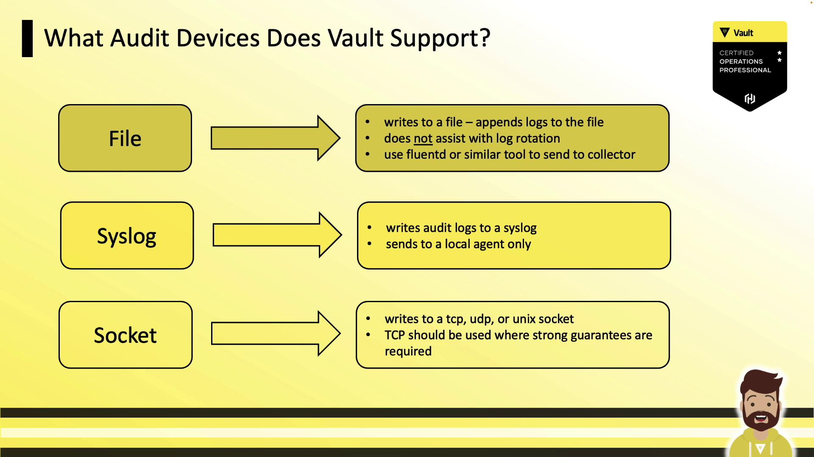
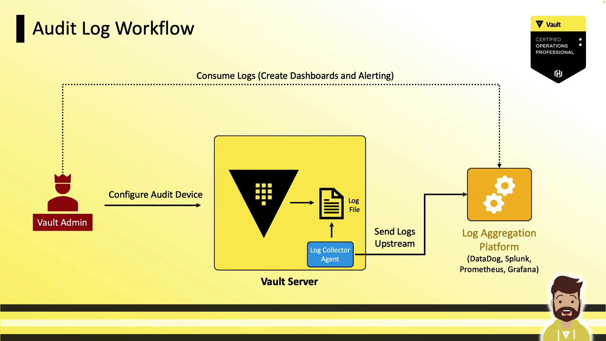

# Monitor and Understand Audit Logs

Source: https://notes.kodekloud.com/docs/HashiCorp-Certified-Vault-Operations-Professional-2022/Monitor-a-Vault-Environment/Monitor-and-Understand-Audit-Logs/page

Learn to monitor HashiCorp Vault activity by capturing requests and responses through audit logs for security, compliance, and troubleshooting.

In this guide, you’ll learn how to monitor HashiCorp Vault activity by capturing every request and response through audit logs. Audit logs provide a comprehensive, tamper-evident record of all Vault operations—crucial for security, compliance, and troubleshooting.

<Frame>
  
</Frame>

Audit logs are stored in JSON by default, making them easy to query with tools like `jq`. Vault automatically hashes any sensitive data (tokens, secrets) using HMAC-SHA256 and a unique salt, ensuring that no raw secret ever appears in logs.

<Callout icon="triangle-alert">
  Never disable HMAC hashing in production. Without hashing, sensitive values and tokens may be exposed in plaintext.
</Callout>

Always secure your log files with strict permissions and immutable storage to maintain an unalterable audit trail.

## Supported Audit Devices

Vault offers three primary audit devices. You can mount one or more simultaneously to ensure high availability.

| Device Type | Description                                            | Common Use Case                      |
| ----------- | ------------------------------------------------------ | ------------------------------------ |
| **file**    | Appends JSON logs to a local file.                     | Simple setups; file rotation by user |
| **syslog**  | Sends entries to a local syslog daemon or remote host. | Centralized logging via syslog       |
| **socket**  | Streams logs over TCP, UDP, or UNIX sockets.           | Guaranteed delivery with TCP stream  |

<Frame>
  
</Frame>

### Safety and High Availability

Audit devices are disabled by default. As soon as you enable one, Vault will require successful log writes before processing any request. If logging fails (e.g., disk full, syslog unreachable), Vault halts client operations—prioritizing safety over availability. To mitigate this, enable multiple audit devices (for example, `file` and `syslog`) so that at least one remains writable.

<Callout icon="lightbulb">
  Enabling two audit devices ensures redundancy. If one path fails, Vault continues logging on the other.
</Callout>

<Frame>
  
</Frame>

## Audit Log Workflow

1. **Configure Audit Devices**\
   Vault Admin mounts one or more audit devices using `vault audit enable`.
2. **Write Logs**\
   Vault writes JSON entries to the configured device(s).
3. **Collect Logs**\
   A local collector (e.g., Fluentd, Splunk Forwarder) tails the file or listens on syslog/socket.
4. **Aggregate & Analyze**\
   Logs are forwarded to SIEM or monitoring platforms (Splunk, Datadog).
5. **Alerting & Dashboards**\
   Create dashboards and alerts—for example, when a root token is created or a policy is changed.

<Frame>
  
</Frame>

## Enabling an Audit Device

Use `vault audit enable` with the target type and parameters:

```bash theme={null}
