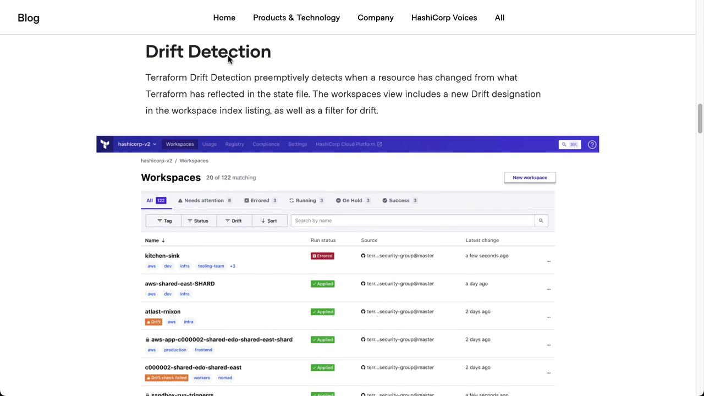
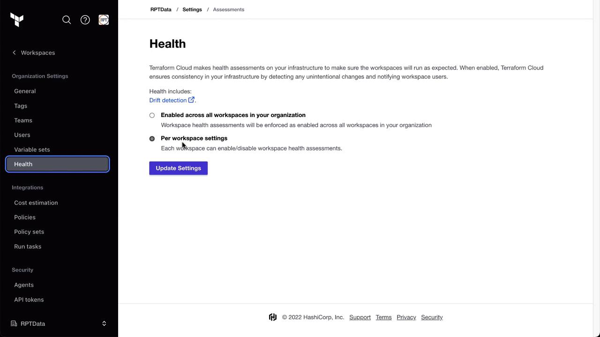
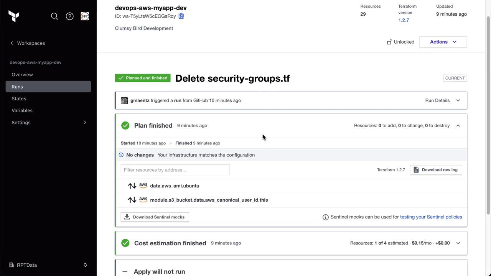
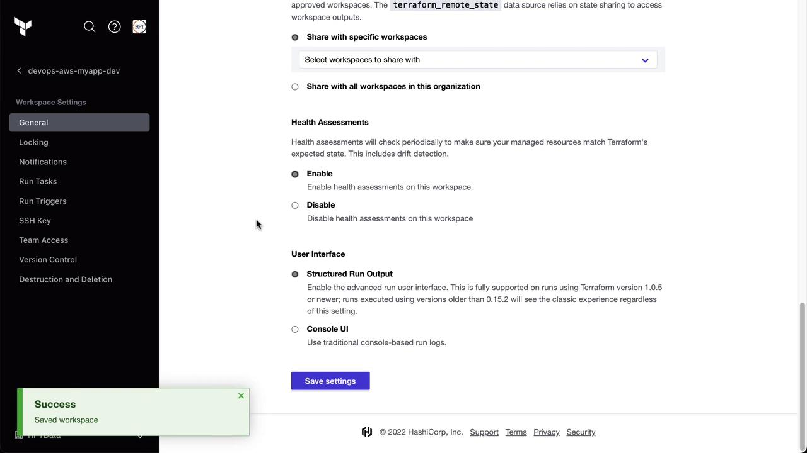
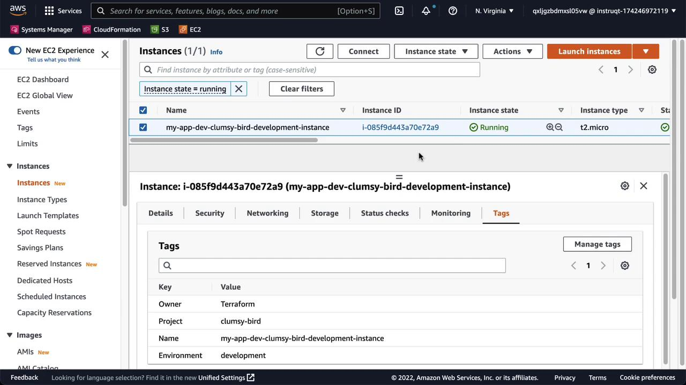
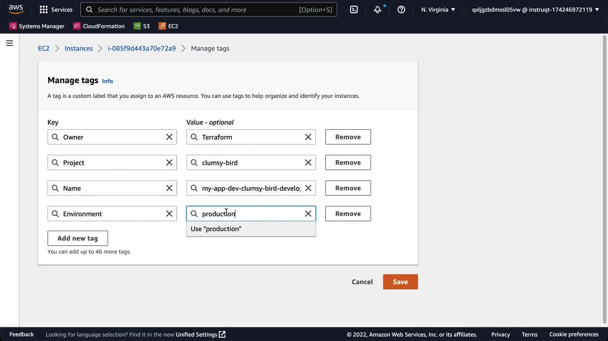
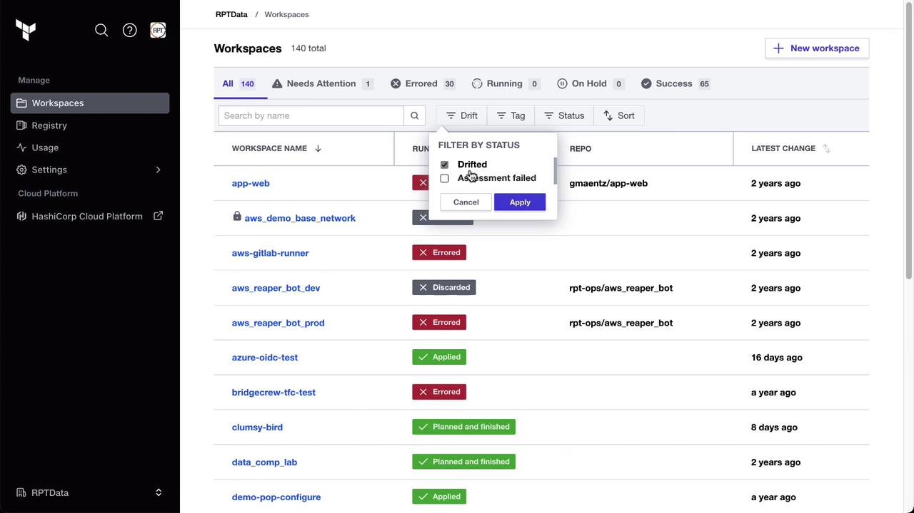
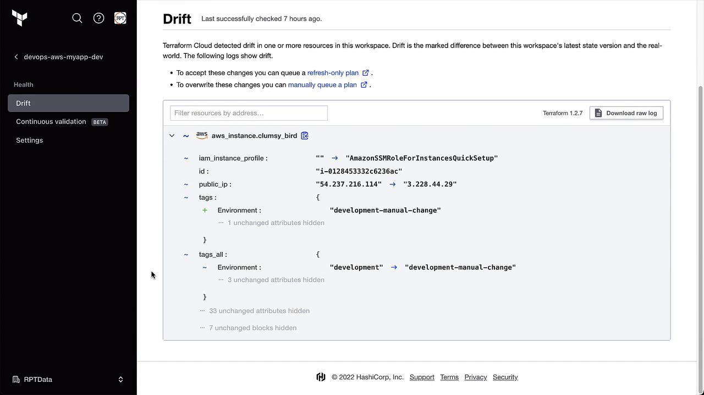
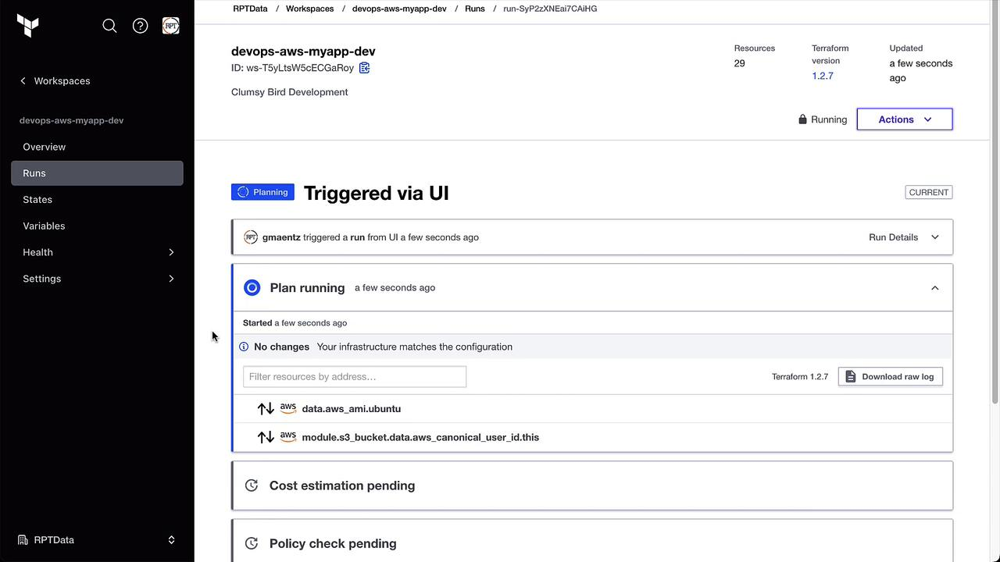
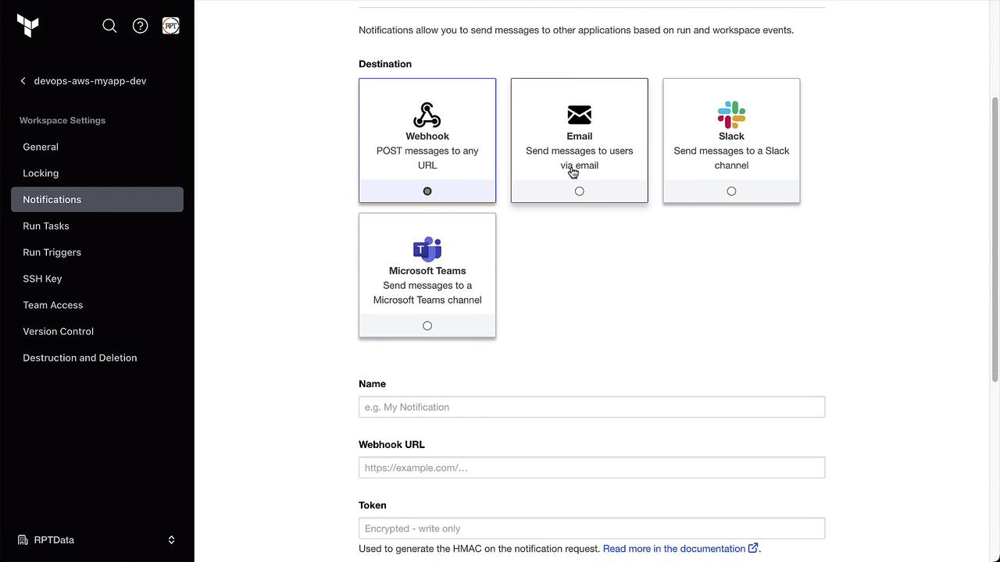

# Terraform 1.0 and Earlier
terraform {
  backend "remote" {
    hostname     = "app.terraform.io"
    organization = "my-organization"
    workspaces {
      name = "my-workspace"
    }
  }
}

# Terraform 1.1 and Later
terraform {
  cloud {
    hostname     = "app.terraform.io"
    organization = "my-organization"
    workspaces {
      name = "my-workspace"
    }
  }
}
```

Run:

```bash theme={null}
terraform init
```

This configures Terraform Cloud for state storage and workspace management.

<Callout icon="lightbulb">
  You can also configure workspaces via the [Terraform Cloud API](https://www.terraform.io/docs/cloud/api/workspaces.html) or the `tfe` provider.
</Callout>

***

By leveraging Terraform Cloud Workspaces, you can clearly separate environments, enforce policy and governance, and scale collaborations across teams. Choose a naming convention, select the execution mode that fits your workflow, and get full visibility into your infrastructure changes.

***

## References

* [Terraform Cloud Documentation](https://www.terraform.io/docs/cloud/index.html)
* [Remote State in Terraform](https://www.terraform.io/docs/language/state/remote.html)
* [Terraform Sentinel Policies](https://www.terraform.io/docs/cloud/sentinel/index.html)

<CardGroup>
  <Card title="Watch Video" icon="video" href="https://learn.kodekloud.com/user/courses/hashicorp-terraform-cloud/module/69fc91b2-bf0f-4922-831c-2aee42d19b03/lesson/c043879b-55ce-49d3-af40-cc0b4b3b47ea" />

  <Card title="Practice Lab" icon="installation" href="https://learn.kodekloud.com/user/courses/hashicorp-terraform-cloud/module/69fc91b2-bf0f-4922-831c-2aee42d19b03/lesson/47cb5594-2e07-4b04-839b-a1e26c26810b" />
</CardGroup>


# Demo Drift Detection

Source: https://notes.kodekloud.com/docs/HashiCorp-Terraform-Cloud/Advanced-Topics/Demo-Drift-Detection/page

Terraform Clouds Drift Detection feature monitors infrastructure for changes, ensuring environments remain in sync with version-controlled Terraform code.

Terraform Cloud’s Drift Detection feature, introduced in mid-2022, continuously monitors your infrastructure for out-of-band changes. By comparing your deployed resources against your version-controlled Terraform code, it helps ensure your environments stay in sync.

## Prerequisites and Licensing

<Callout icon="triangle-alert">
  Terraform Cloud Drift Detection requires a **Business Tier** license. If you’re evaluating this feature, ensure your organization has the correct plan.
</Callout>

## Overview of Workspaces and Health Status

From the Terraform Cloud UI, you can quickly see which workspaces are “Errored,” “Applied,” or have drift:

<Frame>
  
</Frame>

## Enable Drift Detection

You can enable health assessments — including drift detection — either globally or per workspace.

1. Navigate to **Settings** in your organization.
2. Select **Health** and choose your preferred scope.

<Frame>
  
</Frame>

In this demo, we’ve enabled health checks at the **workspace** level. Open the **Clumsy Bird** workspace to confirm its current status. A recent plan and apply completed with no drift:

<Frame>
  
</Frame>

Once enabled, you’ll see a new **Drift** section in the workspace sidebar:

<Frame>
  
</Frame>

## Verifying the Baseline State

Before simulating drift, confirm that your deployed infrastructure matches code. For example, check your AWS EC2 dashboard for the **Clumsy Bird** instance:

<Frame>
  
</Frame>

## Simulate Drift

In the AWS Console, modify the **Environment** tag from `development` to `production`:

<Frame>
  
</Frame>

After saving, Terraform Cloud’s periodic health assessment will detect this change. You can filter by **Drift** on the workspace dashboard:

<Frame>
  
</Frame>

<Callout icon="lightbulb">
  The first health assessment typically runs **24 hours** after your last active Terraform run. Learn more in the [Health Assessment Scheduling documentation](https://www.terraform.io/cloud-docs/health-assessment-scheduling).
</Callout>

<Frame>
  
</Frame>

## Detecting and Reviewing Drift

Once the assessment completes, Terraform Cloud will highlight any discrepancies. In the **Clumsy Bird** workspace, drift is detected and detailed under the **Health** tab:

<Frame>
  
</Frame>

## Handling Detected Drift

Terraform Cloud offers two primary options:

| Method             | Description                                                                                 |
| ------------------ | ------------------------------------------------------------------------------------------- |
| Accept the drift   | Run a **Refresh State** plan to update Terraform’s state file without changing code.        |
| Override the drift | Execute a standard **Plan and Apply** to revert the infrastructure back to match your code. |

Example of a detected drift diff:

```plaintext theme={null}
aws aws_instance.clumsy_bird :
  iam_instance_profile :
    id : 
    public_ip : 
  tags :
    Environment : "development-manual-change"
  tags.all :
    Environment :
      "development" : "development-manual-change"
```

### Accepting the Drift

Click **Start New Run** and select **Refresh State**. This updates the Terraform state to reflect the manual change.

### Overriding the Drift

Select the usual **Plan and Apply** workflow to revert the tag back to `development`:

<Frame>
  
</Frame>

After completion, verify in the AWS Console that the **Environment** tag is back to `development`. The Health tab will now show **No drift detected**.

## Configuring Drift Notifications

Stay informed by setting up notifications under **Notifications**. For example, send an email or Slack message whenever drift is detected:

<Frame>
  
</Frame>

Choose **Health events** and enable **Drift detected**:

<Frame>
  
</Frame>

Specify your email recipients or Slack channel:

<Frame>
  
</Frame>

## Summary

Terraform Cloud Drift Detection (Business Tier) ensures your infrastructure matches your code by:

* Continuously checking for out-of-band changes

* Highlighting drift under the **Health** tab

* Providing options to accept or override detected drift

* Allowing notifications to alert your team immediately

* [Terraform Cloud Health Assessment Scheduling](https://www.terraform.io/cloud-docs/health-assessment-scheduling)

* [Terraform Cloud Overview](https://www.terraform.io/cloud)

* [AWS EC2 Documentation](https://docs.aws.amazon.com/ec2/)

<CardGroup>
  <Card title="Watch Video" icon="video" href="https://learn.kodekloud.com/user/courses/hashicorp-terraform-cloud/module/f7d08e72-e35f-436f-8d42-d0d7364d2532/lesson/02899d10-6428-4b2f-aabc-01c5d508b6a7" />

  <Card title="Practice Lab" icon="installation" href="https://learn.kodekloud.com/user/courses/hashicorp-terraform-cloud/module/f7d08e72-e35f-436f-8d42-d0d7364d2532/lesson/5a97f72e-9b62-420c-9f2c-a7bfe32ace62" />
</CardGroup>
