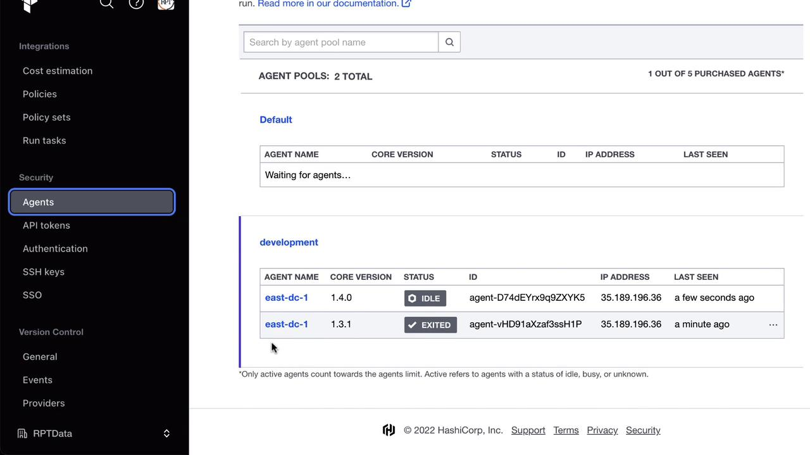
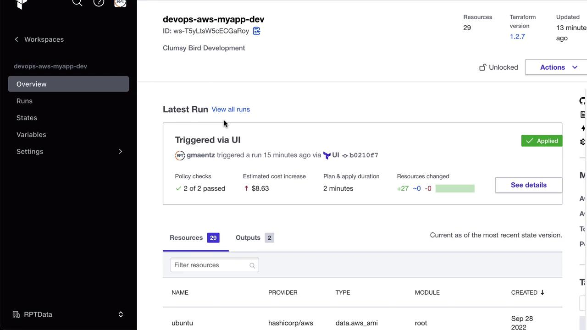
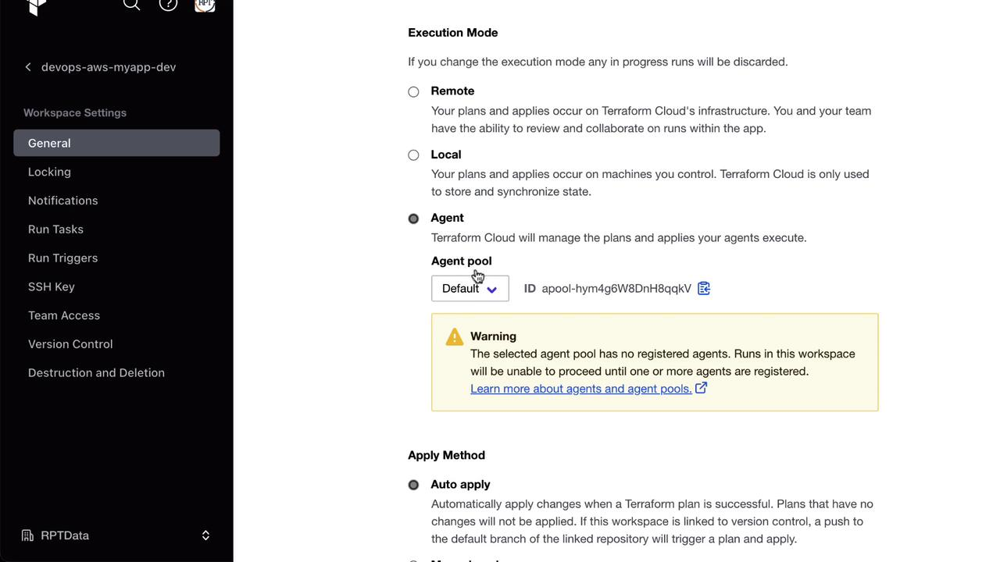
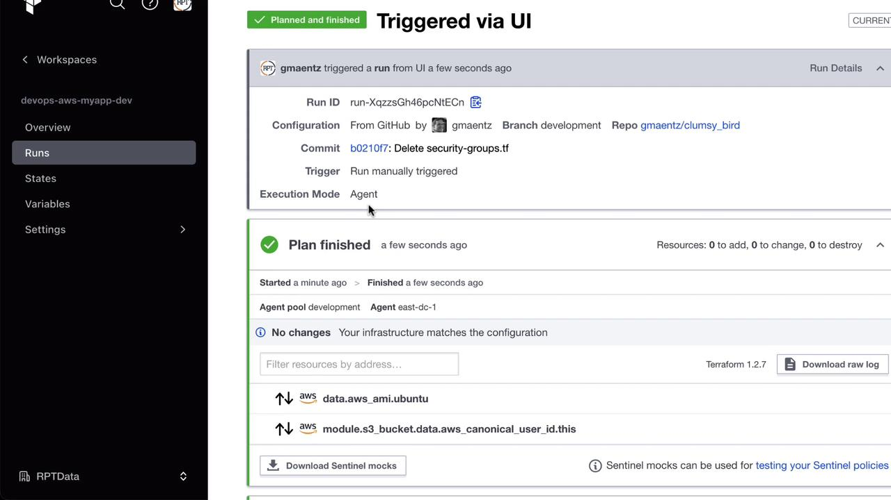
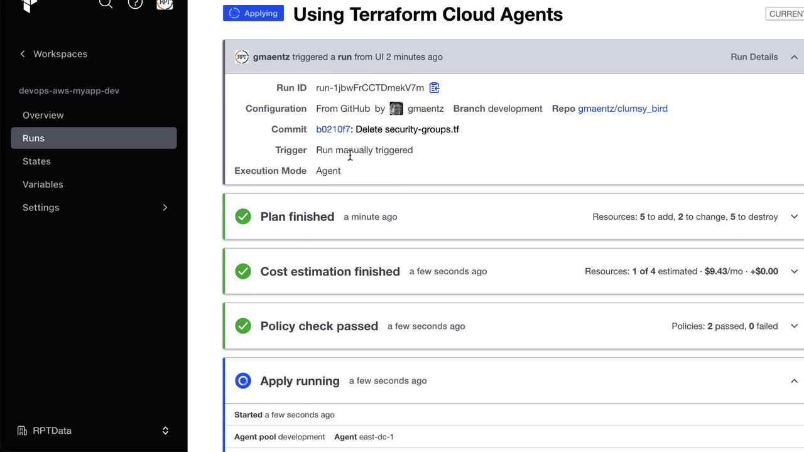
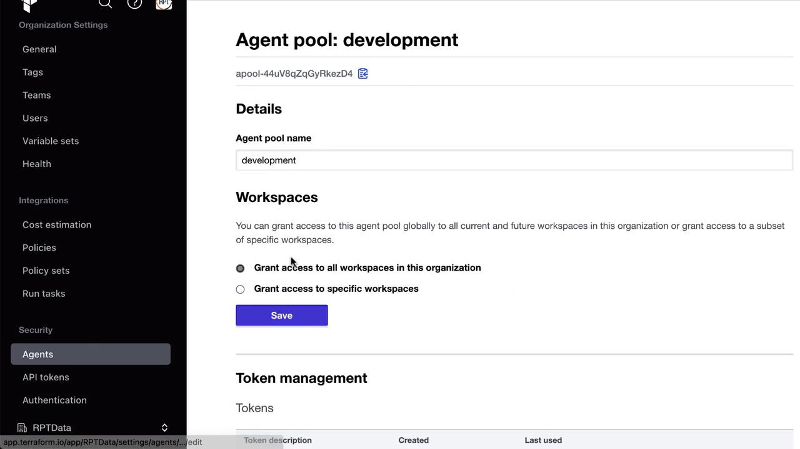
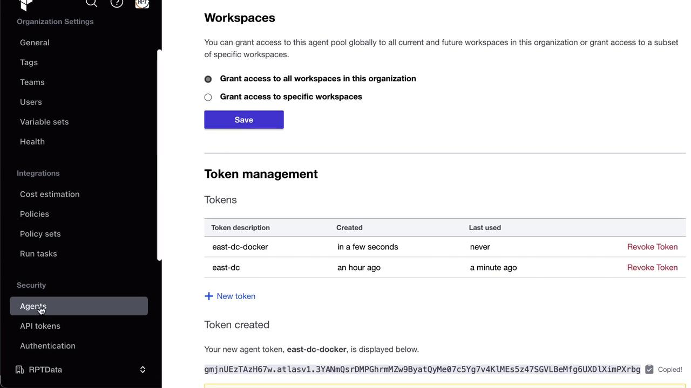

# Replace with the current stable version if newer
curl -Lo tfc-agent_1.3.1_linux_amd64.zip \
  https://releases.hashicorp.com/tfc-agent/1.3.1/tfc-agent_1.3.1_linux_amd64.zip
unzip tfc-agent_1.3.1_linux_amd64.zip
```

Set environment variables and start the agent:

```bash theme={null}
export TFC_AGENT_TOKEN=<your_agent_pool_token>
export TFC_AGENT_NAME=east-dc-1
./tfc-agent
```

On launch, you’ll see a registration confirmation:

```bash theme={null}
2022-10-05T12:14:31.806Z [INFO] core: Agent registered successfully with Terraform Cloud: agent.name=east-dc-1
```

<Frame>
  
</Frame>

## Running an Agent in Docker

Alternatively, launch an agent as a Docker container:

```bash theme={null}
export TFC_AGENT_TOKEN=<your_agent_pool_token>
export TFC_AGENT_NAME=east-dc-2
docker run -e TFC_AGENT_TOKEN -e TFC_AGENT_NAME hashicorp/tfc-agent:latest
```

This pulls the `latest` image, auto-updates its core if enabled, and registers to your specified pool.

## Agent Auto-Update Behavior

Agents check for newer core versions by default. Sample logs:

```bash theme={null}
2022-10-05T12:14:30.066Z [INFO] agent: Core update is available: version=1.4.0
2022-10-05T12:14:31.061Z [INFO] agent: Core successfully updated: version=1.4.0
```

To manage updates manually, disable auto-updates under **Settings → Agents → \[Your Pool]**.

## Configuring a Workspace for Agent Execution

1. Go to **Workspaces → \[Your Workspace]** in Terraform Cloud.
2. Under **Settings → Execution Mode**, select **Agent**.
3. Choose your **development** pool and save.

<Frame>
  
</Frame>

<Frame>
  
</Frame>

<Frame>
  
</Frame>

## Running Terraform via the Agent

Trigger a run in the workspace. The agent logs will indicate progress:

```bash theme={null}
2022-10-05T12:18:38.117Z [INFO] core: Job received: job.type=plan job.id=run-XXXXX
2022-10-05T12:19:38.105Z [INFO] terraform: Terraform CLI details: version=1.2.7
2022-10-05T12:19:38.717Z [INFO] terraform: Running terraform init
2022-10-05T12:19:48.210Z [INFO] terraform: Running terraform plan
```

Back in the UI, you’ll see the plan complete:

<Frame>
  
</Frame>

When changes are pushed, the agent will perform `apply` as well:

<Frame>
  
</Frame>

## Scaling with Multiple Agents

To increase throughput, register additional agents to the same pool. Your Terraform Cloud license determines the maximum concurrent agents.

<Frame>
  
</Frame>

## Managing Pools and Tokens

* Create multiple tokens per pool or assign one per agent.
* Rotate or revoke tokens under **Settings → Agents → \[Your Pool] → Tokens**.
* Delete agents or pools when no longer in use—ensure they aren’t linked to active workspaces.

<Frame>
  
</Frame>

<Frame>
  
</Frame>

Terraform Cloud Agents enable secure, scalable execution of Terraform runs within your network perimeter, giving you full control over connectivity and resources.

## References

* [Terraform Cloud Agents Documentation](https://developer.hashicorp.com/terraform/cloud-guides/agents)
* [Terraform Cloud Workspaces](https://www.terraform.io/cloud-docs/workspaces)
* [HashiCorp Releases](https://releases.hashicorp.com/tfc-agent/)

<CardGroup>
  <Card title="Watch Video" icon="video" href="https://learn.kodekloud.com/user/courses/hashicorp-terraform-cloud/module/f7d08e72-e35f-436f-8d42-d0d7364d2532/lesson/46391a96-8167-4743-8efc-a88d527d2cd0" />
</CardGroup>


# Lab Solution Automating Terraform Cloud

Source: https://notes.kodekloud.com/docs/HashiCorp-Terraform-Cloud/Advanced-Topics/Lab-Solution-Automating-Terraform-Cloud/page

Automate Terraform Cloud workflows by codifying tasks typically done in the UI using the TFC provider.

Automate your Terraform Cloud workflows—workspaces, variables, team access, and more—by codifying everything you’d normally click through in the Terraform Cloud UI. In this lab, we’ll use the official [hashicorp/tfe](https://registry.terraform.io/providers/hashicorp/tfe/latest) provider to:

* Initialize the TFC provider
* Query and inspect existing workspaces
* Create new workspaces
* Manage workspace variables
* Specify Terraform versions
* Dynamically generate multiple workspaces
* Assign team permissions
* Clean up resources

***

## Prerequisites

1. Terraform CLI v1.x installed
2. A Terraform Cloud account
3. A Terraform API token with appropriate permissions

<Callout icon="triangle-alert">
  Keep your `TFE_TOKEN` secure. **Do not** commit API tokens to version control.
</Callout>

Set your Terraform Cloud API token in the shell:

```bash theme={null}
export TFE_TOKEN=YOUR_TERRAFORM_CLOUD_TOKEN
```

***

## 1. Initialize the Terraform Cloud Provider

Create a directory named `workspace_automation` and inside it, add a `main.tf` file:

```terraform theme={null}
terraform {
  required_providers {
    tfe = {
      source  = "hashicorp/tfe"
      version = "~> 0.31"
    }
  }
}

provider "tfe" {
  token = var.tfe_token
}

variable "tfe_token" {
  type        = string
  description = "Terraform Cloud API token"
}

variable "organization" {
  type        = string
  description = "Terraform Cloud organization name"
}

variable "workspace_name" {
  type        = string
  description = "Existing workspace name to query"
}
```

Initialize the provider:

```bash theme={null}
terraform init
```

***

## 2. Query an Existing Workspace

Add a **data source** block to `main.tf` to fetch a workspace by name:

```terraform theme={null}
data "tfe_workspace" "existing" {
  name         = var.workspace_name
  organization = var.organization
}

output "workspace_id" {
  value = data.tfe_workspace.existing.id
}

output "workspace_terraform_version" {
  value = data.tfe_workspace.existing.terraform_version
}
```

Apply the configuration:

```bash theme={null}
terraform apply \
  -var "organization=YOUR-ORG" \
  -var "workspace_name=devops-aws-myapp-dev"
```

Sample output:

```plaintext theme={null}
data.tfe_workspace.existing: Reading...
data.tfe_workspace.existing: Read complete after 2s [id=ws-pj5yrEcvvrdxjYji]

Outputs:
  workspace_id                = "ws-pj5yrEcvvrdxjYji"
  workspace_terraform_version = "1.2.7"
```

Inspect the state:

```bash theme={null}
terraform state list
terraform state show data.tfe_workspace.existing
```

***

## 3. Create a New Workspace

Extend `main.tf` with a resource block to provision a workspace:

```terraform theme={null}
variable "workspace_name_new" {
  type        = string
  description = "Name of the new workspace to create"
}

resource "tfe_workspace" "new" {
  name         = var.workspace_name_new
  organization = var.organization
}

output "workspace_new_id" {
  value = tfe_workspace.new.id
}

output "workspace_new_terraform_version" {
  value = tfe_workspace.new.terraform_version
}
```

Format and apply:

```bash theme={null}
terraform fmt
terraform apply \
  -var "organization=YOUR-ORG" \
  -var "workspace_name=devops-aws-myapp-dev" \
  -var "workspace_name_new=webserver-aws-stage"
```

Preview plan:

```plaintext theme={null}
