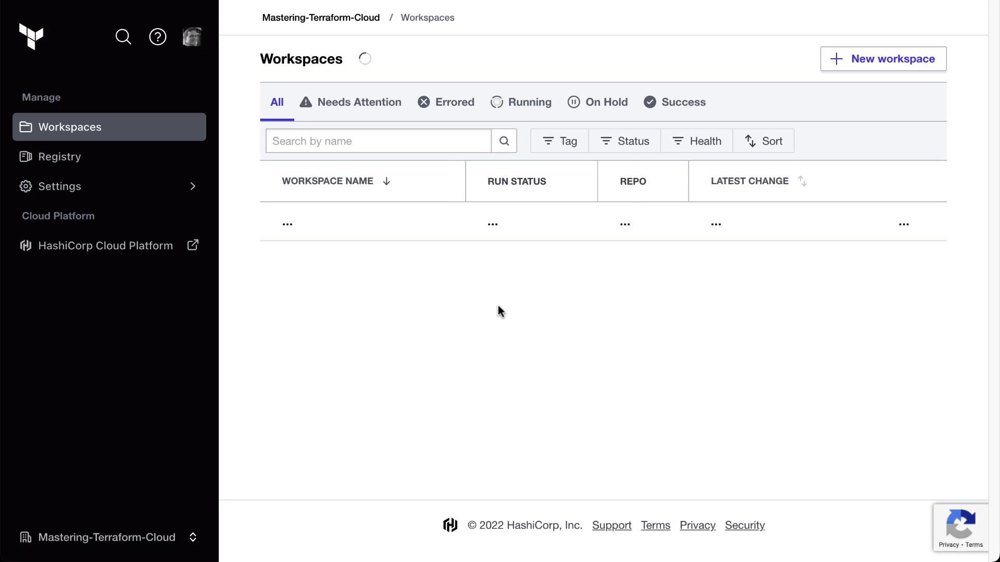
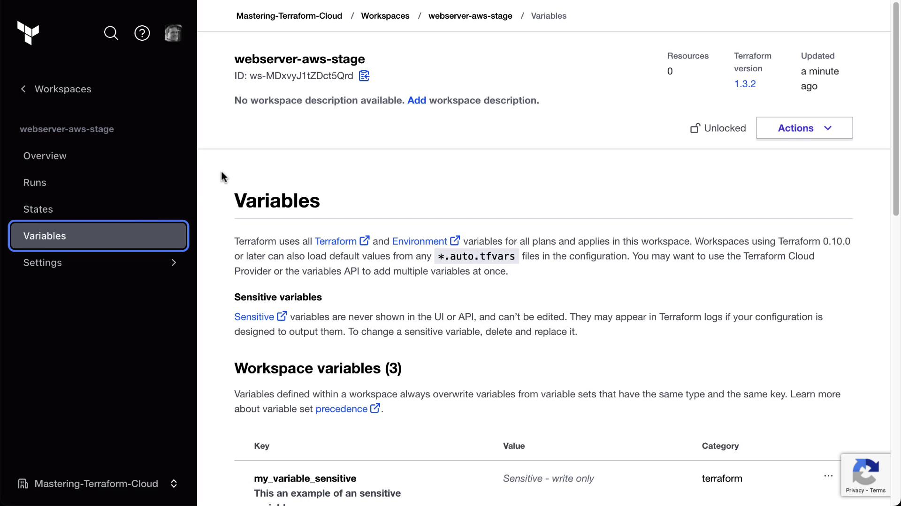
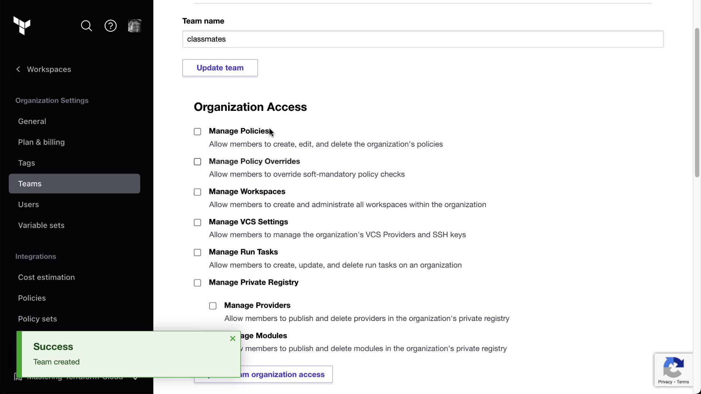
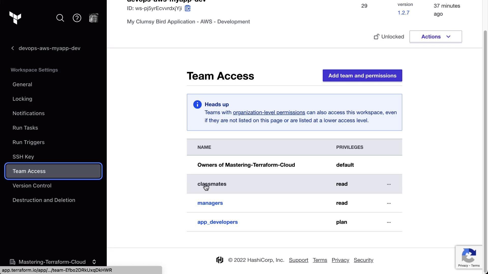
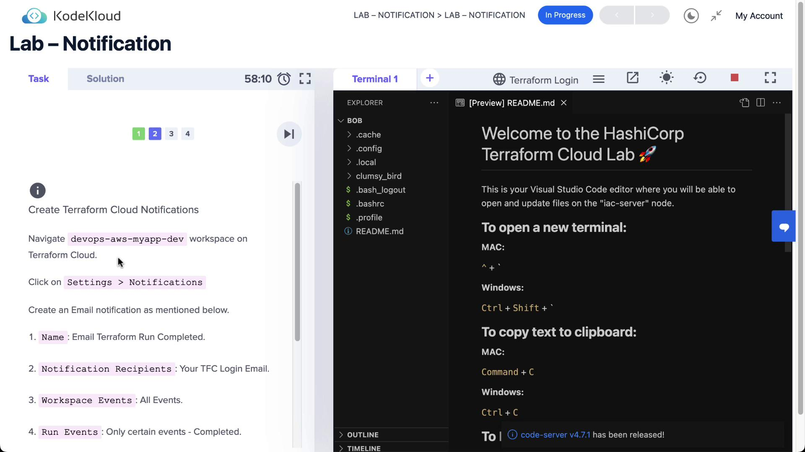
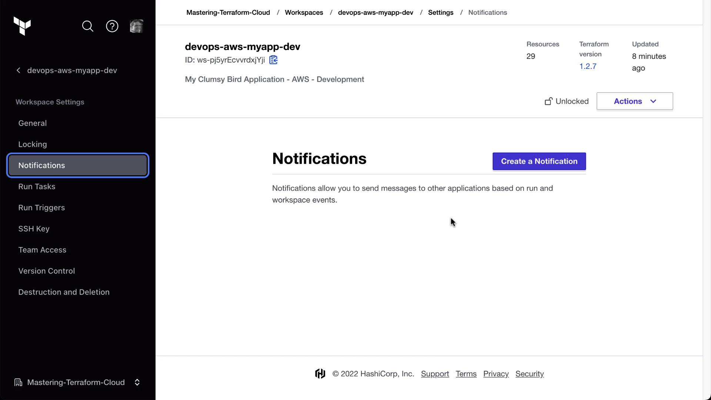
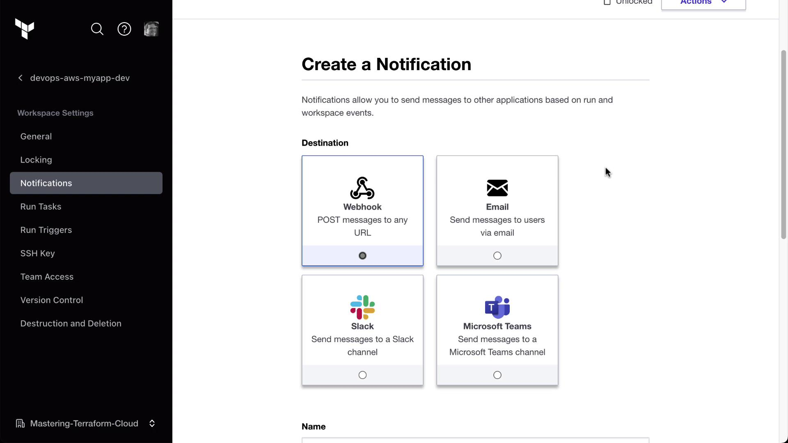
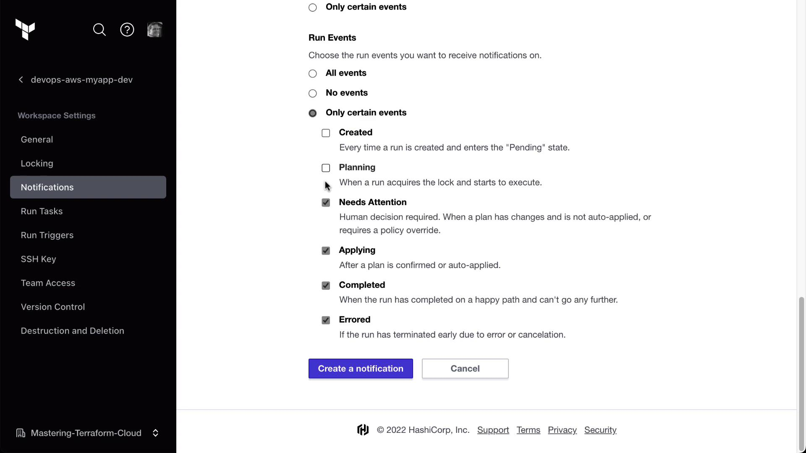
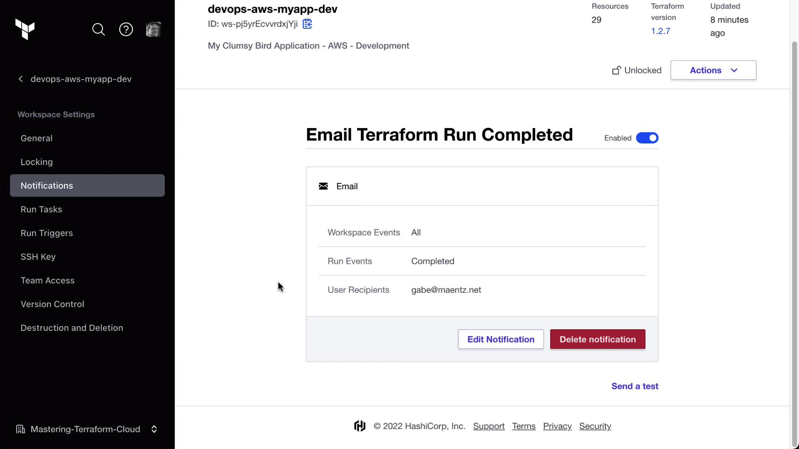
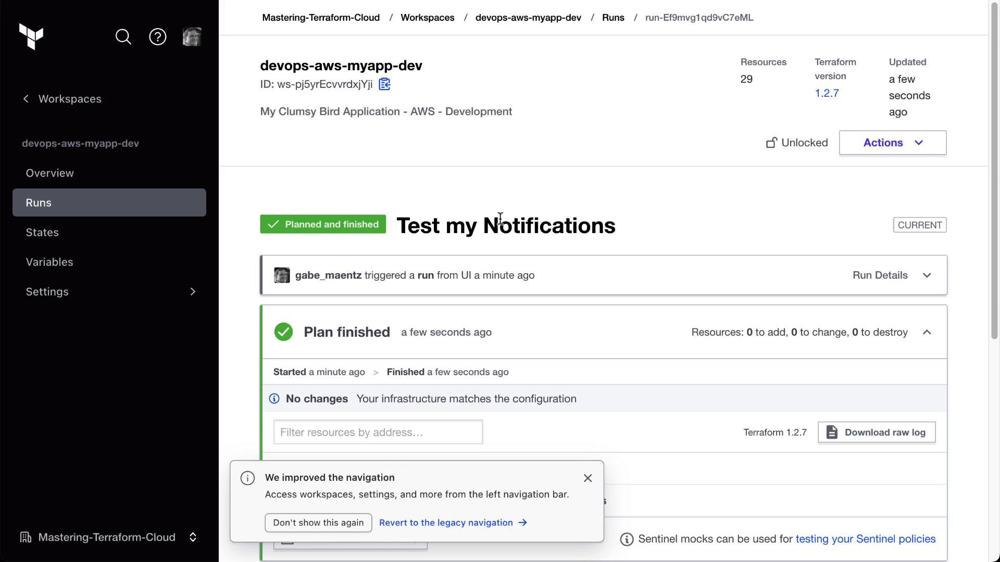

# tfe_workspace.new will be created
resource "tfe_workspace" "new" {
  name              = "webserver-aws-stage"
  organization      = "YOUR-ORG"
  terraform_version = (known after apply)
}
Plan: 1 to add, 0 to change, 0 to destroy.
```

After successful apply, verify the new workspace in Terraform Cloud.

<Frame>
  
</Frame>

***

## 4. Manage Workspace Variables

Use `tfe_variable` resources to define standard, sensitive, and HCL variables:

```terraform theme={null}
resource "tfe_variable" "standard" {
  key          = "variable_name"
  value        = "variable_value"
  category     = "terraform"
  workspace_id = tfe_workspace.new.id
  description  = "A standard variable"
}

resource "tfe_variable" "sensitive" {
  key          = "my_variable_sensitive"
  value        = "my_sensitive_value"
  category     = "terraform"
  workspace_id = tfe_workspace.new.id
  sensitive    = true
}

resource "tfe_variable" "hcl" {
  key          = "my_variable_hcl"
  value        = "[hcl_variable_value]"
  category     = "terraform"
  workspace_id = tfe_workspace.new.id
  description  = "An HCL variable example"
}
```

Apply the changes:

```bash theme={null}
terraform apply \
  -var "organization=YOUR-ORG" \
  -var "workspace_name_new=webserver-aws-stage"
```

Confirm in the Terraform Cloud UI under **Variables** that all variables appear correctly.

<Frame>
  
</Frame>

***

## 5. Specify Terraform Version per Workspace

Control the Terraform version used by the workspace:

```terraform theme={null}
variable "tf_version" {
  type    = string
  default = "1.2.7"
}

resource "tfe_workspace" "new" {
  name              = var.workspace_name_new
  organization      = var.organization
  terraform_version = var.tf_version
}
```

Reapply:

```bash theme={null}
terraform apply \
  -var "organization=YOUR-ORG" \
  -var "workspace_name_new=webserver-aws-stage"
```

Verify the Terraform version update in the workspace settings.

***

## 6. Dynamically Create Multiple Workspaces

Define apps and environments, then loop to create all combinations:

```terraform theme={null}
variable "apps" {
  description = "Map of applications with Terraform versions"
  type        = map(object({ terraform_version = string }))
  default     = {
    appA = { terraform_version = "1.2.7" }
    appB = { terraform_version = "1.2.8" }
  }
}

variable "environments" {
  description = "List of environments"
  type        = list(string)
  default     = ["sandbox", "development", "production"]
}

locals {
  app_envs = flatten([
    for app_key, app in var.apps : [
      for env in var.environments : {
        name              = "${app_key}-${env}"
        terraform_version = app.terraform_version
      }
    ]
  ])
}

resource "tfe_workspace" "all" {
  for_each          = { for env in local.app_envs : env.name => env }
  name              = each.value.name
  organization      = var.organization
  terraform_version = each.value.terraform_version
}
```

Apply all at once:

```bash theme={null}
terraform apply -var "organization=YOUR-ORG"
```

You’ll see six workspaces created (appA/appB × sandbox/development/production).

***

## 7. Assign Team Access to Workspaces

Ensure your TFC plan supports Teams & Governance. Create a `teams.tf`:

```terraform theme={null}
data "tfe_team" "classmates" {
  name         = "classmates"
  organization = var.organization
}

data "tfe_workspace_ids" "all" {
  names        = ["*"]
  organization = var.organization
}

resource "tfe_team_access" "classmates_all" {
  for_each     = toset(data.tfe_workspace_ids.all.ids)
  access       = "read"
  team_id      = data.tfe_team.classmates.id
  workspace_id = each.value
}
```

Apply:

```bash theme={null}
terraform apply -var "organization=YOUR-ORG"
```

Verify in the Terraform Cloud UI under **Organization → Teams → classmates** and in each workspace’s Team Access page.

<Frame>
  
</Frame>

Browse to any workspace’s Team Access settings to confirm the “classmates” team has **read** privileges.

<Frame>
  
</Frame>

***

## 8. Cleanup

When you’re done, destroy all created resources:

```bash theme={null}
terraform destroy \
  -var "organization=YOUR-ORG" \
  -var "workspace_name=devops-aws-myapp-dev" \
  -var "workspace_name_new=webserver-aws-stage"
```

***

## Resource Overview

| Resource Type     | Description                                        | Terraform Block        |
| ----------------- | -------------------------------------------------- | ---------------------- |
| tfe\_workspace    | Manages Terraform Cloud workspaces                 | resource / data source |
| tfe\_variable     | Defines workspace-level variables (sensitive, HCL) | resource               |
| tfe\_team\_access | Grants teams specific access to workspaces         | resource               |

***

## Links and References

* Terraform Cloud Provider Documentation: [https://registry.terraform.io/providers/hashicorp/tfe/latest](https://registry.terraform.io/providers/hashicorp/tfe/latest)
* Terraform Cloud UI Guide: [https://www.terraform.io/cloud-docs](https://www.terraform.io/cloud-docs)
* Terraform CLI Docs: [https://www.terraform.io/cli](https://www.terraform.io/cli)
* Terraform Cloud API: [https://www.terraform.io/cloud-docs/api](https://www.terraform.io/cloud-docs/api)

<CardGroup>
  <Card title="Watch Video" icon="video" href="https://learn.kodekloud.com/user/courses/hashicorp-terraform-cloud/module/f7d08e72-e35f-436f-8d42-d0d7364d2532/lesson/71408858-eb30-4c37-9dff-64ae9f8b27e1" />

  <Card title="Practice Lab" icon="installation" href="https://learn.kodekloud.com/user/courses/hashicorp-terraform-cloud/module/f7d08e72-e35f-436f-8d42-d0d7364d2532/lesson/b66b19a5-b488-4a90-af69-91ebe54a7a9b" />
</CardGroup>


# Lab Solution Notifications

Source: https://notes.kodekloud.com/docs/HashiCorp-Terraform-Cloud/Advanced-Topics/Lab-Solution-Notifications/page

This article explains how to configure notifications in Terraform Cloud for tracking workspace events through various platforms.

Terraform Cloud notifications let you track workspace events—such as runs completing, errors, or drift detection—in real time. By integrating email, Slack, Microsoft Teams, or generic webhooks, you can keep your team informed and responsive throughout the Terraform workflow.

## Step 1: Enable Workspace Notifications

1. Log in to Terraform Cloud and select the **DevOps AWS MyApp Dev** workspace.
2. Navigate to **Settings > Notifications**.

<Frame>
  
</Frame>

If this workspace has no notifications configured, the list will be empty:

<Frame>
  
</Frame>

Click **Create notification** to begin.

## Step 2: Create an Email Notification

Terraform Cloud supports four notification destinations:

* Email
* Slack
* Microsoft Teams
* Generic Webhook

<Frame>
  
</Frame>

### 2.1 Configure Email Settings

1. Select **Email** as the destination.
2. Enter **Terraform run completed** as the notification name.
3. From **Recipient**, choose your Terraform Cloud login email.
4. Under **Events**, uncheck **All events**, then select only **Completed**.

<Frame>
  
</Frame>

Click **Create notification**. You will see the new email alert listed and enabled:

<Frame>
  
</Frame>

<Callout icon="lightbulb">
  Use the **Send test** link next to any notification to verify delivery before you rely on real run events.
</Callout>

## Step 3: Test and Trigger a Terraform Run

1. Click **Send test** on your email notification.
2. Check your inbox for a message titled **Terraform run completed**—it should include workspace details and a test-run ID.

Next, trigger an actual Terraform run:

```bash theme={null}
terraform apply
```

Once the run finishes, you’ll receive a live email with a direct link to the run details in your **DevOps AWS MyApp Dev** workspace:

<Frame>
  
</Frame>

## Additional Notification Destinations

You can extend alerts to other platforms:

| Destination     | Description                                     | Setup Method                        |
| --------------- | ----------------------------------------------- | ----------------------------------- |
| Email           | Direct inbox alerts for run lifecycle events    | Workspace UI > Notifications        |
| Slack           | Post events to any channel via incoming webhook | Provide Slack Webhook URL           |
| Microsoft Teams | Send updates into a Teams channel connector     | Configure Teams incoming webhook    |
| Generic Webhook | Forward payloads to custom HTTP endpoints       | Enter target URL and authentication |

<Callout icon="triangle-alert">
  Ensure your webhook endpoints are publicly reachable, and secure them with authentication or IP allowlists to prevent unauthorized requests.
</Callout>

You can also subscribe to **health events** (for drift detection) or additional run statuses like **Errored** and **Needs Attention**. Tailor notifications to align with your team’s monitoring and incident response processes.

## References

* [Terraform Cloud Notifications Guide](https://www.terraform.io/docs/cloud/notifications/index.html)
* [Terraform Cloud API Overview](https://www.terraform.io/docs/cloud/api/index.html)
* [Incoming Webhooks for Slack](https://api.slack.com/messaging/webhooks)
* [Microsoft Teams Incoming Webhook Connectors](https://docs.microsoft.com/microsoftteams/platform/webhooks-and-connectors/how-to/add-incoming-webhook)

<CardGroup>
  <Card title="Watch Video" icon="video" href="https://learn.kodekloud.com/user/courses/hashicorp-terraform-cloud/module/f7d08e72-e35f-436f-8d42-d0d7364d2532/lesson/ffccfca0-a574-41b6-82f5-cc1d6683c083" />
</CardGroup>
