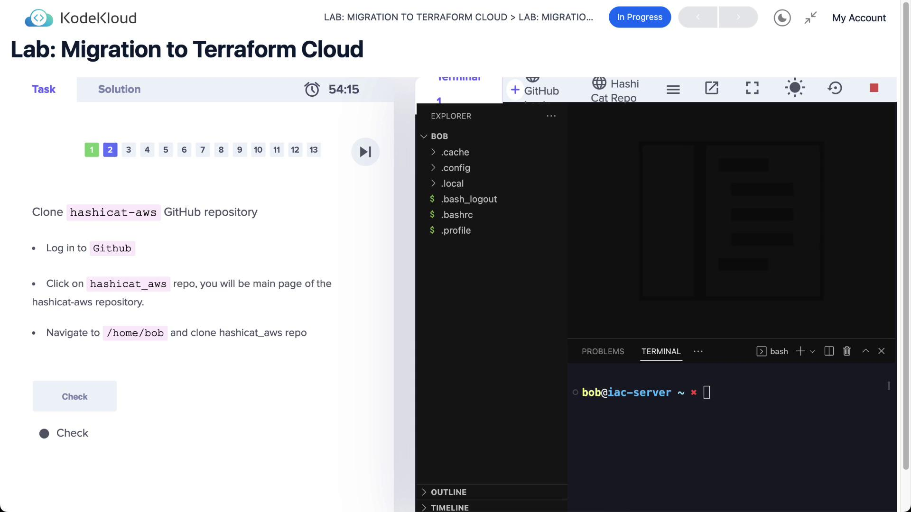
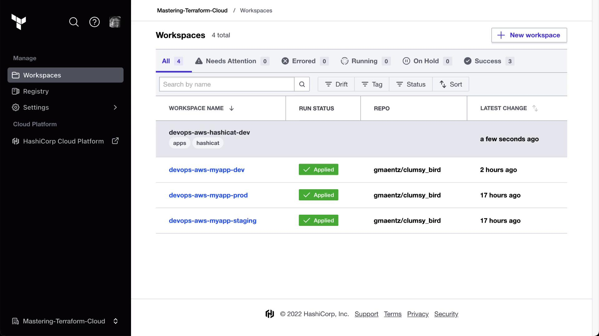
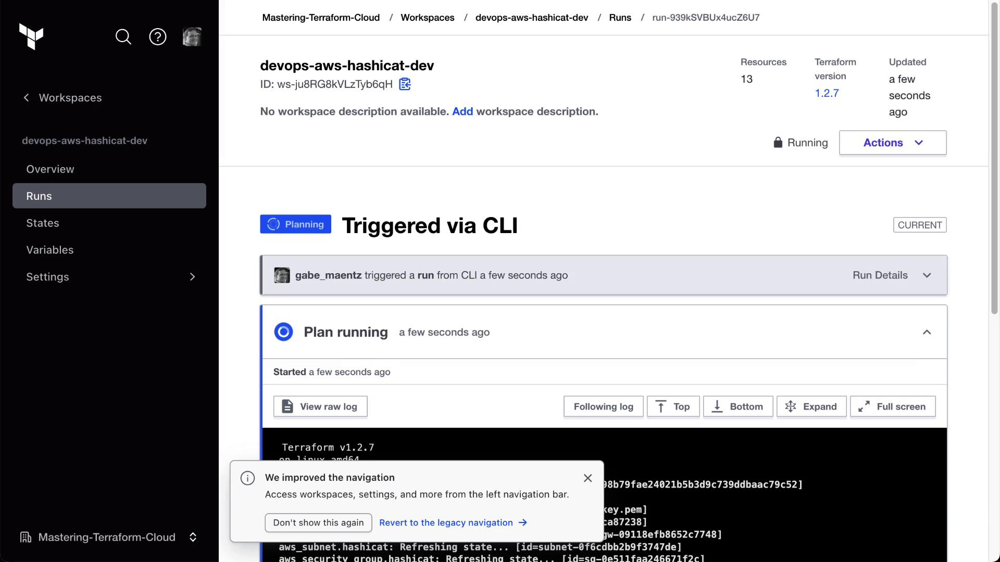

# Lab Solution Migration to Terraform Cloud

Source: https://notes.kodekloud.com/docs/HashiCorp-Terraform-Cloud/Migrating-to-Terraform-Cloud/Lab-Solution-Migration-to-Terraform-Cloud/page

This guide walks you through migrating your existing Terraform OSS setup to Terraform Cloud without destroying your current AWS infrastructure.

Many teams begin with Terraform Open Source (OSS) on their local machines before transitioning to Terraform Cloud for enhanced collaboration, state management, and run governance. This guide walks you through migrating your existing Terraform OSS setup to Terraform Cloud **without destroying your current AWS infrastructure**.

## Table of Contents

1. [Prerequisites](#prerequisites)
2. [Clone and Apply Locally](#clone-and-apply-locally)
3. [Configure Terraform Cloud Backend](#configure-terraform-cloud-backend)
4. [Initialize and Migrate State](#initialize-and-migrate-state)
5. [Trigger Runs via CLI](#trigger-runs-via-cli)
6. [Comparison: OSS vs. Cloud](#comparison-oss-vs-cloud)
7. [References](#references)

***

## Prerequisites

* Terraform OSS installed (v1.0+).
* AWS CLI configured or valid AWS credentials.
* A Terraform Cloud account and organization.
* Git installed.

<Callout icon="triangle-alert">
  Never commit your AWS credentials or Terraform Cloud API tokens to version control. Use environment variables or a secrets manager.
</Callout>

***

## Clone and Apply Locally

First, clone the HashiCat AWS repository and navigate into it:

<Frame>
  
</Frame>

```bash theme={null}
git clone https://github.com/hashicorp/hashicat-aws.git
cd hashicat-aws
```

Set your AWS credentials using environment variables:

```bash theme={null}
export AWS_ACCESS_KEY_ID=<YOUR_ACCESS_KEY_ID>
export AWS_SECRET_ACCESS_KEY=<YOUR_SECRET_ACCESS_KEY>
```

Inspect the existing Terraform configuration in `main.tf`:

```hcl theme={null}
terraform {
  required_providers {
    aws = {
      source  = "hashicorp/aws"
      version = "~> 3.42.0"
    }
  }
}

provider "aws" {}
```

Initialize the working directory and apply:

```bash theme={null}
terraform init
terraform apply -auto-approve
```

You should see output similar to:

```bash theme={null}
Plan: 12 to add, 0 to change, 0 to destroy.
Apply complete! Resources: 12 added, 0 changed, 0 destroyed.
Outputs:
  catapp_ip  = "http://3.236.1.255"
  catapp_url = "http://ec2-3-236-1-255.compute-1.amazonaws.com"
```

Your AWS infrastructure is now managed locally by Terraform OSS.

***

## Configure Terraform Cloud Backend

To migrate state to Terraform Cloud, update `main.tf` with a `cloud` block:

```hcl theme={null}
terraform {
  cloud {
    organization = "YOUR_ORGANIZATION_NAME"

    workspaces {
      tags = ["hashicat", "apps"]
    }
  }

  required_providers {
    aws = {
      source  = "hashicorp/aws"
      version = "~> 3.42.0"
    }
  }
}

provider "aws" {}
```

Log in to Terraform Cloud via the CLI:

```bash theme={null}
terraform login
```

This command prompts you to authorize Terraform Cloud access and stores your API token in `~/.terraform.d/credentials.tfrc.json`.

***

## Initialize and Migrate State

Reinitialize your directory so Terraform switches the backend to Terraform Cloud:

```bash theme={null}
terraform init
```

On success, you’ll see:

```bash theme={null}
Terraform has been successfully initialized with Terraform Cloud backend!
```

Now, run a plan and apply. Terraform will handle state migration automatically:

```bash theme={null}
terraform plan
terraform apply -auto-approve
```

Once complete, your state is stored remotely in Terraform Cloud. You can manage runs, view logs, and set policies from the Terraform Cloud UI:

<Frame>
  
</Frame>

***

## Trigger Runs via CLI

To explicitly specify a workspace name, update your `cloud` block:

```hcl theme={null}
terraform {
  cloud {
    organization = "YOUR_ORGANIZATION_NAME"

    workspaces {
      name = "devops-aws-hashicat-dev"
    }
  }
}
```

Commit and push these changes to your version control system (if connected). Or, trigger the run directly:

```bash theme={null}
terraform apply -auto-approve
```

CLI output will indicate a remote run:

```bash theme={null}
Running apply in Terraform Cloud. Output will stream here. Press Ctrl+C to cancel.

Preparing the remote apply...
To view this run in a browser, visit:
https://app.terraform.io/app/YOUR_ORGANIZATION_NAME/devops-aws-hashicat-dev/runs/<RUN_ID>
```

<Frame>
  
</Frame>

Upon completion, your Terraform Cloud workspace will reflect the latest state, and your AWS infrastructure remains intact throughout the migration.

***

## Comparison: Terraform OSS vs. Terraform Cloud

| Feature          | Terraform OSS     | Terraform Cloud                        |
| ---------------- | ----------------- | -------------------------------------- |
| State Management | Local file        | Remote, centralized                    |
| Collaboration    | Manual sharing    | Teams & Policy Controls                |
| Run Execution    | Local CLI         | Remote plan & apply                    |
| Drift Detection  | Manual            | Automated checks & notifications       |
| Cost Estimation  | Third-party tools | Built-in preview in runs               |
| VCS Integration  | Plugins/scripts   | Native GitHub/Bitbucket/GitLab support |

***

## References

* [Terraform Cloud Documentation](https://www.terraform.io/cloud)
* [HashiCorp GitHub: hashicat-aws](https://github.com/hashicorp/hashicat-aws)
* [Kubernetes Basics](https://kubernetes.io/docs/concepts/overview/what-is-kubernetes/)
* [AWS Provider for Terraform](https://registry.terraform.io/providers/hashicorp/aws)

<CardGroup>
  <Card title="Watch Video" icon="video" href="https://learn.kodekloud.com/user/courses/hashicorp-terraform-cloud/module/3b42de3b-671c-45be-9757-aff04c4af092/lesson/743bc98e-64ef-4246-ab87-a3c3018c5ab4" />

  <Card title="Practice Lab" icon="installation" href="https://learn.kodekloud.com/user/courses/hashicorp-terraform-cloud/module/617ad513-215b-4e40-9b66-1cdb4eacc424/lesson/d77b49a8-dff9-4b6f-b1d8-488bcc1d8523" />
</CardGroup>
