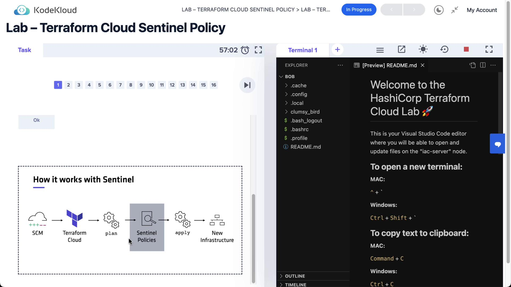
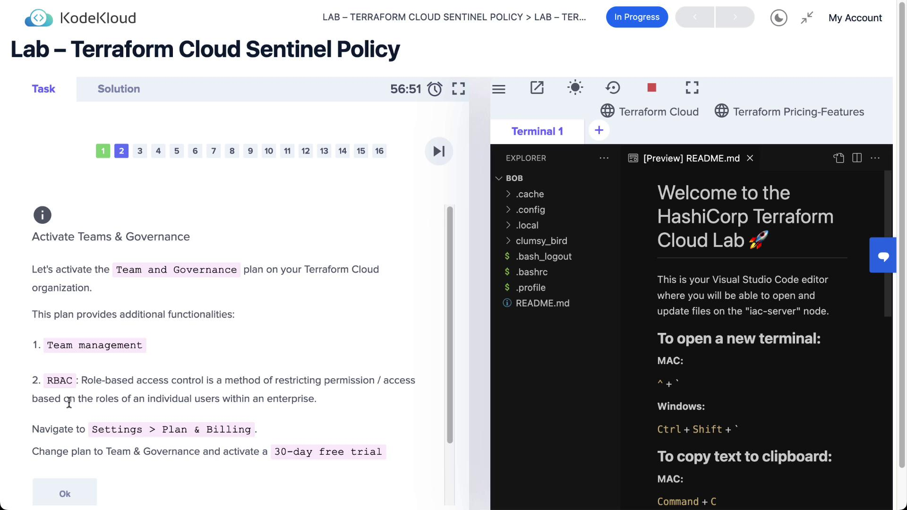
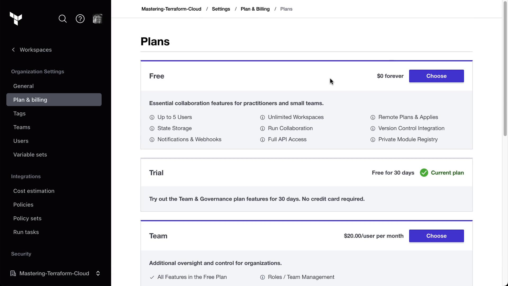
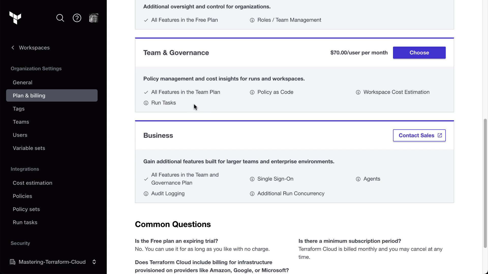
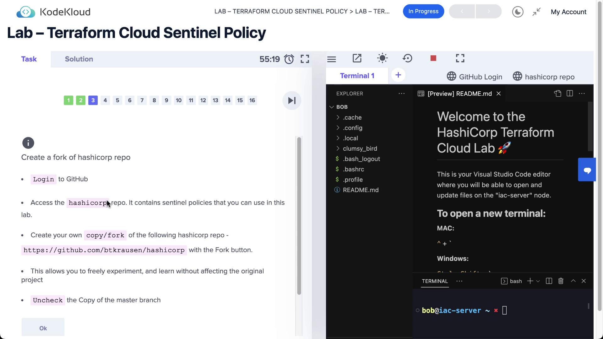

# Lab Solution Terraform Cloud Sentinel Policy

Source: https://notes.kodekloud.com/docs/HashiCorp-Terraform-Cloud/Policy-as-Code-Sentinel-and-OPA/Lab-Solution-Terraform-Cloud-Sentinel-Policy/page

This guide covers implementing Policy as Code in Terraform Cloud using Sentinel to enforce organizational policies for infrastructure compliance.

In this lab, we’ll implement **Policy as Code** in Terraform Cloud with **Sentinel**. Sentinel enforces organizational policies between the `terraform plan` and `terraform apply` stages, ensuring your infrastructure remains compliant before changes are applied.

<Frame>
  
</Frame>

## Prerequisites: Teams & Governance Tier

Sentinel policies require the **Teams & Governance** tier in Terraform Cloud. In **Settings → Plan & Billing**, activate your free trial or subscription for this tier to unlock Policy as Code, cost estimation, and run tasks.

<Callout icon="lightbulb">
  You must have an active Teams & Governance plan in Terraform Cloud before you can enforce Sentinel policies.
</Callout>

<Frame>
  
</Frame>

In **Plan & Billing** you’ll see your current plan:

<Frame>
  
</Frame>

The Teams & Governance tier includes all Team features plus Policy as Code and additional run capabilities:

<Frame>
  
</Frame>

## Fork the Sentinel Policy Repository

Start by forking the HashiCorp Sentinel policy repository into your GitHub account. This gives you a local copy to customize and connect to Terraform Cloud.

<Frame>
  
</Frame>

## Review Sentinel Policies

Below are two example policies from the repository.

### 1. Enforce Mandatory Tags

This policy uses the `tfplan-functions` import to require that every AWS EC2 instance in the plan has a `Name` tag. The `main` rule fails if any instance is missing this tag.

```sentinel theme={null}
import "tfplan-functions" as plan
