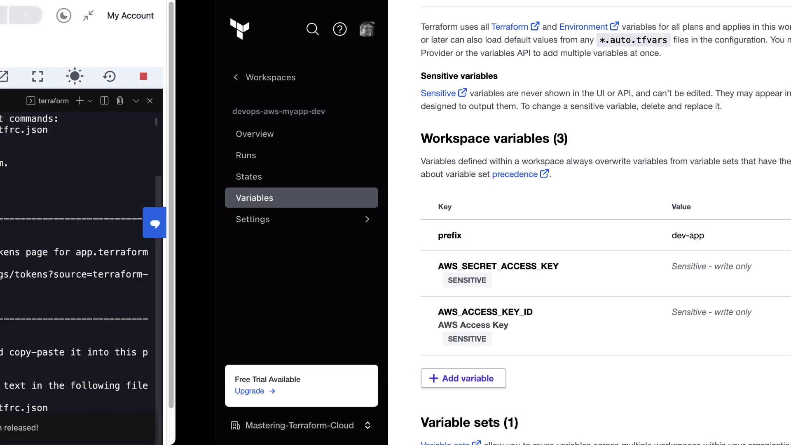
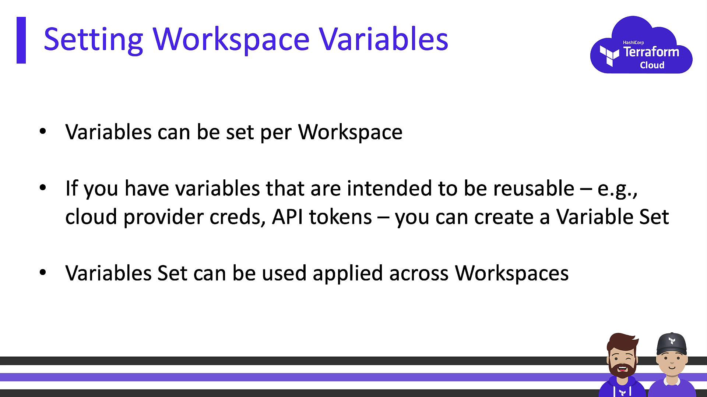

# Authenticate with Terraform Cloud
terraform login

# Initialize the workspace configuration
terraform init
```

After initialization, your local CLI sessions will execute Terraform runs in the Cloud backend.

<Frame>
  
</Frame>

***

## Variable Precedence & Overrides

By default, workspace-level variables override those from organizational sets.

<Callout icon="lightbulb">
  Order of precedence (highest → lowest):

  1. CLI `-var` flags
  2. Workspace-level variables
  3. Organizational variable sets
  4. Terraform defaults
</Callout>

### Overriding at the Workspace UI

1. Open **Settings → Variables** in your workspace.
2. Add `prefix` as an environment variable:
   * **Key**: `prefix`
   * **Value**: `dev-app`
3. Save changes.

### Overriding via CLI at Runtime

```bash theme={null}
terraform plan -var="prefix=dev-app"
```

Example output:

```plaintext theme={null}
Plan: 23 to add, 0 to change, 0 to destroy.

Changes to Outputs:
  ~ clumsy-bird-ip  = "http://54.235.109.203:8001" -> (known after apply)
  ~ clumsy-bird-url = "http://ec2-54-235-109-203.compute-1.amazonaws.com:8001" -> (known after apply)
```

***

## Conclusion

You have now:

* Configured AWS credentials at the workspace level.
* Created and applied an organizational variable set.
* Connected your local CLI to Terraform Cloud.
* Explored variable precedence and override methods.

This setup balances security (by marking secrets sensitive) and flexibility (via overrides), ensuring consistent credential management across environments.

***

## References

* [Terraform Cloud Variables](https://www.terraform.io/cloud-docs/workspaces/variables)
* [Terraform CLI Documentation](https://www.terraform.io/cli)
* [AWS Provider Configuration](https://registry.terraform.io/providers/hashicorp/aws/latest/docs)

<CardGroup>
  <Card title="Watch Video" icon="video" href="https://learn.kodekloud.com/user/courses/hashicorp-terraform-cloud/module/253ba638-af3c-4403-a517-a7f6f7c7594c/lesson/a6c1aa87-edd4-4a5a-ac63-63b95b48b2e5" />
</CardGroup>


# Terraform Cloud Variables

Source: https://notes.kodekloud.com/docs/HashiCorp-Terraform-Cloud/Securing-Variables-with-Terraform-Cloud/Terraform-Cloud-Variables/page

This article explains how to use Terraform Cloud variables for managing infrastructure code securely and efficiently.

Terraform variables in HashiCorp Configuration Language (HCL) let you parameterize your infrastructure code without changing module source files. By centralizing values in Terraform Cloud workspaces, you can:

* Keep secrets out of version control
* Reuse the same configurations across environments
* Simplify CI/CD with remote execution

<Callout icon="triangle-alert">
  Never commit sensitive data (API keys, credentials, or tokens) directly in your `.tf` files. Always mark secrets as *Sensitive* in Terraform Cloud.
</Callout>

## Workspace Variables vs. Organization Variable Sets

Terraform Cloud offers two scopes for storing variable values:

| Variable Scope             | Defined At         | Sensitivity Support | Applies To          | Typical Use Case              |
| -------------------------- | ------------------ | ------------------- | ------------------- | ----------------------------- |
| Workspace Variables        | Single workspace   | Yes                 | One workspace only  | AWS credentials, DB passwords |
| Organization Variable Sets | Organization level | Yes                 | Multiple workspaces | Shared cloud provider tokens  |

<Frame>
  
</Frame>

### Workspace Variables

* Scoped to an individual workspace.
* Can be flagged **Sensitive** to hide in UI, CLI output, and logs.
* Ideal for per-environment secrets like `aws_access_key_id`.

### Organization Variable Sets

* Defined at the organization level for reuse.
* Supports both Terraform input variables and environment variables.
* Workspaces must opt in to inherit the set.
* Perfect for credentials or settings shared by multiple projects.

## Input Variables vs. Environment Variables

Terraform Cloud recognizes two types of variables:

| Variable Type            | Reference in HCL | Common Examples                              |
| ------------------------ | ---------------- | -------------------------------------------- |
| Terraform Input Variable | `var.<name>`     | `var.subscription_id`, `var.db_connection`   |
| Environment Variable     | `<NAME>` env var | `AWS_ACCESS_KEY_ID`, `TF_LOG`, `GOOGLE_CRED` |

All variables can be marked **Sensitive** to prevent exposure in logs or the web UI. Terraform also supports HCL types like `string`, `number`, `list`, and `map`.

## Setting Variables Locally

Even with remote execution, you can still supply values from your workstation:

```bash theme={null}
