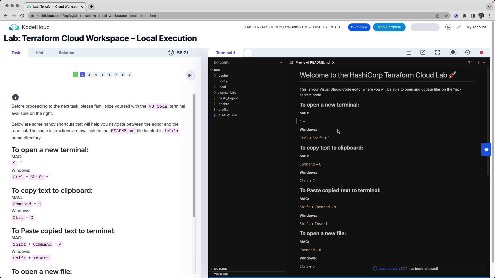
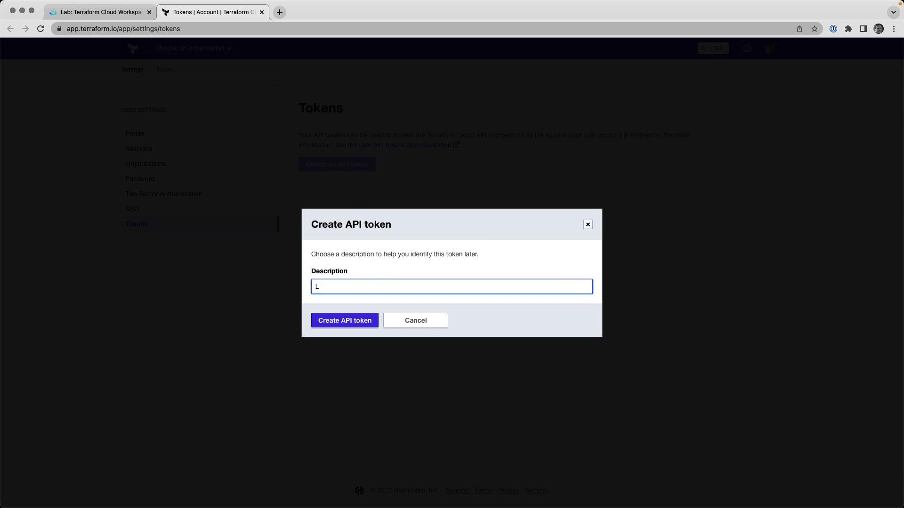
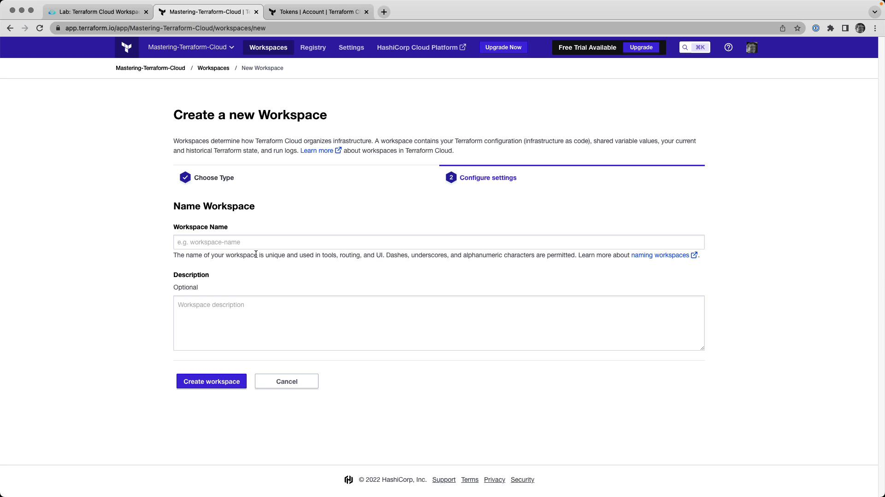
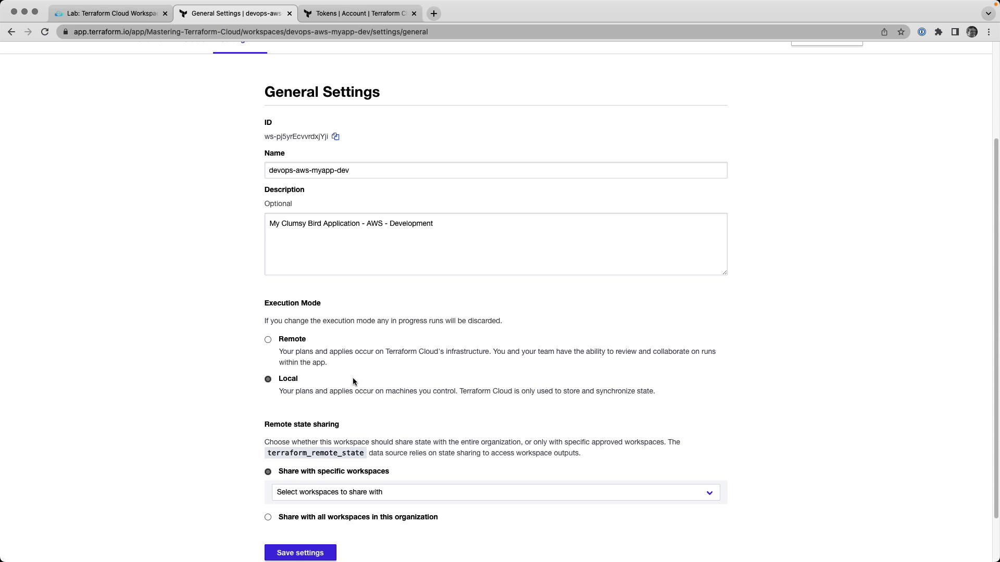

# Lab Solution Local Execution

Source: https://notes.kodekloud.com/docs/HashiCorp-Terraform-Cloud/Terraform-Cloud-Workspaces/Lab-Solution-Local-Execution/page

This guide covers configuring and running Terraform Cloud Workspaces in local execution mode from your local machine.

In this guide, we’ll walk through configuring and running Terraform Cloud Workspaces using **local execution mode**. Follow each step to authenticate, set up AWS credentials, create your workspace, and manage your infrastructure—all from your local machine.

<Frame>
  
</Frame>

## Table of Contents

1. [Authenticate the CLI with Terraform Cloud](#1-authenticate-the-cli-with-terraform-cloud)
2. [Configure AWS Credentials](#2-configure-aws-credentials)
3. [Create a Terraform Cloud Workspace](#3-create-a-terraform-cloud-workspace)
4. [Match Versions & Set Execution Mode](#4-match-versions--set-execution-mode)
5. [Initialize, Plan, and Apply](#5-initialize-plan-and-apply)
6. [Verify in Terraform Cloud](#6-verify-in-terraform-cloud)
7. [Tear Down Infrastructure](#7-tear-down-infrastructure)

***

## 1. Authenticate the CLI with Terraform Cloud

First, log in to Terraform Cloud from your terminal:

```bash theme={null}
terraform login
```

Follow the on-screen prompts to generate a new API token.

<Frame>
  
</Frame>

When prompted, paste your API token into the terminal. Successful authentication will display your user ID and a confirmation message.

| Command           | Description                                      |
| ----------------- | ------------------------------------------------ |
| `terraform login` | Authenticate your local CLI with Terraform Cloud |

## 2. Configure AWS Credentials

Export your AWS credentials as environment variables:

```bash theme={null}
export AWS_ACCESS_KEY_ID=YOUR_AWS_ACCESS_KEY_ID
export AWS_SECRET_ACCESS_KEY=YOUR_AWS_SECRET_ACCESS_KEY
```

<Callout icon="triangle-alert">
  Never commit your AWS credentials or API tokens to version control. Use environment variables or a secrets manager.
</Callout>

<Callout icon="lightbulb">
  These lab environments automatically tear down after one hour, so your temporary credentials remain safe.
</Callout>

| Environment Variable    | Purpose            |
| ----------------------- | ------------------ |
| `AWS_ACCESS_KEY_ID`     | AWS API access key |
| `AWS_SECRET_ACCESS_KEY` | AWS API secret key |

## 3. Create a Terraform Cloud Workspace

In Terraform Cloud’s web UI:

1. Select your organization.
2. Click **New Workspace → CLI-driven workflow**.
3. Enter:
   * **Name**: `devops-aws-myapp-dev`
   * **Description**: Development environment for MyApp on AWS.

<Frame>
  
</Frame>

Add the following backend configuration to `backend.tf` (or your chosen `.tf` file):

```hcl theme={null}
terraform {
  cloud {
    organization = "Mastering-Terraform-Cloud"
    workspaces {
      name = "devops-aws-myapp-dev"
    }
  }
}
```

## 4. Match Versions & Set Execution Mode

Ensure your local Terraform version matches the workspace setting:

```bash theme={null}
terraform version
```

In Terraform Cloud’s UI, go to **Workspace → Settings → General**, then:

* Set **Terraform Version** to match your local client.
* Change **Execution Mode** to **Local**.
* Save your changes.

<Frame>
  
</Frame>

## 5. Initialize, Plan, and Apply

Initialize your local directory and review the execution plan:

```bash theme={null}
terraform init
terraform plan
```

Expected plan output:

```hcl theme={null}
Plan: 23 to add, 0 to change, 0 to destroy.

Changes to Outputs:
  + clumsy-bird-ip  = (known after apply)
  + clumsy-bird-url = (known after apply)
```

Apply your configuration:

```bash theme={null}
terraform apply -auto-approve
```

Sample apply summary:

```bash theme={null}
Apply complete! Resources: 23 added, 0 changed, 0 destroyed.

Outputs:
  clumsy-bird-ip  = "http://18.214.74.214:8001"
  clumsy-bird-url = "http://ec2-18-214-74-214.compute-1.amazonaws.com:8001"
```

## 6. Verify in Terraform Cloud

Navigate to **Workspace → Runs** and inspect the latest run. You’ll see resource details and outputs:

```json theme={null}
{
  "outputs": {
    "clumsy-bird-ip": {
      "value": "http://18.214.74.214:8001",
      "type": "string"
    },
    "clumsy-bird-url": {
      "value": "http://ec2-18-214-74-214.compute-1.amazonaws.com:8001",
      "type": "string"
    }
  },
  "resources": [
    {
      "mode": "data",
      "type": "aws_ami",
      "name": "ubuntu",
      "provider": "provider.terraform.io/hashicorp/aws"
    }
  ]
}
```

## 7. Tear Down Infrastructure

When testing is complete, destroy all resources:

```bash theme={null}
terraform destroy -auto-approve
```

Confirm the teardown:

```bash theme={null}
Plan: 0 to add, 0 to change, 23 to destroy.
Do you really want to destroy all resources in workspace "devops-aws-myapp-dev"? ... yes ...
Apply complete! Resources: 0 added, 0 changed, 23 destroyed.
```

***

## Links and References

* [Terraform Cloud CLI-Driven Workflow](https://www.terraform.io/cloud/workspaces/cli-driven)
* [Terraform Documentation](https://www.terraform.io/docs)
* [AWS Credentials Configuration](https://docs.aws.amazon.com/cli/latest/userguide/cli-configure-envvars.html)

<CardGroup>
  <Card title="Watch Video" icon="video" href="https://learn.kodekloud.com/user/courses/hashicorp-terraform-cloud/module/69fc91b2-bf0f-4922-831c-2aee42d19b03/lesson/0a6ef325-dc19-4050-904b-ced34b6433ab" />

  <Card title="Practice Lab" icon="installation" href="https://learn.kodekloud.com/user/courses/hashicorp-terraform-cloud/module/69fc91b2-bf0f-4922-831c-2aee42d19b03/lesson/64c307ef-f6e0-463f-8a40-352fd04b3bd4" />
</CardGroup>
