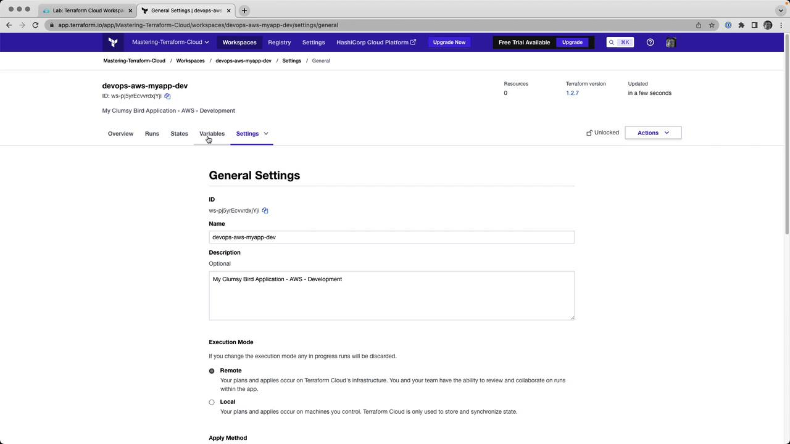
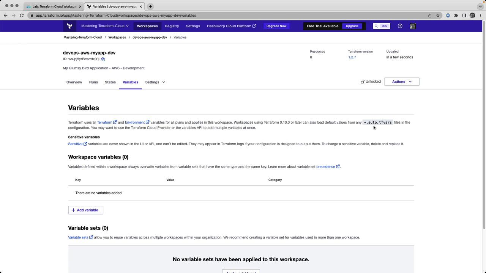
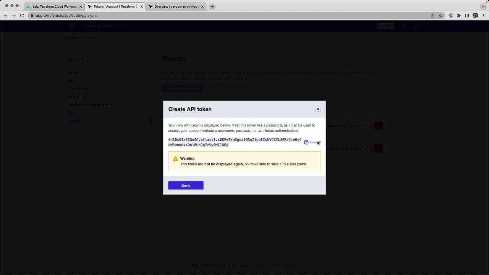
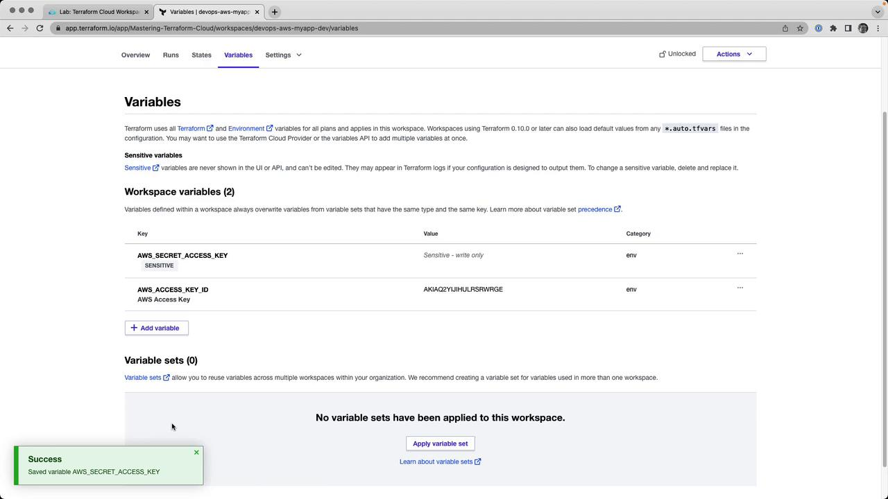
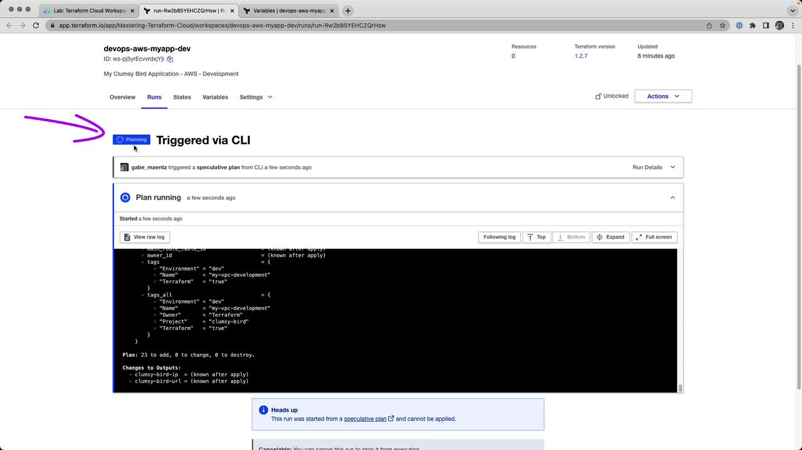
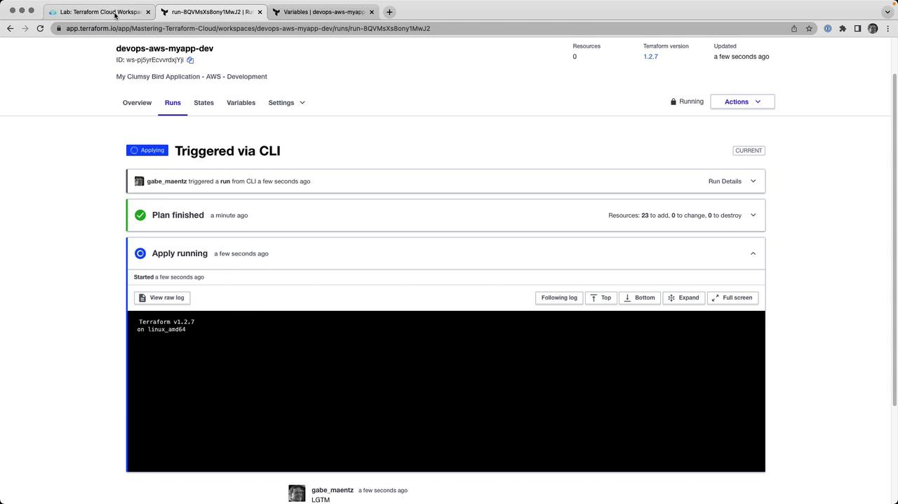

# Lab Solution Remote Execution

Source: https://notes.kodekloud.com/docs/HashiCorp-Terraform-Cloud/Terraform-Cloud-Workspaces/Lab-Solution-Remote-Execution/page

This guide explains how to convert a Terraform Cloud workspace from local to remote execution while managing AWS credentials securely.

In this guide, we’ll convert an existing Terraform Cloud workspace (`devops-aws-myapp-dev`) from local to remote execution. You’ll learn how to rename variable files, configure the remote backend, authenticate, and manage runs in Terraform Cloud—all while securely handling AWS credentials.

## 1. Log in and Select Your Workspace

1. Navigate to [https://app.terraform.io/](https://app.terraform.io/) and log in.
2. Choose your organization **Mastering-Terraform-Cloud**.
3. Under **Workspaces**, click **devops-aws-myapp-dev**.

<Frame>
  
</Frame>

## 2. Enable Remote Execution

1. Go to **Settings** → **General**.
2. Change **Execution Mode** from **Local** to **Remote**.
3. Click **Save settings**.

<Frame>
  
</Frame>

## 3. Rename Your Variables File

Terraform Cloud automatically loads any file ending in `.auto.tfvars`. Rename your local `terraform.tfvars` to:

```bash theme={null}
mv terraform.tfvars terraform.auto.tfvars
```

Example contents of `terraform.auto.tfvars`:

```hcl theme={null}
prefix        = "app"
project       = "clumsy-bird"
environment   = "development"
instance_type = "t2.micro"
```

<Callout icon="lightbulb">
  Files with the `*.auto.tfvars` suffix are auto-loaded by Terraform Cloud—no manual variable uploads required.
</Callout>

<Frame>
  
</Frame>

## 4. Configure the Remote Backend

In your Terraform configuration (e.g., `backend.tf`), point to your Terraform Cloud organization and workspace:

```hcl theme={null}
terraform {
  cloud {
    organization = "Mastering-Terraform-Cloud"

    workspaces {
      name = "devops-aws-myapp-dev"
    }
  }
}
```

## 5. Authenticate with Terraform Cloud

Run the login command to link your CLI to Terraform Cloud:

```bash theme={null}
terraform login
```

When prompted, paste your API token. Generate or copy it from **User Settings** → **Tokens** in the web UI.

<Frame>
  
</Frame>

## 6. Initialize Terraform

Initialize the backend, providers, and modules. This will register your workspace with Terraform Cloud:

```bash theme={null}
terraform init
```

Example output:

```bash theme={null}
Initializing modules...
Downloading registry.terraform.io/terraform-aws-modules/vpc/aws 3.14.4 for vpc...
...
Terraform Cloud has been successfully initialized!
```

## 7. Set Environment Variables in the Workspace

In the Terraform Cloud UI, go to **Variables** and add:

| Variable Name            | Category    | Sensitive |
| ------------------------ | ----------- | --------- |
| AWS\_ACCESS\_KEY\_ID     | Environment | No        |
| AWS\_SECRET\_ACCESS\_KEY | Environment | Yes       |

<Callout icon="triangle-alert">
  Mark `AWS_SECRET_ACCESS_KEY` as **Sensitive** to prevent it from being exposed in logs or state files.
</Callout>

<Frame>
  
</Frame>

## 8. Run a Remote Plan

From your CLI, execute:

```bash theme={null}
terraform plan
```

The plan will run remotely in Terraform Cloud and stream logs back to your terminal:

```bash theme={null}
Running plan in Terraform Cloud. Output will stream here...
Preparing the remote plan...
To view this run in a browser, visit:
https://app.terraform.io/app/Mastering-Terraform-Cloud/devops-aws-myapp-dev/runs/run-HCZ7HSw
...
```

You can also watch progress in the UI:

<Frame>
  
</Frame>

At the end, you’ll see:

```hcl theme={null}
Plan: 23 to add, 0 to change, 0 to destroy.

Changes to Outputs:
  clumsy-bird-ip  = (known after apply)
  clumsy-bird-url = (known after apply)
```

## 9. Apply the Run

Approve and apply your plan:

* **CLI**:
  ```bash theme={null}
  terraform apply
  ```
  Type `yes` when prompted.

* **UI**: Click **Confirm & Apply** in the **Runs** tab.

<Frame>
  
</Frame>

Once complete, outputs appear:

```plaintext theme={null}
clumsy-bird-ip  = "http://50.16.35.225:8001"
clumsy-bird-url = "http://ec2-50-16-35-225.compute-1.amazonaws.com:8001"
```

## 10. Inspect State Versions

Terraform Cloud automatically versions your state. Under **States**, you can browse previous versions or view the latest state JSON:

```json theme={null}
{
  "version": 4,
  "terraform_version": "1.2.7",
  "serial": 2,
  "outputs": {
    "clumsy_bird_ip": {
      "value": "http://50.16.35.225:8001",
      "type": "string"
    },
    "clumsy_bird_url": {
      "value": "http://ec2-50-16-35-225.compute-1.amazonaws.com:8001",
      "type": "string"
    }
  },
  "resources": []
}
```

## 11. Teardown (Optional)

To destroy all resources managed by this workspace:

```bash theme={null}
terraform destroy
```

You can confirm via CLI or by clicking **Confirm & Apply** in the **Runs** tab of Terraform Cloud.

***

Congratulations! You’ve successfully switched your Terraform Cloud workspace to remote execution, centralized state and runs, and managed sensitive variables securely.

## Links and References

* [Terraform Cloud Remote Operations](https://www.terraform.io/cloud/run)
* [Terraform Cloud Workspaces](https://www.terraform.io/cloud/workspaces)
* [Managing Variables in Terraform Cloud](https://www.terraform.io/cloud/workspaces/variables)
* [AWS CLI Documentation](https://docs.aws.amazon.com/cli/latest/)

<CardGroup>
  <Card title="Watch Video" icon="video" href="https://learn.kodekloud.com/user/courses/hashicorp-terraform-cloud/module/69fc91b2-bf0f-4922-831c-2aee42d19b03/lesson/01418c27-6579-463f-b9da-d1d86fa4cd80" />

  <Card title="Practice Lab" icon="installation" href="https://learn.kodekloud.com/user/courses/hashicorp-terraform-cloud/module/69fc91b2-bf0f-4922-831c-2aee42d19b03/lesson/2c9247c7-1126-4bba-84ed-44b67fc0297d" />
</CardGroup>
