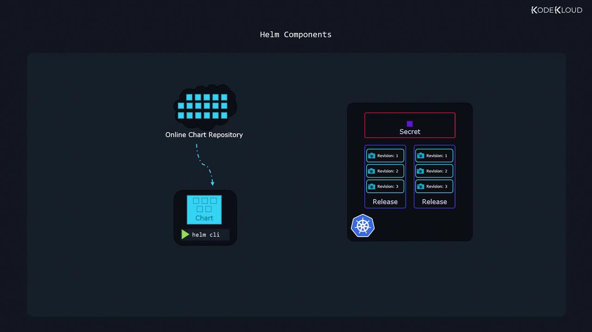

# Helm Components

Source: https://notes.kodekloud.com/docs/Helm-for-Beginners/Introduction-to-Helm/Helm-Components/page

This article explores Helms core components and their roles in streamlining application management within Kubernetes clusters.

In this article, we explore the core components of Helm and examine how they work together to streamline application management within a Kubernetes cluster. Helm simplifies tasks such as installing charts, performing upgrades, and rolling back changes by leveraging several key components: the Helm CLI, Charts, Releases, and metadata storage.

## Helm Key Components

1. **Helm CLI**\
   The Helm command-line utility runs on your local machine, enabling you to install charts, upgrade releases, and roll back changes, among other operations.

2. **Charts**\
   Charts are packages comprised of files that include all the instructions Helm needs to create the Kubernetes objects required by an application. They serve as reusable deployment packages and are available publicly from various repositories.

3. **Releases**\
   A release is created when a chart is deployed to your cluster. It represents a single installation of an application based on a Helm chart. Each time you perform an action—such as an upgrade or configuration change—a new revision (or snapshot) is generated, enabling independent management of multiple application versions.

4. **Metadata**\
   Helm stores release metadata, including chart details and revision history, as secrets within your Kubernetes cluster. This ensures that the deployment history remains accessible to everyone working on the cluster.

The diagram below illustrates the overall Helm architecture, showcasing how the Helm CLI interacts with chart repositories to create and manage releases within your Kubernetes environment:

<Frame>
  
</Frame>

## Helm Charts and Templating

Helm charts bundle not only Kubernetes manifest files but also powerful templating capabilities that support flexibility and customization. Consider a simple HelloWorld application running an Nginx web server. This application uses two primary Kubernetes objects—a Deployment and a Service. The deployment template uses templating to substitute values defined in a separate configuration file.

Below is an example of a basic Helm chart, organized into distinct files:

```yaml theme={null}
