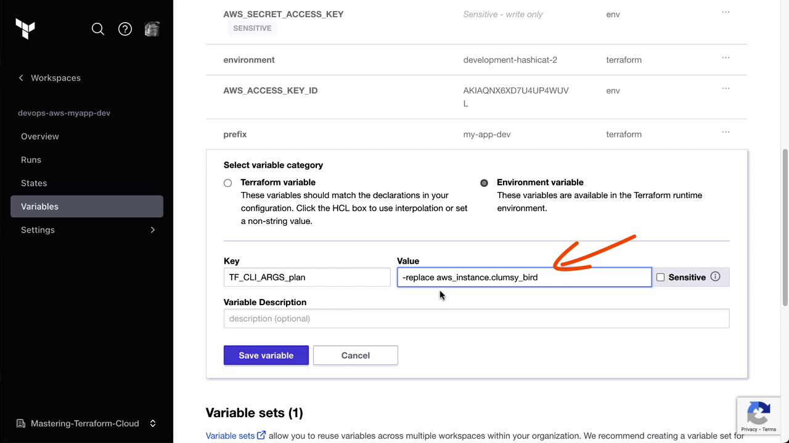
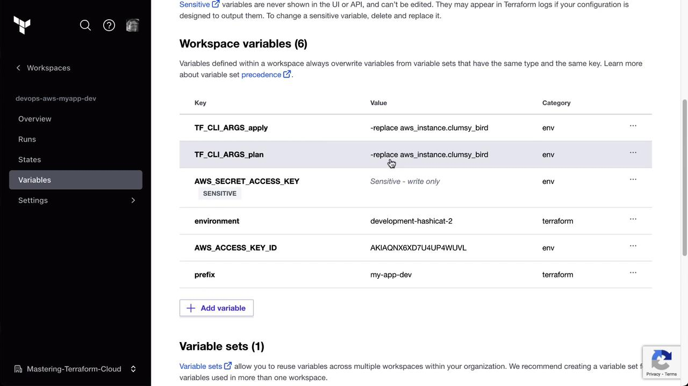
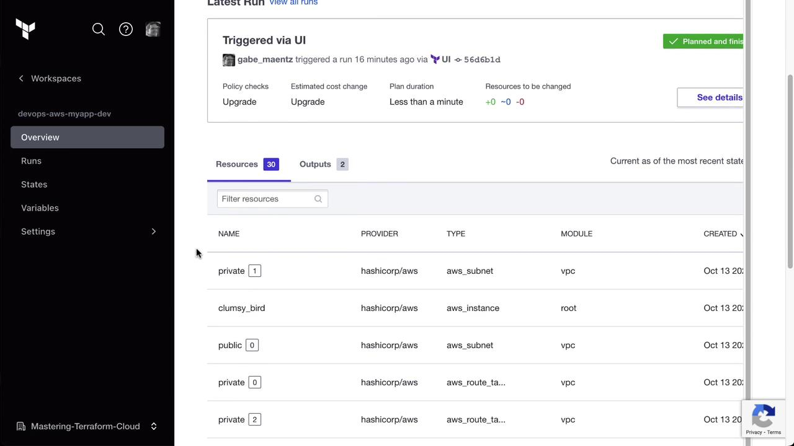
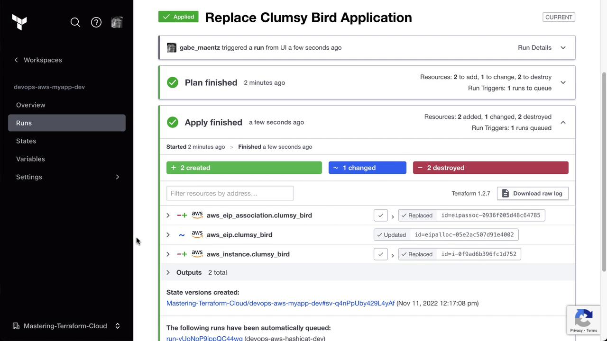
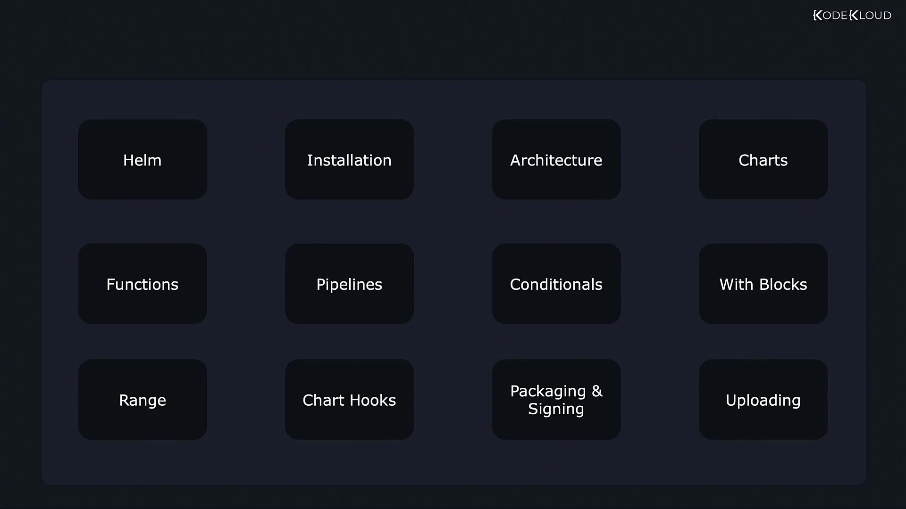

# No changes. Your infrastructure matches the configuration.
```

> **lightbulb** Local `plan` and `init` commands work because Terraform Cloud is acting as your remote backend.

***

## Local Apply Is Blocked for VCS-Connected Workspaces

Attempting `terraform apply` on a VCS-connected workspace will result in an error:

```bash theme={null}
$ terraform apply
Error: Apply not allowed for workspaces with a VCS connection

A workspace that is connected to a VCS requires the VCS-driven workflow to ensure that the VCS remains the single source of truth.
```

> **triangle-alert** Terraform Cloud disallows local `apply` on VCS workspaces. All changes must flow through your Git repository.

***

## Using `-replace` to Recreate Specific Resources

Terraform’s `-replace` flag lets you target explicit resources for recreation:

```bash theme={null}
$ terraform apply -replace=aws_instance.clumsy_bird
```

You can confirm the resource exists in state:

```bash theme={null}
$ terraform state list
aws_instance.clumsy_bird
aws_eip.clumsy_bird
...
module.vpc.aws_vpc.this[0]
```

Since local `apply` is blocked, we’ll inject these flags into Terraform Cloud runs.

***

## Injecting CLI Arguments via Environment Variables

Terraform Cloud lets you define environment variables for each run phase. We’ll configure `TF_CLI_ARGS_plan` and `TF_CLI_ARGS_apply` to include `-replace`.

1. In the Terraform Cloud UI, open the **MyApp Dev** workspace.
2. Navigate to **Variables** → **Environment Variables**.
3. Add the following entries:

| Variable Name        | Value                                                          | Purpose                                        |
| -------------------- | -------------------------------------------------------------- | ---------------------------------------------- |
| TF\_CLI\_ARGS\_plan  | `-replace=aws_instance.clumsy_bird -input=false`               | Automatically replace the instance during plan |
| TF\_CLI\_ARGS\_apply | `-replace=aws_instance.clumsy_bird -auto-approve -input=false` | Bypass approval and replace on apply           |



After saving, your workspace’s environment variables list should appear similar to this:



***

## Triggering the Terraform Cloud Run

Now, start a new run from the Terraform Cloud UI. During **Plan** and **Apply**, Terraform Cloud automatically applies your `-replace` flags:



You’ll see the plan mark two resources for destruction and recreation, plus one change. After Apply completes, the targeted instance and its related resources have been replaced—**with no Git commits**.



***

## Conclusion

By using `TF_CLI_ARGS_plan` and `TF_CLI_ARGS_apply` environment variables in Terraform Cloud, you can inject CLI flags (such as `-replace`) into runs on VCS-connected workspaces. This method lets you force resource replacement without altering your Terraform configuration or committing changes to Git.

***

## References

* [Terraform Cloud Get Started](https://www.terraform.io/cloud/get-started)
* [Terraform CLI Options](https://www.terraform.io/docs/cli/commands/apply.html)
* [Terraform Cloud Variables](https://www.terraform.io/cloud-docs/workspaces/variables)

- [Watch Video](https://learn.kodekloud.com/user/courses/hashicorp-terraform-cloud/module/f7d08e72-e35f-436f-8d42-d0d7364d2532/lesson/25ccf5ca-9a0e-4860-9e6e-d125e84d0bf1)

  - [Practice Lab](https://learn.kodekloud.com/user/courses/hashicorp-terraform-cloud/module/f7d08e72-e35f-436f-8d42-d0d7364d2532/lesson/1625a4c9-e5b6-45bd-b7bb-80aa67fa4990)


# Conclusion

Source: https://notes.kodekloud.com/docs/Helm-for-Beginners/Conclusion/Conclusion/page

This article introduces Helm, covering installation, architecture, essential components, and advanced features for effective chart management in development workflows.

Thank you for reading this article on Helm. In this lesson, we introduced Helm and explored its fundamental concepts. We covered how to install Helm and get started, took a closer look at its architecture, and examined essential components such as charts, releases, revisions, and repositories.

We also demonstrated how you can write your own charts. Consider the following diagram for an overview of key Helm-related topics:



> **lightbulb** For a detailed exploration of Helm's advanced capabilities—including functions, pipelines, conditionals, with blocks, ranges, and hooks—refer to our additional modules.

Furthermore, we delved into advanced features, demonstrating how to leverage functions, pipelines, conditionals, with blocks, ranges, and hooks. We also discussed the mechanisms for packaging, signing, and uploading charts, ensuring a smooth workflow in your development process.

Please share your feedback and let us know if there are additional topics you'd like to see covered in future lessons. We hope you enjoyed the course and found the hands-on exercises both fun and insightful. Don't forget to share your course completion certificate on social media to inspire others!

Until next time, this is Mumshad Mannambeth signing off. Goodbye.

- [Watch Video](https://learn.kodekloud.com/user/courses/helm-for-beginners/module/38be0004-68fb-4932-9b91-d7b6f66aa11c/lesson/94882b7d-1f4a-4178-b1cc-f3ea3066cbf6)
