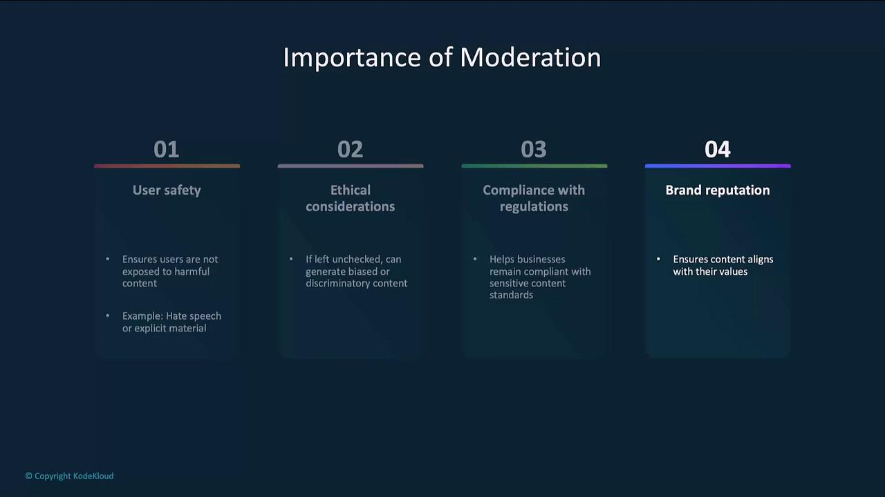
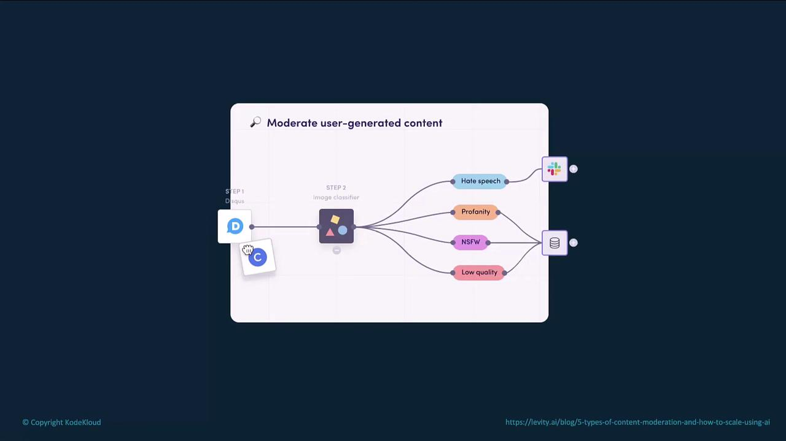
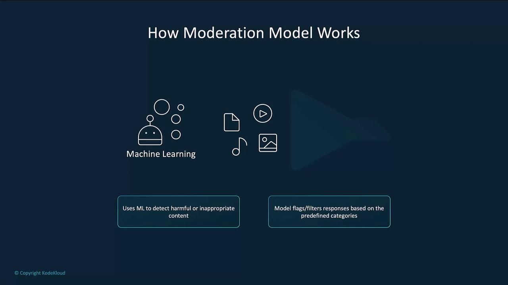
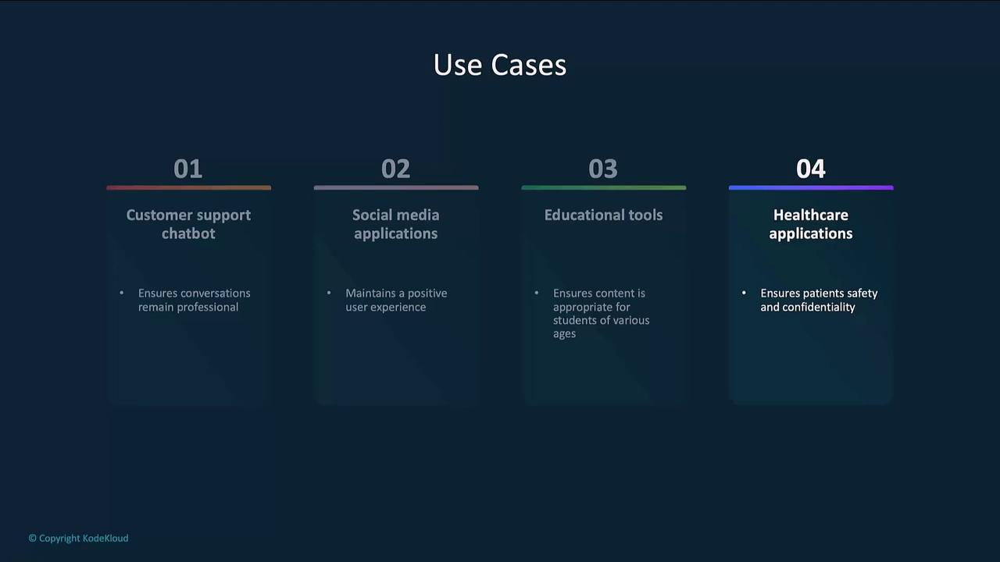
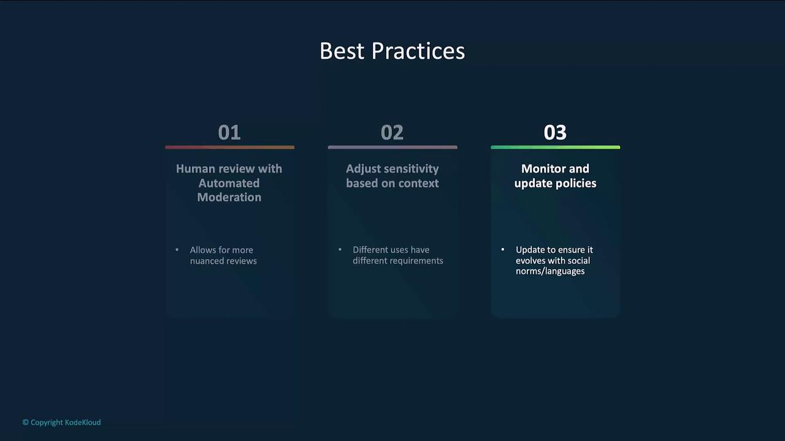

# CalendarEvent(name='Science Fair Visit', date='2024-08-10', participants=['Alice', 'Bob'])
```

<Callout icon="lightbulb">
  Make sure you’re using the `openai` Python package version that supports `.parse()` (e.g., v0.27+).\
  See [Pydantic documentation](https://docs.pydantic.dev/latest/) for detailed model usage.
</Callout>

***

## 2. Step-by-Step Reasoning as Structured Output

You can capture a chain of thought or intermediate steps by defining a Pydantic model that holds your reasoning.

```python theme={null}
from pydantic import BaseModel
from openai import OpenAI

client = OpenAI()

class MathReasoning(BaseModel):
    steps: list[str]
    final_answer: str

completion = client.beta.chat.completions.parse(
    model="gpt-4-2024-08-06",
    messages=[
        {"role": "system", "content": "You are a helpful math tutor. Guide the user."},
        {"role": "user",   "content": "How can I solve 8x + 7 = -23?"}
    ],
    response_format=MathReasoning,
)

math = completion.choices[0].message.parsed
print("Steps:", math.steps)
print("Answer:", math.final_answer)
```

***

## 3. Building a Recipe Generator with JSON Output

Prompt the model to output strict JSON so downstream services can ingest it without additional parsing.

```python theme={null}
from openai import OpenAI

client = OpenAI(api_key="sk-REPLACE_WITH_YOUR_KEY")

def recipe_gen(ingredients: list[str]) -> str:
    messages = [{"role": "user", "content": ing} for ing in ingredients]
    messages.extend([
        {"role": "system",    "content": "JSON Format Required"},
        {"role": "assistant", "content": "You are a high-end chef. Generate a recipe in JSON!"}
    ])

    response = client.chat.completions.create(
        model="gpt-4",
        messages=messages,
        max_tokens=300,
        temperature=0.9
    )
    return response.choices[0].message.content

if __name__ == "__main__":
    ingredients = []
    while True:
        ing = input("Enter an ingredient (or type done): ")
        if ing.strip().lower() == "done":
            break
        ingredients.append(ing)

    print(recipe_gen(ingredients))
```

Run the script:

```bash theme={null}
$ python recipe_generator.py
Enter an ingredient (or type done): chocolate
Enter an ingredient (or type done): grapes
Enter an ingredient (or type done): pizza dough
Enter an ingredient (or type done): done
```

Example JSON response:

```json theme={null}
{
  "recipe": {
    "title": "Chocolate-Infused Grape Pizza Tacos",
    "servings": 4,
    "ingredients": [
      { "name": "Corn tortillas",   "quantity": 8,   "unit": "pieces" },
      { "name": "Pizza dough",      "quantity": 1,   "unit": "pound" },
      { "name": "Dark chocolate",   "quantity": 100, "unit": "grams", "type": "finely chopped" },
      { "name": "Red grapes",       "quantity": 200, "unit": "grams", "type": "halved" },
      { "name": "Mozzarella cheese","quantity": 200, "unit": "grams", "type": "shredded" },
      { "name": "Ricotta cheese",   "quantity": 100, "unit": "grams" },
      { "name": "Fresh basil leaves","quantity": 12,  "unit": "leaves" }
    ]
  }
}
```

<Callout icon="triangle-alert">
  Never commit your API keys to public repositories. Use environment variables or a secure vault.
</Callout>

***

## 4. Switching to CSV Output

Simply update the system prompt to request CSV, then process the comma-separated response.

```python theme={null}
from openai import OpenAI

client = OpenAI(api_key="sk-REPLACE_WITH_YOUR_KEY")

def recipe_gen_csv(ingredients: list[str]) -> str:
    messages = [{"role": "user", "content": ing} for ing in ingredients]
    messages.extend([
        {"role": "system",    "content": "CSV Format Required"},
        {"role": "assistant", "content": "You are a high-end chef. Generate a CSV recipe!"}
    ])

    response = client.chat.completions.create(
        model="gpt-4",
        messages=messages,
        max_tokens=300,
        temperature=0.9
    )
    return response.choices[0].message.content

if __name__ == "__main__":
    ingredients = []
    while True:
        ing = input("Enter an ingredient (or type done): ")
        if ing.strip().lower() == "done":
            break
        ingredients.append(ing)

    print(recipe_gen_csv(ingredients))
```

Sample CSV output:

```csv theme={null}
Ingredient,Quantity,Preparation
Chicken Breast,2 pieces,Cut into cubes
Potatoes,2 medium,Peeled and diced
Eggs,4,Hard-boiled and sliced
Olive Oil,2 Tbsp,For cooking
Garlic,2 cloves,Minced
Onion,1 medium,Finely chopped
Salt,1 tsp,To taste
Black Pepper,1/2 tsp,To taste
Paprika,1/2 tsp,To taste
Fresh Parsley,2 tbsp,Chopped for garnish
```

You can even mix formats—return cooking steps as CSV:

```text theme={null}
Step 1,Heat olive oil in a large pan over medium heat.
Step 2,Add chicken and onion; sauté until translucent.
Step 3,Add garlic, potatoes, and paprika; cook until tender.
Step 4,Stir in eggs until heated through.
Step 5,Garnish with parsley and serve.
```

***

By specifying your desired output format in the `system` and `assistant` messages, you guarantee consistency and simplify downstream processing. For more advanced examples, see the [OpenAI Structured Outputs Guide](https://platform.openai.com/docs/guides/structured-outputs).

## Links and References

* [OpenAI API Documentation](https://platform.openai.com/docs/)
* [Pydantic Documentation](https://docs.pydantic.dev/latest/)

<CardGroup>
  <Card title="Watch Video" icon="video" href="https://learn.kodekloud.com/user/courses/introduction-to-openai/module/42afe984-cd3e-4b3c-b1e0-8e9093f57a63/lesson/69e43059-3653-4c78-8216-84ef4ceefe3c" />
</CardGroup>


# Moderation

Source: https://notes.kodekloud.com/docs/Introduction-to-OpenAI/Features/Moderation/page

This article explores AI content moderation, ethical standards, and the OpenAI Moderation API for maintaining safety and user trust.

In this lesson, we’ll dive into content moderation, explore ethical standards for AI-generated outputs, and see how the OpenAI Moderation API helps maintain safety, compliance, and user trust. You’ll learn why moderation matters, examine the end-to-end workflow, review real-world use cases, see code examples, and discover best practices.

***

## Importance of Moderation

Implementing robust moderation controls is critical for any AI system that interacts with users, especially in customer-facing or regulated environments. Without proper filtering, AI models may generate harmful, biased, or inappropriate content, which can damage user trust and lead to legal issues. Key benefits include:

* **User safety**: Prevents exposure to hate speech, violence, explicit material, or other harmful language—vital in healthcare, education, and support.
* **Ethical compliance**: Guards against biased or discriminatory outputs, promoting fairness and inclusivity.
* **Regulatory adherence**: Helps organizations meet industry-specific and legal requirements for handling sensitive data.
* **Brand protection**: Safeguards your reputation by filtering out content that could harm credibility.

<Frame>
  
</Frame>

***

## Content Moderation Workflow

A typical moderation pipeline includes the following stages:

1. **Content ingestion**\
   User submissions (text or images) enter your system.
2. **Classification**\
   The moderation model analyzes inputs for categories such as hate speech, profanity, NSFW content, or low-quality submissions.
3. **Action**\
   Flagged items trigger notifications (e.g., Slack, email) or are stored in a review queue.
4. **Review & resolution**\
   Content is either automatically blocked or escalated to human moderators for final decisions.

<Frame>
  
</Frame>

***

## How the Moderation Model Works

OpenAI’s moderation model applies machine learning to detect harmful or inappropriate content in real time. Core features include:

* **Real-time filtering**: Analyzes responses before they reach end users.
* **Category detection**: Flags violence, hate speech, sexual content, self-harm, harassment, illicit behavior, and more.
* **Custom sensitivity**: Configure thresholds to match your application’s risk tolerance.

<Frame>
  
</Frame>

<Callout icon="lightbulb">
  You can adjust the model’s `threshold` and combine multiple category scores to fine-tune what content is flagged. This flexibility ensures the moderation pipeline aligns with your brand guidelines and compliance requirements.
</Callout>

***

## Industry Use Cases

Moderation is essential across sectors:

| Industry         | Use Case                                | Benefit                                                |
| ---------------- | --------------------------------------- | ------------------------------------------------------ |
| Customer Support | Chatbots and live agents                | Ensures professional, safe interactions under pressure |
| Social Media     | User-generated posts and comments       | Prevents offensive or harmful content from going live  |
| Education        | Online learning platforms               | Maintains age-appropriate, safe learning environments  |
| Healthcare       | Patient portals and telehealth messages | Protects patient safety and confidentiality            |

<Frame>
  
</Frame>

***

## Example: Calling the Moderation Endpoint

Use the `moderations.create` method to detect whether a piece of text should be flagged:

```python theme={null}
from openai import OpenAI

client = OpenAI()

response = client.moderations.create(
    model="omni-moderation-latest",
    input="Your text to classify goes here..."
)

print(response)
```

A sample JSON response:

```json theme={null}
{
  "category_scores": {
    "sexual": 2.34e-07,
    "sexual/minors": 1.63e-07,
    "harassment": 0.001164,
    "harassment/threatening": 0.002212,
    "hate": 3.20e-07,
    "hate/threatening": 2.49e-07,
    "illicit": 0.000523,
    "illicit/violent": 3.68e-07,
    "self-harm": 0.001118,
    "self-harm/intents": 0.000626,
    "self-harm/instructions": 7.37e-08,
    "violence": 0.859927,
    "violence/graphic": 0.377017
  },
  "category_applied_input_types": {
    "sexual": ["image"],
    "sexual/minors": [],
    "harassment": [],
    "harassment/threatening": [],
    "hate": []
  }
}
```

From these scores, determine which categories exceed your thresholds and decide whether to block the content or forward it for human review.

<Callout icon="triangle-alert">
  Review your threshold settings carefully. Overly strict filters may block legitimate content, while lenient settings could let harmful material slip through.
</Callout>

***

## Best Practices

<Frame>
  
</Frame>

* Combine automated moderation with human review for nuanced cases.
* Tailor sensitivity levels based on content type, audience, and context.
* Continuously monitor and update policies to reflect evolving language and social norms.

Regularly refine your moderation pipeline to ensure it remains fair, accurate, and aligned with both user expectations and legal requirements.

***

## Links and References

* [OpenAI Moderation API](https://platform.openai.com/docs/guides/moderation)
* [OpenAI Developer Documentation](https://platform.openai.com/docs/)
* [Responsible AI Practices](https://www.ibm.com/topics/responsible-ai)

<CardGroup>
  <Card title="Watch Video" icon="video" href="https://learn.kodekloud.com/user/courses/introduction-to-openai/module/42afe984-cd3e-4b3c-b1e0-8e9093f57a63/lesson/60ce1069-ade6-4ac2-8ade-3b0735b1e857" />
</CardGroup>
