# Tokenization and Its Impact on AI Models

Source: https://notes.kodekloud.com/docs/Introduction-to-OpenAI/Introduction-to-AI/Tokenization-and-Its-Impact-on-AI-Models/page

This article discusses tokenization, its types, strategies, and its significant impact on AI model performance and efficiency.

Tokenization is the process of converting raw text into discrete units—tokens—that AI models can process. Serving as the foundation for natural language understanding and generation, tokenization impacts everything from computational efficiency to semantic accuracy in large language models (LLMs).

In this guide, we cover:

* Introduction to tokenization
* Key tokenization strategies
* Role of tokenization in AI model performance
* Tokenization in modern architectures (GPT, DALL·E)
* Challenges and best practices

<Frame>
  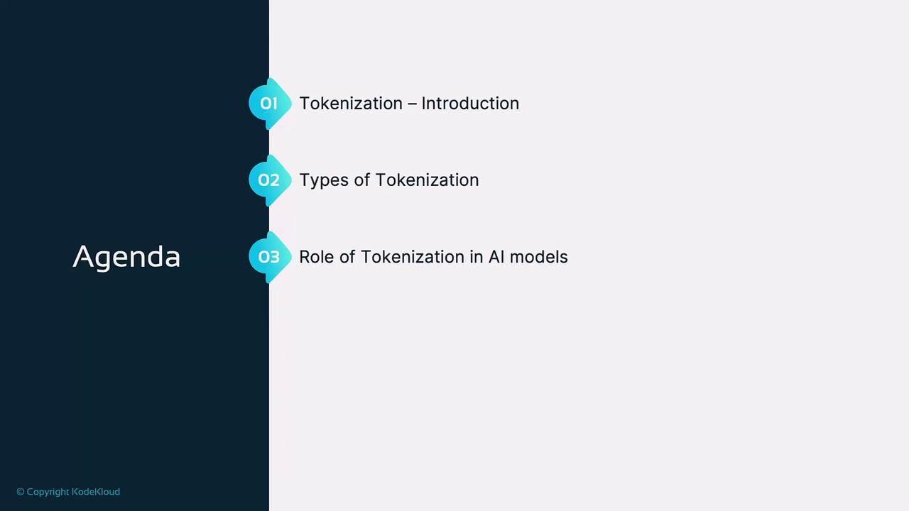
</Frame>

***

## What Is Tokenization?

Tokenization breaks raw text into tokens—words, subwords, characters, or punctuation—enabling AI models to convert language into numerical embeddings. Since LLMs cannot directly interpret raw text, tokenization standardizes inputs, making them suitable for tasks like generation, classification, or translation.

<Frame>
  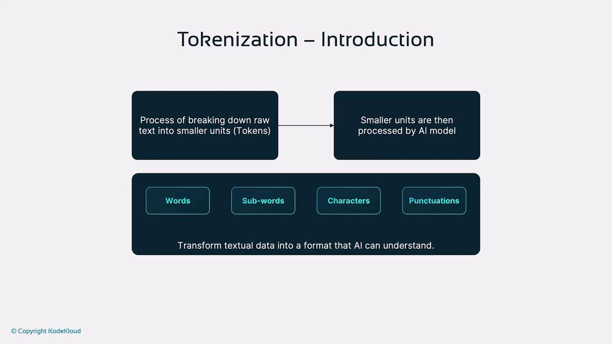
</Frame>

<Frame>
  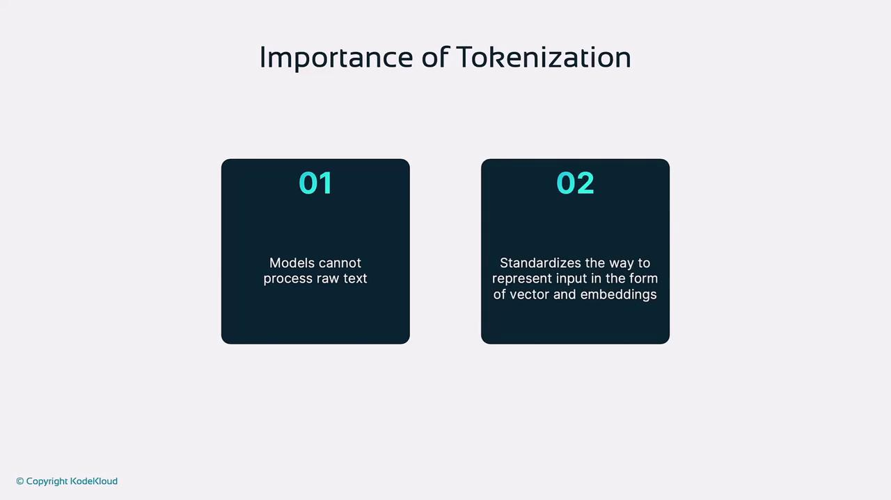
</Frame>

***

## Types of Tokenization

Each tokenization strategy balances vocabulary size, sequence length, and model performance. Here is a comparison of the main approaches:

| Tokenization Type   | Description                                                   | Advantages                              | Disadvantages                             |
| ------------------- | ------------------------------------------------------------- | --------------------------------------- | ----------------------------------------- |
| Word-Level          | Splits text into full words.                                  | Simple; preserves full word semantics.  | Large vocabulary; cannot handle OOV words |
| Subword-Level (BPE) | Merges frequent character/subword pairs (Byte Pair Encoding). | Reduces OOV issues; smaller vocabulary. | More complex; may split meaningful units  |
| Character-Level     | Treats every character as a token.                            | No OOV issues; fine-grained control.    | Very long sequences; low semantic density |

***

### 1. Word-Level Tokenization

Word-level tokenization treats each word as an individual token. For example, “the cat wore a hat” becomes: `the`, `cat`, `wore`, `a`, `hat`.

<Frame>
  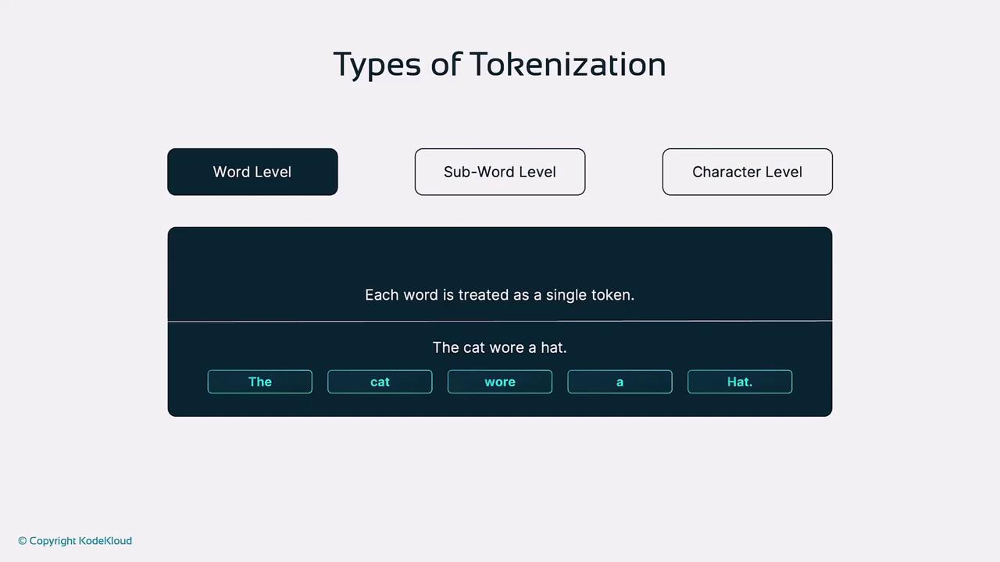
</Frame>

**Advantages**

* Simple implementation
* Preserves whole-word meaning

**Disadvantages**

* Large vocabulary required
* Cannot handle new or rare words (OOV)

<Frame>
  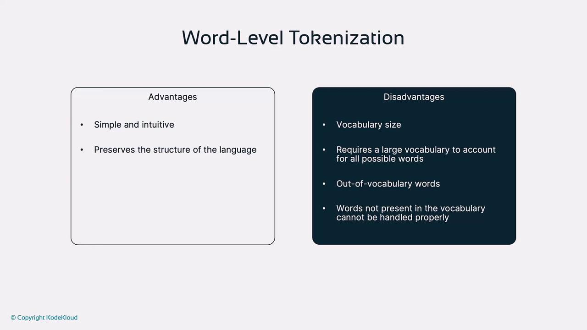
</Frame>

***

### 2. Subword-Level Tokenization

Subword techniques like Byte Pair Encoding (BPE) iteratively merge the most frequent character or subword pairs, creating a flexible vocabulary.

<Frame>
  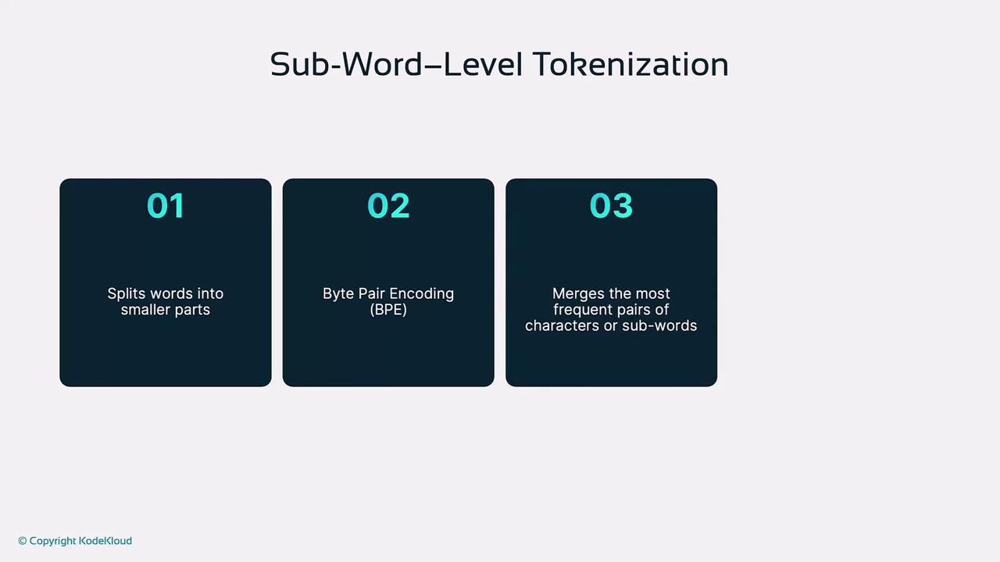
</Frame>

For example, “unhappiness” may become: `un` + `happiness`, and “don’t waste food” could split into: `don` + `'t`, `waste`, `food`.

<Frame>
  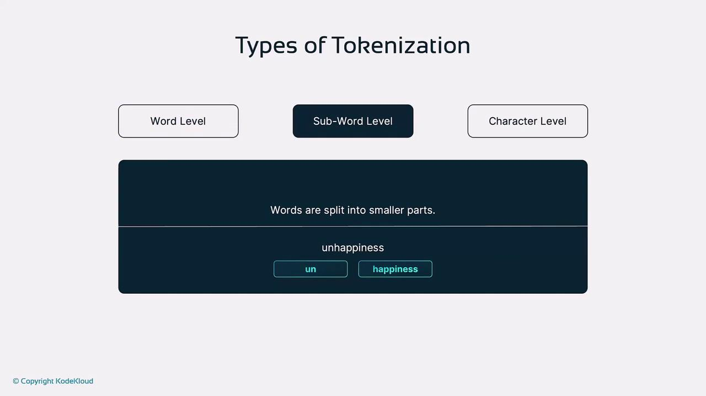
</Frame>

**Advantages**

* Handles rare and compound words
* Balances vocabulary size and coverage

**Disadvantages**

* More complex to implement
* Split tokens can reduce readability

<Frame>
  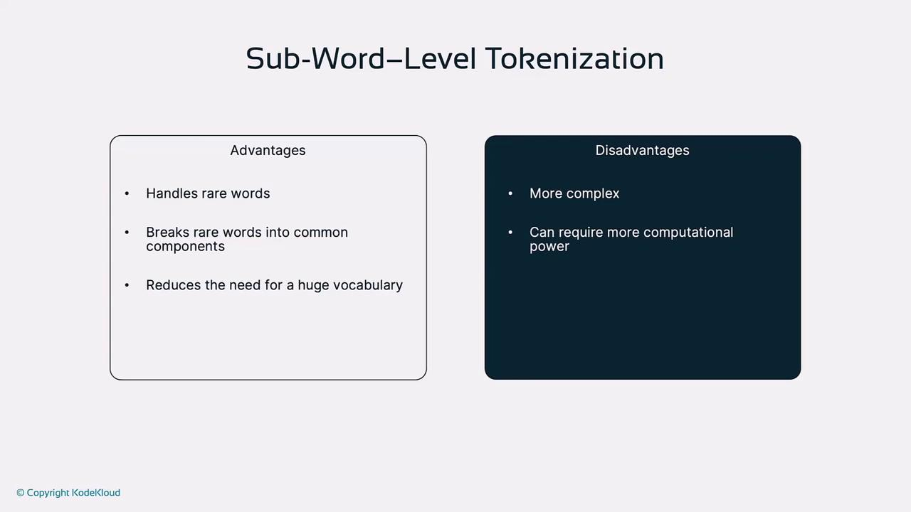
</Frame>

<Callout icon="lightbulb">
  Subword tokenization (BPE, WordPiece) is the most common approach in state-of-the-art language models to mitigate OOV issues and control vocabulary size.
</Callout>

***

### 3. Character-Level Tokenization

This method breaks text into individual characters, including spaces and punctuation. E.g., “It is raining.” becomes `I`, `t`, ` `, `i`, `s`, ` `, `r`, `a`, `i`, `n`, `i`, `n`, `g`, `.`.

<Frame>
  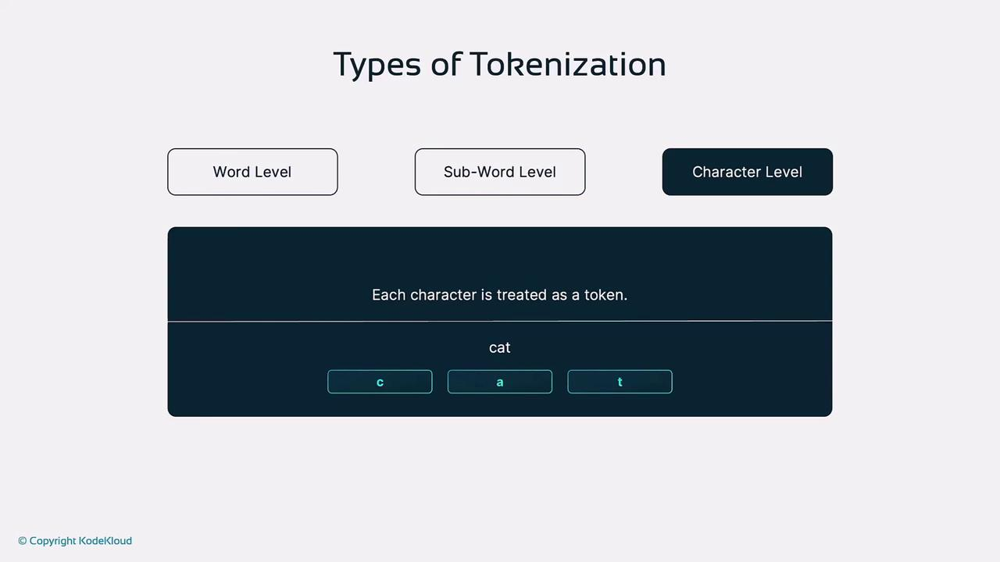
</Frame>

<Frame>
  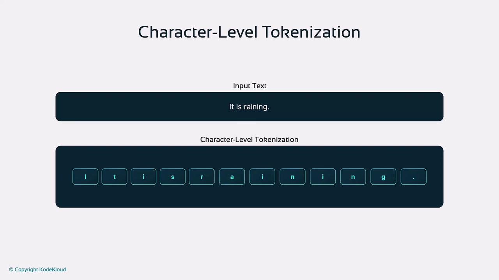
</Frame>

**Advantages**

* Resolves all OOV issues
* Fine-grained text analysis

**Disadvantages**

* Very long sequences increase compute
* Low semantic density per token

<Frame>
  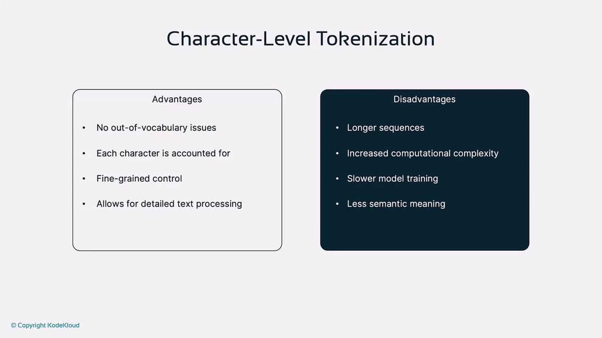
</Frame>

***

## Role of Tokenization in AI Models

Effective tokenization influences:

* **Vocabulary & Memory**\
  A larger vocabulary demands more memory and compute.
* **Handling OOV Words**\
  Subword methods mitigate unseen-word errors.
* **Contextual Clarity**\
  Proper token boundaries improve self-attention and disambiguation (e.g., “bank”).
* **Training Efficiency**\
  Optimized tokenization reduces sequence length and speeds up convergence.

<Frame>
  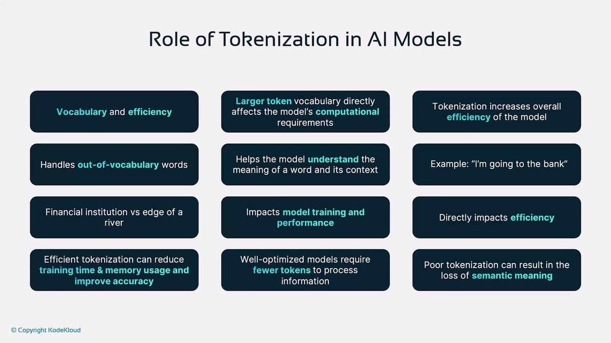
</Frame>

***

## Tokenization in Modern AI Models

**GPT Series (e.g., GPT-4)**\
Employs BPE-based subword tokenization to manage vocabulary size while handling rare or novel terms for coherent text generation.

**DALL·E**\
Applies tokenization to both textual prompts and image patches, enabling cross-modal learning for text-to-image synthesis.

<Frame>
  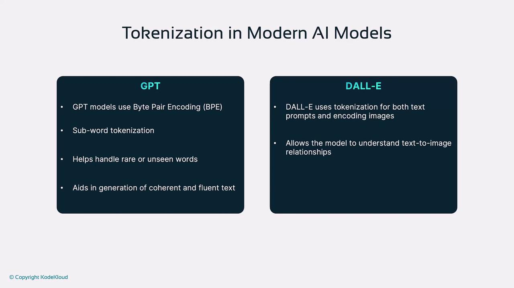
</Frame>

***

## Challenges and Considerations

* **Tokenization Bias**\
  Frequency imbalances in training data can introduce model bias.
* **Language-Specific Tokenization**\
  Scripts without spaces (Mandarin, Japanese) require specialized tokenizers.
* **Multilingual Models**\
  Must efficiently handle diverse scripts and vocabularies for cross-lingual tasks.

<Callout icon="triangle-alert">
  Inadequate tokenization may amplify bias or degrade performance in specialized or multilingual scenarios. Always evaluate your tokenizer on representative data.
</Callout>

<Frame>
  
</Frame>

***

## Conclusion

Tokenization underpins the success of NLP and multimodal AI systems. By selecting and fine-tuning the right tokenization strategy—whether word-level, subword-level, or character-level—you can significantly improve your model’s efficiency, accuracy, and fairness.

## References

* [Byte Pair Encoding (BPE)](https://en.wikipedia.org/wiki/Byte_pair_encoding)
* [WordPiece Tokenization](https://huggingface.co/[AWS_SECRET_ACCESS_KEY].html)
* [Hugging Face Tokenizers](https://huggingface.co/docs/tokenizers/)
* [Kubernetes Basics](https://kubernetes.io/docs/concepts/overview/what-is-kubernetes/)

<CardGroup>
  <Card title="Watch Video" icon="video" href="https://learn.kodekloud.com/user/courses/introduction-to-openai/module/b34266e4-9475-4747-82ff-ee6646f5ca14/lesson/ebf99aee-afa8-41cd-844c-2a8403158de9" />
</CardGroup>
