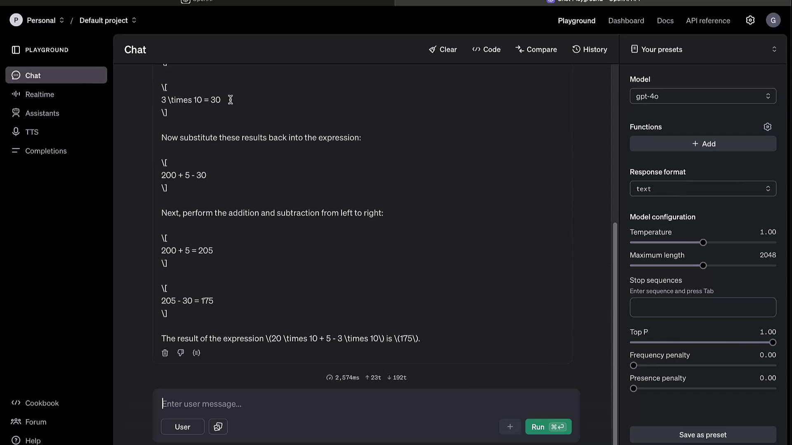
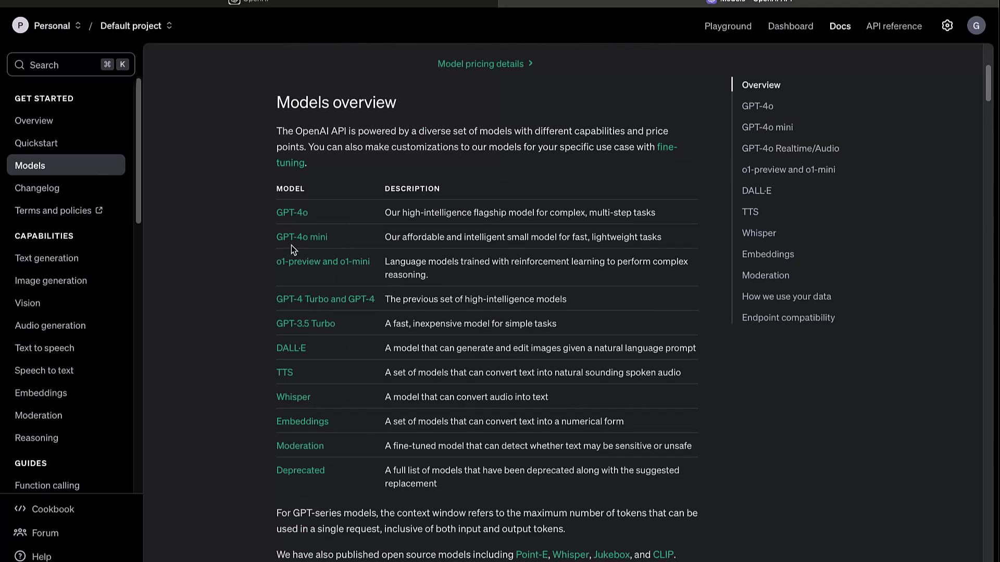
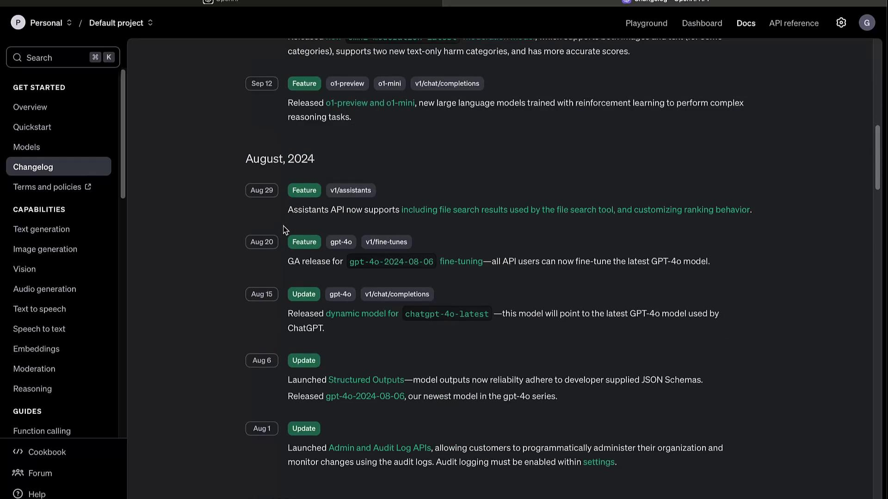
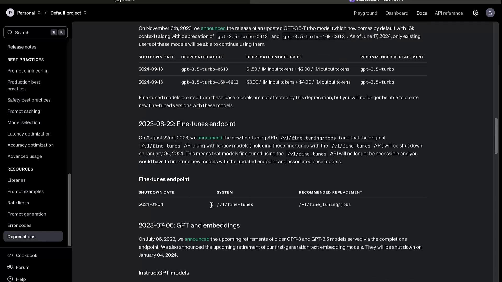

# Getting Started With OpenAI Platform

Source: https://notes.kodekloud.com/docs/Introduction-to-OpenAI/Pre-Requisites/Getting-Started-With-OpenAI-Platform/page

This guide helps you navigate the OpenAI Platform, covering the Playground, Dashboard, and Documentation for efficient AI development.

Welcome! In this guide, you’ll learn how to navigate the OpenAI Platform—exploring the Playground, Dashboard, and Documentation—to streamline your AI development workflow.

***

## Playground

The **Playground** offers an interactive environment to test models and fine-tune parameters before integrating them into your code.

### 1. Interacting with Models

Switch to the **Chat** tab for conversational prompts. For example:

```text theme={null}
what is 20 times 10 plus 5 minus 3 times 10
```

Click **Run** and watch the model break down the calculation step by step, returning the answer.

### 2. Tuning Parameters

Adjust these settings to influence output quality and creativity:

* **Temperature**: Controls randomness (0.0–1.0)
* **Max Tokens**: Limits response length
* **Top K** / **Top P**: Filters token selection based on probability

<Frame>
  
</Frame>

### 3. Additional Features

* **Model Switching**: Try GPT-3.5, GPT-4, or custom fine-tuned models
* **Speech to Text**: Real-time audio transcription
* **Text to Speech**: Generate audio responses
* **Assistant Builder**: Design your own conversational agent
* **Completion Settings**: Preconfigure defaults for repeated experiments

<Callout icon="lightbulb">
  The Playground is ideal for rapid prototyping. Once satisfied, copy code snippets directly into your application.
</Callout>

***

## Dashboard

The **Dashboard** centralizes your account and usage management.

| Feature           | Description                                           |
| ----------------- | ----------------------------------------------------- |
| Usage Analytics   | View API call counts, token usage, and cost estimates |
| Assistants & Jobs | Manage chat assistants and batch processing tasks     |
| Fine-tuning       | Upload training data and launch custom model tweaks   |
| File Storage      | Store and retrieve files for embedding or training    |
| API Keys          | Create, view, and revoke keys for secure access       |

Access your metrics, configure billing alerts, and optimize resource allocation all from one place.

***

## Documentation

Comprehensive docs cover every aspect of the API and its components. Visit [OpenAI API Documentation][openai-docs] for full details.

### Models Overview

Browse the **Models** section to compare capabilities and select the best fit:

<Frame>
  
</Frame>

Selecting a model—such as **GPT-4**—reveals its parameters, use cases, and any available variants.

### Changelog

Track updates, deprecations, and new features in the **Changelog**. Staying informed ensures your integrations remain stable.

<Frame>
  
</Frame>

### Capabilities

| Modality         | Description                               |
| ---------------- | ----------------------------------------- |
| Text Generation  | Conversational agents, content creation   |
| Image Generation | DALL·E image creation and editing         |
| Audio            | Text-to-Speech & real-time Speech-to-Text |
| Embeddings       | Semantic vectors for search & clustering  |
| Video            | Video generation and analysis (beta)      |

#### JavaScript Example

```javascript theme={null}
import OpenAI from "openai";

const openai = new OpenAI();

const completion = await openai.chat.completions.create({
  model: "gpt-4",
  messages: [
    { role: "system", content: "You are a helpful assistant." },
    { role: "user", content: "Write a haiku about recursion in programming." }
  ]
});

console.log(completion.choices[0].message.content);
```

#### Python Example

```python theme={null}
from openai import OpenAI

client = OpenAI()

completion = client.chat.completions.create(
    model="gpt-4",
    messages=[
        {"role": "system", "content": "You are a helpful assistant."},
        {"role": "user", "content": "Write a haiku about recursion in programming."}
    ]
)

print(completion.choices[0].message.content)
```

<Callout icon="lightbulb">
  Be sure to set your `OPENAI_API_KEY` in environment variables before running these snippets.
</Callout>

***

## Guides and Advanced Topics

Explore specialized tutorials to maximize the API’s potential:

* Function Calling
* Model Evaluation & Benchmarks
* Fine-tuning & Distillation
* Batch Processing Workflows
* Official Libraries & SDKs
* Prompt Engineering Best Practices
* Rate Limits, Error Codes, and Retirements

Example: Create image variations with DALL·E in Python:

```python theme={null}
response = client.images.create_variation(
    model="dall-e-2",
    image=open("corgi_and_cat_paw.png", "rb"),
    n=1,
    size="1024x1024"
)
print(response.data[0].url)
```

***

## Deprecations

Regularly review the **Deprecations** section to avoid using sunset features and to plan migrations.

<Frame>
  
</Frame>

<Callout icon="triangle-alert">
  Deprecated endpoints and models will stop functioning after their scheduled sunset dates. Always update to the recommended replacements to prevent downtime.
</Callout>

***

## Links and References

* [OpenAI API Documentation][openai-docs]
* [OpenAI Playground](https://platform.openai.com/playground)
* [OpenAI GitHub](https://github.com/openai)

[openai-docs]: https://platform.openai.com/docs

<CardGroup>
  <Card title="Watch Video" icon="video" href="https://learn.kodekloud.com/user/courses/introduction-to-openai/module/192b48b6-ae6c-4126-8784-a84f0d284a41/lesson/1ade8416-e558-49ae-a7a7-d88d2df040d4" />
</CardGroup>
