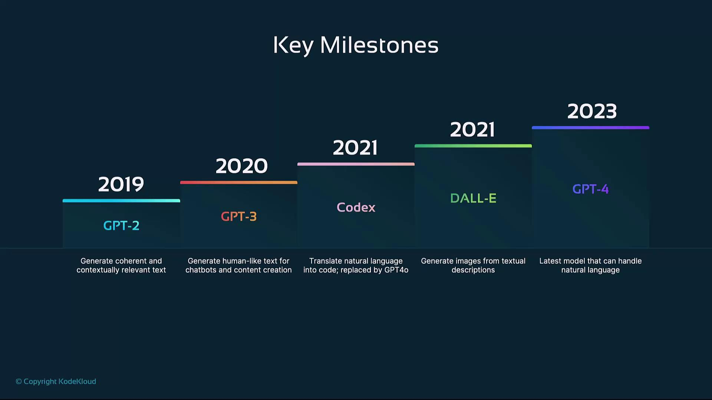

# History of OpenAI

Source: https://notes.kodekloud.com/docs/Introduction-to-OpenAI/Pre-Requisites/History-of-OpenAI/page

This article outlines the history and key milestones of OpenAIs development of artificial general intelligence and its various models.

OpenAI was founded in December 2015 by Sam Altman, Elon Musk, Greg Brockman, Ilya Sutskever, Wojciech Zaremba, and other leading technologists. Their mission: to research and develop artificial general intelligence (AGI) in a way that is safe, ethical, and benefits all of humanity. From the outset, OpenAI has focused on automation, creativity, decision-making, and problem-solving using state-of-the-art machine learning techniques.

<Callout icon="lightbulb">
  Learn more about AGI and its implications in the [OpenAI Charter](https://openai.com/charter/).
</Callout>

## Key Milestones

| Year | Model  | Description                                                                                                  |
| ---- | ------ | ------------------------------------------------------------------------------------------------------------ |
| 2019 | GPT-2  | A large-scale transformer that generates coherent, contextually relevant text.                               |
| 2020 | GPT-3  | Expanded to 175 billion parameters, powering chatbots, content creation, and more.                           |
| 2021 | Codex  | Translates natural language into code, enabling developers to build applications by describing their intent. |
| 2021 | DALL·E | Generates high-quality images from text prompts, unlocking new creative workflows in design and digital art. |
| 2023 | GPT-4  | Multimodal model with enhanced language understanding, coding capabilities, and image inputs.                |

## 2019 – GPT-2

In early 2019, OpenAI unveiled **GPT-2**, showcasing how transformer architectures can produce long-form, context-aware text. Despite its capabilities, the full model was initially withheld due to concerns about potential misuse.

* Transformer-based architecture
* 1.5 billion parameters
* Demonstrated coherent text generation across diverse topics

## 2020 – GPT-3

The release of **GPT-3** in mid-2020 marked a major leap:

* 175 billion parameters for deep language understanding
* Zero- and few-shot learning capabilities
* Applications: chatbots, virtual assistants, automated content writing, and more

Read more about the capabilities of large language models in the [GPT-3 paper](https://arxiv.org/abs/2005.14165).

## 2021 – Codex

Building on GPT-3, **Codex** was introduced to bridge natural language and programming. It can:

* Interpret plain-English prompts
* Generate code in multiple languages (e.g., Python, JavaScript)
* Power developer tools like GitHub Copilot

<Callout icon="triangle-alert">
  Use Codex responsibly. Generated code may require security reviews and testing before production deployment.
</Callout>

## 2021 – DALL·E

**DALL·E** demonstrated creative AI by converting text descriptions into images:

* Leveraged GPT-style transformers for image synthesis
* Supported diverse artistic styles and novel object combinations
* Found use cases in marketing, digital art, and rapid prototyping

## 2023 – GPT-4

The latest milestone, **GPT-4**, extends OpenAI’s models to be truly multimodal:

* Processes both text and image inputs
* Delivers finer-grained reasoning and problem-solving
* Powers advanced applications in research, software development, and creative industries

<Frame>
  
</Frame>

## Further Reading

* [OpenAI Official Site](https://openai.com/)
* [Understanding Transformers](https://arxiv.org/abs/1706.03762)
* [Generative Pre-trained Transformers (GPT)](https://en.wikipedia.org/wiki/GPT-3)
* [GitHub Copilot Documentation](https://docs.github.com/en/copilot)

## References

* OpenAI Charter: [https://openai.com/charter/](https://openai.com/charter/)
* “Language Models are Few-Shot Learners” (GPT-3 paper): [https://arxiv.org/abs/2005.14165](https://arxiv.org/abs/2005.14165)

<CardGroup>
  <Card title="Watch Video" icon="video" href="https://learn.kodekloud.com/user/courses/introduction-to-openai/module/192b48b6-ae6c-4126-8784-a84f0d284a41/lesson/e79a723b-89a3-4172-ade8-9e91cfeb4aaa" />
</CardGroup>
