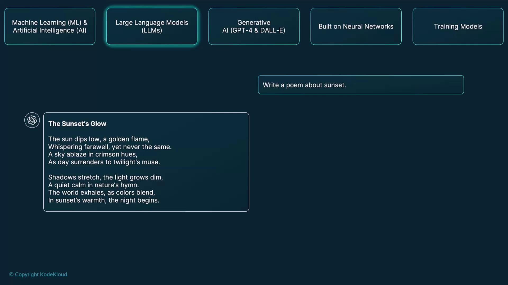
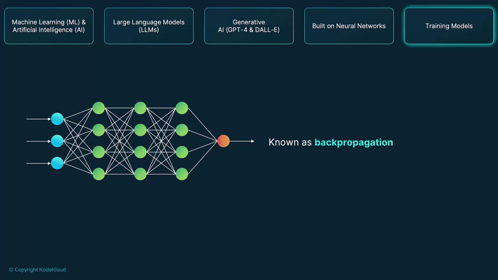

# How OpenAI Works

Source: https://notes.kodekloud.com/docs/Introduction-to-OpenAI/Pre-Requisites/How-OpenAI-Works/page

This guide explores OpenAI’s principles, architectures, and training methods for advanced text, code, and image generation capabilities.

In this guide, we delve into OpenAI’s core principles, architectures, and training methodologies. You’ll learn how self-supervised learning, transformer-based neural networks, and reinforcement fine-tuning combine to power cutting-edge capabilities in text, code, and image generation.

***

## Machine Learning

Machine Learning (ML) enables systems to learn patterns and make predictions from data without explicit programming. OpenAI applies **self-supervised learning** on massive text and image corpora, allowing models to:

* Predict the next word or token in a sequence
* Learn structural patterns and semantic relationships
* Improve accuracy as more data is processed

By optimizing internal parameters through gradient‐based methods, these models refine their predictive performance over time.

***

## Artificial Intelligence

Artificial Intelligence (AI) encompasses algorithms and systems that perform tasks requiring human-like reasoning, decision-making, and problem solving. At OpenAI, AI underpins features such as:

* Contextual text generation
* Complex language comprehension
* Automated code synthesis and debugging

These capabilities power tools ranging from chatbots to developer assistants.

***

## Large Language Models

Large Language Models (LLMs) are transformer-based systems trained on billions of words. OpenAI’s GPT series (Generative Pre-trained Transformers) exemplifies this approach:

1. **Pre-training** on diverse text sources to learn linguistic structure
2. **Fine-tuning** on specialized datasets or tasks for domain expertise
3. **Inference** using probability distributions to generate coherent text

When you submit a prompt, the model selects the most likely next tokens, producing fluent, contextually rich responses—whether you’re drafting a poem, solving a coding challenge, or summarizing an article.

<Frame>
  
</Frame>

***

## Generative AI

Generative AI creates entirely new content by modeling underlying data distributions. Key architectures include:

* **GANs** (Generative Adversarial Networks) for realistic image synthesis
* **VAEs** (Variational Autoencoders) for structured latent representations
* **Transformers** (e.g., GPT, DALL·E) for high-fidelity text and image outputs

By learning statistical patterns in training data, these systems can produce unique outputs—from photorealistic images to creative stories.

***

## Neural Networks

Neural networks are the computational backbone of OpenAI’s models. The **Transformer** architecture stands out by using self-attention mechanisms to capture long-range dependencies in sequences. Key components:

* **Multi-head attention** layers for parallel context aggregation
* **Feedforward** networks for nonlinear feature transformation
* **Layer normalization** and **residual connections** to stabilize training

Reinforcement learning from human feedback (RLHF) further refines model outputs based on real-world preferences.

***

## Training Models

OpenAI’s flagship models—GPT, CLIP, and DALL·E—undergo extensive training cycles on text, image–text pairs, and code repositories. The process involves:

1. **Task Definition**\
   Assign specific objectives like next-token prediction, image captioning, or code completion.

2. **Backpropagation**\
   Compute gradients to assess how each weight contributes to the model’s error, propagating corrections backward through the network.

3. **Optimization**\
   Apply gradient descent variants (e.g., Adam) to update parameters in the direction that reduces the loss.

<Callout icon="lightbulb">
  Training these models requires specialized hardware (GPUs/TPUs) and distributed computing frameworks to handle billions of parameters efficiently.
</Callout>

| Model  | Domain     | Primary Use Case                            |
| ------ | ---------- | ------------------------------------------- |
| GPT    | Text       | Language generation & understanding         |
| CLIP   | Image-Text | Zero-shot image classification & captioning |
| DALL·E | Image      | Creative image synthesis from prompts       |

<Frame>
  
</Frame>

<Frame>
  
</Frame>

***

## Links and References

* [Transformer Architecture Paper](https://arxiv.org/abs/1706.03762)
* [OpenAI Research](https://openai.com/research)
* [Reinforcement Learning from Human Feedback](https://openai.com/research/rlhf)
* [Kaggle Datasets](https://www.kaggle.com/datasets)

<CardGroup>
  <Card title="Watch Video" icon="video" href="https://learn.kodekloud.com/user/courses/introduction-to-openai/module/192b48b6-ae6c-4126-8784-a84f0d284a41/lesson/360ed777-0b9d-4625-8cc5-d87e1f18fa12" />
</CardGroup>
