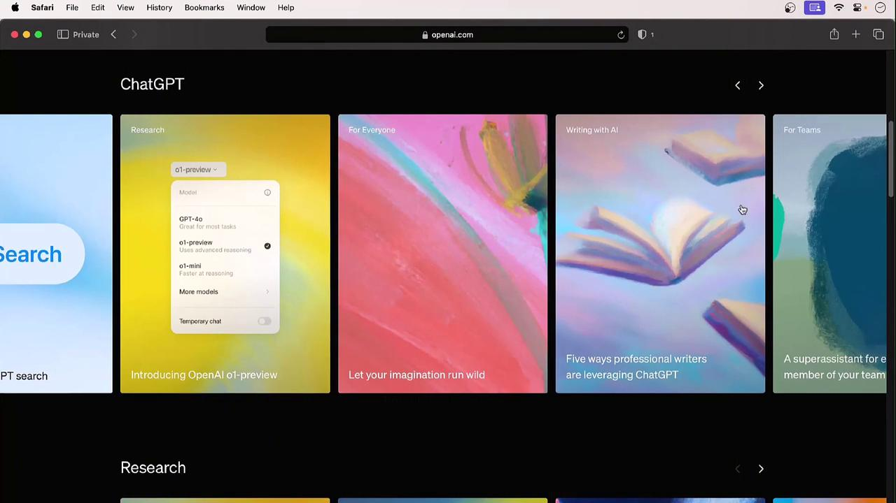
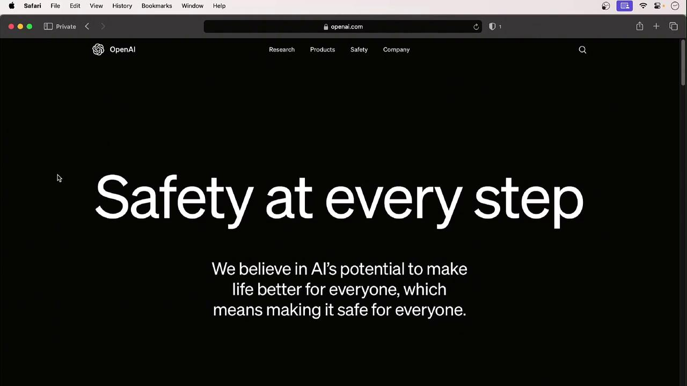
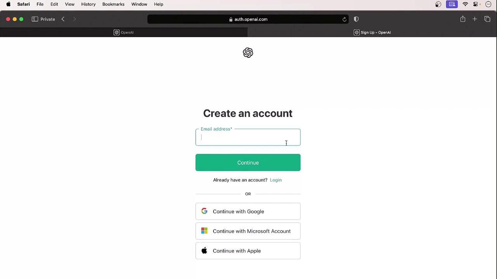
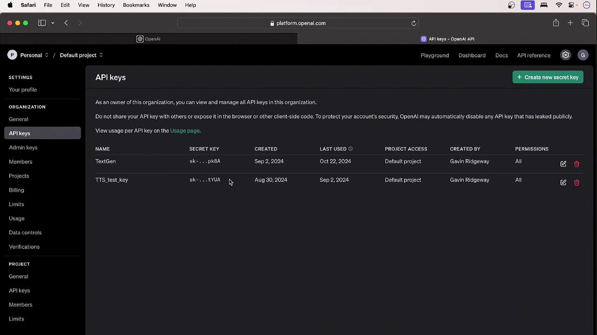
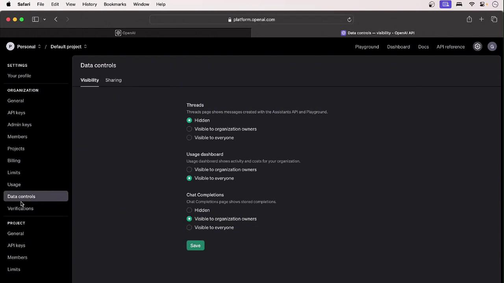

# OpenAI Account Setup

Source: https://notes.kodekloud.com/docs/Introduction-to-OpenAI/Pre-Requisites/OpenAI-Account-Setup/page

This tutorial teaches how to navigate the OpenAI website, sign up for an account, and locate API keys.

Welcome! In this tutorial, you’ll learn how to navigate the OpenAI website, sign up for an account, and locate your API keys. Let’s get started.

***

## 1. Homepage Overview

Open your browser and go to [https://openai.com](https://openai.com). The homepage highlights key resources:

| Section   | Description                                    | Examples                           |
| --------- | ---------------------------------------------- | ---------------------------------- |
| Research  | Browse model releases, papers, and demos       | DALL·E, GPT-4                      |
| Safety    | Standards for ethical AI, copyright, deepfakes | “Safety at every step” guidelines  |
| Company   | OpenAI’s mission, team, and corporate values   | About Us, Careers                  |
| Developer | API reference, tutorials, SDKs                 | API docs, code samples             |
| Stories   | Use cases, news, and blog articles             | Customer spotlights, announcements |

<Frame>
  
</Frame>

***

## 2. Exploring the Menu

### Research

Under **Research**, you’ll find model releases and research insights:

* **DALL·E**: Generate high-quality images from textual prompts.
* **GPT-4**: State-of-the-art LLM for advanced text generation.

<Callout icon="lightbulb">
  OpenAI is developing experimental video-generation models—imagine a woolly mammoth running in the snow!
</Callout>

### Safety

The **Safety** section covers:

* Ethics and responsible AI
* Copyright guidance
* Misinformation and deepfake prevention

<Frame>
  
</Frame>

### Company

Visit **Company → About Us** to learn OpenAI’s mission, values, and organizational structure.

***

## 3. Accessing the API

1. Go to **Products → API** in the top menu.
2. Click **Login** (or **Sign Up** if you don’t have an account yet).
3. Explore the left sidebar for:
   * API reference
   * Quickstart guides
   * Sample code

Example JavaScript snippet to create a chat completion with GPT-4:

```javascript theme={null}
import OpenAI from "openai";
const openai = new OpenAI();

const completion = await openai.chat.completions.create({
  model: "gpt-4",
  messages: [
    { role: "user", content: "Write a haiku about AI." }
  ]
});

console.log(completion.choices[0].message.content);
```

***

## 4. Creating Your Account

Follow these steps to set up your OpenAI account:

1. Click **Sign Up** on the API page.
2. Enter your email address and create a password.
3. Verify your email via the confirmation link.
4. Complete your profile:
   * Full name
   * Organization (optional)
   * Birth date

<Frame>
  
</Frame>

***

## 5. Your Profile and API Keys

Once logged in, click your initials in the top-right corner to open **Profile & Keys**. Here you can:

* Update organization name and billing details
* Adjust interface settings and preferences
* Create, view, or revoke API keys

<Frame>
  
</Frame>

To generate a new key, select **Create new secret key**. You’ll also see options for:

* Admin vs. user permissions
* Project-based access controls
* Billing and usage dashboards
* Rate limits and quotas
* Data control settings

<Frame>
  
</Frame>

***

## Next Steps

In the following section, we’ll dive into OpenAI’s detailed documentation, explore advanced model features, and walk through sample integrations.

***

## Links and References

* [OpenAI API Documentation](https://platform.openai.com/docs)
* [ChatGPT Overview](https://openai.com/blog/chatgpt)
* [DALL·E](https://openai.com/dall-e-2)
* [Safety Guidelines](https://openai.com/policies/usage-policies)

<CardGroup>
  <Card title="Watch Video" icon="video" href="https://learn.kodekloud.com/user/courses/introduction-to-openai/module/192b48b6-ae6c-4126-8784-a84f0d284a41/lesson/b82918dd-28ca-410c-ad50-3fc8db6ea3cd" />
</CardGroup>
