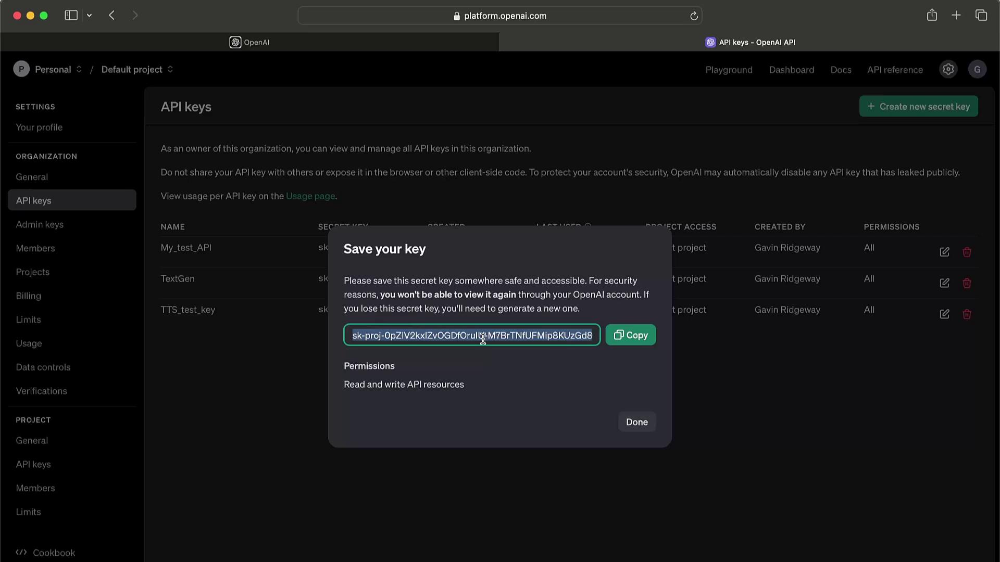
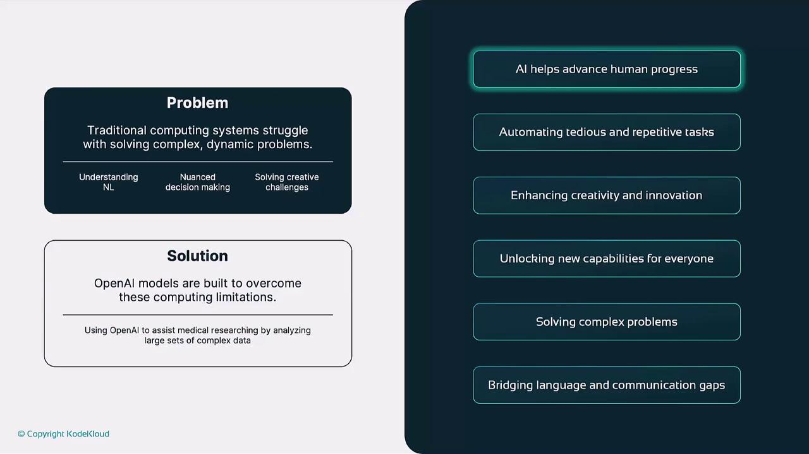
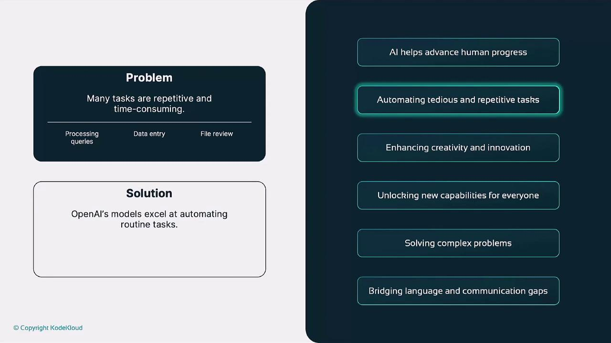
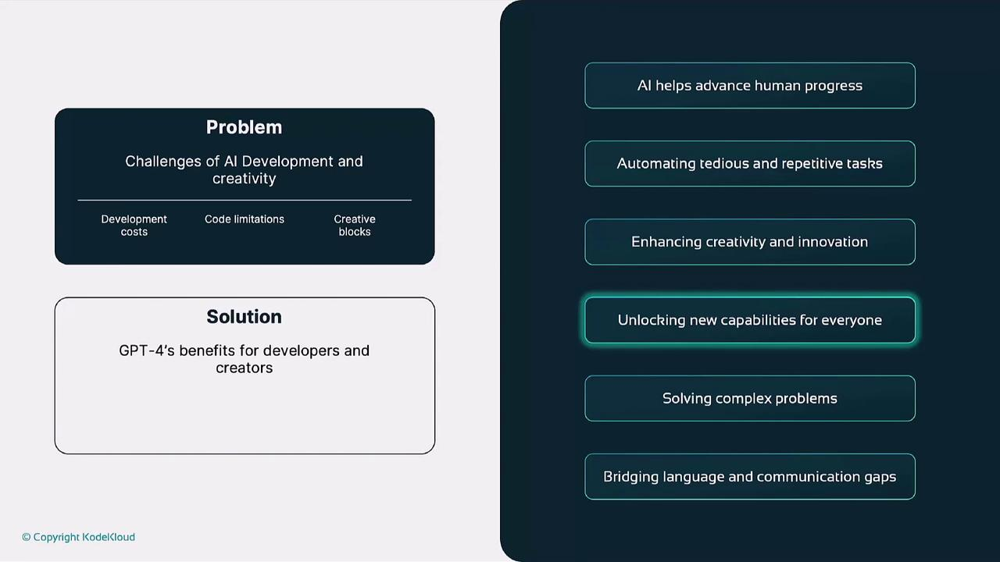

# Load your API key from an environment variable
api_key = os.getenv("OPENAI_API_KEY")

client = OpenAI(api_key=api_key)
response = client.chat.completions.create(
    model="gpt-4",
    messages=[{"role": "user", "content": "Write a haiku about AI"}]
)

print(response.choices[0].message.content)
```

<Callout icon="lightbulb">
  Never hard-code your API key in source files. Use environment variables or secret management tools instead.
</Callout>

For full reference, see the [OpenAI API Documentation](https://platform.openai.com/docs/api-reference).

## Generating and Protecting Your OpenAI API Key

Follow these steps to create and secure a new secret key on the OpenAI platform:

1. Sign in and click the **Settings** (cogwheel) icon in the lower-left corner.
2. Choose **API keys** from the sidebar menu.
3. Click **Create new secret key**, provide a descriptive name (e.g., *My Test API*), and set the required scopes.
4. Copy your newly generated key immediately—this is the only time it will be visible—and store it in a secure vault.

<Frame>
  
</Frame>

<Callout icon="triangle-alert">
  Never expose your secret key in client-side code, public repositories, or logs. If compromised, revoke it immediately to prevent unauthorized charges.
</Callout>

### Key Management Best Practices

| Practice                     | Recommendation                                                   |
| ---------------------------- | ---------------------------------------------------------------- |
| Unique Keys                  | Generate separate keys for development, staging, and production. |
| Principle of Least Privilege | Grant only the permissions necessary for each key.               |
| Regular Rotation             | Rotate keys periodically to minimize security risks.             |
| Usage Monitoring             | Set up alerts on unusual request patterns.                       |

If you suspect a key has been leaked or abused, delete it right away and issue a replacement.

<CardGroup>
  <Card title="Watch Video" icon="video" href="https://learn.kodekloud.com/user/courses/introduction-to-openai/module/192b48b6-ae6c-4126-8784-a84f0d284a41/lesson/d5439a66-cdd9-4bcd-8cd4-796a7243d1ee" />
</CardGroup>


# Why We Need OpenAI

Source: https://notes.kodekloud.com/docs/Introduction-to-OpenAI/Pre-Requisites/Why-We-Need-OpenAI/page

This article discusses the benefits of OpenAIs technology for enhancing productivity, creativity, and problem-solving across various sectors.

OpenAI’s advanced artificial intelligence unlocks powerful new capabilities, from accelerating research to automating everyday tasks. In this article, we’ll dive into the six main reasons organizations and individuals rely on OpenAI to stay competitive, creative, and efficient.

| Benefit                                 | Impact                                 | Example                                        |
| --------------------------------------- | -------------------------------------- | ---------------------------------------------- |
| Advances Human Progress                 | Solves ambiguous, real-world problems  | AI-driven drug discovery in pharmaceuticals    |
| Automates Tedious Tasks                 | Frees teams for strategic work         | GPT-4–powered customer support bots            |
| Enhances Creativity and Innovation      | Accelerates ideation and prototyping   | DALL·E image generation for marketing          |
| Unlocks New Capabilities for Developers | Reduces time-to-market for AI features | Instant NLP in chatbots using GPT-4 API        |
| Solves Complex Problems at Scale        | Processes massive datasets efficiently | Climate modeling and supply-chain optimization |
| Bridges Language and Communication Gaps | Provides personalized learning         | AI-powered language tutoring apps              |

***

## 1. Advances Human Progress

Traditional software follows static rules, making it difficult to tackle tasks involving uncertainty, nuance, or creativity. OpenAI’s models, however, excel at:

* Natural language understanding
* Complex decision-making
* Creative problem solving

<Frame>
  
</Frame>

For instance, in medicine, GPT-4 can analyze thousands of research papers to spot novel drug candidates—shortening research cycles and accelerating breakthroughs in oncology or neurology.

***

## 2. Automates Tedious and Repetitive Tasks

Repetitive chores like data entry, routine customer support, or basic content drafting drain time and resources. OpenAI automates these processes to let teams focus on innovation:

<Frame>
  
</Frame>

With GPT-4, you can:

* Instantly respond to FAQs
* Generate first-draft reports and summaries
* Automate blog post outlines

<Callout icon="lightbulb">
  Automating routine tasks not only boosts productivity but also reduces human error, ensuring consistent output quality.
</Callout>

Companies like Shopify integrate AI chatbots that handle thousands of inquiries daily—improving response times and customer satisfaction without expanding support teams.

***

## 3. Enhances Creativity and Innovation

Creative blocks and limited resources often slow design, writing, and marketing efforts. OpenAI’s tools help you ideate, prototype, and iterate faster:

<Frame>
  
</Frame>

* GPT-4 generates story prompts, dialogue, or full drafts
* DALL·E produces unique visuals from plain-text descriptions

For example, a marketing agency can rapidly generate multiple ad copy variations and concept images—driving faster campaign turnarounds and more A/B testing options.

***

## 4. Unlocks New Capabilities for Everyone

Building robust AI from scratch demands specialized talent and infrastructure. OpenAI’s pre-trained models let developers embed advanced features instantly:

<Frame>
  
</Frame>

Key integrations include:

* Natural language processing (NLP)
* Code generation and review
* Automated reasoning and summarization

A chatbot built with GPT-4 handles context-aware conversations out of the box—no complex NLP pipelines required.

***

## 5. Solves Complex Problems Beyond Human Capability

Modeling systems like climate change, epidemiology, or large-scale logistics involves massive data and subtle patterns. OpenAI rises to the challenge:

<Frame>
  
</Frame>

Use cases include:

* Predicting compound interactions in drug discovery
* Simulating environmental changes for climate research
* Optimizing supply-chain routes in real time

These capabilities help scientists and enterprises make high-confidence decisions faster than ever before.

***

## 6. Bridges Language and Communication Gaps

One-size-fits-all teaching and translation tools often fall short in personalized learning. OpenAI powers adaptive, interactive language experiences:

OpenAI–driven language apps can:

* Tailor vocabulary exercises to individual progress
* Offer real-time grammar and pronunciation feedback
* Translate conversations with near-human fluency

<Callout icon="triangle-alert">
  Always review AI-generated content for accuracy and cultural sensitivity—especially when translating or teaching critical concepts.
</Callout>

By customizing each learner’s journey, AI-driven platforms foster engagement and improve outcomes in global classrooms and remote training environments.

***

## References

* [Kubernetes Basics](https://kubernetes.io/docs/concepts/overview/what-is-kubernetes/)
* [Docker Hub](https://hub.docker.com/)
* [Terraform Registry](https://registry.terraform.io/)

<CardGroup>
  <Card title="Watch Video" icon="video" href="https://learn.kodekloud.com/user/courses/introduction-to-openai/module/192b48b6-ae6c-4126-8784-a84f0d284a41/lesson/d1b9dd78-f8ee-41ee-b7fa-d9c47129b3b7" />
</CardGroup>
