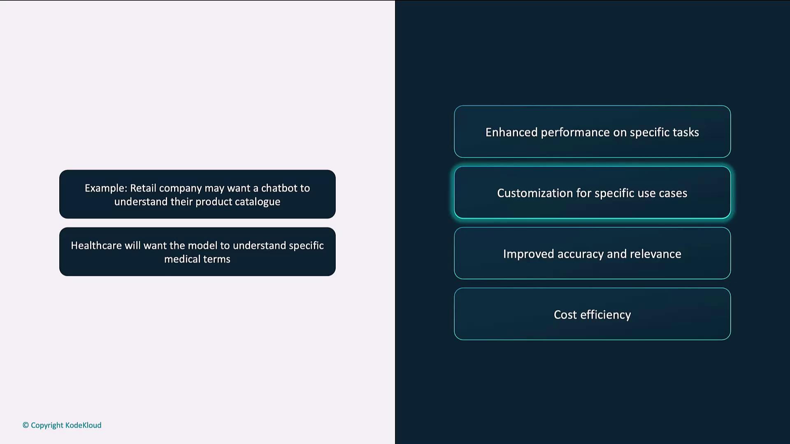
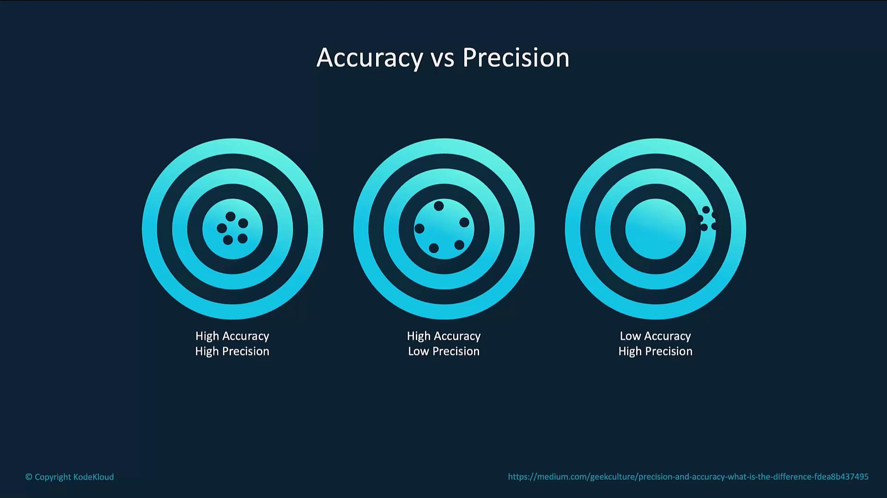
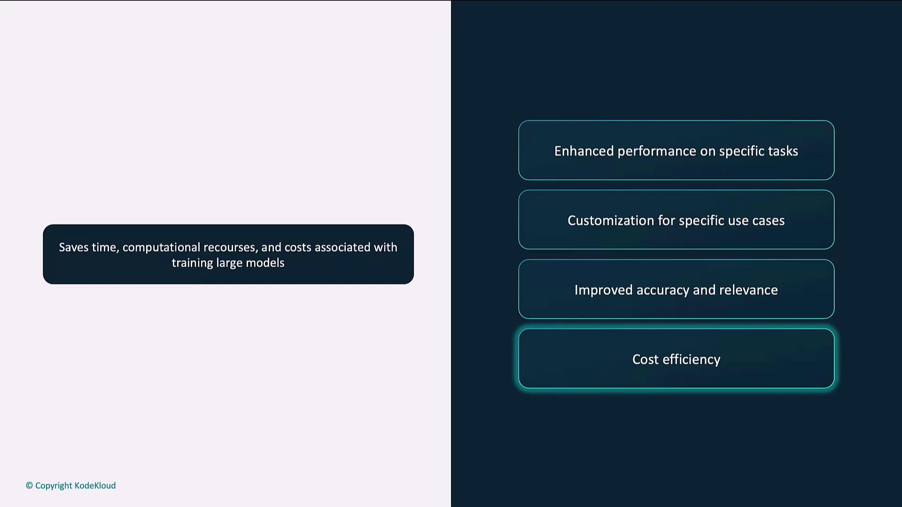
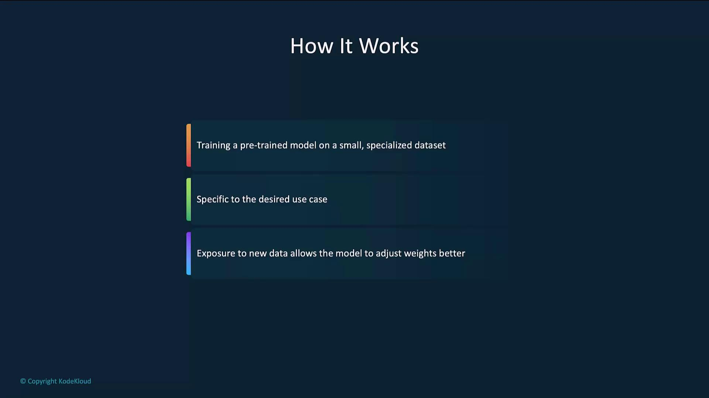
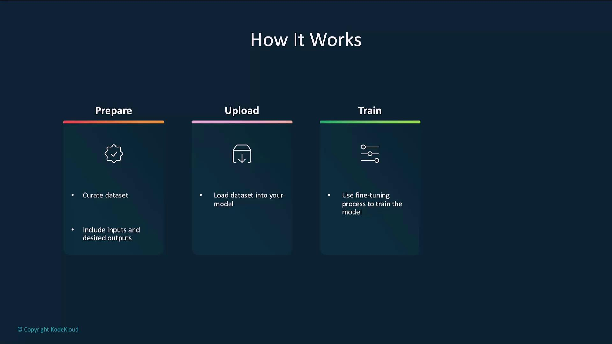
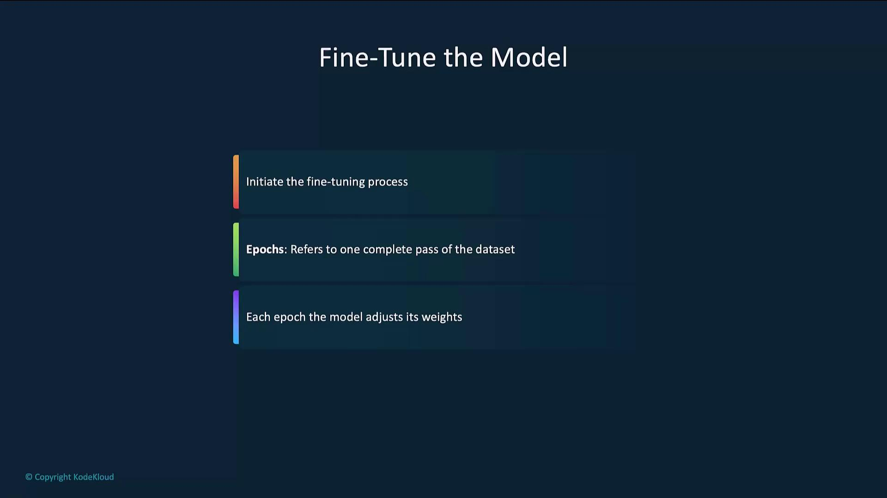
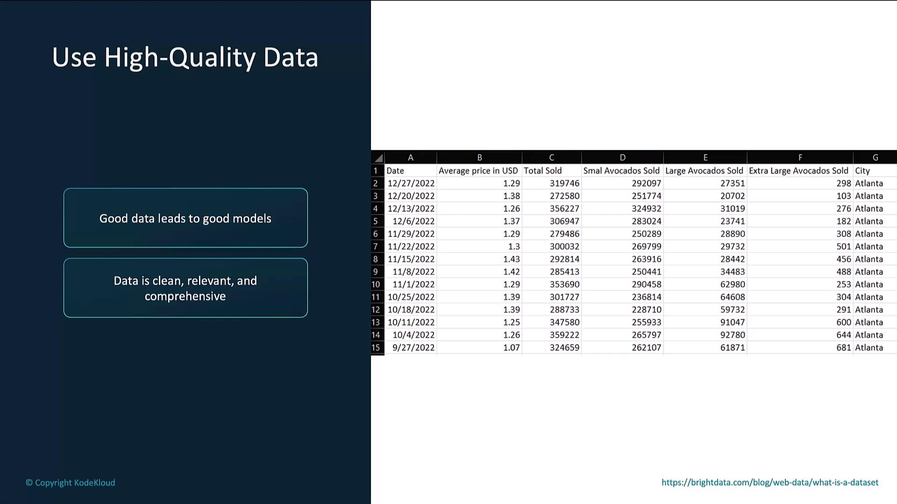
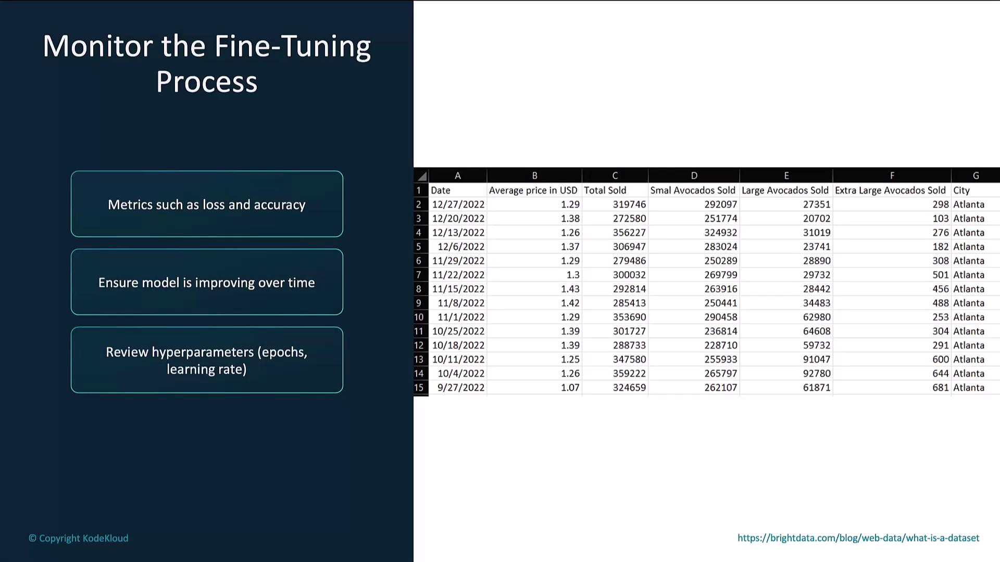

# Fine Tuning

Source: https://notes.kodekloud.com/docs/Introduction-to-OpenAI/Text-Generation/Fine-Tuning/page

Fine-tuning enhances pre-trained language models for specific tasks, improving relevance, accuracy, and efficiency without starting from scratch.

Fine-tuning teaches a pre-trained language model to excel on your specific tasks. By training on a domain-focused dataset, you improve relevance, accuracy, and cost efficiency without starting from scratch.

## Why Fine-Tune?

When a base model’s general-purpose knowledge falls short, fine-tuning bridges the gap. Key benefits include:

| Benefit              | Description                                       |
| -------------------- | ------------------------------------------------- |
| Enhanced Performance | Optimize for task-specific language patterns.     |
| Custom Use Cases     | Tailor outputs to your industry or application.   |
| Improved Accuracy    | Generate more precise and relevant responses.     |
| Cost Efficiency      | Save compute and time versus full-model training. |

### Customization for Specific Use Cases

Fine-tuning adapts models like GPT-4 to handle domain terminology and workflows. For instance:

* A retail chatbot that understands product catalogs and return policies
* A healthcare assistant trained on medical language and compliance

<Frame>
  
</Frame>

## Accuracy vs. Precision

Balancing accuracy (closeness to the correct answer) with precision (consistency across runs) is crucial:

| Scenario                           | Accuracy | Precision | Outcome                         |
| ---------------------------------- | -------- | --------- | ------------------------------- |
| Consistently correct responses     | High     | High      | Reliable and repeatable output  |
| Generally correct but varied style | High     | Low       | Good answers, inconsistent form |
| Consistently wrong responses       | Low      | High      | Repeated errors                 |

<Frame>
  
</Frame>

## Cost Efficiency

Fine-tuning reuses existing model weights, drastically reducing training time and compute costs:

* Leverage pre-trained parameters
* Shorter training cycles
* Lower resource consumption

<Frame>
  
</Frame>

## How Fine-Tuning Works

The process refines a pre-trained model on your labeled dataset while preserving its broad knowledge:

1. Prepare the dataset
2. Upload the dataset
3. Train the model
4. Evaluate the model

<Frame>
  
</Frame>

### High-Level Flow

<Frame>
  
</Frame>

## Example Code

Below is a step-by-step example using the OpenAI Python SDK.

### 1. Prepare the Dataset

Each line in a JSONL file should contain a `prompt` and `completion` object.

```json theme={null}
{"prompt": "Generate a confidentiality agreement clause:", "completion": "The Parties agree to keep all information confidential..."}
{"prompt": "Create a termination clause for a contract:", "completion": "This Agreement may be terminated by either party upon written notice..."}
```

<Callout icon="lightbulb">
  Ensure your JSONL file follows the [JSONL specification](https://jsonlines.org/) and that prompts/completions accurately reflect your target style.
</Callout>

### 2. Upload the Dataset

Use the Files endpoint to register your dataset for fine-tuning.

```python theme={null}
from openai import OpenAI

client = OpenAI()

client.files.create(
    file=open("mydata.jsonl", "rb"),
    purpose="fine-tune"
)
```

### 3. Fine-Tune the Model

Start a fine-tuning job by specifying the training file, base model, and hyperparameters.

```python theme={null}
from openai import OpenAI

client = OpenAI()

client.fine_tuning.jobs.create(
    training_file="file-abc123",
    model="gpt-4o-mini-2024-07-18",
    hyperparameters={
        "n_epochs": 2
    }
)
```

An **epoch** is one pass over the entire dataset. Multiple epochs let the model gradually refine its parameters.

<Frame>
  
</Frame>

### 4. Evaluate the Model

After fine-tuning, send test prompts to verify performance.

```python theme={null}
from openai import OpenAI

client = OpenAI()

completion = client.chat.completions.create(
    model="your-fine-tuned-model-id",
    messages=[
        {"role": "system", "content": "You are a helpful assistant."},
        {"role": "user", "content": "Write a haiku about recursion in programming."}
    ]
)

print(completion.choices[0].message.content)
```

## Best Practices

### Use High-Quality Data

High-quality, relevant data drives better models. Clean and validate entries before fine-tuning.

| Date       | Price | Quantity Sold | City        |
| ---------- | ----- | ------------- | ----------- |
| 2024-01-01 | 1.20  | 150           | New York    |
| 2024-01-02 | 1.30  | 200           | Los Angeles |

<Frame>
  
</Frame>

<Callout icon="lightbulb">
  Manually review samples to ensure consistency and remove noisy entries.
</Callout>

### Start with a Small Dataset

Begin with a smaller dataset to gauge model behavior before scaling to larger volumes.

### Monitor the Fine-Tuning Process

Track metrics such as loss and accuracy. If you see overfitting or stalled progress, adjust hyperparameters (e.g., learning rate, epochs).

<Frame>
  
</Frame>

## Links and References

* [OpenAI Fine-Tuning Guide](https://platform.openai.com/docs/guides/fine-tuning)
* [JSONL Format Specification](https://jsonlines.org/)
* [OpenAI Python SDK](https://github.com/openai/openai-python)

<CardGroup>
  <Card title="Watch Video" icon="video" href="https://learn.kodekloud.com/user/courses/introduction-to-openai/module/b6b7bec7-ed21-47d5-afbb-663df59f5e97/lesson/8e0deb58-1be3-473d-a0b4-b769c359438b" />
</CardGroup>
