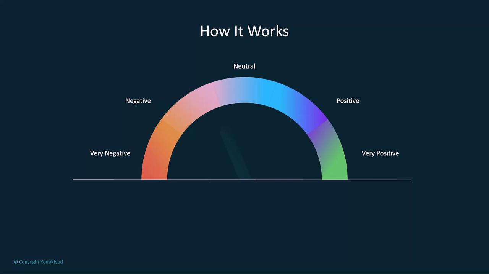
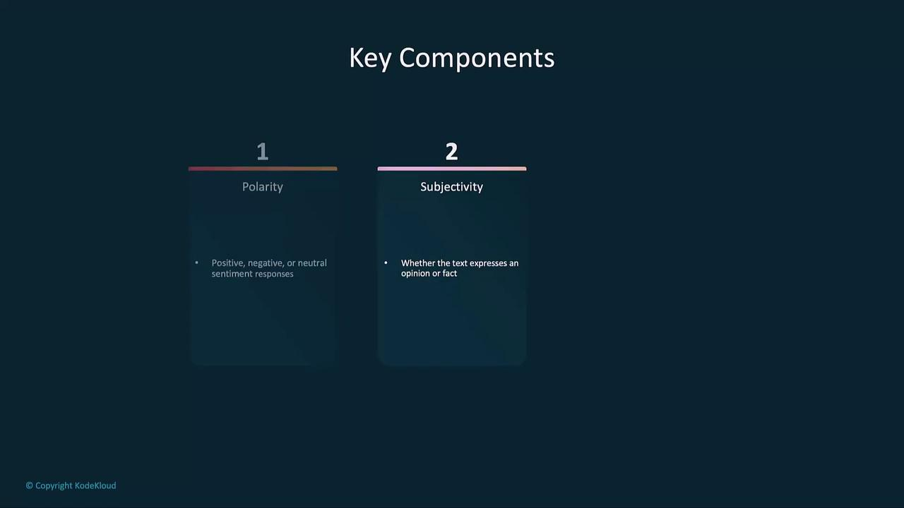

# Sentiment Analysis With OpenAI

Source: https://notes.kodekloud.com/docs/Introduction-to-OpenAI/Text-Generation/Sentiment-Analysis-With-OpenAI/page

This guide explores sentiment analysis using OpenAIs GPT-4 model, covering its importance, implementation, and real-world applications.

In this guide, we’ll dive into sentiment analysis using OpenAI’s GPT-4 model. You’ll learn:

* Why sentiment analysis matters
* How sentiment classification works
* Implementing basic and advanced sentiment analysis with GPT-4
* Real-world applications and best practices

## Table of Contents

* [Importance of Sentiment Analysis](#importance-of-sentiment-analysis)
* [How It Works](#how-it-works)
* [Sentiment Analysis with GPT-4](#sentiment-analysis-with-gpt-4)
  * [Basic Sentiment Classification](#basic-sentiment-classification)
* [Advanced Sentiment Analysis](#advanced-sentiment-analysis)
  * [Fine-Grained Sentiment Categories](#fine-grained-sentiment-categories)
  * [Domain-Specific Fine-Tuning](#domain-specific-fine-tuning)
  * [Aspect-Based Sentiment Analysis](#aspect-based-sentiment-analysis)
* [Applications](#applications)
* [Links and References](#links-and-references)

***

## Importance of Sentiment Analysis

Sentiment analysis transforms unstructured text into actionable insights. Organizations leverage it to:

1. **Extract Insights from Large Datasets**\
   Analyze product reviews, social media comments, and support tickets in bulk to discover trends—e.g., recurring feature requests or complaints.

2. **Understand Customer Feedback**\
   Classify feedback as positive, negative, or neutral so teams can prioritize improvements like faster shipping or improved support.

3. **Monitor Brand Perception**\
   Track real-time sentiment on platforms such as Twitter or Facebook to gauge public reaction to marketing campaigns or product launches.

4. **Enhance Customer Service**\
   Automatically flag negative tickets so agents can promptly address unhappy customers and boost satisfaction.

5. **Track Market Sentiment**\
   In finance, sentiment signals from news articles and social media can guide short-term trading strategies around earnings announcements.

<Frame>
  
</Frame>

***

## How It Works

Sentiment analysis models determine the **polarity**, **subjectivity**, and **intensity** of a given text. GPT-4 fine-tuned for sentiment tasks can classify reviews, comments, and more with high accuracy.

<Frame>
  
</Frame>

Key components of sentiment classification:

* **Polarity**: Positive, negative, or neutral orientation
* **Subjectivity**: Opinionated vs. objective content
* **Intensity**: Strength of the sentiment (e.g., mildly positive vs. strongly positive)

<Frame>
  
</Frame>

***

## Sentiment Analysis with GPT-4

Below are examples showing how to call OpenAI’s API for sentiment detection in customer service reviews and social media posts.

### Basic Sentiment Classification

```python theme={null}
import openai

openai.api_key = "YOUR_API_KEY"

def analyze_sentiment(text):
    response = openai.ChatCompletion.create(
        model="gpt-4",
        messages=[
            {"role": "user", "content": f"Analyze the sentiment of the following text: '{text}'"}
        ],
        max_tokens=60,
        temperature=0.0
    )
    sentiment = response.choices[0].message.content.strip()
    return sentiment
