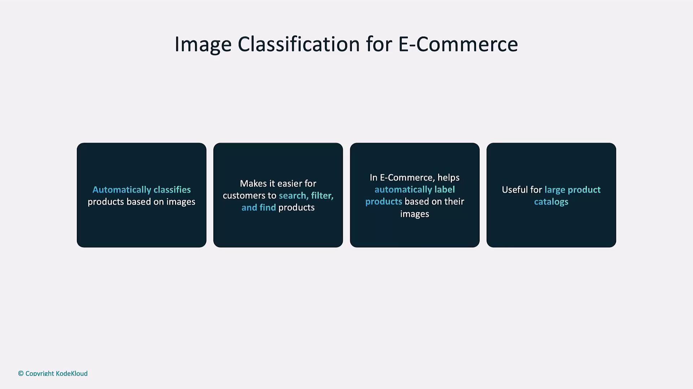
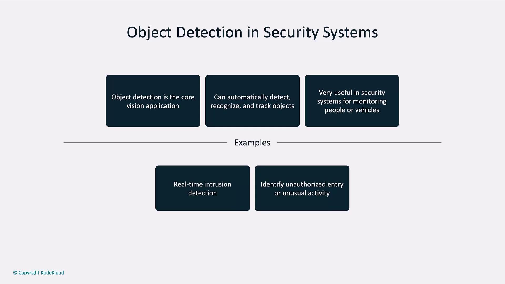
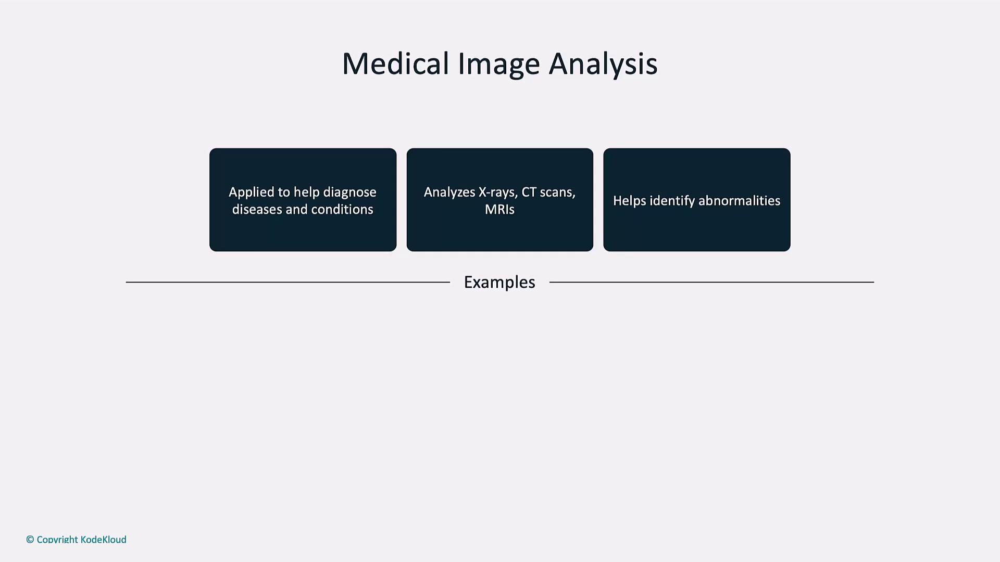
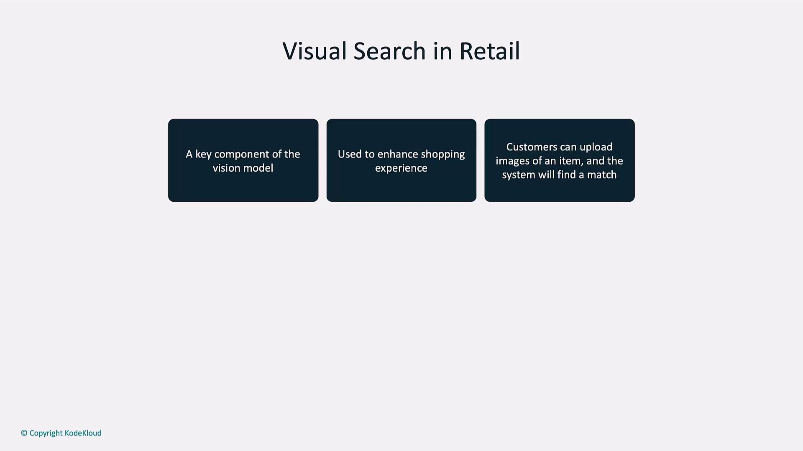

# Practical Vision Applications

Source: https://notes.kodekloud.com/docs/Introduction-to-OpenAI/Vision/Practical-Vision-Applications/page

This guide explores five high-impact use cases for vision models in various industries showcasing efficiency and innovation.

In this guide, we explore five high-impact use cases for vision models such as [OpenAI’s CLIP](https://openai.com/research/clip) and [DALL·E](https://openai.com/product/dall-e). From retail automation to autonomous navigation, these applications showcase how computer vision drives efficiency and innovation.

| Application Area                    | Key Benefit                                                   |
| ----------------------------------- | ------------------------------------------------------------- |
| Image Classification for E-commerce | Automatic tagging, improved search, seamless catalog uploads  |
| Object Detection & Security Systems | Real-time intrusion alerts and crowd monitoring               |
| Medical Image Analysis              | Rapid detection of fractures, tumors, and other abnormalities |
| Visual Search in Retail             | Image-based product discovery and style recommendations       |
| Autonomous Vehicles                 | Object, lane, and obstacle detection for self-driving cars    |

***

## 1. Image Classification for E-commerce

Automated image classification helps online retailers tag thousands of products by style, material, or color—boosting search relevance and reducing manual effort.

* Automatically label new inventory
* Enhance on-site search filters
* Maintain consistent metadata across catalogs

<Callout icon="lightbulb">
  Use high‐quality, well-lit images to improve classification accuracy. Crop tightly around the product to reduce background noise.
</Callout>

<Frame>
  
</Frame>

Example: Identify the contents of a product image via URL using OpenAI’s Vision API.

```python theme={null}
from openai import OpenAI

client = OpenAI(api_key="YOUR_API_KEY")

response = client.chat.completions.create(
    model="gpt-4o-mini",
    messages=[
        {"role": "user", "content": [
            {"type": "text", "text": "What’s in this image?"},
            {"type": "image_url", "image_url": {
                "url": "https://upload.wikimedia.org/wikipedia/commons/thumb/d/dd/Gfp-wisconsin-madison-the-nature-boardwalk.jpg/2560px-Gfp-wisconsin-madison-the-nature-boardwalk.jpg"
            }}
        ]}
    ],
    max_tokens=300,
)

print(response.choices[0].message.content)
```

The model accurately describes a scenic outdoor boardwalk framed by trees, greenery, blue sky, and clouds.

***

## 2. Object Detection and Security Systems

Real-time object detection enables smart surveillance solutions that identify people, vehicles, and unauthorized access in critical areas.

* Intrusion detection in restricted zones
* Automated alerts for security teams
* Crowd density monitoring and flow analysis

<Callout icon="lightbulb">
  Deploy inference on edge devices to minimize latency and avoid sending raw video feeds over the network.
</Callout>

<Frame>
  
</Frame>

A typical workflow: the camera detects a person in a no-entry zone and instantly notifies on-duty personnel.

***

## 3. Medical Image Analysis

Vision models support radiologists by quickly flagging anomalies in X-rays, CT scans, and MRIs—helping to detect fractures, tumors, and infections with high sensitivity.

<Frame>
  
</Frame>

<Callout icon="triangle-alert">
  This tool is for preliminary assessment only. Always consult a licensed medical professional for diagnosis and treatment.
</Callout>

**Example: Detecting a Forearm Fracture**

```python theme={null}
response = client.chat.completions.create(
    model="gpt-4o-mini",
    messages=[
        {"role": "user", "content": [
            {"type": "text", "text": "Examine this medical image. Explain what the injury is."},
            {"type": "image_url", "image_url": {
                "url": "https://media02.stockfood.com/largepreviews/MzU50Dg1NTQx/11609211-Broken-arm-X-ray.jpg"
            }}
        ]}
    ],
    max_tokens=300,
)

print(response.choices[0].message.content)
```

The model pinpoints a fractured radius and ulna, illustrating its potential for faster preliminary diagnoses.

***

## 4. Visual Search in Retail

Visual search transforms online shopping by letting users upload photos to find matching or similar products—driving higher engagement and conversion rates.

* Snap-and-search for apparel, accessories, or home decor
* Instantly retrieve visually similar catalog items
* Personalize recommendations based on style features

<Frame>
  
</Frame>

A shopper uploads a photo of a pair of sneakers, and the system returns available styles with comparable color, design, and brand.

***

## 5. Autonomous Vehicles

Self-driving cars rely on computer vision for perception tasks crucial to safe navigation:

* Real-time object detection (vehicles, pedestrians, traffic signals)
* Lane and road edge detection
* Dynamic obstacle avoidance

**Example: Road Scene Description**

```python theme={null}
response = client.chat.completions.create(
    model="gpt-4o-mini",
    messages=[
        {"role": "user", "content": [
            {"type": "text", "text": "You are an autonomous vehicle. Describe what you detect in front of you."}
        ]},
        {"role": "user", "content": [
            {"type": "image_url", "image_url": {
                "url": "https://media.istockphoto.com/id/636690722/photo/driving-at-sunset-view-from-the-driver-angle-car-focusinside.jpg?s=612x612&w=0&k=20&c=B-D5L7GVi93AhjfoLngbxHB8AEBjXPk_ZQ8tZEmSBo="
            }}
        ]}
    ],
    max_tokens=300,
)

print(response.choices[0].message.content)
```

The model identifies traffic lights, nearby cars, lane markings, road conditions, and potential pedestrians—demonstrating robust scene understanding.

***

## Links and References

* [OpenAI Vision API Guide](https://platform.openai.com/docs/guides/images)
* [Kubernetes Documentation](https://kubernetes.io/docs/)
* [Docker Hub](https://hub.docker.com/)
* [Terraform Registry](https://registry.terraform.io/)

<CardGroup>
  <Card title="Watch Video" icon="video" href="https://learn.kodekloud.com/user/courses/introduction-to-openai/module/d76ba88f-ebc6-4d12-8aa5-9359bc23be72/lesson/927f1b53-a94c-4b9b-9373-a1f1bc67e490" />
</CardGroup>
