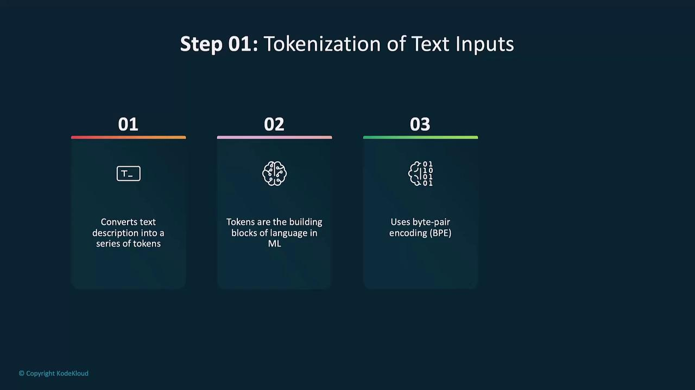
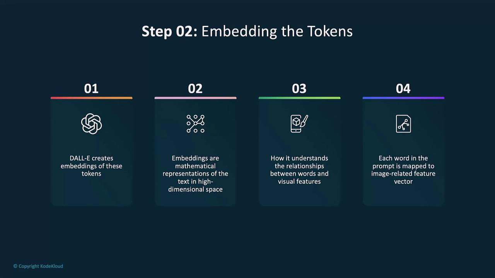
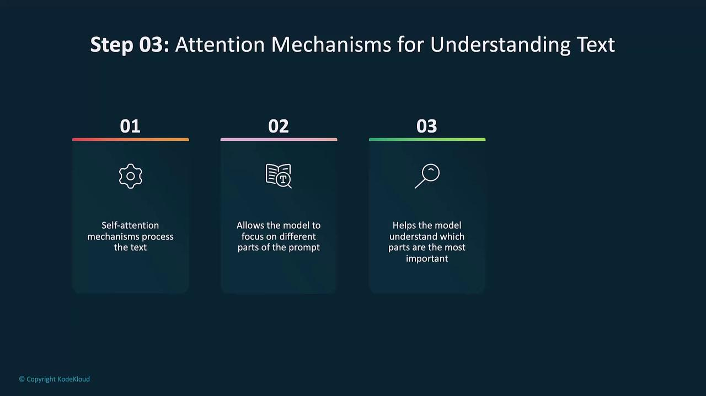
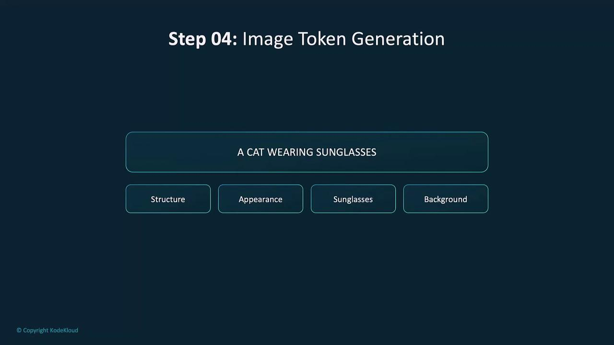
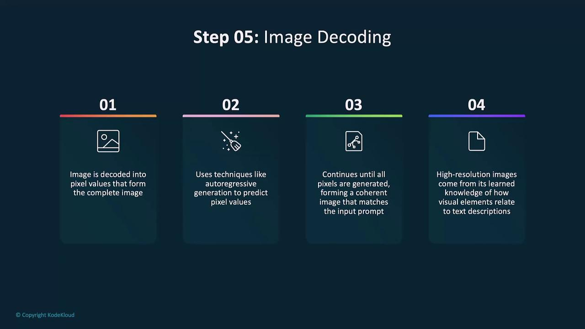
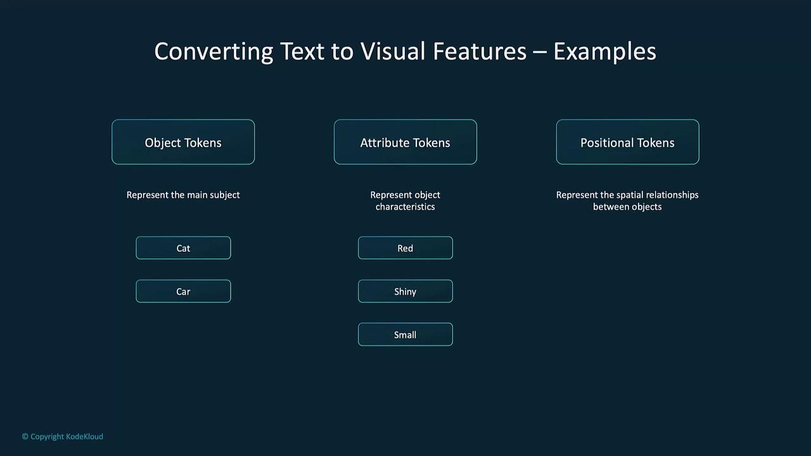
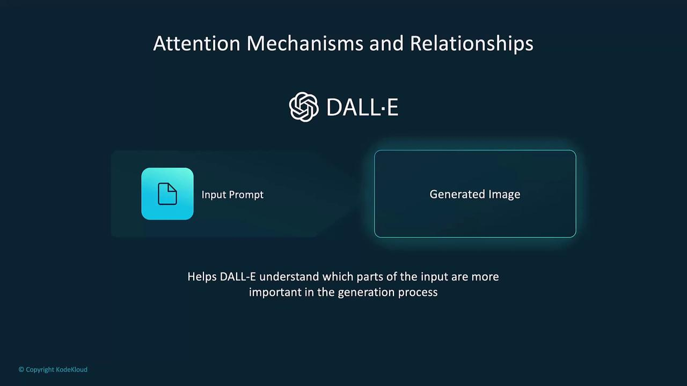
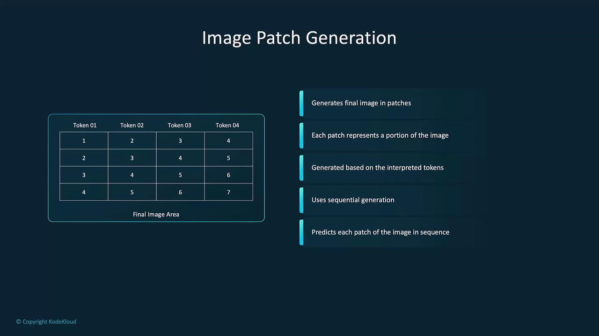

# Understanding DALL E Text to Image Generation

Source: https://notes.kodekloud.com/docs/Introduction-to-OpenAI/Vision/Understanding-DALL-E-Text-to-Image-Generation/page

This guide explores how DALL·E transforms text prompts into high-resolution, coherent images using a detailed pipeline.

In this guide, we’ll explore how DALL·E transforms text prompts into high-resolution, coherent images. Built on the transformer architecture, DALL·E’s pipeline involves:

* Tokenizing text
* Mapping tokens to embeddings
* Applying self-attention over text
* Predicting discrete image tokens
* Decoding tokens into pixels
* Assembling and refining image patches

## Pipeline Overview

| Stage                   | Purpose                                                 |
| ----------------------- | ------------------------------------------------------- |
| Tokenization            | Split prompt into subword tokens using BPE              |
| Embedding               | Map each token to a high-dimensional vector             |
| Text Self-Attention     | Capture contextual relationships between tokens         |
| Image Token Generation  | Predict discrete image tokens for structure & style     |
| Image Decoding          | Autoregressively convert tokens into pixel values       |
| Patch Assembly & Render | Stitch patches and refine pixels into a seamless output |

## 1. Tokenization

DALL·E begins by tokenizing your input prompt. Using Byte-Pair Encoding (BPE), the model splits text into subword tokens, ensuring efficient coverage of vocabulary.

<Frame>
  
</Frame>

Example in Python:

```python theme={null}
text = "a cat wearing sunglasses"
tokens = ["a", " cat", " wear", "ing", " sun", "glass", "es"]
```

These tokens serve as the basis for all subsequent stages.

## 2. Embedding Tokens

Each token is then projected into a continuous embedding space. These dense vectors capture semantic meaning and link text to visual concepts.

<Frame>
  
</Frame>

For example, the token for “cat” encodes feline features, while “sunglasses” reflects accessory attributes.

## 3. Attention Mechanisms for Text

DALL·E employs self-attention to weigh the importance of each token relative to others. This allows the model to focus on key phrases and capture dependencies between words.

<Frame>
  
</Frame>

For the prompt “a red apple next to a green banana,” attention disentangles color attributes and models their spatial arrangement.

## 4. Image Token Generation

Once text embeddings are ready, the decoder predicts image tokens. Each token represents discrete visual elements such as shape, color, or texture.

<Frame>
  
</Frame>

In our example, DALL·E generates tokens for structure (cat silhouette), appearance (fur color), accessory (sunglasses), and background.

## 5. Image Decoding

Image tokens are converted into pixel values through autoregressive decoding. Pixels are generated sequentially, ensuring smooth transitions and detailed structure.

<Frame>
  
</Frame>

<Callout icon="lightbulb">
  Typical output resolutions are 512×512 or 1024×1024. You can adjust this setting via API parameters.
</Callout>

## 6. Transforming Prompts into Visual Features

DALL·E categorizes tokens into three visual feature types:

| Token Type        | Role                                         |
| ----------------- | -------------------------------------------- |
| Object Tokens     | Main subjects (e.g., “cat,” “cabin”)         |
| Attribute Tokens  | Qualities (e.g., “red,” “cozy,” “snowfall”)  |
| Positional Tokens | Spatial relations (e.g., “next to,” “above”) |

<Frame>
  
</Frame>

Self-attention then prioritizes these features for accurate image generation.

<Frame>
  
</Frame>

*For “a blue bird sitting on a branch,” attention focuses on the bird–branch relationship to ensure correct placement.*

## 7. Image Patch Generation

Finally, DALL·E composes the image patch by patch. Each patch is generated based on the visual feature tokens. After prediction, patches are stitched together and refined at the pixel level.

<Frame>
  
</Frame>

<Callout icon="triangle-alert">
  If post-processing is skipped, patch seams may become visible. Always apply smoothing or filtering for production-ready images.
</Callout>

## Links and References

* [OpenAI DALL·E 2](https://openai.com/product/dall-e-2)
* [Transformer Architecture (Vaswani et al.)](https://arxiv.org/abs/1706.03762)
* [Byte-Pair Encoding (BPE) Explained](https://huggingface.co/learn/nlp-course/chapter7/7)
* [Self-Attention Mechanism Overview](https://www.tensorflow.org/text/guide/transformer)

<CardGroup>
  <Card title="Watch Video" icon="video" href="https://learn.kodekloud.com/user/courses/introduction-to-openai/module/d76ba88f-ebc6-4d12-8aa5-9359bc23be72/lesson/d8bfcd6c-7fb2-4377-a306-10430f72e272" />
</CardGroup>
