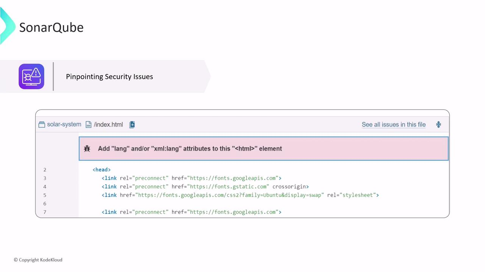
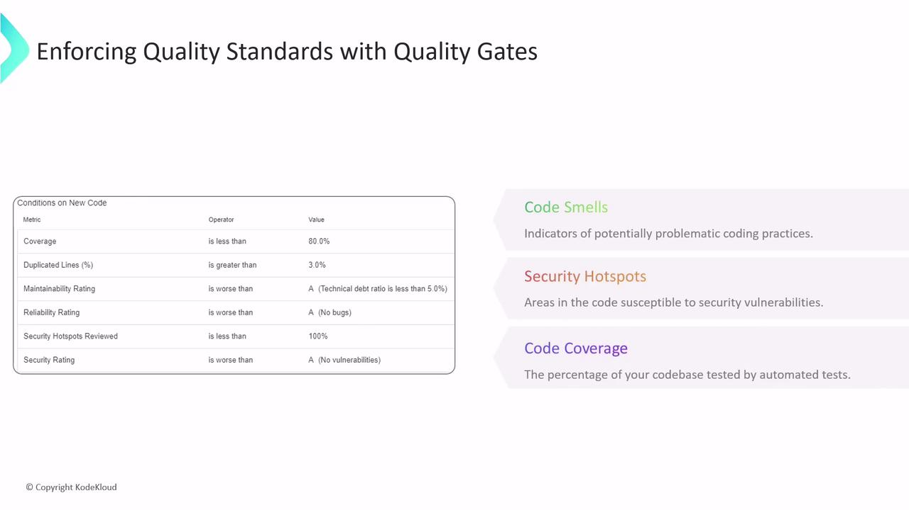
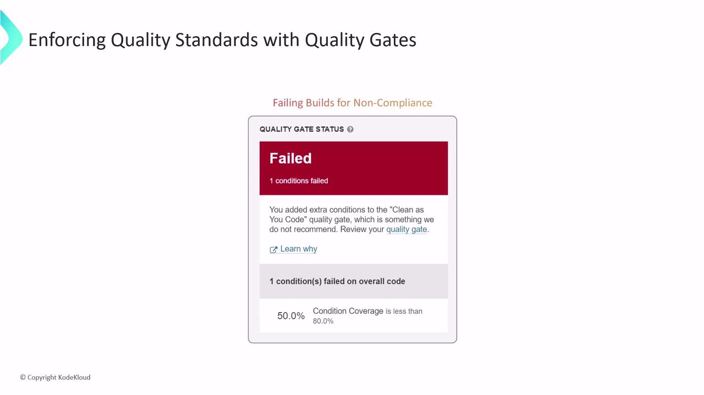

# SonarQube Intro

Source: https://notes.kodekloud.com/docs/Jenkins-Pipelines/Code-Quality-and-Testing/SonarQube-Intro/page

This article explores Static Application Security Testing using SonarQube to identify security vulnerabilities and ensure code quality through automated reviews and quality gates.

In this lesson, we explore Static Application Security Testing (SAST), often referred to as Static Analysis. This process examines your application's source code to identify potential security vulnerabilities, acting as a sophisticated code scanner that points out areas needing improvement.

We use SonarQube—an open-source platform from SonarSource—to perform our static analysis. SonarQube continuously monitors your code quality by conducting automated code reviews to ensure that your coding standards are met and maintained.

## Benefits of Static Analysis

Static analysis offers several key benefits:

* Detects bugs early in the development lifecycle, saving time and reducing the cost of fixes.
* Identifies sections of your code that may require restructuring or simplification.
* Automatically enforces project-specific coding rules to promote consistency and maintainability.

<Callout icon="lightbulb">
  Analyzing your code is only the first step. Addressing the flagged issues using SonarQube's detailed data is essential to improve your application's security and performance.
</Callout>

<Frame>
  
</Frame>

SonarQube scans your entire codebase and highlights specific lines where vulnerabilities are detected, providing actionable insights to reduce your project's risk and improve reliability.

## Quality Gates and Code Metrics

SonarQube introduces quality gates as checkpoints to ensure that your project meets predefined security and quality standards. You can set thresholds for various metrics, including:

* **Code Smells:** Indicators of potentially problematic coding practices.
* **Security Hotspots:** Sections of code that might expose vulnerabilities.
* **Code Coverage:** The percentage of your codebase covered by automated tests.

<Frame>
  
</Frame>

If any quality gate condition is not met, the build process is halted. This ensures that only code meeting your high quality standards moves forward in the development pipeline.

<Frame>
  
</Frame>

<Callout icon="triangle-alert">
  Ensure that your quality gate thresholds are properly configured to prevent substandard code from progressing into production.
</Callout>

<CardGroup>
  <Card title="Watch Video" icon="video" href="https://learn.kodekloud.com/user/courses/jenkins-pipelines/module/bcd4711c-8a69-4218-a65c-113fd7a7a88d/lesson/1a54d06c-af35-481a-ad3f-b8e0dbbb6f94" />
</CardGroup>
