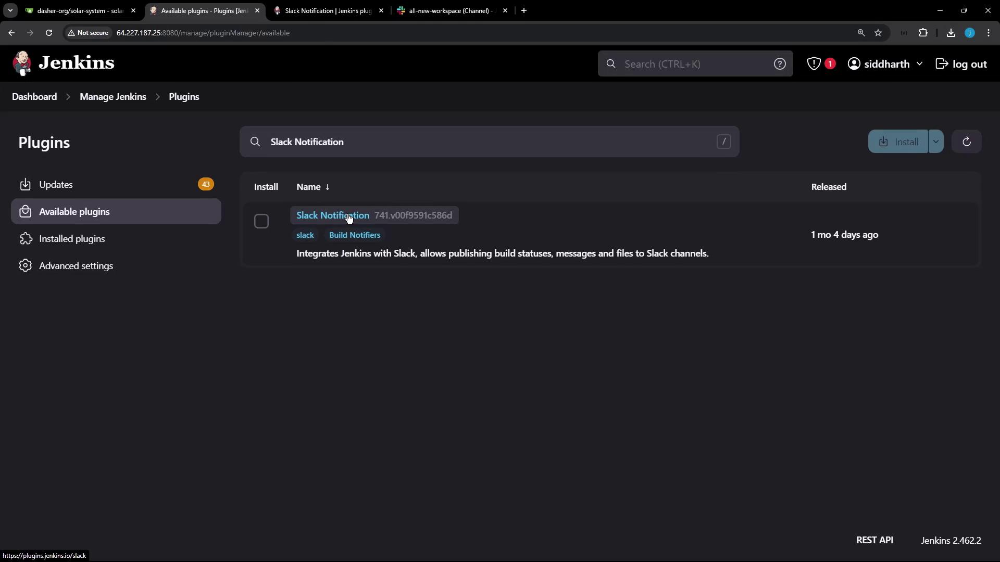
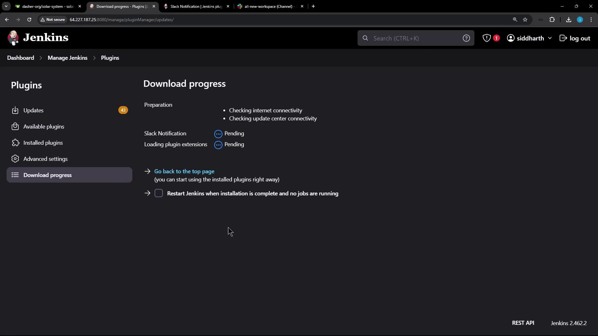
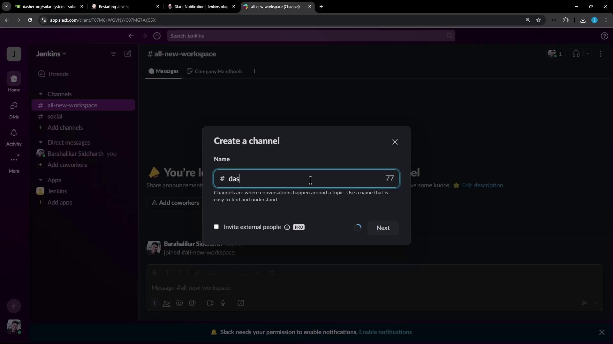
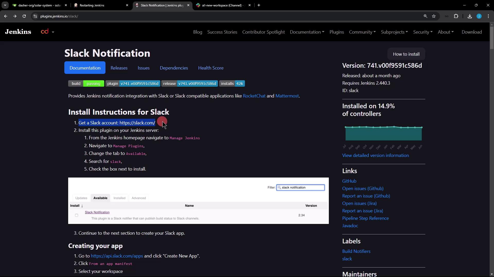
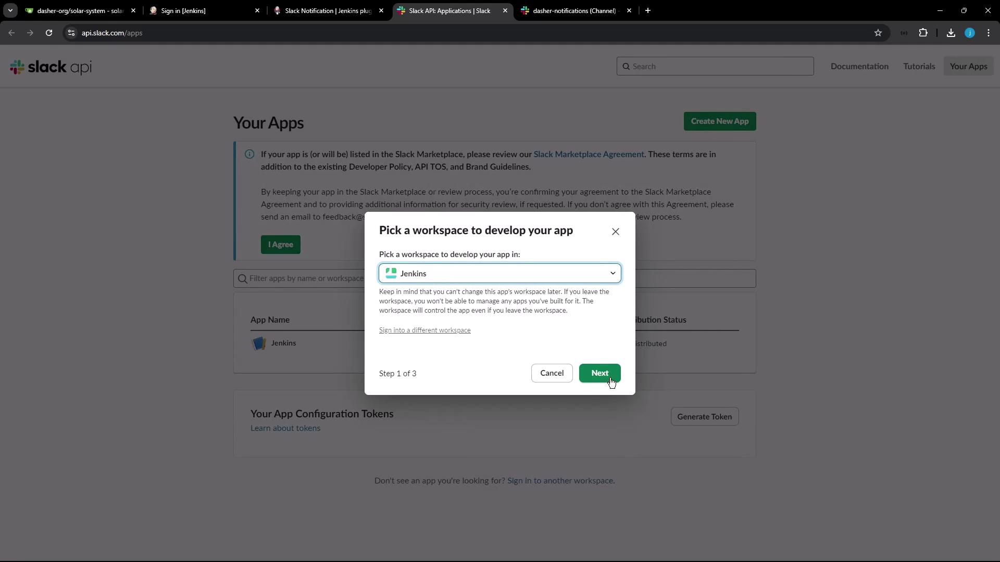
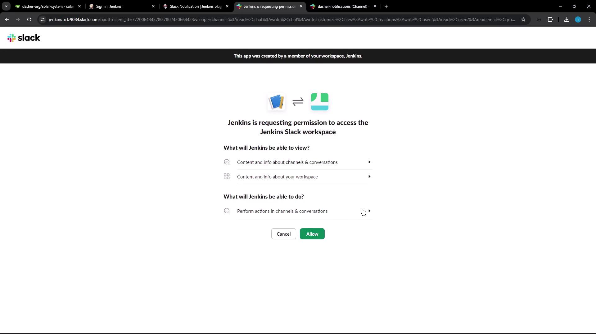
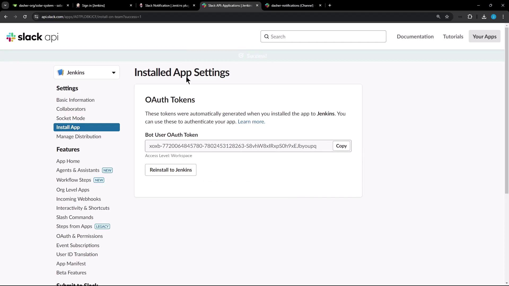
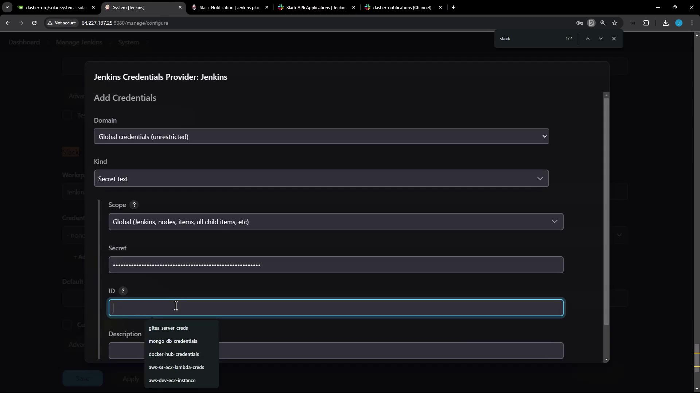

# Slack Notification Setup

Source: https://notes.kodekloud.com/docs/Jenkins-Pipelines/Jenkins-Administration-and-Monitoring/Slack-Notification-Setup/page

Learn to integrate the Slack Notification plugin with Jenkins for automatic build status messages in Slack channels.

In this lesson, you'll learn how to integrate the Slack Notification plugin with Jenkins to automatically publish build status messages to your Slack channels. This guide provides a step-by-step approach, complete with configuration details and example code blocks to help you set up and test notifications effectively.

***

## Step 1: Install the Slack Notification Plugin

Begin by installing the Slack Notification plugin on your Jenkins instance. This plugin is accessible via the Plugin Manager in Jenkins, helping to integrate Jenkins with Slack by sending build status messages.

<Frame>
  
</Frame>

After locating the plugin using the search feature, proceed with its installation. You can monitor the plugin download progress during the installation process:

<Frame>
  
</Frame>

Once the installation is complete, restart Jenkins to apply the new settings.

***

## Step 2: Review Slack Notification Plugin Documentation

Before diving into configuration, it is essential to review the Slack Notification plugin documentation. If you are new to Slack, first create an account and set up your workspace. Within this workspace, create a dedicated Slack channel for receiving Jenkins notifications. For instance, you might create a channel named "Dasher notifications."

<Frame>
  
</Frame>

***

## Step 3: Create a Slack App from Manifest

Next, create a new Slack App in your workspace. In Slack’s app configuration, choose to create an app from an app manifest. Select your workspace (for our purposes, the Jenkins workspace), and replace any pre-filled content with the YAML manifest provided below.

<Frame>
  
</Frame>

### YAML Manifest for Slack App

Use the following YAML manifest, which includes all required bot scopes for full functionality:

```yaml theme={null}
display_information:
  name: Jenkins
features:
  bot_user:
    display_name: Jenkins
    always_online: true
oauth_config:
  scopes:
    bot:
      - channels:read
      - chat:write
      - chat:write.customize
      - files:write
      - reactions:write
      - users:read
      - users:read.email
      - app_mentions:read
      - groups:read
      - users:read:admin
      - gnpubs:read
settings:
  org_deploy_enabled: false
  socket_mode_enabled: false
  token_rotation_enabled: false
```

After pasting the manifest into Slack’s configuration, click **Next**. You will see a summary page displaying the eight permissions associated with your bot user.

<Frame>
  
</Frame>

Review the summary details:

```yaml theme={null}
1  display_information:
2    name: Jenkins
3  features:
4    bot_user:
5      display_name: Jenkins
6      always_online: true
7  oauth_config:
8    scopes:
9      bot:
10       - channels:read
11       - chat:write
12       - chat:write.customize
13       - files:write
14       - reactions:write
15       - users:read
16       - users:read.email
17       - app_mentions:read
18  settings:
19    org_deploy_enabled: false
20    socket_mode_enabled: false
21    token_rotation_enabled: false
```

When you are satisfied with the configuration details, click **Create**. Once the app creation process is complete, Slack will provide you with an OAuth token. Be sure to click **Install App to Workspace** when prompted to ensure the app is properly installed in your Slack workspace.

At times, you might encounter an alternative version of the manifest used internally by Slack, such as:

```yaml theme={null}
display_name: Jenkins
always_online: true
oauth_config:
  scopes:
    bot:
      - channels:read
      - chat:write
      - files:write
      - reactions:write
      - users:read
      - users:read:admin
      - gnpubs:read
settings:
  oauth_mic_enabled: true
  socket_mode_enabled: false
  token_rotation_enabled: false
```

After the installation, keep the provided OAuth token secure as it is crucial for connecting Jenkins with Slack.

<Frame>
  
</Frame>

You can also review the installed app settings and OAuth token information:

<Frame>
  
</Frame>

***

## Step 4: Configure Slack Credentials in Jenkins

With your OAuth token ready, proceed to configure the Slack integration within Jenkins:

1. Navigate to **Manage Jenkins** → **Configure System**.
2. Locate the Slack notification settings.
3. Enter your workspace name (for example, Jenkins).
4. Create new credentials of type **Secret Text**, then paste your bot user OAuth token. For instance, set the credential ID as "Slack bot token."

<Frame>
  
</Frame>

After adding the credentials, select the newly created Slack token in your configuration settings. Specify the Slack channel where notifications should be sent (e.g., "Dasher notifications"). For advanced settings, you may leave the default values for icon emoji and username.

Click **Test Connection**. If you receive an error message like:

```plaintext theme={null}
Failure(["ok":false,"error":"not_in_channel"])
```

<Callout icon="triangle-alert">
  This error indicates that your Jenkins app user is not a member of the specified Slack channel. To resolve this, invite the Jenkins app to the channel by typing @Jenkins (or the app’s display name) within the channel.
</Callout>

Once the app is added to the channel, test the connection again until you receive a success confirmation.

To further verify the connection via a pipeline step, use the following command:

```groovy theme={null}
slackSend color: "good", message: "Message from Jenkins Pipeline"
```

This confirms that the integration is working correctly.

***

## Conclusion

With these steps completed, you have successfully set up Slack notifications in Jenkins. Your build statuses and messages will now be automatically posted to the designated Slack channel, ensuring that you stay informed of build outcomes in real time.

For further details about the Slack/Jenkins integration, you can visit the plugin page at [Jenkins Plugin Page](http://64.227.187.25:8080/).

Thank you for following this lesson.

<Callout icon="lightbulb">
  For more information, consider reviewing the following resources:

  * [Jenkins Documentation](https://www.jenkins.io/doc/)
  * [Slack API Documentation](https://api.slack.com/)
</Callout>

<CardGroup>
  <Card title="Watch Video" icon="video" href="https://learn.kodekloud.com/user/courses/jenkins-pipelines/module/f046d5d1-6fa6-4156-b38d-202ed885b64d/lesson/9b13f9d8-dbc7-4deb-834c-a8ddb5d71feb" />
</CardGroup>
