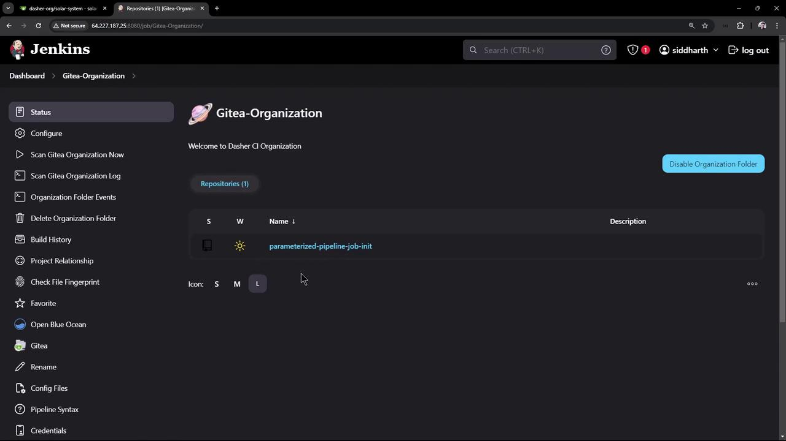
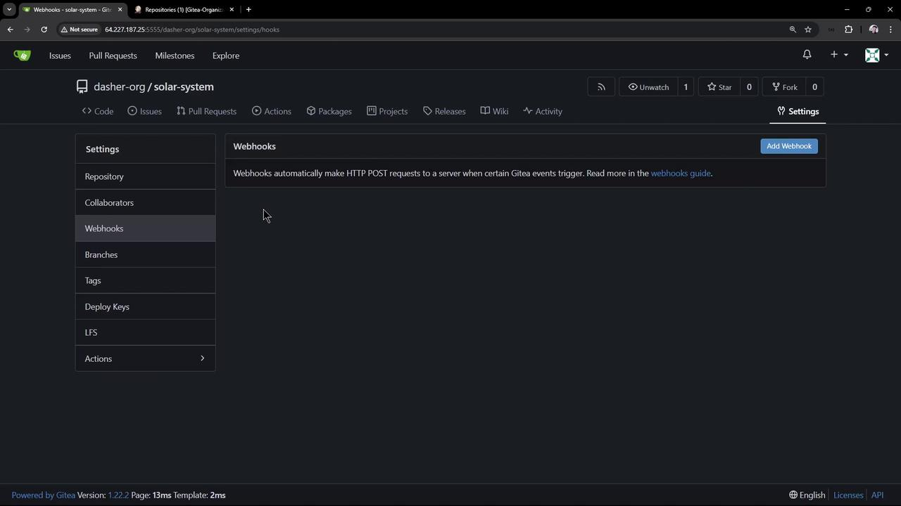
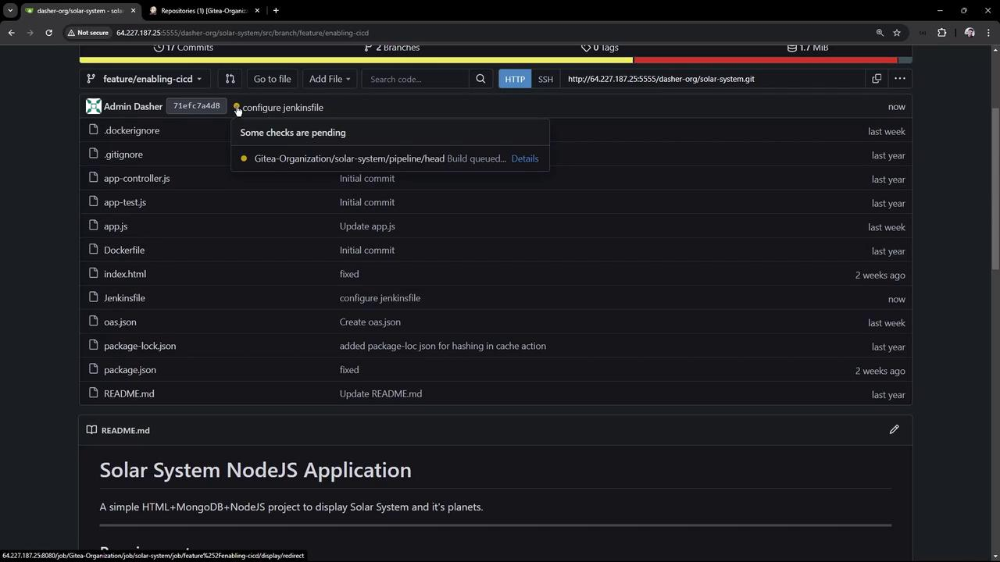
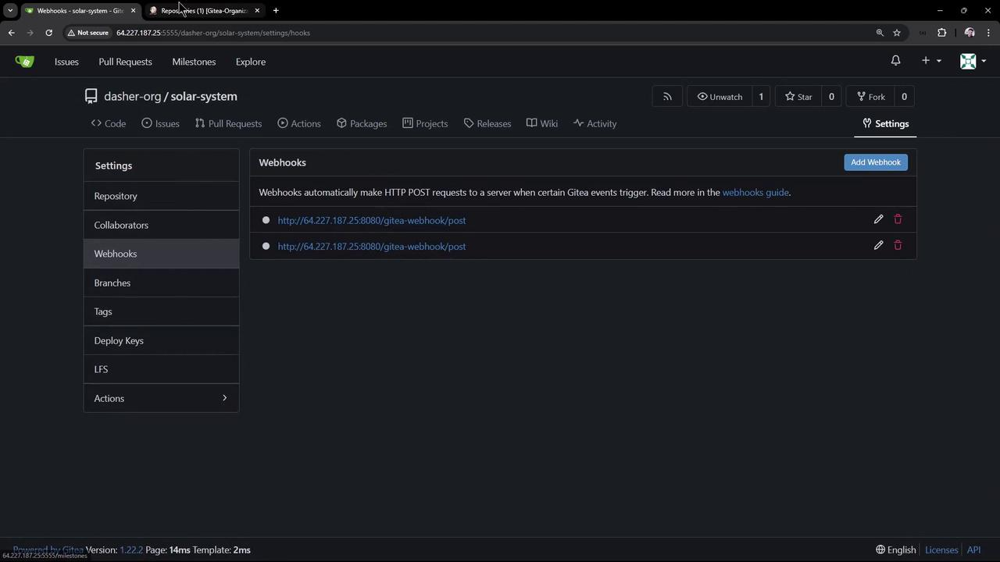
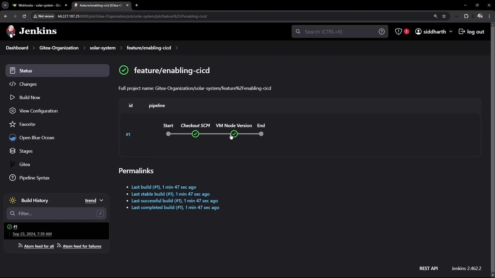
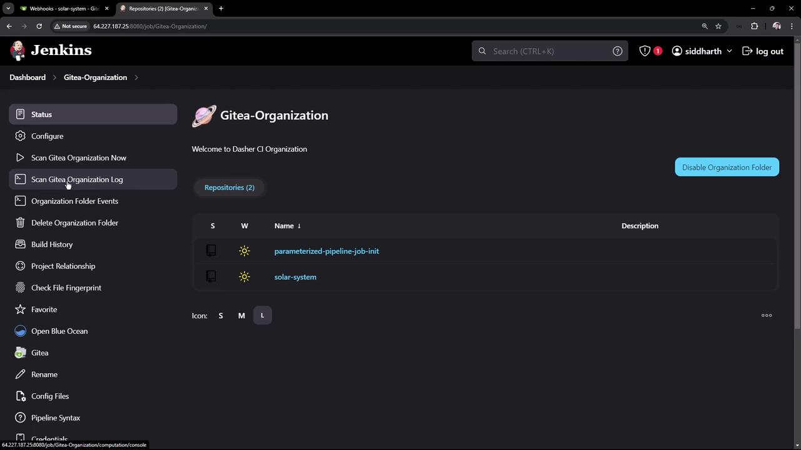
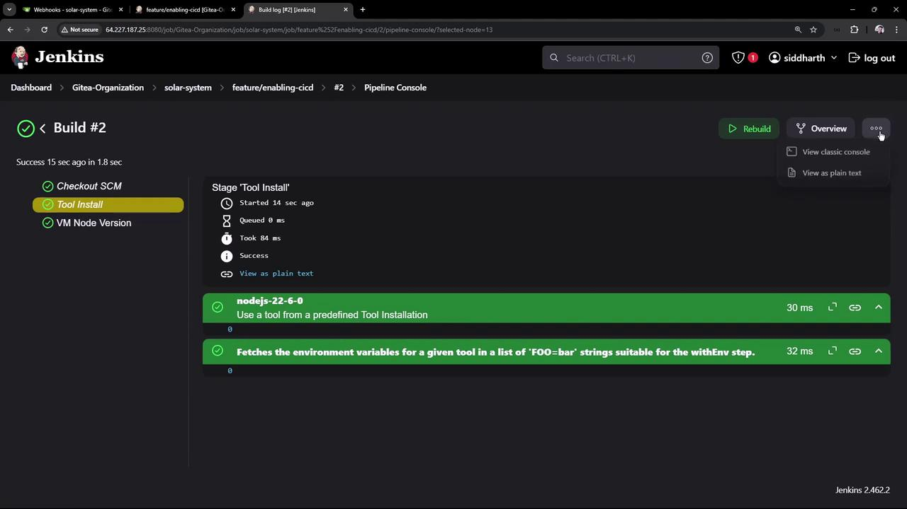
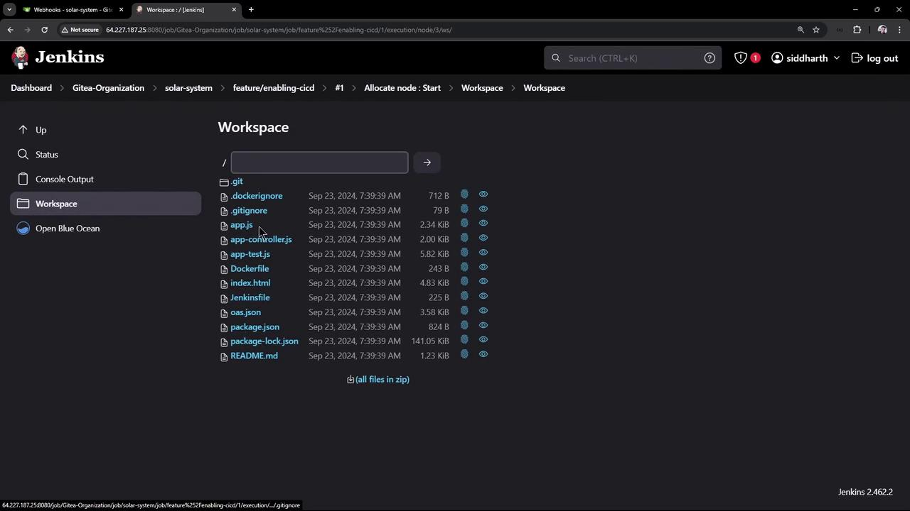

# Add Jenkinsfile to Solar System Repo

Source: https://notes.kodekloud.com/docs/Jenkins-Pipelines/Setting-Up-CI-Pipeline/Add-Jenkinsfile-to-Solar-System-Repo/page

This guide explains how to add a Jenkinsfile to the Solar System repository for enabling CI/CD automation.

This guide demonstrates how to configure a Jenkinsfile in the Solar System repository to enable CI/CD. Previously, a GITHUB organization folder was set up in Jenkins, which successfully discovered repositories containing a Jenkinsfile. Since the Solar System repository did not include a Jenkinsfile, it was not picked up by Jenkins, and the corresponding webhook was missing.

<Frame>
  
</Frame>

When you check the repository settings under webhooks, no webhook is present:

<Frame>
  
</Frame>

<Callout icon="lightbulb">
  Adding a Jenkinsfile to the repository allows Jenkins to automatically detect and trigger builds using webhooks. This setup ensures that every branch with a Jenkinsfile receives its own pipeline job.
</Callout>

## Enabling CI/CD with a Jenkinsfile

Follow these steps to add a Jenkinsfile to the Solar System repository and enable its CI/CD pipeline:

### 1. Clone the Repository

Clone the Solar System repository to your virtual machine:

```bash theme={null}
git clone http://64.227.187.25:5555/dasher-org/solar-system.git
Cloning into 'solar-system'...
remote: Enumerating objects: 83, done.
remote: Counting objects: 100% (83/83), done.
remote: Compressing objects: 100% (60/60), done.
remote: Total 83 (delta 23), reused 83 (delta 23), pack-reused 0 (from 0)
Receiving objects: 100% (83/83), 1.71 MiB | 35.72 MiB/s, done.
Resolving deltas: 100% (23/23), done.
cd solar-system
```

### 2. Create a Feature Branch

Create a new feature branch to add the Jenkinsfile and various pipeline stages:

```bash theme={null}
git checkout -b feature/enabling-cicd
Switched to a new branch 'feature/enabling-cicd'
```

### 3. Create and Configure the Jenkinsfile

In your project explorer, create a file named `Jenkinsfile` and add the following pipeline definition. This simple pipeline prints the Node.js and npm versions using a shell step:

```groovy theme={null}
pipeline {
    agent any

    stages {
        stage('VM Node Version') {
            steps {
                sh '''
                    node -v
                    npm -v
                '''
            }
        }
    }
}
```

Commit your changes and push the branch. Once the Jenkinsfile is committed, the webhook will trigger the pipeline automatically.

### 4. Verify in the Jenkins UI

Open the Jenkins UI and navigate to the Solar System repository. Verify that the `feature/enabling-cicd` branch is recognized and the Jenkinsfile is detected. You will be able to see the branch details and pipeline execution history.

<Frame>
  
</Frame>

Inspect the webhook settings to confirm the creation of webhooks:

<Frame>
  
</Frame>

### 5. Review the Organization Scan Log

The Jenkins organization folder project scans repositories and branches. For example, during the scan, Jenkins evaluates whether a branch contains a Jenkinsfile:

```text theme={null}
Checking repository parameterized-pipeline-job-init
Proposing parameterized-pipeline-job-init
Looking up repository dasher-org/parameterized-pipeline-job-init

Checking branches...
Checking branch main
    'Jenkinsfile' found
Met criteria

1 branches were processed (query completed)

Checking repository solar-system
Proposing solar-system
Looking up repository dasher-org/solar-system

Checking branches...
Checking branch main
    'Jenkinsfile' not found
Does not meet criteria

1 branches were processed
Checking pull requests...
0 pull requests were processed

3 repositories were processed
[Mon Sep 23 07:23:10 UTC 2024] Finished organization scan. Scan took 1.8 sec
Finished: SUCCESS
```

A subsequent scan confirms that the feature branch meets the criteria:

```text theme={null}
Checking repository parameterized-pipeline-job-init
Proposing parameterized-pipeline-job-init
Looking up repository dasher-org/parameterized-pipeline-job-init

Checking branches...
Checking branch main
  'Jenkinsfile' found
Met criteria
1 branches were processed (query completed)

Checking repository solar-system
Proposing solar-system
Looking up repository dasher-org/solar-system

Checking branches...
Checking branch feature/enabling-cicd
  'Jenkinsfile' found
Met criteria
1 branches were processed (query completed)

3 repositories were processed
[Mon Sep 23 07:40:50 UTC 2024] Finished organization scan. Scan took 1.9 sec
Finished: SUCCESS
```

### 6. Pipeline Execution

After the Jenkinsfile is detected, Jenkins creates a job for the Solar System repository on the `feature/enabling-cicd` branch. The pipeline checks out the source code from SCM and executes the defined stage:

<Frame>
  
</Frame>

The stage runs a shell script to print the Node.js version and npm version. The output is similar to:

```text theme={null}
node -v
v20.16.0
npm -v
10.8.1
```

### 7. Using a Configured Node.js Installation

To utilize a specific Node.js installation configured in Jenkins, update the Jenkinsfile with the tool configuration. Replace the existing pipeline definition with the updated version below:

```groovy theme={null}
pipeline {
    agent any

    tools {
        nodejs 'nodejs-22-6-0'
    }

    stages {
        stage('VM Node Version') {
            steps {
                sh '''
                    node -v
                    npm -v
                '''
            }
        }
    }
}
```

Commit and push the changes. When the build is triggered, you will see output indicating that the pipeline uses Node.js version 22.6.0:

```text theme={null}
+ node -v
v22.6.0
+ npm -v
10.8.2
```

With this configuration, the Solar System repository demonstrates how the Jenkins organization folder scans and creates jobs automatically for any branch containing a Jenkinsfile.

<Frame>
  
</Frame>

<Frame>
  
</Frame>

Additionally, you can review the Jenkins workspace to see the list of checked-out files:

<Frame>
  
</Frame>

## Next Steps

In the next session, we will enhance the pipeline further by installing the necessary dependencies and expanding the configuration beyond this basic setup. This foundational lesson illustrates how Jenkins automatically discovers and configures pipelines for branches with a Jenkinsfile, streamlining your CI/CD process.

Thank you for following along.

<Callout icon="lightbulb">
  * For more details on Jenkins pipelines, visit the [Jenkins Documentation](https://www.jenkins.io/doc/).
  * Learn more about how webhooks and organization folder projects work in Jenkins by exploring related guides.
</Callout>

<CardGroup>
  <Card title="Watch Video" icon="video" href="https://learn.kodekloud.com/user/courses/jenkins-pipelines/module/7e239b62-2dfd-4594-85cf-e51c0707121c/lesson/43796d86-44df-404b-b579-2335e077d886" />
</CardGroup>
