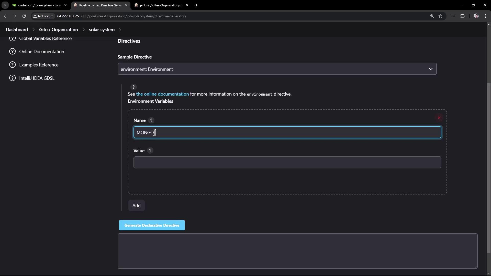
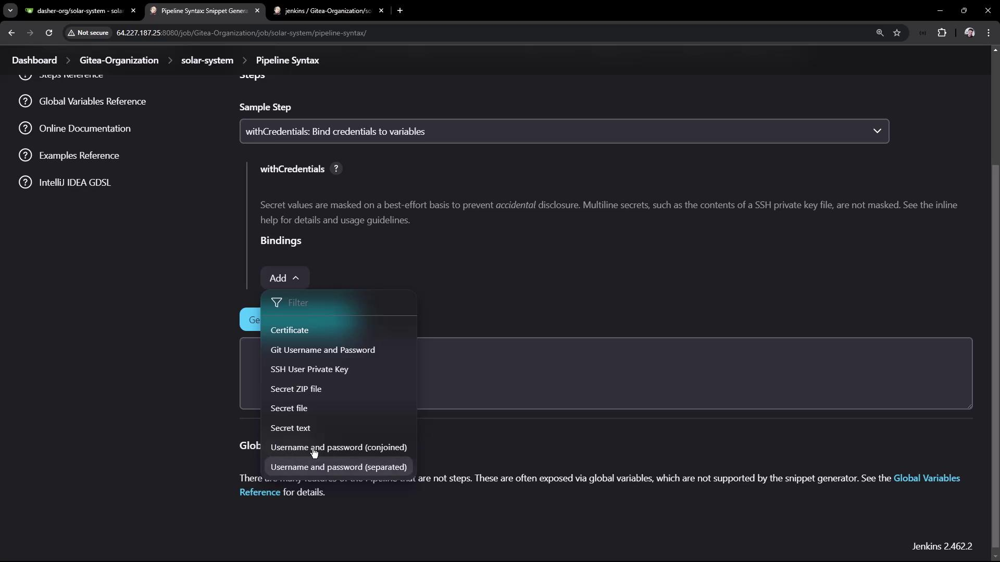
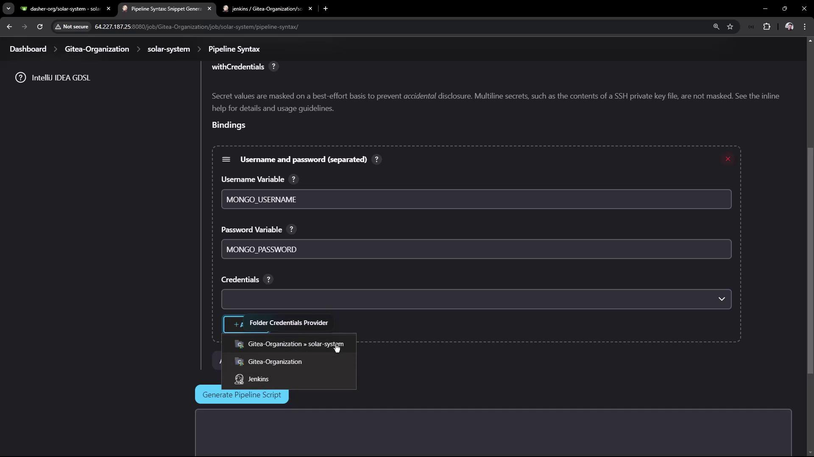
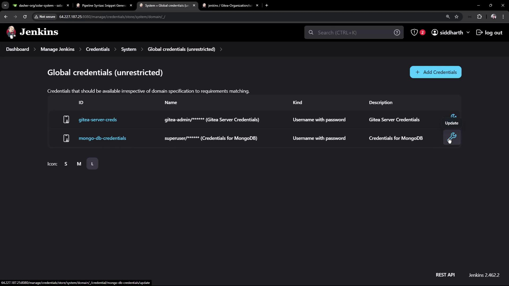
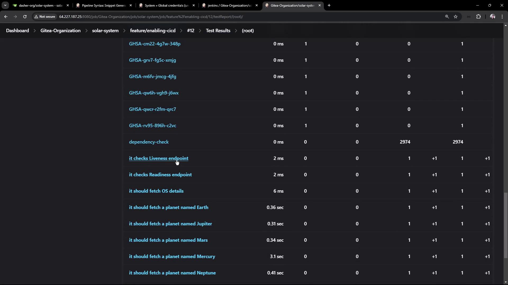

# Unit Testing and Analyze JUnit Reports

Source: https://notes.kodekloud.com/docs/Jenkins-Pipelines/Setting-Up-CI-Pipeline/Unit-Testing-and-Analyze-JUnit-Reports/page

This article explains how to configure a Jenkins pipeline for unit testing and analyzing JUnit reports.

In this guide, we explain how to configure a new stage in your Jenkins pipeline to run unit tests and analyze JUnit reports. You will update your Jenkinsfile, address environment variable issues, and secure sensitive credentials.

***

## Configuring the Unit Testing Stage

Begin by opening your Jenkinsfile. Copy the existing “Installing Dependencies” stage and rename it to “Unit Testing.” Initially, your file might include a stage that installs dependencies using an npm command. For instance:

```groovy theme={null}
nodejs 'nodejs-22-6-0'

stages {
    stage('Installing Dependencies') { 
        // ... 
    }
    
    stage('Dependency Scanning') { 
        // ... 
    }
    
    stage('Unit') { 
        steps { 
            sh 'npm install --no-audit'
        } 
    }
}
```

Next, update the stage to run the unit tests using the command `npm test`. Your updated stage should look like this:

```groovy theme={null}
stage('Unit Testing') {
    steps {
        sh 'npm test'
    }
}
```

Save and commit the changes. When you trigger the pipeline build, the process will include the new unit testing stage. If the unit testing step fails, consult the logs for details.

***

## Diagnosing and Addressing Connection Failures

If the job fails, you might encounter an error similar to the example shown below:

<Frame>
  
</Frame>

The logs might indicate that MongoDB connectivity failed due to undefined environment variables (e.g., MONGO\_URI, MONGO\_USERNAME, and MONGO\_PASSWORD). For example, a portion of your app.js might include:

```javascript theme={null}
const bodyParser = require('body-parser');
const mongoose = require('mongoose');
const express = require('express');
const cors = require('cors');

app.use(bodyParser.json());
app.use(express.static(path.join(__dirname, '/')));
app.use(cors());

mongoose.connect(process.env.MONGO_URI, {
    user: process.env.MONGO_USERNAME,
    pass: process.env.MONGO_PASSWORD,
    useNewUrlParser: true,
    useUnifiedTopology: true,
}, function(err) {
    if (err) {
        console.log("error!! " + err);
    } else {
        // console.log("MongoDB Connection Successful")
    }
});

var Schema = mongoose.Schema;
```

Since the Jenkins pipeline isn’t automatically passing these values, MongoDB connectivity can fail.

<Callout icon="lightbulb">
  Set the required environment variables directly in your Jenkinsfile to resolve connectivity issues.
</Callout>

***

## Setting Environment Variables and Securing Credentials

You can configure environment variables within your Jenkins pipeline. For example, add an environment block at the top of your Jenkinsfile:

```groovy theme={null}
environment {
    MONGO_URI = "mongodb+srv://supercluster.d83jj.mongodb.net/superData"
}
```

Be aware that storing sensitive data (like usernames, passwords, or API tokens) in plain text is not secure. For credentials such as MongoDB’s username and password, use Jenkins credentials stored at the global level, and reference them with the withCredentials step. For instance:

```groovy theme={null}
withCredentials([usernamePassword(
    credentialsId: 'mongo-db-credentials', 
    passwordVariable: 'MONGO_PASSWORD', 
    usernameVariable: 'MONGO_USERNAME'
)]) {
    // Command execution block
}
```

The Jenkins UI allows you to set environment variables and manage credentials. Consider the screenshot below, which illustrates configuring an environment variable for MongoDB:

<Frame>
  
</Frame>

After configuring the environment variable and credentials, update your Jenkinsfile's unit testing stage as follows:

```groovy theme={null}
pipeline {
    agent any

    tools { 
        // Define any necessary tools here
    }

    environment {
        MONGO_URI = "mongodb+srv://supercluster.d83jj.mongodb.net/superData"
    }

    stages {
        stage('Installing Dependencies') {
            // ...
        }
        
        stage('Dependency Scanning') {
            // ...
        }

        stage('Unit Testing') {
            steps {
                withCredentials([usernamePassword(
                    credentialsId: 'mongo-db-credentials', 
                    passwordVariable: 'MONGO_PASSWORD', 
                    usernameVariable: 'MONGO_USERNAME'
                )]) {
                    sh 'npm test'
                }
            }
        }
    }
}
```

In the credentials setup, you might see options for certificates, Git username/password, SSH keys, and more. The screenshot below demonstrates that:

<Frame>
  
</Frame>

When adding MongoDB credentials, you might configure a username (e.g., "superuser") and a password ("superpassword") with a unique ID such as mongo-db-credentials:

<Frame>
  
</Frame>

Manage these credentials through Jenkins’s Global Credentials page:

<Frame>
  
</Frame>

***

## Archiving and Viewing Test Reports

After executing the `npm test` command successfully, your tests generate a JUnit XML report (e.g., test-results.xml). Archive these results by adding a junit step after your tests. A complete Jenkinsfile configuration incorporating environment variables, credentials, and JUnit archiving might appear as follows:

```groovy theme={null}
pipeline {
    agent any

    tools {
        // Configure tools as required
    }

    environment {
        MONGO_URI = "mongodb+srv://supercluster.d83jj.mongodb.net/superData"
    }

    stages {
        stage('Installing Dependencies') {
            // Installation steps
        }

        stage('Dependency Scanning') {
            // Dependency scan steps, possibly with parallel tasks
        }

        stage('Unit Testing') {
            steps {
                withCredentials([usernamePassword(
                    credentialsId: 'mongo-db-credentials', 
                    passwordVariable: 'MONGO_PASSWORD', 
                    usernameVariable: 'MONGO_USERNAME'
                )]) {
                    sh 'npm test'
                }
                junit allowEmptyResults: true, testResults: 'test-results.xml'
            }
        }
    }
}
```

After committing these changes and triggering your pipeline, Jenkins will run the tests and archive the test report. You can inspect the test results directly through the Jenkins interface. If you are dealing with a substantial number of tests, consider using the classic UI for detailed results, including endpoint checks such as liveness and readiness tests.

For example, the screenshot below displays a test report interface with endpoint check results:

<Frame>
  
</Frame>

***

## Summary

To summarize, follow these steps to configure a unit testing stage in your Jenkins pipeline:

1. Add a new stage named “Unit Testing” that executes `npm test`.
2. Define the necessary environment variables, such as MONGO\_URI.
3. Securely pass the MongoDB username and password using Jenkins credentials with the withCredentials step.
4. Archive the JUnit XML test results using the junit step for later analysis.

Below is the final snippet of your Jenkinsfile configuration:

```groovy theme={null}
pipeline {
    agent any

    tools {
        // ...
    }

    environment {
        MONGO_URI = "mongodb+srv://supercluster.d83jj.mongodb.net/superData"
    }

    stages {
        stage('Installing Dependencies') {
            // ...
        }

        stage('Dependency Scanning') {
            // ...
        }

        stage('Unit Testing') {
            steps {
                withCredentials([usernamePassword(
                    credentialsId: 'mongo-db-credentials', 
                    passwordVariable: 'MONGO_PASSWORD', 
                    usernameVariable: 'MONGO_USERNAME'
                )]) {
                    sh 'npm test'
                }
                junit allowEmptyResults: true, testResults: 'test-results.xml'
            }
        }
    }
}
```

After committing these improvements to your Jenkinsfile and running the pipeline, your logs should indicate successful MongoDB connections, test executions, and archived test reports. This setup provides an efficient way to review both current and historical test data.

<Callout icon="lightbulb">
  Ensure that your credentials are managed securely by periodically reviewing and updating them in Jenkins Global Credentials.
</Callout>

Thank you for following along with this guide!

<CardGroup>
  <Card title="Watch Video" icon="video" href="https://learn.kodekloud.com/user/courses/jenkins-pipelines/module/7e239b62-2dfd-4594-85cf-e51c0707121c/lesson/96bae981-de89-4389-ba55-bdcc0c763b84" />
</CardGroup>
