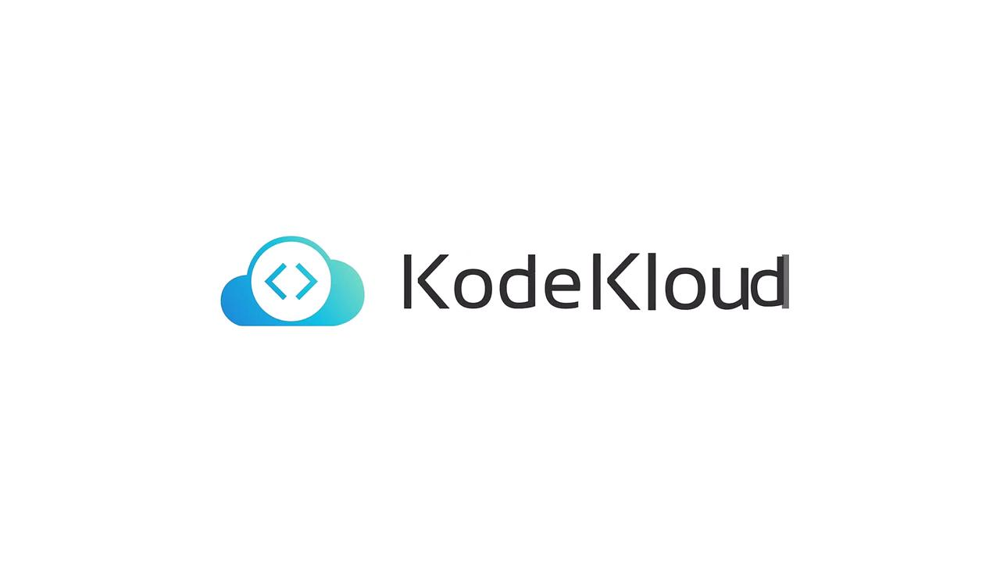

# ... mocha runs tests ...
$ echo $?
0
```

## Code coverage with NYC

Running coverage uses nyc and enforces the threshold defined in package.json. If coverage is below the threshold, the command exits non-zero—useful to fail or gate CI pipelines:

```bash theme={null}
$ npm run coverage
# runs tests + nyc, then outputs a summary
-------------------------------|---------|----------|---------|---------|-------------------
File                           | % Stmts | % Branch | % Funcs | % Lines | Uncovered Line #s
-------------------------------|---------|----------|---------|---------|-------------------
All files                      |   79.54 |    33.33 |      70 |   79.06 |
app.js                         |   79.54 |    33.33 |      70 |   79.06 | 23,49-50,58,62-67
-------------------------------|---------|----------|---------|---------|-------------------
$ echo $?
1
```

This intentional failure is often used in CI to demonstrate how to stop or continue pipeline execution on coverage failures; Jenkins automation will show patterns for handling such failures.

## Start the application locally

Start the server:

```bash theme={null}
$ npm start

> Solar System@6.7.6 start
> node app.js

Server successfully running on port - 3000
(node:83049) [DEP0170] DeprecationWarning: The URL mongodb://... is invalid. Future versions of Node.js will throw an error.
(Use `node --trace-deprecation ...` to show where the warning was created)
```

The app listens on port 3000 by default. Access it locally via [http://localhost:3000](http://localhost:3000) or on your VM using its IP and port 3000.

## Web UI screenshot

Open the UI to search planets and inspect the host/pod name displayed:

<Frame>
  
</Frame>

## API endpoints (summary)

| Endpoint | Method | Purpose                       | Sample Response                     |
| -------: | :----: | ----------------------------- | ----------------------------------- |
|      /os |   GET  | Return hostname/pod name      | `{"os":"jenkins-controller-1"}`     |
|    /live |   GET  | Liveness probe                | `{"status":"live"}`                 |
|   /ready |   GET  | Readiness probe               | `{"status":"ready"}`                |
|  /planet |  POST  | Query planet by id/name (DB)  | `{ "id":1, "name":"Mercury", ... }` |
|        / |   GET  | Serve index page or plaintext | `"Example"`                         |

Example JSON responses:

* GET /os

```json theme={null}
{
  "os": "jenkins-controller-1"
}
```

* GET /live

```json theme={null}
{
  "status": "live"
}
```

* GET /ready

```json theme={null}
{
  "status": "ready"
}
```

## Wrap-up

You have now:

* Examined the repository structure and key files (app.js, app.controller.js, client.js, tests, Dockerfile, OpenAPI)
* Installed dependencies and run tests locally
* Learned common failure modes (missing MONGO\_URI) and mitigations
* Collected code coverage using nyc
* Started the app and verified the UI and basic endpoints

Next steps: automate these commands in a Jenkins pipeline to run installs, tests, coverage checks, and builds so you can validate the application automatically as part of CI/CD.

<CardGroup>
  <Card title="Watch Video" icon="video" href="https://learn.kodekloud.com/user/courses/jenkins-pipelines/module/a3bf42b8-d7de-4cf9-aeae-bc71ae305be6/lesson/569156f9-41bf-4e0c-bdbd-cc3a2aa0cb6f" />
</CardGroup>


# Course Introduction

Source: https://notes.kodekloud.com/docs/Jenkins-Project-Building-CICD-Pipeline-for-Scalable-Web-Applications/Introduction/Course-Introduction/page

This project-based course offers hands-on experience with Jenkins and key DevOps tools through practical labs in a browser-based environment.

Welcome to the Jenkins Project Course at KodeKloud! In this project-based course, you'll gain real-world experience with Jenkins and other key DevOps tools through hands-on labs in a browser-based environment. This setup enables you to transition quickly from theory to practice without the hassle of setting up local infrastructure.

## What You'll Learn

We begin by demystifying the core concepts of Jenkins: what Jenkins is, why it's indispensable in modern development, and how to create and configure basic Jenkins jobs. Your journey starts with a simple "Hello World" pipeline that lays the foundation for more complex workflows.

Next, you'll integrate Jenkins with Git to manage your source code repository effectively and incorporate unit testing to ensure code quality. You'll explore various build triggers that automate workflows based on code changes or schedules, and learn how to make your Jenkins jobs dynamic by leveraging environment variables.

As you progress, you'll become proficient in advanced pipeline features like nested and parallel stages, options, parameters, and user inputs, making your workflows interactive and adaptable. Along the way, we'll guide you through effective Jenkins plugin management and best practices for configuring and executing jobs.

## Deployment and Advanced Integrations

### Single Server Deployment

Learn how to deploy your application on a single server using Jenkins pipelines. Start with basic deployment steps and follow hands-on demonstrations that teach efficient application configuration and delivery.

### Serverless Architecture with AWS Lambda

Explore AWS Lambda in a dedicated section focused on serverless architecture. Learn to deploy Lambda functions using the Serverless Application Model and configure Jenkins pipelines for efficient serverless deployments, all through accessible hands-on demos.

### Containerization with Docker

Delve into the world of Docker and discover how to build custom Docker images, integrate Jenkins with Docker, and write Dockerfiles for containerization. You’ll also learn how to manage Docker Hub credentials securely within Jenkins for robust container deployments.

### Orchestration with Kubernetes and AWS EKS

Get acquainted with Kubernetes and AWS EKS to master scalable and reliable container orchestration. This course guides you through working with Pods, replicas, and deployments, and shows you how to set up an EKS cluster and deploy your application using Jenkins pipelines.

## Course Outcomes

By the end of this course, you will have a thorough understanding of how to leverage Jenkins, Docker, Kubernetes, and AWS EKS to create robust, scalable, and automated CI/CD pipelines for your applications.

At KodeKloud, we foster community learning. Our vibrant forum provides a space to ask questions, share insights, and collaborate with fellow learners. Join our community and take your first step towards mastering modern DevOps practices.

<Frame>
  
</Frame>

<CardGroup>
  <Card title="Watch Video" icon="video" href="https://learn.kodekloud.com/user/courses/jenkins-project-building-ci-cd-pipeline-for-scalable-web-applications/module/d50cea6d-7bc8-43c6-82b6-40a89e1c9f77/lesson/bb914665-0a0b-4fb7-922a-32792690688c" />
</CardGroup>
