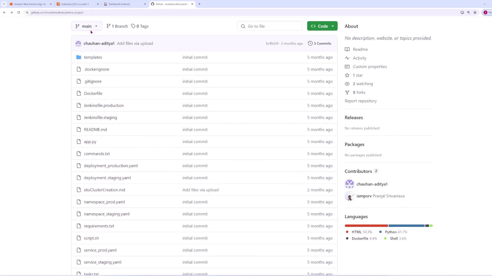
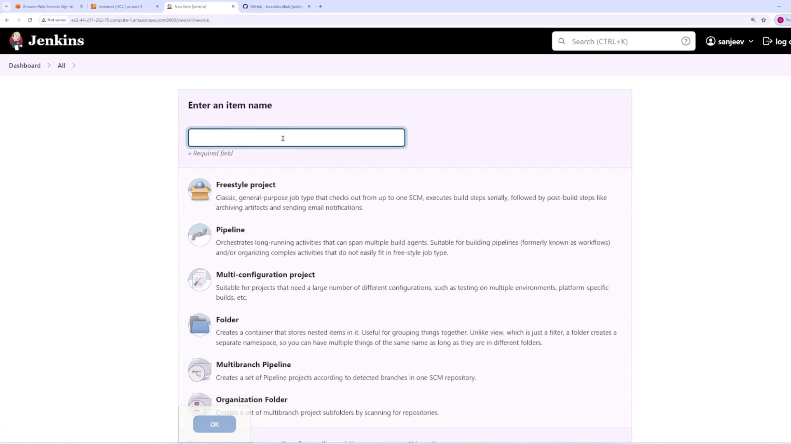
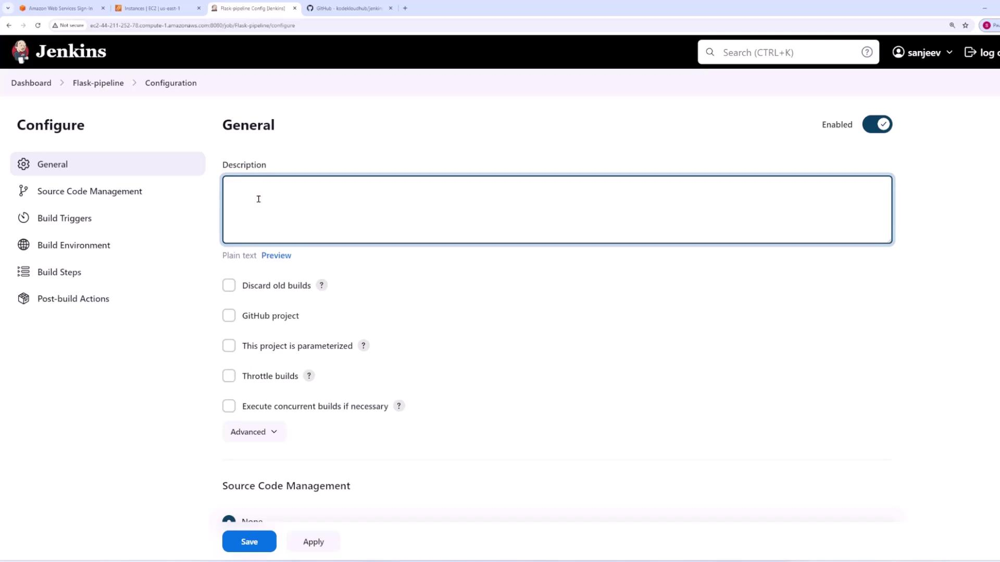
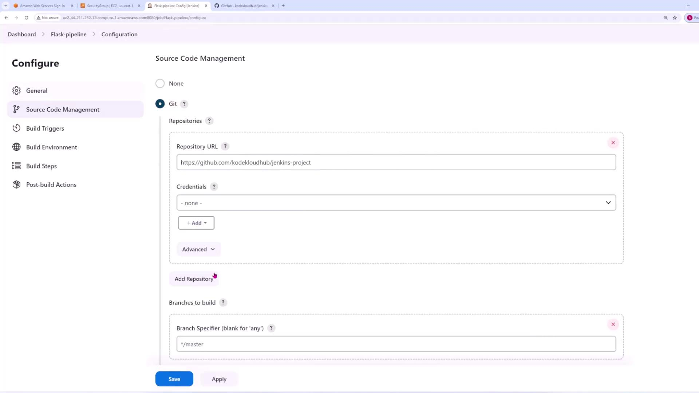
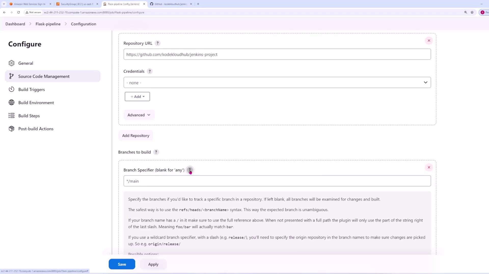
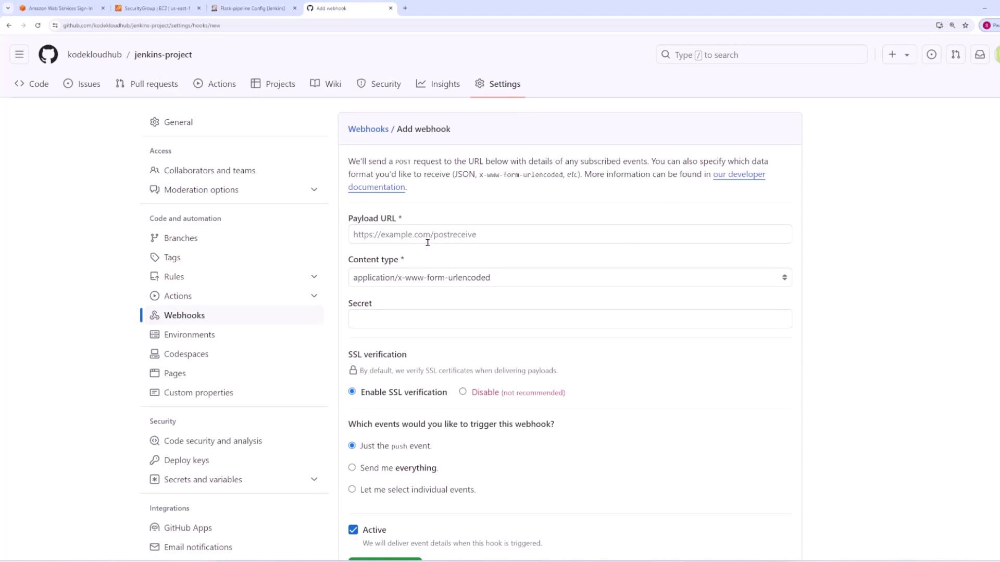
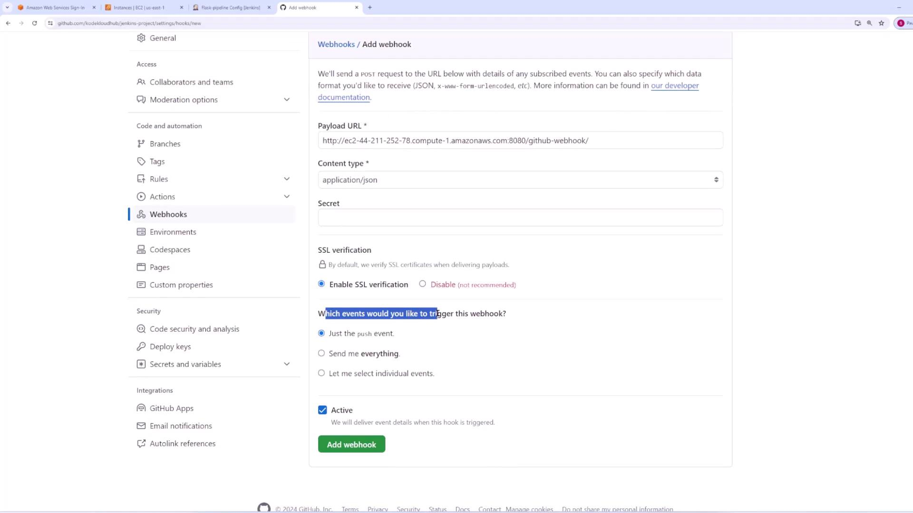

# Integrating with Git

Source: https://notes.kodekloud.com/docs/Jenkins-Project-Building-CICD-Pipeline-for-Scalable-Web-Applications/Jenkins/Integrating-with-Git/page

This article explains how to integrate Git with Jenkins for automated builds using a Flask application.

In this lesson, we demonstrate how to integrate Git with Jenkins using a simple Flask application. The goal is to trigger builds automatically whenever changes are pushed to the Git repository.

## Step 1. Start with Your Flask Application

Begin with a Flask application hosted in a Git repository.

<Frame>
  
</Frame>

## Step 2. Configure Jenkins to Trigger Builds

### Create a New Jenkins Job

1. From the Jenkins dashboard, click on "New Item" and name the job "Flask pipeline."
2. Select the **Freestyle project** option to build a basic pipeline and click **OK**.

<Frame>
  
</Frame>

### Configure Job Details

* You can add an optional project description on the next screen to provide context for your team.

<Frame>
  
</Frame>

### Set Up Source Code Management

1. In the **Source Code Management** section, change the default "None" option to **Git**.
2. Enter the Git repository URL. For public repositories, credentials are not necessary; for private repositories, configure the appropriate credentials.

<Frame>
  
</Frame>

### Specify the Branch to Build

* By default, Jenkins may reference the `/master` branch. If your repository uses a branch named `main`, update the branch information accordingly.
* Leaving the branch field blank triggers builds for any branch; however, the focus here is on the `main` branch.

<Frame>
  
</Frame>

### Configure Build Triggers

* Scroll down to the **Build Triggers** section and select **GitHub hook trigger for Git SCM polling**. This enables GitHub to send a webhook notification to the Jenkins server whenever changes are pushed.

### Add Build Steps

1. Add a build step by selecting **Execute Shell**.
2. In the command text box, include the following command to output a test message during the build process:

   ```bash theme={null}
   echo "Hello from Jenkins"
   ```

## Step 3. Set Up GitHub Webhook

Configure GitHub to notify Jenkins when changes occur:

1. Navigate to your GitHub repository’s **Settings**, then access the **Webhooks** section.
2. Click **Add webhook** and complete the following:
   * Set the **Payload URL** to your Jenkins server’s URL (for example, using your EC2 instance's public DNS or IP address). Append `/GitHub-webhooks` if required.
   * Choose `application/json` as the **Content Type**.
   * Select **Push events** to trigger the webhook on code commits.

<Frame>
  
</Frame>

<Frame>
  
</Frame>

<Callout icon="lightbulb">
  After configuring, verify that GitHub shows a green checkmark next to your webhook. This confirms that notifications are delivered successfully.
</Callout>

Return to the Jenkins job configuration, click **Apply** and then **Save**.

## Step 4. Run a Manual Build

Perform a manual build in Jenkins to establish the job configuration. During the first build, Jenkins will clone the repository and execute the shell command.

### Sample Console Output

```bash theme={null}
Started by user sanjeev
Running as SYSTEM
Building in workspace /var/lib/jenkins/workspace/Flask-pipeline
The recommended git tool is: NONE
No credentials specified
Cloning the remote Git repository
Cloning repository https://github.com/kodeloudhub/jenkins-project
/usr/bin/git init /var/lib/jenkins/workspace/Flask-pipeline # timeout=10
Fetching upstream changes from https://github.com/kodeloudhub/jenkins-project
> git --version # timeout=10
> git config remote.origin.url https://github.com/kodeloudhub/jenkins-project # timeout=10
> git fetch --tags --force --progress https://github.com/kodeloudhub/jenkins-project +refs/heads/*:refs/remotes/origin/* # timeout=10
> /usr/bin/git rev-parse refs/remotes/origin/main^{commit} # timeout=10
Checking out Revision bfc8c9b987f71911d5c844b1875beeda9 (refs/remotes/origin/main)
> /usr/bin/git config core.sparsecheckout # timeout=10
> /usr/bin/git checkout -f bfc8c9b987f71911d5c844b1875beeda9 # timeout=10
Commit message: "Add files via upload"
First time build. Skipping changelog.
[Flask-pipeline] $ /bin/sh -xe /tmp/jenkins36311316873210734.sh
+ echo 'Hello from Jenkins'
Hello from Jenkins
Finished: SUCCESS
```

## Step 5. Test Auto-Trigger by Pushing Changes

Modify your Flask application (for example, update `index.html`):

```html theme={null}
<html>
  <head>
    <style>
      .task-item {
      }
      .task-text {
        margin: 0;
      }
    </style>
  </head>
  <body>
    <h1>Todo App</h1>
    <!-- Add Task Form -->
    <form method="post">
```

After saving your changes, add, commit, and push them using the following commands:

```bash theme={null}
