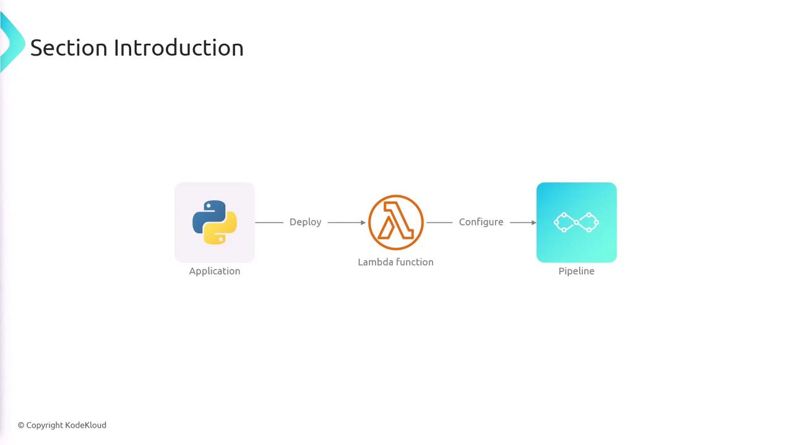
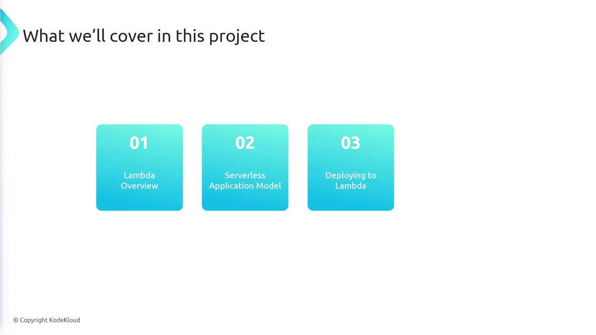

# Section Introduction

Source: https://notes.kodekloud.com/docs/Jenkins-Project-Building-CICD-Pipeline-for-Scalable-Web-Applications/Lambda-Deployment/Section-Introduction/page

This lesson explores designing and implementing CI/CD pipelines for serverless applications on AWS, focusing on packaging Python applications and automating deployments with Jenkins.

In this lesson, we will explore how to design and implement CI/CD pipelines specifically for serverless applications on AWS. You will learn how to package a Python application as an AWS Lambda function and then leverage Jenkins to build an automated CI/CD pipeline that deploys the updated code to Lambda seamlessly.

<Frame>
  
</Frame>

We start by examining AWS Lambda, its core functionalities, and best practices for integrating serverless computing into your applications. You will also get an overview of the AWS Serverless Application Model (SAM), a powerful CLI tool that streamlines the development, packaging, and deployment processes for serverless projects.

<Callout icon="lightbulb">
  Understanding the Serverless Application Model is crucial as it simplifies many aspects of deploying Lambda functions by automating several manual steps.
</Callout>

Next, the lesson will guide you through the process of deploying applications to Lambda using SAM. Finally, you will configure a Jenkins-based CI/CD pipeline that automates the deployment of your serverless applications, ensuring that every code update is efficiently and reliably pushed to production.

<Frame>
  
</Frame>

By the end of this lesson, you will have a comprehensive understanding of:

| Topic                        | Overview                                                      | Benefit                                                        |
| ---------------------------- | ------------------------------------------------------------- | -------------------------------------------------------------- |
| AWS Lambda                   | Learn how to package and deploy Python applications as Lambda | Reduced operational overhead and scalable serverless computing |
| Serverless Application Model | Simplify development and deployment with SAM CLI              | Accelerated deployment processes and streamlined workflows     |
| Jenkins CI/CD Pipeline       | Integrate CI/CD pipelines for automated deployments           | Improved code quality and faster time-to-market                |

This structured approach not only enhances your technical knowledge but also equips you with practical skills for automating deployments in a serverless environment. Enjoy diving into each section and empower your development workflow with modern, automated CI/CD practices.

<CardGroup>
  <Card title="Watch Video" icon="video" href="https://learn.kodekloud.com/user/courses/jenkins-project-building-ci-cd-pipeline-for-scalable-web-applications/module/ddd997d7-0eea-4fa7-8265-5feeb01301e8/lesson/0c88f902-1de4-4eab-a7a4-19f1ab2adeee" />
</CardGroup>
