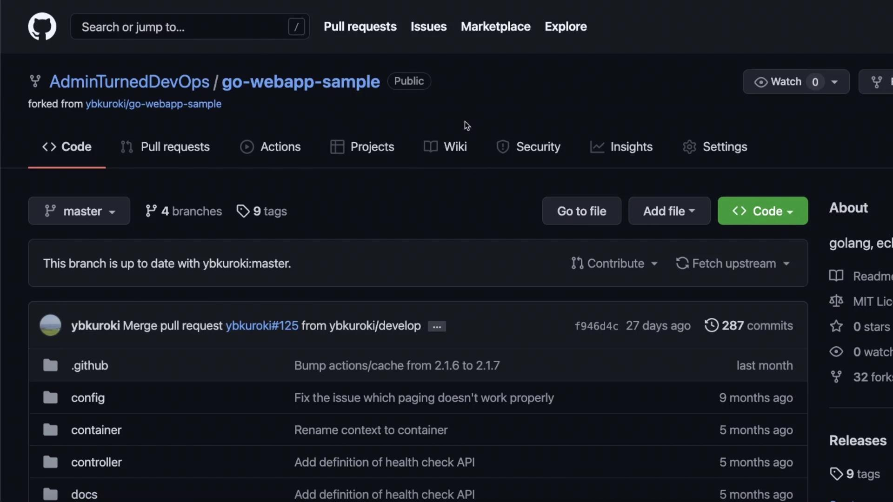
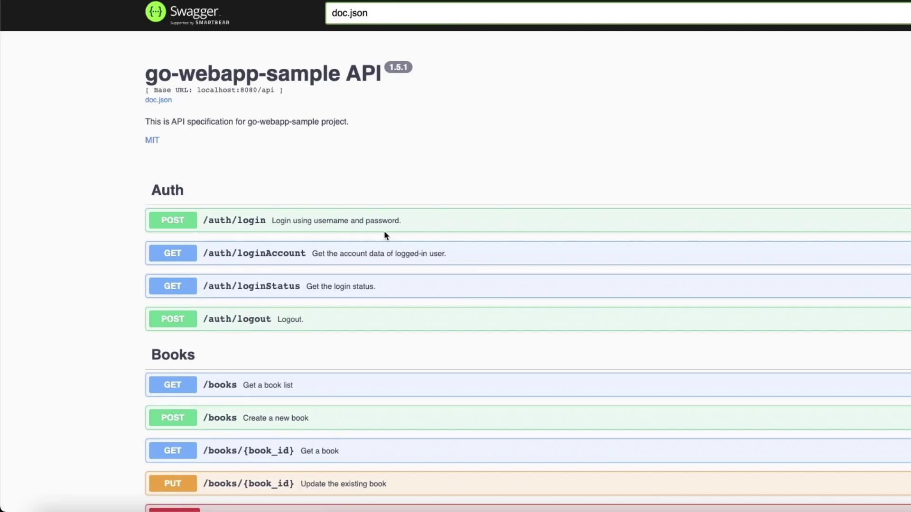

# Application Details

Source: https://notes.kodekloud.com/docs/Jenkins/Introduction/Application-Details/page

This article explores the Go Web App sample application designed for deployment using Jenkins, featuring GORM for database operations and integrated Swagger API documentation.

In this article, we explore the Go Web App sample application, which is designed for deployment using [Jenkins](https://learn.kodekloud.com/user/courses/jenkins). This application, forked to the Admin Turn DevOps GitHub organization and available in the Go Web App sample repository, is a straightforward implementation that leverages GORM for seamless database operations.

<Frame>
  
</Frame>

When you run the application, you will first see a login page. Use the provided credentials (for example, "test" for both username and password) to log in. Once authenticated, you will gain access to several application features, including an integrated Swagger API documentation interface that details all available endpoints.

<Callout icon="lightbulb">
  To explore all the endpoints, simply navigate to the Swagger UI after starting the application.
</Callout>

## Installation and Usage

Follow these commands in your terminal to install and run the application:

```bash theme={null}
go get -u github.com/ybkuroki/go-webapp-sample
```

```bash theme={null}
go run main.go
```

Once the application is running, open the Swagger UI to review the list of available API endpoints and their documentation.

<Frame>
  
</Frame>

## API Endpoints Overview

For example, the API features an endpoint that checks the login status, confirming a successful authentication when queried. Additionally, the application enables you to fetch account details. Below is an example JSON response detailing the attributes of the logged-in account:

```json theme={null}
{
  "id": 1,
  "name": "test",
  "authority_id": 1,
  "authority": {
    "id": 1,
    "name": "Admin"
  }
}
```

<Callout icon="lightbulb">
  Feel free to explore the repository further, download the source code, and experiment with the application locally.
</Callout>

## Next Steps

This article covers the initial setup and exploration of the Go Web App. In the subsequent sections, we will delve into the full deployment process, guiding you through each step in detail.

Thank you for reading!

<CardGroup>
  <Card title="Watch Video" icon="video" href="https://learn.kodekloud.com/user/courses/jenkins/module/5a828d07-ced8-44a3-8b8d-f2467f247360/lesson/95ef14fa-3b4a-4abe-806b-322ac1905299" />
</CardGroup>
