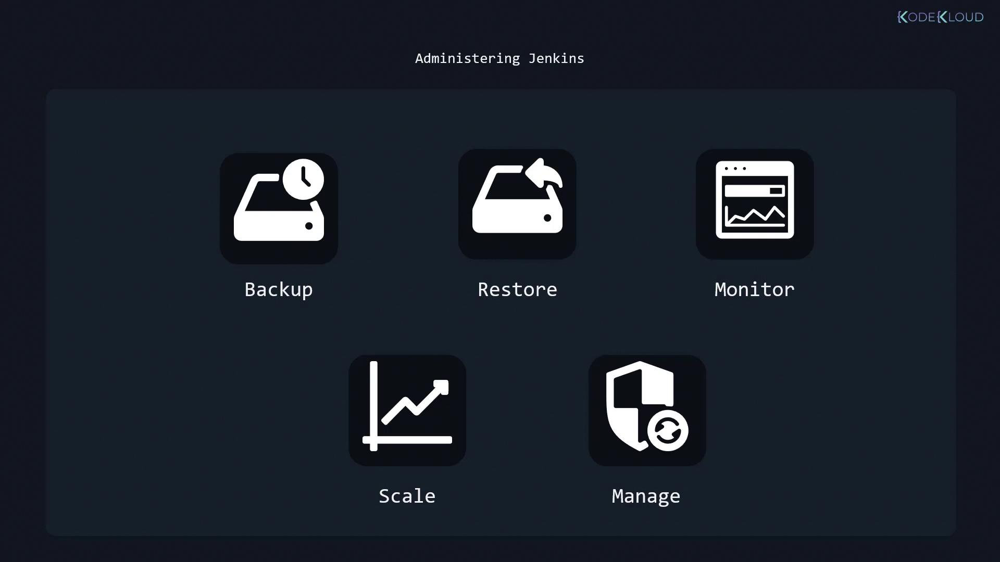

# Administering Jenkins

Source: https://notes.kodekloud.com/docs/Jenkins/Systems-Administration-with-Jenkins/Administering-Jenkins/page

Best practices for managing Jenkins to ensure stability, scalability, and quick recovery in CI/CD environments.

Managing Jenkins efficiently requires a comprehensive administration plan that ensures stability, scalability, and quick recovery from issues. Follow these best practices to keep your Jenkins environment running optimally:

<Callout icon="lightbulb">
  Regular backups of your server and all critical files and folders are essential. However, a backup is only as effective as its accompanying restore strategy. Always validate and test your restoration procedures to ensure reliability during emergencies.
</Callout>

## Proactive Monitoring and Diagnostics

Effective monitoring is crucial for early detection of issues. By continuously tracking system performance and analyzing error logs, you can swiftly diagnose and troubleshoot problems, minimizing downtime and maintaining smooth operations.

## Scaling Your Jenkins Infrastructure

As the user base and CI/CD pipelines grow, your Jenkins infrastructure may need to expand. For example, if you are currently running two Jenkins servers and anticipate increased load, scaling to three or four nodes is necessary. This proactive scaling ensures your system can handle higher workloads efficiently.

## Regular Maintenance and Updates

Jenkins is not a set-it-and-forget-it platform. Regular maintenance, including applying updates, patches, and security fixes, is key to keeping your system secure and performing at its best.

<Frame>
  
</Frame>

## Summary

To maintain a robust Jenkins environment, focus on:

* Implementing and testing reliable backup and restore strategies.
* Monitoring system performance and diagnosing issues promptly.
* Scaling infrastructure in line with increasing workload demands.
* Conducting routine maintenance, updates, and security patches.

Thank you for reading, and see you in the next article!

<CardGroup>
  <Card title="Watch Video" icon="video" href="https://learn.kodekloud.com/user/courses/jenkins/module/22de6dac-d594-40dc-a3fb-1cc8d20b8a61/lesson/e5db9f73-b364-499f-9b38-f478fd9dfafc" />
</CardGroup>
