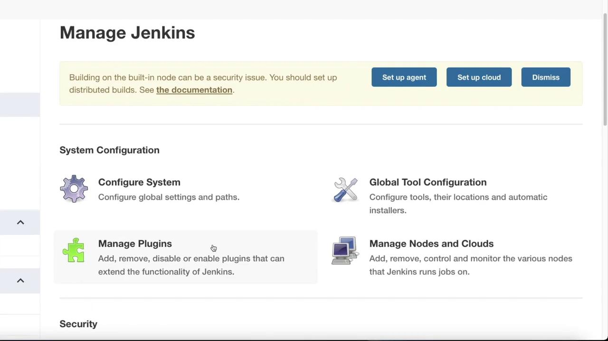
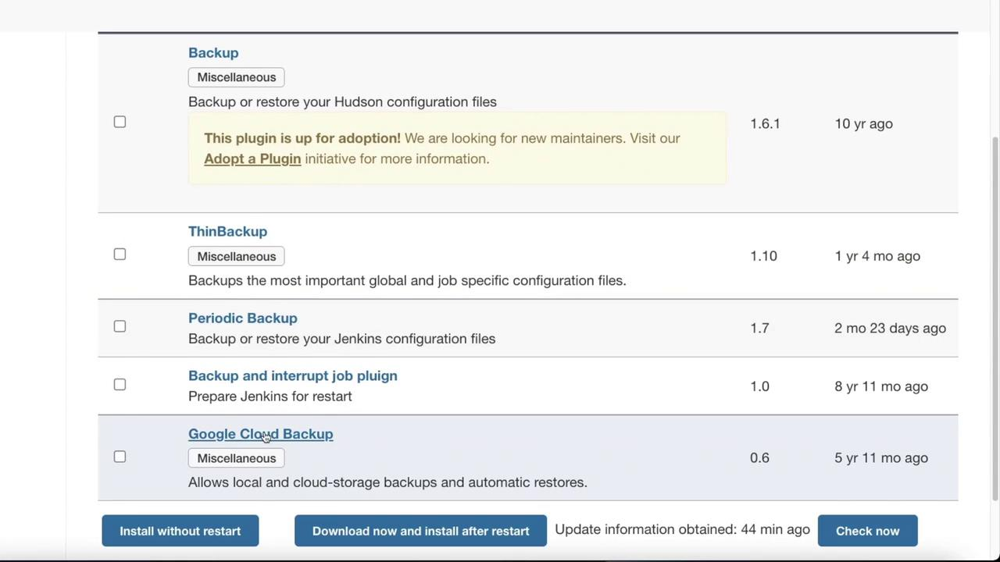
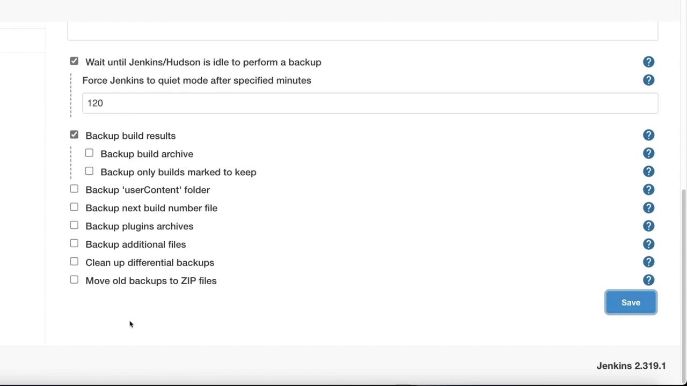
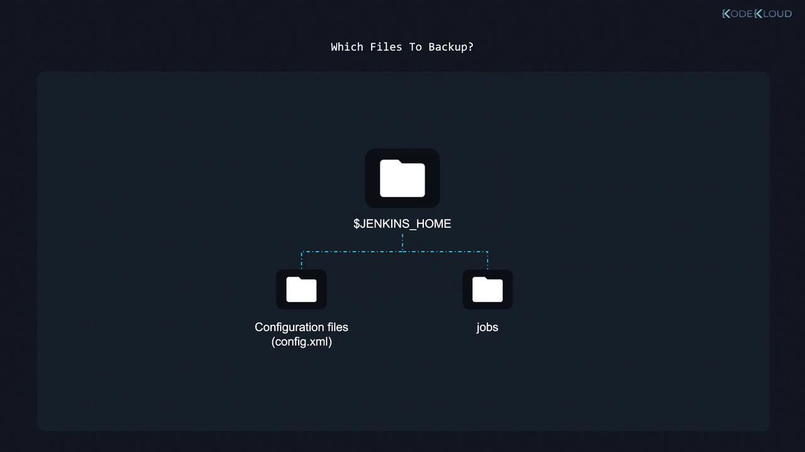

# Jenkins backup script
readonly JENKINS_HOME="$1"
readonly DEST_FILE="$2"
readonly CUR_DIR=$(cd $(dirname "$BASH_SOURCE-$0") && pwd)
readonly TMP_DIR="${CUR_DIR}/tmp"
readonly ARC_NAME=jenkins-backup
readonly ARC_DIR="${TMP_DIR}/${ARC_NAME}"
readonly TMP_TAR_NAME="${TMP_DIR}/${ARC_NAME}.tar.gz"

function usage() {
  echo "usage: $(basename $0) /path/to/jenkins_home archive.tar.gz"
}
```

While this script is a valuable resource for those who prefer custom solutions, utilizing a backup plugin often provides a more integrated and streamlined experience.

## Installing a Backup Plugin

To set up a Jenkins backup plugin, follow these steps:

1. Log in to the Jenkins portal.
2. Click on **Manage Jenkins**.
3. Select **Manage Plugins**.

<Frame>
  
</Frame>

Next, navigate to the **Available** tab and search for "Backup". While the Thin Backup plugin is widely used, you might also consider alternatives like the Google Cloud Backup plugin.

<Frame>
  
</Frame>

After selecting Thin Backup, click **Install Without Restart**. Once installation is complete, return to **Manage Jenkins** and locate the Thin Backup section.

Within Thin Backup, you can configure settings to back up global configurations as well as job-specific settings. Key configuration options include:

* **Backup Directory:** Set the directory where backups will be stored (ensure Jenkins has write access).
* **Backup Schedules:** Define schedules for differential and full backups.
* **Number of Backup Sets:** Specify how many backup sets to retain.
* **Files Excluded:** List files to be ignored during the backup.
* **Backup Scope:** Choose which files are to be included in the backup.

<Callout icon="triangle-alert">
  A valid backup directory is critical. If no backup directory is configured correctly, the backup process will fail.
</Callout>

After adjusting the settings, click **Backup Now**. If the backup directory is not correctly specified, you will need to configure a proper directory before retrying.

## Configuring a Backup Directory

SSH into your server with the following command:

```bash theme={null}
ssh mike@20.127.77.19
mike@20.127.77.19's password:
```

Once logged in, create and verify a backup directory with these commands:

```bash theme={null}
mike@jenkins01:~$ pwd
/home/mike
mike@jenkins01:~$ mkdir jenkinsbackup
mike@jenkins01:~$ cd jenkinsbackup/
mike@jenkins01:~/jenkinsbackup$ pwd
/home/mike/jenkinsbackup
```

If the directory exists but lacks the required permissions, adjust them—temporarily, you might set permissive permissions for testing:

```bash theme={null}
mike@jenkins01:~$ chmod 777 jenkinsbackup/
```

<Callout icon="triangle-alert">
  Avoid using 777 permissions in production environments. Always adjust permissions in accordance with your organization’s security policies.
</Callout>

Once the directory is properly configured, return to Jenkins and click **Backup Now**. Verify the backup file by checking your backup directory once the process completes.

<Frame>
  
</Frame>

## Conclusion

This article has provided a detailed overview of various backup strategies for Jenkins. Whether you opt for a plugin-based solution or a custom shell script, ensuring that your backup method aligns with your operational and security requirements is paramount.

For further details on Jenkins and its capabilities, visit the [Jenkins Documentation](https://www.jenkins.io/doc/). Happy backing up!

<CardGroup>
  <Card title="Watch Video" icon="video" href="https://learn.kodekloud.com/user/courses/jenkins/module/22de6dac-d594-40dc-a3fb-1cc8d20b8a61/lesson/3fa36943-55fe-48d9-a4b8-b1a170a0cc3d" />
</CardGroup>


# Backup and restoring Jenkins

Source: https://notes.kodekloud.com/docs/Jenkins/Systems-Administration-with-Jenkins/Backup-and-restoring-Jenkins/page

This article discusses the importance of backing up the Jenkins home folder to secure critical data and ensure system integrity.

When planning a backup strategy for Jenkins—or any similar system—it’s essential to understand the common backup concepts. Whether you're using full backups, snapshots, or incremental backups, the primary goal is to ensure your system's data remains secure even while applications continue running.

## Critical Components to Back Up

While it might seem ideal to back up every component, the most crucial element is the Jenkins home folder. This folder contains approximately 90% of your valuable data, including configuration settings and job definitions.

<Callout icon="lightbulb">
  Backing up the Jenkins home folder is paramount for maintaining your CI/CD pipelines and overall system integrity.
</Callout>

### Key Items Inside the Jenkins Home Folder

1. **Configuration Files**\
   Inside the Jenkins home folder, configuration files such as `config.xml` manage Jenkins’ settings and system configurations. Losing these files can disrupt the way Jenkins operates in your environment.

2. **Jobs Directory**\
   The `jobs` directory contains all your individual pipelines. This directory is critical because losing it would mean losing every CI/CD pipeline, effectively wiping out your deployment processes and associated efforts.

<Frame>
  
</Frame>

<Callout icon="triangle-alert">
  Neglecting to include the entire Jenkins home folder in your backup strategy can lead to significant data loss and system downtime.
</Callout>

## Final Thoughts

To ensure maximum protection and quick recovery, integrate the Jenkins home folder into your backup strategy. With a reliable backup in place, you can quickly restore your system after any failure or data loss.

That concludes this article. We look forward to sharing more insights in the next one!

## Related Resources

* [Jenkins Documentation](https://www.jenkins.io/doc/)
* [Continuous Integration and Continuous Delivery (CI/CD)](https://www.redhat.com/en/topics/devops/what-is-ci-cd)

<CardGroup>
  <Card title="Watch Video" icon="video" href="https://learn.kodekloud.com/user/courses/jenkins/module/22de6dac-d594-40dc-a3fb-1cc8d20b8a61/lesson/b18fefbe-dcc3-4a4c-bc60-d9585c9343de" />
</CardGroup>
