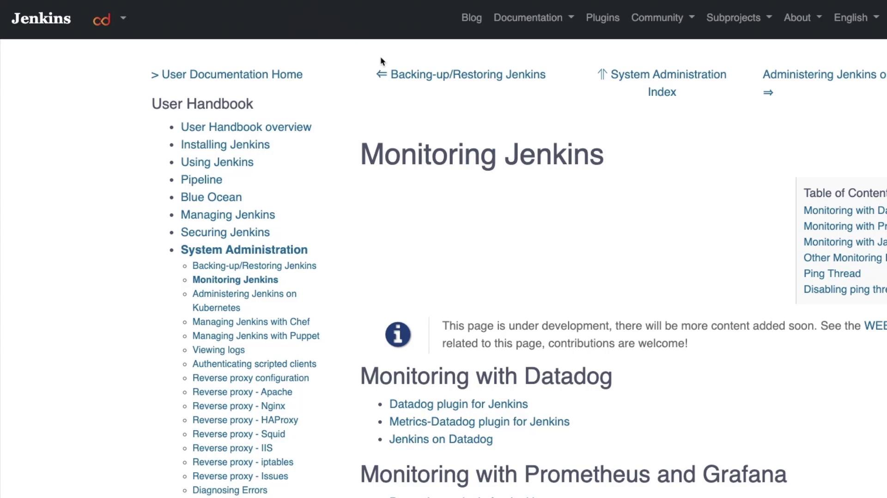
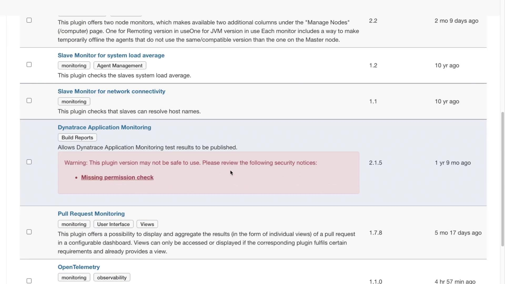
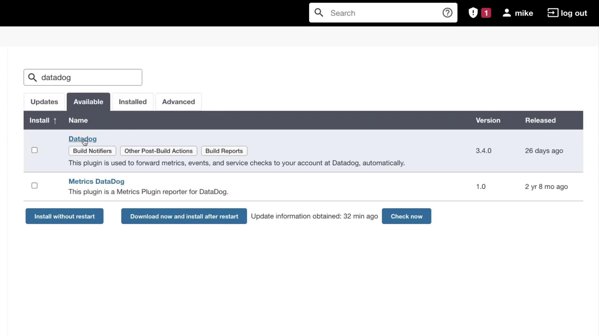
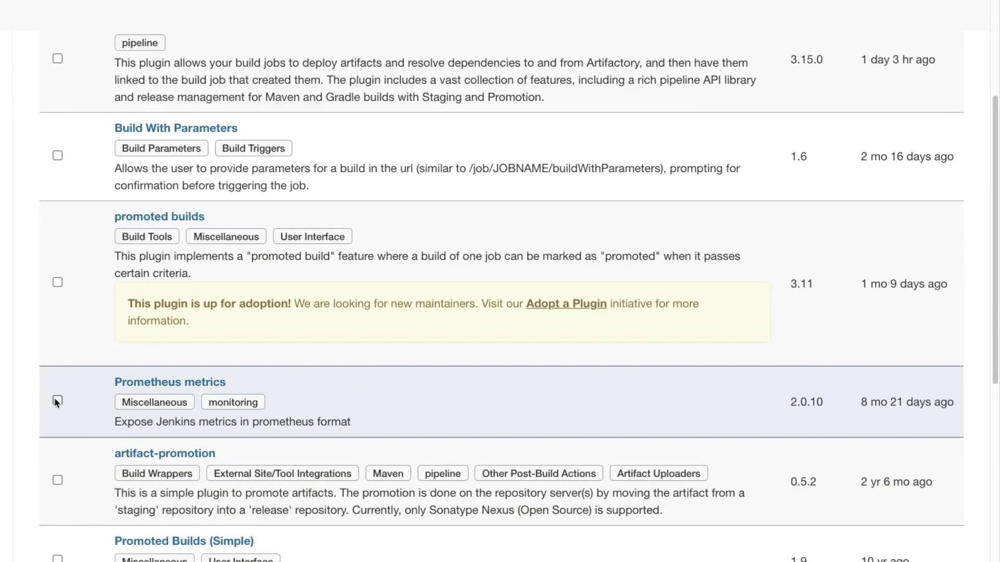
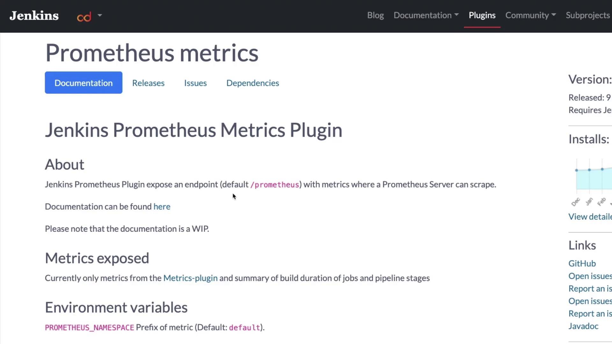

# Monitoring Jenkins

Source: https://notes.kodekloud.com/docs/Jenkins/Systems-Administration-with-Jenkins/Monitoring-Jenkins/page

This guide explains how to monitor Jenkins using plugins and integrate metrics with Prometheus.

In this guide, we explain how to monitor Jenkins using various plugins and integrate Jenkins metrics with Prometheus. Organizations can choose from several monitoring solutions such as Datadog, Prometheus with Grafana, and Java Melody. This article focuses on leveraging the Prometheus plugin for Jenkins monitoring.

<Frame>
  
</Frame>

## Overview of Available Monitoring Plugins

Jenkins provides a range of monitoring plugins to fit different requirements:

* **Datadog Monitoring:** Several plugins are available to integrate Jenkins with Datadog.
* **Prometheus and Grafana Monitoring:** A dedicated plugin makes it easy to export and visualize metrics.
* **Java Melody Monitoring:** Additional plugins support detailed application monitoring.

To view these plugins:

1. Log into your Jenkins dashboard.
2. Navigate to **Manage Jenkins** > **Manage Plugins**.
3. Click on the **Available** tab and search for "Monitoring".

As you browse the search results, you may notice plugins such as:

* **Prometheus Metrics:** Scroll down for details.
* **Dynatrace:** This plugin appears outdated and may have security issues.

<Callout icon="triangle-alert">
  Some plugins may be outdated or have security vulnerabilities. Always check the plugin documentation before installing.
</Callout>

<Frame>
  
</Frame>

For example, a search for Datadog will display the available Datadog plugin:

<Frame>
  
</Frame>

In this tutorial, we will use the Prometheus plugin.

## Installing the Prometheus Plugin

To install the Prometheus plugin:

1. Select the Prometheus plugin from the list.
2. Click **Install Without Restart**.

<Frame>
  
</Frame>

After starting the installation, you will see the progress. Note that the Prometheus plugin, like some other plugins, might require a Jenkins restart to work completely.

<Callout icon="lightbulb">
  After installation, open your terminal and run the following command to restart Jenkins:

  sudo systemctl restart jenkins
</Callout>

Allow Jenkins some time to restart. Once restarted, log in again. Then, navigate to the plugin's documentation to review the default environment variables and understand how Jenkins exposes metrics at the `/prometheus` endpoint.

<Frame>
  
</Frame>

## Integrating Jenkins with Prometheus

After setting up your Prometheus server (for instance, on Azure), configure it to scrape metrics from Jenkins. Follow these steps:

1. **SSH into your Prometheus server** and open the configuration file:

   ```bash theme={null}
   sudo vi /etc/prometheus/prometheus.yml
   ```

2. **Update the configuration** by modifying the "targets" section. Remove any unnecessary comments and paste the following snippet:

   ```yaml theme={null}
   scrape_interval: 15s  # Scrape every 15 seconds. Default is every 1 minute.
   evaluation_interval: 15s  # Evaluate rules every 15 seconds. Default is every 1 minute.

   # Alertmanager configuration
   alerting:
     alertmanagers:
     - static_configs:
       - targets:
         - alertmanager:9093

   # Load rules periodically based on 'evaluation_interval'.
   rule_files:
     # - "first_rules.yml"
     # - "second_rules.yml"

   scrape_configs:
     # Scraping Prometheus itself.
     - job_name: 'prometheus'
       static_configs:
       - targets: ['localhost:9090']
     # Scraping Jenkins metrics.
     - job_name: 'Jenkins'
       metrics_path: '/prometheus'
       static_configs:
       - targets: ['52.146.45.251:8080']
   ```

   Replace the IP address and port in the `targets` field with your actual Jenkins server details.

3. **Restart Prometheus** to apply the new configuration:

   ```bash theme={null}
   mike@prometheus01:~$ sudo systemctl restart prometheus
   mike@prometheus01:~$ systemctl status prometheus
   ```

   When successful, you should see output similar to:

   ```text theme={null}
   ● prometheus.service - Prometheus Time Series Collection and Processing Server
      Loaded: loaded (/etc/systemd/system/prometheus.service; enabled; vendor preset: enabled)
      Active: active (running) since Tue 2022-01-04 18:56:47 UTC; 5s ago
    Main PID: 3431 (prometheus)
       Tasks: 7 (limit: 2298)
      Memory: 59.6M
      CGroup: /system.slice/prometheus.service
              └─3431 /usr/local/bin/prometheus --config.file /etc/prometheus/prometheus.yml --storage.tsdb.path /var/lib/prometheus
   ```

Once Prometheus restarts, check the dashboard to confirm that it is successfully scraping Jenkins logs and metrics.

## Conclusion

This guide covers the essentials of monitoring Jenkins by installing the Prometheus plugin and integrating it with a Prometheus server. For further details and resources, consider exploring the following links:

* [Kubernetes Basics](https://kubernetes.io/docs/concepts/overview/what-is-kubernetes/)
* [Jenkins Documentation](https://www.jenkins.io/doc/)
* [Prometheus Documentation](https://prometheus.io/docs/)

<Callout icon="lightbulb">
  Practice the setup in your development environment to gain hands-on experience with Jenkins monitoring and Prometheus integration.
</Callout>

<CardGroup>
  <Card title="Watch Video" icon="video" href="https://learn.kodekloud.com/user/courses/jenkins/module/22de6dac-d594-40dc-a3fb-1cc8d20b8a61/lesson/2f4991ca-76a6-4845-95ba-43ca90bb361e" />
</CardGroup>
