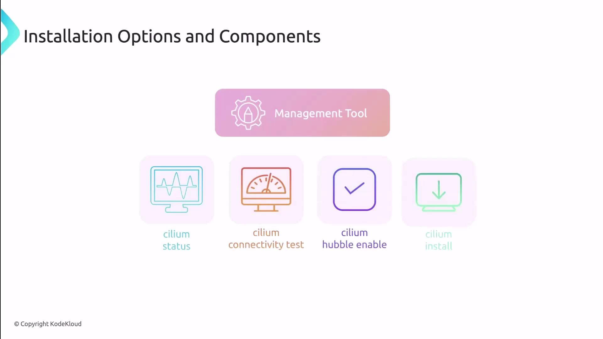

# deny-egress.yaml
apiVersion: networking.k8s.io/v1
kind: NetworkPolicy
metadata:
  name: default-deny-egress
spec:
  podSelector: {}          # selects all Pods in default
  policyTypes:
    - Egress
```

Apply and verify:

```bash theme={null}
kubectl apply -f deny-egress.yaml
kubectl describe networkpolicy default-deny-egress
```

You should see `policyTypes: [Egress]` and no `egress` rules.

### 2.1 Validate Egress Blocking

Attempt to ping Google and a cross-namespace Pod—both should time out:

```bash theme={null}
kubectl exec -it pod1 -- ping -c 2 www.google.com
kubectl exec -it pod1 -- ping -c 2 192.168.121.187
```

No responses will be received.

***

## 3. Apply Default-Deny Ingress

Similarly, deny all inbound traffic to Pods in `default`:

```yaml theme={null}
# deny-ingress.yaml
apiVersion: networking.k8s.io/v1
kind: NetworkPolicy
metadata:
  name: default-deny-ingress
spec:
  podSelector: {}
  policyTypes:
    - Ingress
```

Apply the policy:

```bash theme={null}
kubectl apply -f deny-ingress.yaml
```

From a Pod in `kube-system`, try to `curl` **pod2** (NGINX):

```bash theme={null}
POD_IP=$(kubectl get pod pod2 -o jsonpath='{.status.podIP}')
kubectl run --rm -i test-client --image=centos --namespace=kube-system --restart=Never -- \
  curl --connect-timeout 1 http://$POD_IP
```

You should see a timeout.

<Callout icon="triangle-alert">
  Applying default-deny policies without specific allow rules can disrupt critical workloads. Always plan your policies carefully.
</Callout>

***

## 4. Allow Specific Egress and Ingress

Once Pods are isolated by default, define exceptions:

| Policy Name            | Direction | Allowed Peer Pods | Port |
| ---------------------- | --------- | ----------------- | ---- |
| `default-deny-egress`  | Egress    | `app=nginx`       | 80   |
| `default-deny-ingress` | Ingress   | `app=centos`      | 80   |

### 4.1 Permit Egress to NGINX Pods

Update **deny-egress.yaml**:

```yaml theme={null}
spec:
  policyTypes:
    - Egress
  egress:
    - to:
        - podSelector:
            matchLabels:
              app: nginx
      ports:
        - protocol: TCP
          port: 80
```

Apply the updated policy:

```bash theme={null}
kubectl apply -f deny-egress.yaml
```

### 4.2 Permit Ingress from Management Pods

Update **deny-ingress.yaml**:

```yaml theme={null}
spec:
  policyTypes:
    - Ingress
  ingress:
    - from:
        - podSelector:
            matchLabels:
              app: centos
      ports:
        - protocol: TCP
          port: 80
```

Apply the updated policy:

```bash theme={null}
kubectl apply -f deny-ingress.yaml
```

***

## 5. Verify Selective Connectivity

1. **Allowed**: From **pod1** → NGINX on port 80
   ```bash theme={null}
   kubectl exec -it pod1 -- curl --connect-timeout 1 http://$POD_IP
   ```
   You should see the NGINX welcome page.

2. **Blocked**: From **pod1** → NGINX on port 8080
   ```bash theme={null}
   kubectl exec -it pod1 -- curl --connect-timeout 1 http://$POD_IP:8080
   ```
   Connections on other ports will time out.

***

## Recap

* Kubernetes defaults to **allow all** ingress/egress traffic.
* **Default-deny** policies lock down Pods by default.
* Fine-tune communication by defining **egress** and **ingress** rules matching labels, ports, and namespaces.

***

## Links and References

* [Kubernetes NetworkPolicy](https://kubernetes.io/docs/concepts/services-networking/network-policies/)
* [Understanding Kubernetes Networking](https://kubernetes.io/blog/2018/07/24/announcing-granular-networking-policy-support/)
* [NetworkPolicy Examples](https://github.com[AWS_SECRET_ACCESS_KEY]/networkpolicy)

<CardGroup>
  <Card title="Watch Video" icon="video" href="https://learn.kodekloud.com/user/courses/kubernetes-networking/module/5eea49e6-caea-4e84-88a0-268ea6f263af/lesson/93daad7d-fdc9-49cb-b162-86b2efe14f72" />

  <Card title="Practice Lab" icon="installation" href="https://learn.kodekloud.com/user/courses/kubernetes-networking/module/5eea49e6-caea-4e84-88a0-268ea6f263af/lesson/b1f38672-72af-445d-8fc9-6ede055cdd10" />
</CardGroup>


# Installing Cilium Overview

Source: https://notes.kodekloud.com/docs/Kubernetes-Networking-Deep-Dive/Container-Network-InterfaceCNI/Installing-Cilium-Overview/page

This article explores installation methods and observability options for Cilium on Kubernetes using CLI, Helm, and Hubble.

Before diving into the demo, let’s explore the key tools, installation approaches, and observability options for Cilium on Kubernetes.

## 1. Cilium CLI: Your Primary Management Tool

The [Cilium CLI][cilium-cli] is the go-to command-line utility for installing, managing, and troubleshooting Cilium:

* View the overall status of Cilium components
* Verify network connectivity across endpoints
* Run built-in network tests
* Enable Hubble for deep observability
* Install Cilium and addons

<Frame>
  
</Frame>

```bash theme={null}
