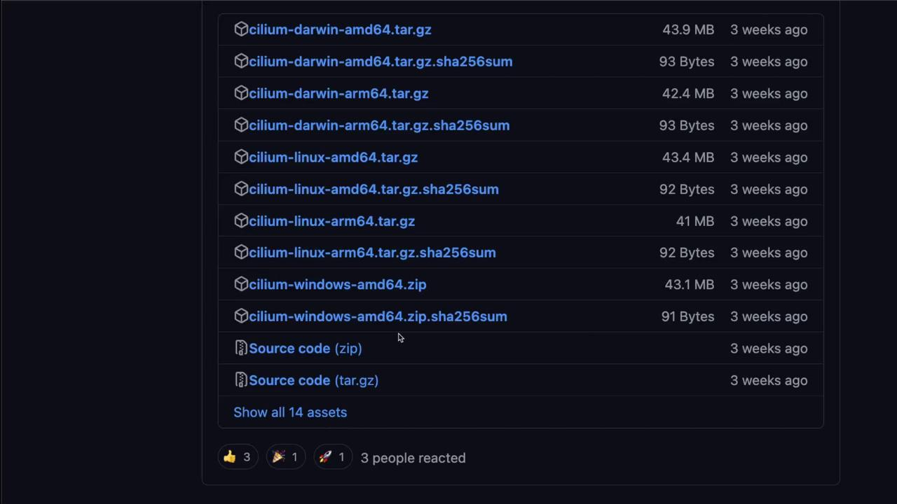
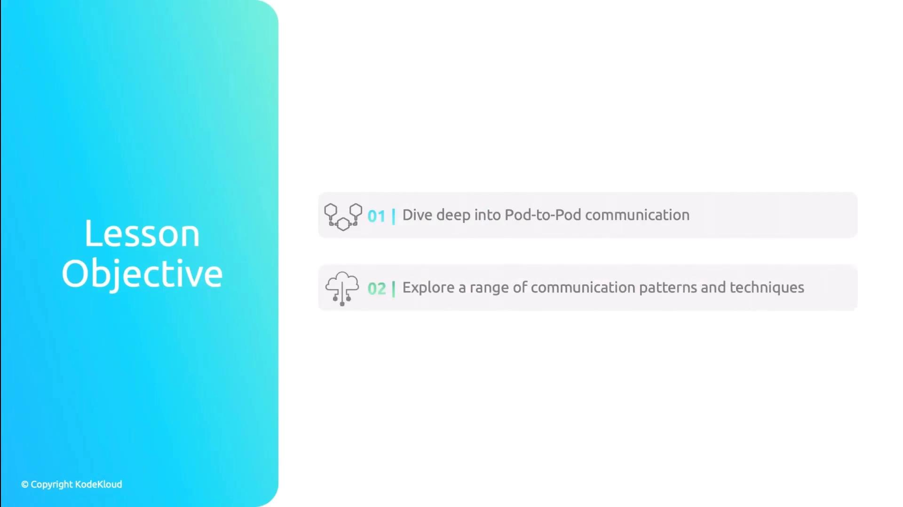
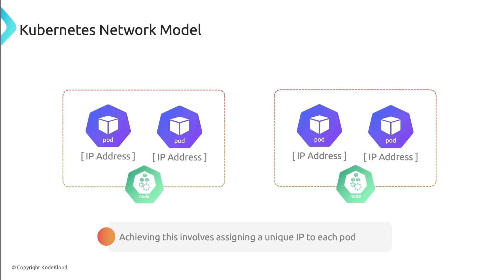
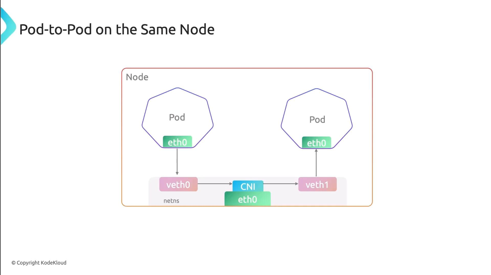
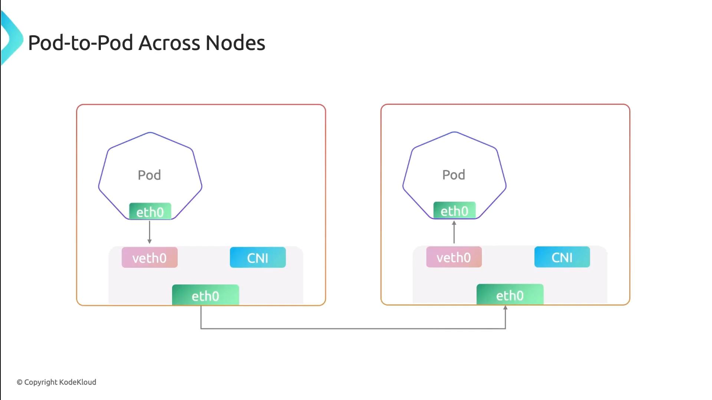
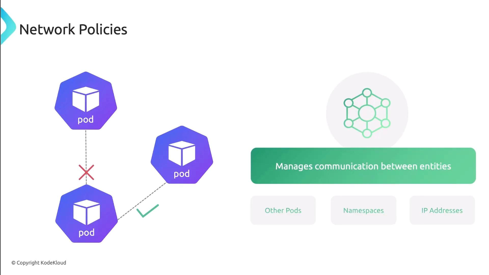

# Determine the latest stable version and target architecture
CILIUM_CLI_VERSION=$(curl -s https://raw.githubusercontent.com/cilium/cilium-cli/main/stable.txt)
CLI_ARCH=amd64
if [ "$(uname -m)" = "aarch64" ]; then
  CLI_ARCH=arm64
fi

# Download the tarball and its SHA-256 checksum
curl -L --fail --remote-name-all \
  https://github.com/cilium/cilium-cli/releases/download/${CILIUM_CLI_VERSION}/cilium-linux-${CLI_ARCH}.tar.gz{,.sha256sum}

# Verify the checksum before extraction
sha256sum --check cilium-linux-${CLI_ARCH}.tar.gz.sha256sum

# Extract and install the binary
sudo tar xzvf cilium-linux-${CLI_ARCH}.tar.gz -C /usr/local/bin

# Remove downloaded files
rm cilium-linux-${CLI_ARCH}.tar.gz{,.sha256sum}
```

This process:

1. Fetches the correct binary for your CPU architecture.
2. Validates it with the downloaded SHA-256 checksum.
3. Places the `cilium` executable into `/usr/local/bin`.

### 2. Verify the Cilium CLI installation

Run:

```bash theme={null}
cilium version --client
```

You should see output similar to:

```text theme={null}
cilium-cli version: v0.16.13 compiled with go1.21.25 on linux/amd64
cilium image (default): v1.15.6
cilium image (stable): v1.16.0
```

If you need a specific version, visit the [Cilium CLI GitHub releases page][cilium-cli-releases] to download the right asset.

<Frame>
  
</Frame>

## Install Hubble CLI

The Hubble CLI installation mirrors the Cilium CLI workflow. Use the same pattern to download, verify, and install.

### 1. Download and verify the Hubble CLI

```bash theme={null}
# Get the latest stable Hubble version and set architecture
HUBBLE_VERSION=$(curl -s https://raw.githubusercontent.com/cilium/hubble/master/stable.txt)
HUBBLE_ARCH=amd64
if [ "$(uname -m)" = "aarch64" ]; then
  HUBBLE_ARCH=arm64
fi

# Download the Hubble tarball and checksum
curl -L --fail --remote-name-all \
  https://github.com/cilium/hubble/releases/download/${HUBBLE_VERSION}/hubble-linux-${HUBBLE_ARCH}.tar.gz{,.sha256sum}

# Validate the download
sha256sum --check hubble-linux-${HUBBLE_ARCH}.tar.gz.sha256sum

# Install the binary
sudo tar xzf hubble-linux-${HUBBLE_ARCH}.tar.gz -C /usr/local/bin

# Cleanup
rm hubble-linux-${HUBBLE_ARCH}.tar.gz{,.sha256sum}
```

### 2. Verify the Hubble CLI installation

Execute:

```bash theme={null}
hubble version
```

Expected output:

```text theme={null}
hubble v1.16.0 compiled with go1.22.5 on linux/amd64
```

For alternative versions, browse the [Hubble GitHub releases page][hubble-releases].

***

Now that both the Cilium and Hubble CLIs are installed, you’re ready to proceed with deploying Cilium onto your Kubernetes cluster.

## Links and References

* [Cilium “Get Started” documentation][cilium-gettingstarted]
* [Cilium CLI GitHub releases page][cilium-cli-releases]
* [Hubble documentation][hubble-docs]
* [Hubble GitHub releases page][hubble-releases]

[cilium-gettingstarted]: https://docs.cilium.io/gettingstarted/

[cilium-cli-releases]: https://github.com/cilium/cilium-cli/releases

[hubble-docs]: https://docs.cilium.io/gettingstarted/hubble/

[hubble-releases]: https://github.com/cilium/hubble/releases

<CardGroup>
  <Card title="Watch Video" icon="video" href="https://learn.kodekloud.com/user/courses/kubernetes-networking/module/5eea49e6-caea-4e84-88a0-268ea6f263af/lesson/7782c4cc-a537-4c18-81d9-b583f6c8f4f7" />
</CardGroup>


# Internal Kubernetes Communication Overview

Source: https://notes.kodekloud.com/docs/Kubernetes-Networking-Deep-Dive/Container-Network-InterfaceCNI/Internal-Kubernetes-Communication-Overview/page

This article explores pod communication within a Kubernetes cluster, covering network models, policies, services, and service meshes for reliable application design.

In this lesson, we’ll explore how pods communicate inside a Kubernetes cluster. We’ll cover key patterns and tools—from the basic network model to advanced service meshes—so you can design reliable, secure, and scalable applications.

<Frame>
  
</Frame>

## Table of Contents

* [Recap: Kubernetes Network Model](#recap-kubernetes-network-model)
* [Pod-to-Pod Communication on the Same Node](#pod-to-pod-communication-on-the-same-node)
* [Pod-to-Pod Communication Across Nodes](#pod-to-pod-communication-across-nodes)
* [Network Policies](#network-policies)
* [Services & DNS](#services--dns)
* [Service Mesh](#service-mesh)
* [References](#references)

## Recap: Kubernetes Network Model

Kubernetes enforces a flat, IP-per-pod network. The core principles are:

1. **Unique Pod IP**\
   Every Pod receives its own IP address.
2. **Local Node Traffic**\
   Pods on the same node communicate via localhost or the CNI bridge.
3. **Cluster-wide Reachability**\
   Pods on different nodes talk without NAT, thanks to the CNI (we’re using Cilium).

<Callout icon="lightbulb">
  We use [Cilium](https://cilium.io/) with eBPF for high-performance routing, policy enforcement, and load balancing—no IP masquerading required.
</Callout>

<Frame>
  
</Frame>

## Pod-to-Pod Communication on the Same Node

When pods share a node, each pod’s network interface pairs with a veth endpoint on the CNI bridge. All traffic stays local:

* Low latency, no encapsulation
* Direct IP routing on the bridge interface

<Frame>
  
</Frame>

## Pod-to-Pod Communication Across Nodes

For inter-node traffic, Cilium injects eBPF programs into the kernel to handle routing, encapsulation (if overlay is used), and policy. Traffic flows like this:

1. Pod → veth → Cilium eBPF hook
2. Encapsulation (if enabled)
3. Underlay network → remote node
4. Decapsulation → destination pod

This approach eliminates the need for traditional overlay networks and improves performance.

<Frame>
  
</Frame>

## Network Policies

Network Policies control traffic at the IP and port level (TCP/UDP). You can specify which pods, namespaces, or external CIDRs are allowed or denied.

| Feature           | Description                     | Example                                    |
| ----------------- | ------------------------------- | ------------------------------------------ |
| PodSelector       | Select pods by label            | `podSelector: matchLabels: app: frontend`  |
| NamespaceSelector | Scope policy to namespaces      | `namespaceSelector: matchLabels: team:ops` |
| IPBlock           | Allow/Deny external CIDR ranges | `ipBlock: cidr: 172.16.0.0/16`             |
| PolicyTypes       | Ingress, Egress, or both        | `policyTypes: ["Ingress","Egress"]`        |

<Frame>
  
</Frame>

## Services & DNS

Kubernetes Services provide stable endpoints and built-in DNS discovery. Each Service gets a DNS A record, so clients always hit the right IP:

* **ClusterIP**: Internal load-balancer
* **NodePort**: Exposes port on each node
* **LoadBalancer**: External cloud LB

| Service Type | Scope     | Example Command                                       |
| ------------ | --------- | ----------------------------------------------------- |
| ClusterIP    | Internal  | `kubectl expose pod nginx --port=80 --target-port=80` |
| NodePort     | External  | `kubectl create service nodeport nginx --port=80`     |
| LoadBalancer | Cloud LBs | `kubectl apply -f loadbalancer-service.yaml`          |

Pods also get a DNS entry of the form:

```text theme={null}
pod-ip-address.namespace.pod.cluster.local
