# e.g. 10-244-1-3.default.pod.cluster.local
```

<Callout icon="triangle-alert">
  Pod DNS records change on restart or rescheduling. Always prefer Service DNS names (`my-service.default.svc.cluster.local`) for stable discovery.
</Callout>

<Frame>
  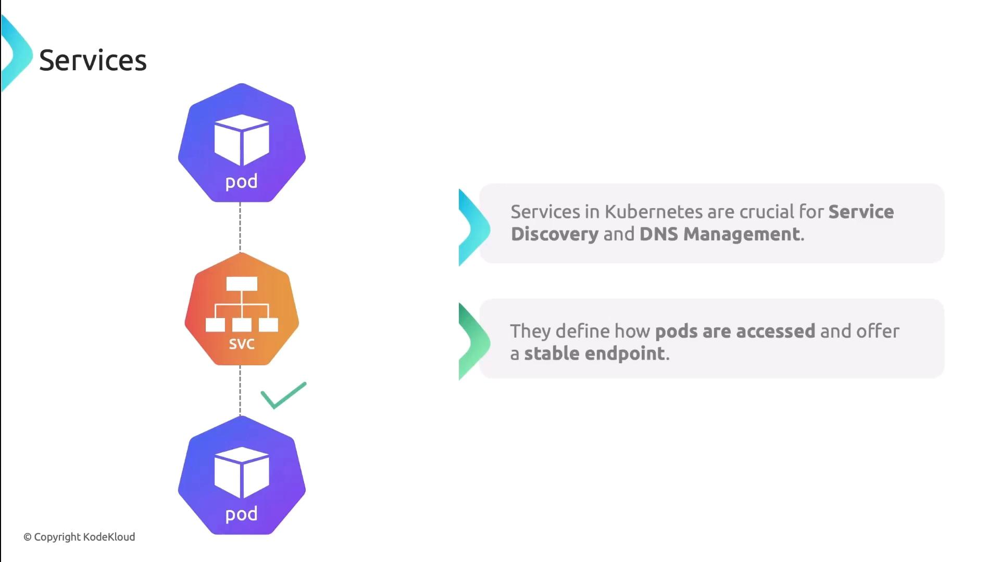
</Frame>

## Service Mesh

A Service Mesh (e.g., Istio, Linkerd) injects sidecar proxies into each pod. These proxies manage:

* Traffic routing and retries
* Mutual TLS (mTLS) encryption
* Circuit breaking and observability

No application code changes are needed—network features are handled transparently.

<Frame>
  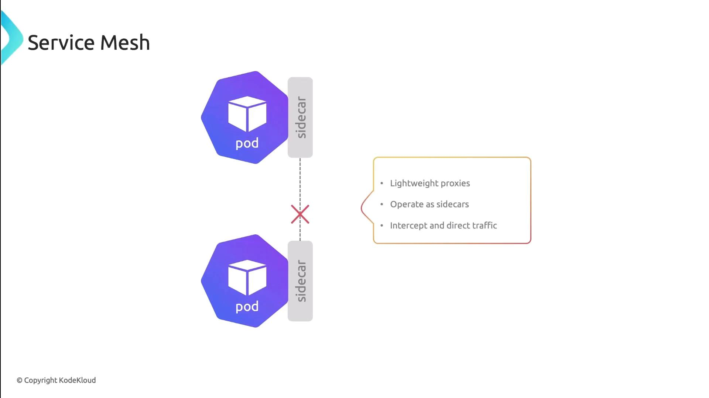
</Frame>

***

In this lesson, we reviewed Kubernetes’ pod-to-pod connectivity patterns, network policies, Service DNS, and the power of a Service Mesh. Next, try applying these concepts in your own cluster!

## References

* [Kubernetes Networking Concepts](https://kubernetes.io/docs/concepts/cluster-administration/networking/)
* [Cilium Documentation](https://docs.cilium.io/)
* [Kubernetes Services](https://kubernetes.io/docs/concepts/services-networking/service/)
* [Istio Service Mesh](https://istio.io/latest/docs/)
* [Linkerd Service Mesh](https://linkerd.io/)

<CardGroup>
  <Card title="Watch Video" icon="video" href="https://learn.kodekloud.com/user/courses/kubernetes-networking/module/5eea49e6-caea-4e84-88a0-268ea6f263af/lesson/c59b34d8-459c-4088-9cc7-d36f224a061f" />
</CardGroup>


# Introduction to Container Network Interface CNI

Source: https://notes.kodekloud.com/docs/Kubernetes-Networking-Deep-Dive/Container-Network-InterfaceCNI/Introduction-to-Container-Network-Interface-CNI/page

This guide explores the Container Network Interface (CNI), its architecture, specification, features, and popular plugins for Kubernetes networking.

As your Kubernetes cluster grows and hosts more workloads, networking complexity can quickly become a bottleneck. The Kubernetes networking model requires every pod to communicate seamlessly across nodes, demanding consistent, automated configuration management. In this guide, we’ll explore the Container Network Interface (CNI)—its purpose, architecture, specification, and key features—before surveying the most popular CNI plugins in today’s ecosystem.

<Frame>
  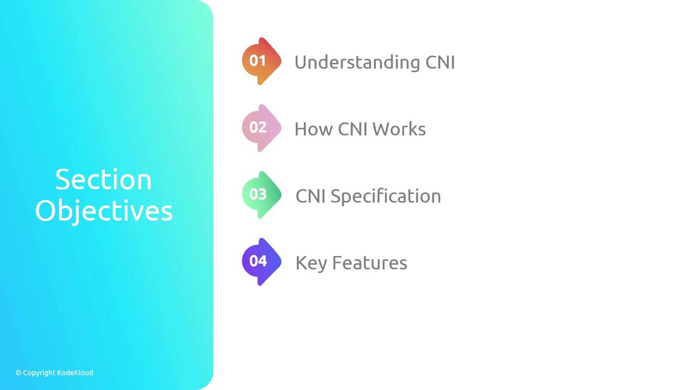
</Frame>

## What Is CNI?

The Container Network Interface is a **CNCF** project defining a standard for configuring network interfaces in Linux and Windows containers. It provides:

* A **specification** for network configuration files (JSON).
* **Libraries** for writing networking plugins.
* A **protocol** that container runtimes (e.g., containerd, CRI-O) use to invoke plugins.

When a container is created or deleted, CNI allocates or cleans up network resources, delivering a unified interface for orchestrators like Kubernetes.

## How CNI Works

Under the hood, the container runtime handles network setup by invoking one or more CNI plugin binaries. Here’s the typical workflow in Kubernetes:

1. **API Server → Kubelet**: Request to create a Pod.
2. **Kubelet → Runtime**: Allocate a new network namespace for the pod.
3. **Runtime → CNI Plugin**: Invoke plugin(s) with JSON config via stdin.
4. **Plugin(s) → Runtime**: Return interface details on stdout.
5. **Runtime → Container**: Launch container in the prepared namespace.

<Frame>
  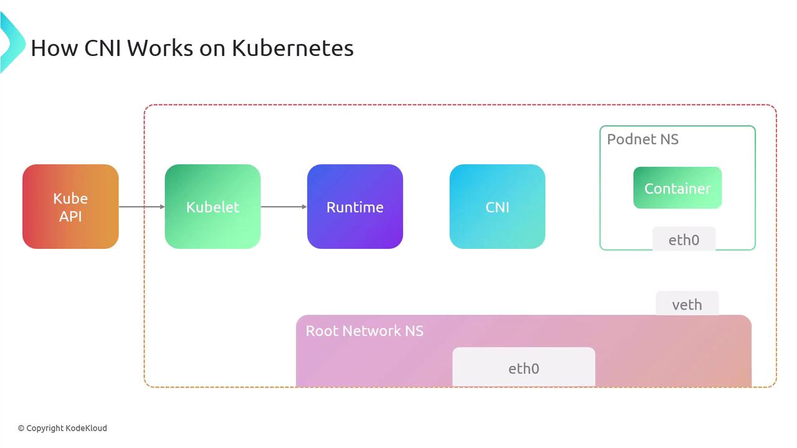
</Frame>

<Callout icon="lightbulb">
  CNI plugin binaries must be installed on every node (default: `/opt/cni/bin`). Without them, pods may fail to start.
</Callout>

## CNI Specification Overview

The CNI spec comprises:

* A JSON schema for network configuration.
* A naming convention for network definitions and plugin lists.
* An execution protocol using environment variables.
* A mechanism for chaining multiple plugins.
* Standard data types for operation results.

<Frame>
  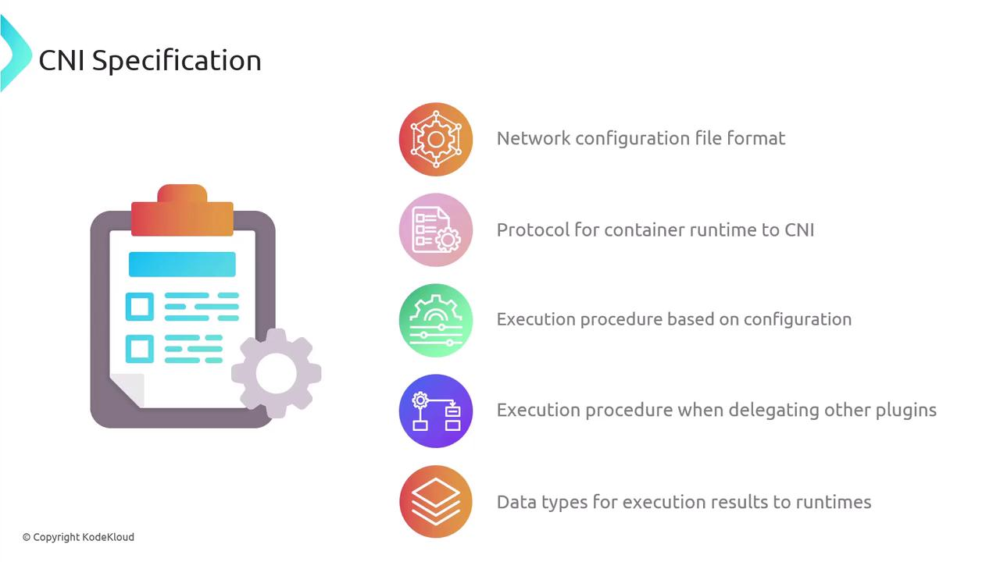
</Frame>

### Network Configuration Files

Configuration lives in a JSON file interpreted by the runtime at execution time. You can chain multiple plugins:

```json theme={null}
{
  "cniVersion": "1.1.0",
  "name": "dbnet",
  "plugins": [
    {
      "type": "bridge",
      "bridge": "cni0",
      "keyA": ["some", "plugin", "configuration"],
      "ipam": {
        "type": "host-local",
        "subnet": "10.1.0.0/16",
        "gateway": "10.1.0.1",
        "routes": [{"dst": "0.0.0.0/0"}]
      }
    },
    {
      "dns": {"nameservers": ["10.1.0.1"]}
    },
    {
      "type": "tuning",
      "capabilities": {"mac": true},
      "sysctl": {"net.core.somaxconn": "500"}
    },
    {
      "type": "portmap",
      "capabilities": {"portMappings": true}
    }
  ]
}
```

Each object in `plugins` is invoked in sequence for setup or teardown.

### Plugin Execution Protocol

CNI relies on environment variables to pass context:

<Frame>
  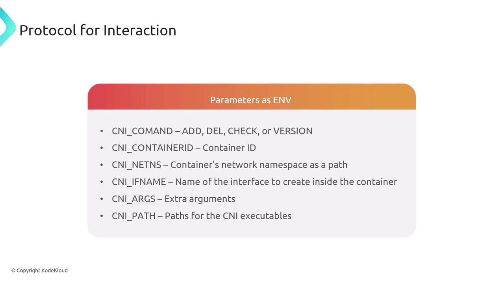
</Frame>

| Variable         | Description                                  |
| ---------------- | -------------------------------------------- |
| CNI\_COMMAND     | Operation (`ADD`, `DEL`, `CHECK`, `VERSION`) |
| CNI\_CONTAINERID | Unique container identifier                  |
| CNI\_NETNS       | Path to container’s network namespace        |
| CNI\_IFNAME      | Interface name inside the container          |
| CNI\_ARGS        | Additional plugin-specific arguments         |
| CNI\_PATH        | Paths to locate CNI plugin binaries          |

#### Core Operations

* **ADD**: Attach and configure an interface.
* **DEL**: Detach and cleanup.
* **CHECK**: Validate current network state.
* **VERSION**: Query supported CNI versions.

A network attachment is uniquely identified by `CNI_CONTAINERID` + `CNI_IFNAME`. Plugins read JSON config from stdin and write results to stdout.

### Execution Flow

<Frame>
  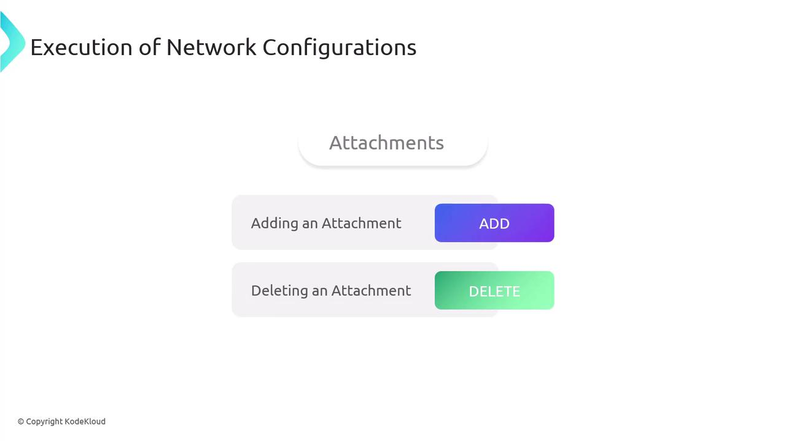
</Frame>

When running **ADD**:

1. Derive the network configuration.
2. Execute plugin binaries **in listed order** with `CNI_COMMAND=ADD`.
3. Halt on any failure and return an error.
4. Persist success data for later `CHECK` or `DEL`.

<Frame>
  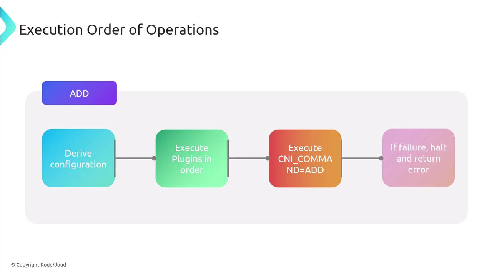
</Frame>

The **DEL** operation runs plugins in **reverse order**. **CHECK** follows the same sequence as `ADD` but performs validations only.

<Frame>
  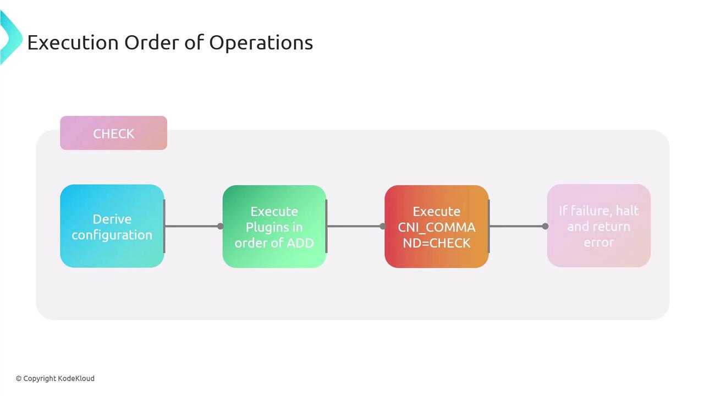
</Frame>

## Chaining and Delegation

CNI supports chaining multiple plugins. A parent plugin can delegate tasks to child plugins. On failure, the parent invokes a **DEL** on all delegates before returning an error, ensuring cleanup.

## Result Types

CNI operations return standardized JSON for:

* **Success**: Contains `cniVersion`, configured interfaces, IPs, routes, DNS.
* **Error**: Includes `code`, `msg`, `details`, `cniVersion`.
* **Version**: Lists supported spec versions.

<Frame>
  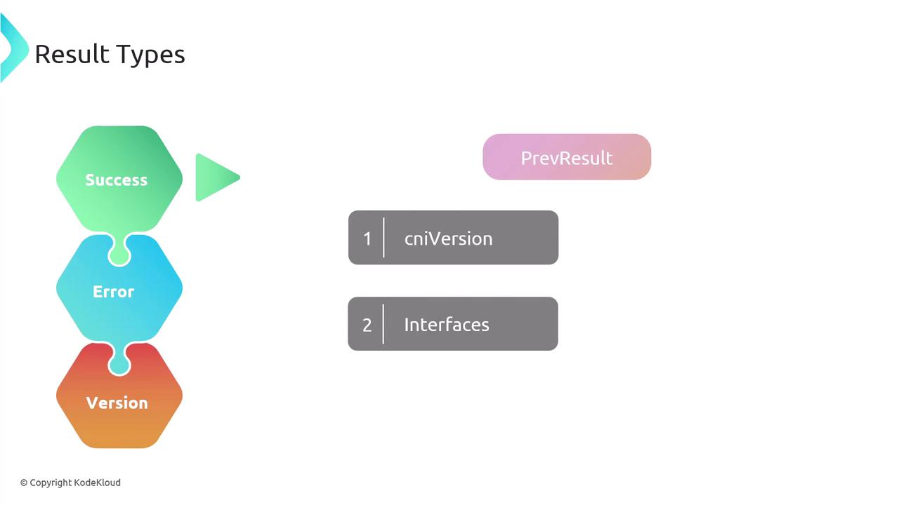
</Frame>

Example **error** response:

```json theme={null}
{
  "cniVersion": "1.1.0",
  "code": 7,
  "msg": "Invalid Configuration",
  "details": "Network 192.168.0.0/31 too small to allocate from."
}
```

## Key Features of CNI

<Frame>
  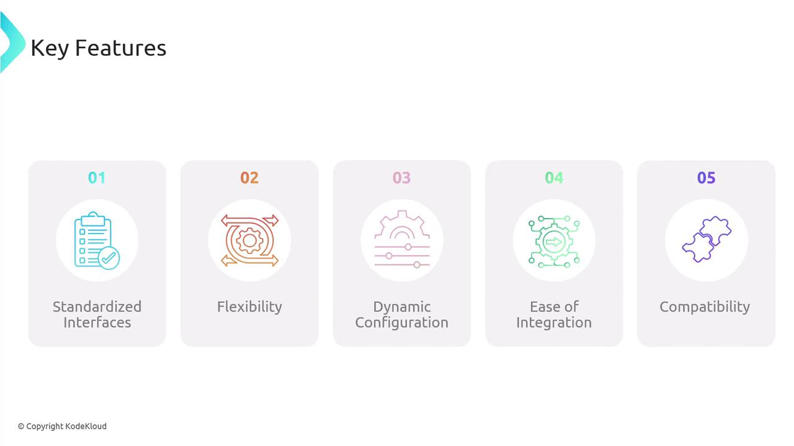
</Frame>

1. **Standardized Interface**: Unified API for all container runtimes.
2. **Flexibility**: Supports a vast ecosystem of plugins.
3. **Dynamic Configuration**: Runtime-driven setup and teardown.
4. **Ease of Integration**: Embeds directly into container runtimes.
5. **Compatibility**: Versioned specs for interoperability.

## Popular CNI Plugins

<Frame>
  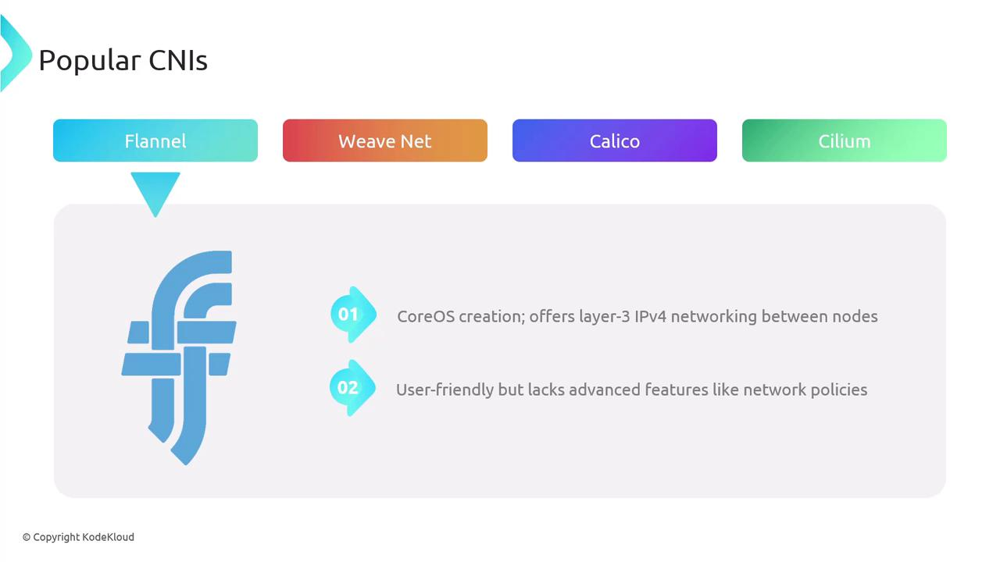
</Frame>

**Flannel** – A CoreOS project providing simple IPv4 layer-3 networking.\
**Weave Net** – Weaveworks’ layer-2 overlay with built-in encryption and network policies.

<Frame>
  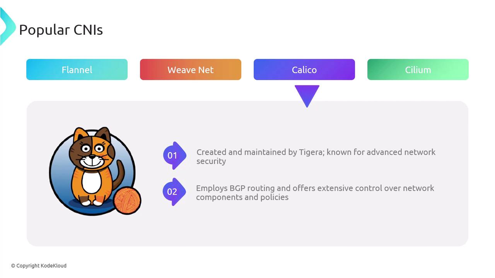
</Frame>

**Calico** – Tigera’s solution featuring scalable BGP routing and robust network policies.

<Frame>
  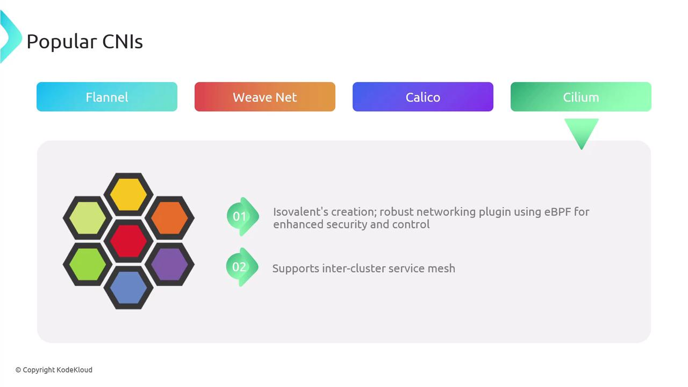
</Frame>

**Cilium** – Leverages eBPF for deep network and security visibility, plus inter-cluster service mesh capabilities.

Many cloud providers (AWS, Azure, GCP) also offer CNI implementations optimized for their platforms.

### Comparison of Popular CNIs

| Plugin    | Type         | Key Features                          |
| --------- | ------------ | ------------------------------------- |
| Flannel   | L3 Overlay   | Simple IPv4 overlay, minimal policy   |
| Weave Net | L2 Overlay   | Encryption, built-in network policies |
| Calico    | BGP Routing  | Scalable, advanced security policies  |
| Cilium    | eBPF-Powered | Fine-grained policies, service mesh   |

## Conclusion

<Frame>
  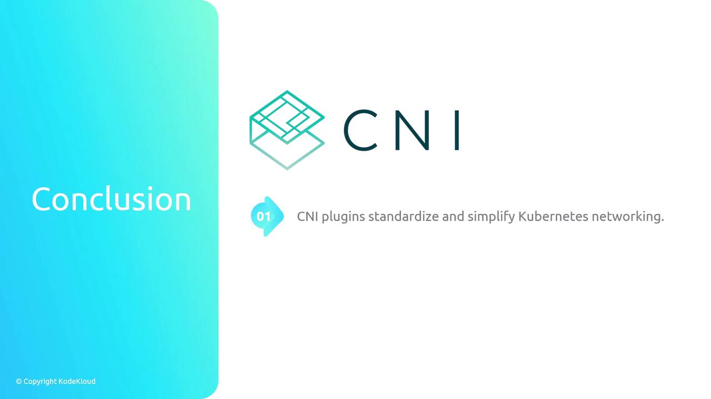
</Frame>

CNI delivers a standardized, extensible framework that streamlines Kubernetes networking. By understanding its specification, execution model, and popular plugins, cluster operators can design robust, flexible network architectures.

## References

* [Kubernetes Networking Concepts](https://kubernetes.io/docs/concepts/cluster-administration/networking/)
* [CNI Specification on GitHub](https://github.[SECRET_REDACTED].md)
* [Container Network Interface (CNI) Project](https://www.cncf.io/projects/container-network-interface/)

<CardGroup>
  <Card title="Watch Video" icon="video" href="https://learn.kodekloud.com/user/courses/kubernetes-networking/module/5eea49e6-caea-4e84-88a0-268ea6f263af/lesson/92357493-dc8c-43d3-b0b3-f67ceed4e400" />
</CardGroup>
