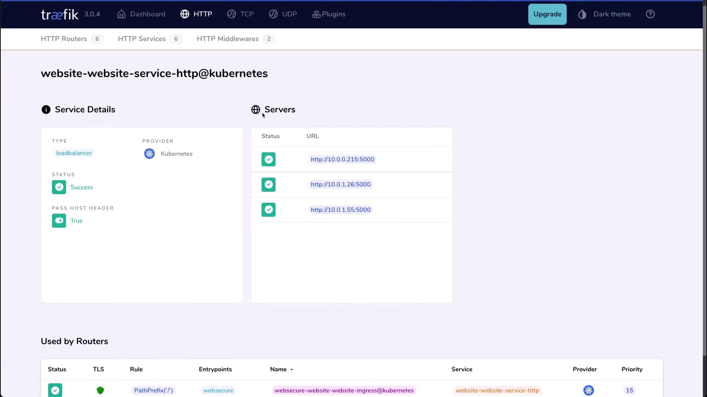
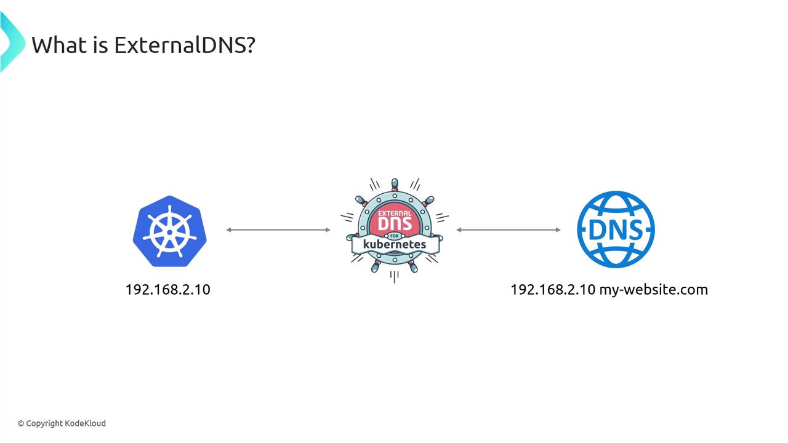
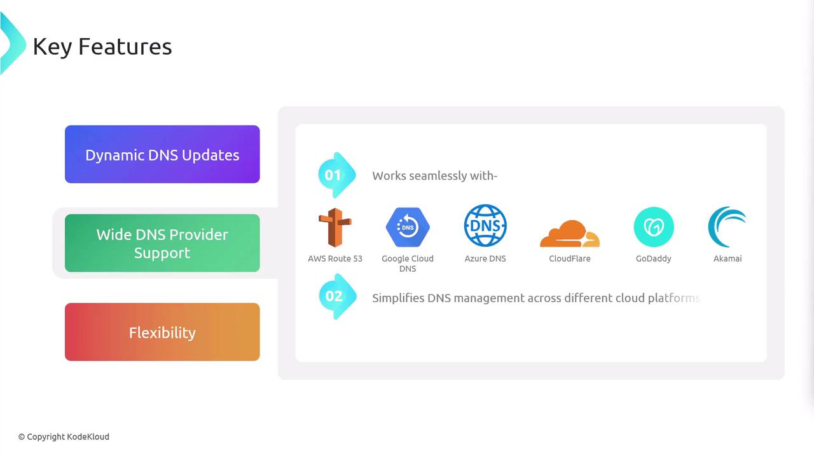

# service-dashboard.yaml
apiVersion: v1
kind: Service
metadata:
  name: traefik-dashboard-service
  namespace: traefik
spec:
  type: NodePort
  ports:
    - port: 9000
      targetPort: traefik
      nodePort: 30000
  selector:
    app.kubernetes.io/instance: traefik-traefik
```

Apply and verify the Service:

```bash theme={null}
kubectl apply -f service-dashboard.yaml
kubectl describe svc -n traefik traefik-dashboard-service
```

Expected output:

```text theme={null}
Name:                     traefik-dashboard-service
Namespace:                traefik
Selector:                 app.kubernetes.io/instance=traefik-traefik
Type:                     NodePort
IP:                       10.104.3.15
Port:                     9000/TCP
TargetPort:               traefik/TCP
NodePort:                 30000/TCP
Endpoints:                10.1.0.10:9000
```

## 2. Enable Insecure API Access

By default, Traefik’s API/dashboard is secured. For this lab, we’ll enable insecure access by adding `--api.insecure=true` to the deployment arguments.

Edit the Traefik deployment:

```bash theme={null}
kubectl edit deployment traefik -n traefik
```

Under the container spec’s `args:` section, include:

```yaml theme={null}
args:
  - "--api.dashboard=true"
  - "--api.insecure=true"
  - "--entryPoints.metrics.address=:9100/tcp"
  - "--entryPoints.traefik.address=:9000/tcp"
  - "--entryPoints.web.address=:8000/tcp"
  - "--entryPoints.websecure.address=:8443/tcp"
  - "--metrics.prometheus=true"
  - "--metrics.prometheus.entrypoint=metrics"
  - "--providers.kubernetescrd"
  - "--providers.kubernetesingress"
  - "--entryPoints.websecure.http.tls=true"
  - "--log.level=INFO"
  - "--accesslog=true"
  - "--accesslog.fields.defaultmode=keep"
  - "--accesslog.fields.headers.defaultmode=drop"
  - "--ping=true"
  - "--global.sendanonymoususage"
```

Save and exit. The deployment will rollout updated pods:

```bash theme={null}
kubectl get pods -n traefik
```

You should see:

```text theme={null}
NAME                         READY   STATUS    RESTARTS   AGE
traefik-79554cb74d-txqdf     1/1     Running   0          30s
```

## 3. Access the Dashboard

Open port 30000 on your node and navigate to:

```text theme={null}
http://<node-ip>:30000
```

On the dashboard, you’ll find:

* **Entry Points**: Listening ports on the Traefik pod
* **Routers**: Rules mapping incoming requests to services
* **Services**: Backend services and their endpoints
* **Middlewares**: Request transformations (none configured here)

### Entry Points Overview

| Entry Point | Port | Protocol | TLS Enabled |
| ----------- | ---- | -------- | ----------- |
| metrics     | 9100 | TCP      | No          |
| traefik     | 9000 | TCP      | No          |
| web         | 8000 | TCP      | No          |
| websecure   | 8443 | TCP      | Yes         |

### Inspecting Services

On the **Services** page, you can drill into each service’s pods and endpoints. In our CompanyX application, all services show healthy endpoints:

<Frame>
  
</Frame>

## 4. Scale the Application

Let’s scale the CompanyX website to 5 replicas:

```bash theme={null}
kubectl scale deployment companyx-website --replicas=5
```

Verify new pods:

```bash theme={null}
kubectl get pods -n companyx
```

```text theme={null}
NAME                                  READY   STATUS    RESTARTS   AGE
companyx-website-5d596d7d7d-abc12     1/1     Running   0          1m
companyx-website-5d596d7d7d-def34     1/1     Running   0          1m
companyx-website-5d596d7d7d-ghi56     1/1     Running   0          1m
companyx-website-5d596d7d7d-jkl78     1/1     Running   0          1m
companyx-website-5d596d7d7d-mno90     1/1     Running   0          1m
```

Refresh the Traefik dashboard—you’ll now see five healthy pods listed under the CompanyX service.

<Callout icon="lightbulb">
  In a production setup, secure the dashboard with authentication or restrict access to a private network.
</Callout>

***

This completes our overview of the Traefik observability dashboard—an invaluable tool for monitoring traffic flows, routing, and service health in Kubernetes. For further reading, see the [Traefik documentation](https://doc.traefik.io/traefik/).

<CardGroup>
  <Card title="Watch Video" icon="video" href="https://learn.kodekloud.com/user/courses/kubernetes-networking/module/19677663-2b7d-4c3d-92ee-06df9f5530eb/lesson/de4fe60d-c213-4a51-bd72-8293086d4a37" />
</CardGroup>


# External DNS Overview

Source: https://notes.kodekloud.com/docs/Kubernetes-Networking-Deep-Dive/Kubernetes-Ingress/External-DNS-Overview/page

ExternalDNS automates DNS record management for Kubernetes services and ingresses, ensuring applications remain reachable as resources change.

The Kubernetes DNS system enables services and pods to discover one another via in-cluster lookups. When you expose applications to the public internet, managing DNS records manually can become error-prone. ExternalDNS automates this process by synchronizing Kubernetes Services and Ingresses with your DNS provider—AWS Route 53, Cloudflare, Google Cloud DNS, and more.

<Frame>
  
</Frame>

ExternalDNS continuously watches for Kubernetes resource changes. When a Service or Ingress is created, updated, or deleted, it will create, update, or remove the corresponding DNS records, ensuring your applications remain reachable even as IP addresses shift.

<Frame>
  
</Frame>

## Key Features

1. **Dynamic DNS Updates**\
   Reacts in real time to scaling events, rolling updates, or resource deletions—keeping DNS entries accurate without manual steps.

2. **Flexibility & Control**
   * Manages DNS for LoadBalancer, NodePort, ClusterIP, and headless Services, as well as Ingress resources.
   * Use annotation-based filters or custom FQDN templates to target specific records.
   * Optionally ignore selected resources using annotation rules.

3. **Broad Provider Compatibility**\
   ExternalDNS integrates with the most popular DNS services, making it ideal for hybrid and multi-cloud deployments.

   | DNS Provider        | Use Case                 | Example Flag              |
   | ------------------- | ------------------------ | ------------------------- |
   | AWS Route 53        | Public zones on AWS      | `--provider=aws`          |
   | Google Cloud DNS    | GCP-managed domains      | `--provider=google`       |
   | Azure DNS           | Azure public DNS zones   | `--provider=azure`        |
   | Cloudflare          | External DNS management  | `--provider=cloudflare`   |
   | DigitalOcean DNS    | DO-managed domains       | `--provider=digitalocean` |
   | NS1, Infoblox, etc. | Enterprise DNS solutions | `--provider=<name>`       |

<Frame>
  
</Frame>

## Architecture Scenarios

* **LoadBalancer**\
  In cloud environments (AWS, GCP, Azure), ExternalDNS creates DNS A/AAAA records pointing to provisioned external IPs.

* **NodePort / ClusterIP**\
  Map DNS to node IPs plus NodePorts, or manage ClusterIP entries—even if they’re only internally routable.

* **Headless Services**\
  Assign stable DNS names to individual pod IPs (e.g., for Kafka or other stateful sets).

## Installation

Add the ExternalDNS Helm chart and update:

```bash theme={null}
helm repo add external-dns https://kubernetes-sigs.github.io/external-dns/
helm repo update
```

<Callout icon="triangle-alert">
  Ensure your cloud IAM role or API credentials have permissions to create and modify DNS records. See [ExternalDNS GitHub](https://github.com/kubernetes-sigs/external-dns) for provider-specific requirements.
</Callout>

Install with Helm, replacing `provider` and provider-specific settings as needed:

```bash theme={null}
helm install external-dns external-dns/external-dns \
  --namespace kube-system \
  --set provider=aws \
  --set aws.zoneType=public
```

<Callout icon="lightbulb">
  You can also install ExternalDNS by applying a plain Kubernetes Deployment manifest—ideal for GitOps workflows.
</Callout>

## Deployment Configuration

Below is a sample `Deployment` manifest. Adjust `args` to fit your environment:

```yaml theme={null}
apiVersion: apps/v1
kind: Deployment
metadata:
  name: external-dns
  namespace: kube-system
spec:
  strategy:
    type: Recreate
  selector:
    matchLabels:
      app: external-dns
  template:
    metadata:
      labels:
        app: external-dns
    spec:
      serviceAccountName: external-dns
      containers:
      - name: external-dns
        image: registry.k8s.io/external-dns/external-dns:v0.13.7
        args:
        - --source=service
        - --source=ingress
        - --provider=aws
        - --registry=txt
        - --txt-owner-id=my-cluster
```

### General Arguments

* `--source` (service, ingress)
* `--namespace` (limit scope)
* `--provider` (aws, google, azure, cloudflare, etc.)
* `--policy` (sync or create-only)
* `--domain-filter` (restrict to specific domains)

<Frame>
  
</Frame>

## Security, Authentication & Advanced Options

* `--registry` (txt, aws-tags)
* `--txt-owner-id` (unique TXT record owner)
* `--annotation-filter` (manage only annotated resources)
* `--fqdn-template` (custom FQDN generation)

<Frame>
  
</Frame>

## Configuring Application Resources

ExternalDNS discovers resources via annotations. Add these under `metadata` in your Service or Ingress:

```yaml theme={null}
